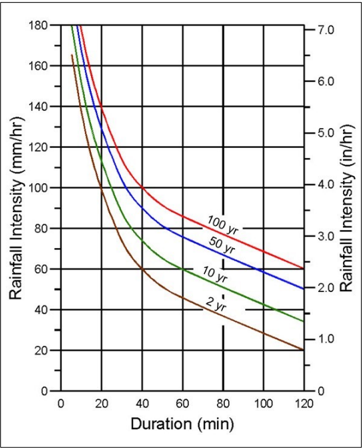
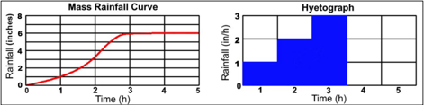
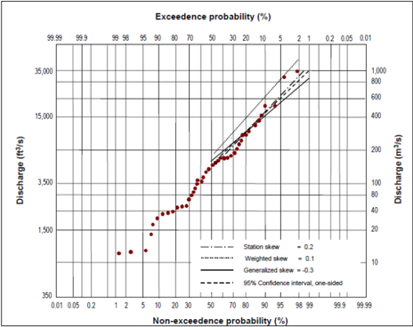
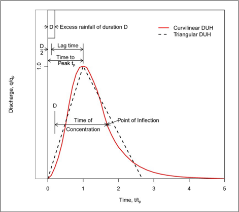
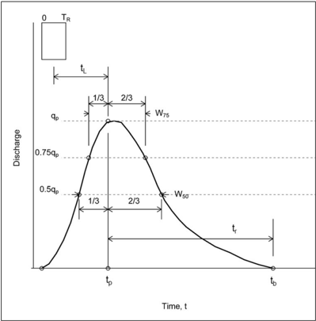

# Chapter 4 - Urban Hydrologic Procedures

- Source: hif24006.pdf
- Generated: 2025-12-28T23:40:53+00:00
- Chunk: 4/13
- Estimated tokens: ~8,472
- Total pages: 313
- Type: chapter

## Chapter 4 - Urban Hydrologic Procedures

This  chapter  provides  an  overview  of  hydrologic  methods  and  procedures  commonly  used  in urban  highway  drainage  design.  The  chapter  condenses  information  from Highway Hydrology , Hydraulic  Design  Series  2  (HDS -2)  (FHWA 2002).  The chapter  introduces  the  methods  and procedures, their data demands, and their limitations. Most of these procedures can be applied using commonly available computer programs. HDS-2 contains additional information and detail on the methods described.

## 4.1 Rainfall (Precipitation)

Rainfall,  along  with  watershed  characteristics,  determines  the  flows  for  storm  drainage  design. The following sections describe three representations of rainfall the designer can use to derive flood flows: uniform rainfall intensity, variable rainfall intensity, and synthetic design storm events.

## 4.1.1 Uniform Rainfall Intensity

Although rainfall intensity varies during precipitation events, many of the procedures that designers  use  to  derive  peak  flow  (see  Section 4.2)  are  based  on  an  assumed  uniform  rainfall intensity. Intensity is the  rate of rainfall  and  is  typically  given  in  units  of  inches  per  hour  (millimeters per hour).

Federal,  State,  and  local  agencies  have  developed  Intensity -Duration-Frequency  (IDF)  curves throughout the United States  through frequency analysis of rainfall events for thousands of rainfall gages. The  IDF  curve, as illustrated in Figure  4.1, provides a summary  of  a  site's rainfall characteristics by relating storm duration and exceedance  probability (frequency) to rainfall intensity (assumed constant over the duration). To interpret an IDF curve, find the rainfall duration along the horizontal axis, go vertically up the graph until reaching the proper return period, then go horizontally to the left  and  read  the  intensity  off  the vertical axis.  Most  highway  agency drainage manuals  contain  regional  IDF  curves and  NOAA  Atlas  14  provides  a  national  source  of  IDF curves.

## 4.1.2 Variable Rainfall Intensity (Hyetograph)

Rainfall  intensity  in  any  given  storm  varies  over  time. Figure 4.2 depicts  a  mass  rainfall  curve showing the accumulation of rainfall during an actual or design storm. The instantaneous intensity is  the  slope  of  the  mass  rainfall  curve  at  a  particular  time.  For  hydrologic  analysis,  designers typically  divide  the  storm  into  convenient  time  increments  and  determine  the  average  intensity over each of the selected periods. The designer then plots these results as a rainfall hyetograph, like that presented in Figure 4.2.

for

Hyetographs provide greater flexibility in creating design storms than a uniform rainfall intensity by specifying the precipitation variability over  time.  Designers  use  them  in  conjunction  with hydrographic (rather than peak flow) methods. In storm drain design, hyetographs are relevant for volumetric applications such as storage routing of hydrographs. Hyetographs allow simulation of actual rainfall events  and  calibration of hydrologic  models,  which  can  provide valuable  information  on  the  relative  flood  risks  of  different  events.  The  National  Climatic  Data Center (NCDC) at NOAA often makes available hyetographs of actual storms.

Figure 4.1. Example IDF curves.

Figure 4.2. Example mass rainfall curve and corresponding hyetograph.

## 4.1.3 Synthetic Design Storm Events

Designers typically base  drainage  design  on  synthetic,  rather  than  actual,  rainfall  events.  The U.S.  Department  of  Agriculture's Natural  Resources  Conservation  Service  (NRCS),  formerly known  as  the  Soil  Conservation  Service  (SCS), developed  and  documented  24-hour  rainfall distributions, which is described in HDS-2. The SCS 24-hour rainfall distributions are widely used synthetic hyetographs and incorporate the intensity -duration relationship for the design AEP. This approach assumes that the maximum rainfall for any duration within the 24-hour duration has the same AEP. For example, a 0.1 AEP, 24-hour design storm contains the 0.1 AEP  rainfall depths for all durations up to 24 hours as derived from IDF curves. Other sources of rainfall distributions exist including NOAA Atlas 14.

## 4.2 Peak Flow

Peak flows are generally adequate for design and analysis of conveyance systems such as storm drains  or  open  channels.  This  section  discusses  methods  used  to  derive  peak  flows  for  both gaged and ungaged sites. The  NRCS ( SCS) peak flow method is another approach that calculates peak flow as a function of drainage basin area, potential watershed storage, and the time  of  concentration.  This  rainfall -runoff  methodology  separates  total  rainfall  into  direct  runoff, retention, and initial abstraction. HDS-2 provides more detailed discussion on this method.

## 4.2.1 Statistical Analysis

Designers use statistical analysis to evaluate peak flows where adequate gaged streamflow data exist. Frequency distributions, used in the analysis of hydrologic data, include the distribution, the log-normal  distribution,  the  Gumbel  extreme  value  distribution,  and  the  logPearson type  III  distribution.  The  log-Pearson  type  III  distribution  is  a  three-parameter  gamma distribution with a logarithmic transform of the independent variable. Designers use it widely for flood  analyses  because  the  data  frequently  fit  the  assumed  population.  This  flexibility  led  the United States Geological Survey (USGS) to recommend its use as the standard distribution for flood frequency studies by all U.S. Government agencies, as documented in Bulletin (England  et  al.  2019).  Figure  4.3  presents  an  example  of  a  log-Pearson type  III  distribution frequency curve (FHWA 2002). Designers do not commonly use statistical analysis methods in urban drainage design due to the lack of adequate streamflow data. Consult HDS -2 (FHWA 2002) for additional information on these methods.

## 4.2.2 Rational Method

One of the most used approaches for the calculation of peak flow from small areas is the Rational Method, given as:

| Q K =    | u CIA   | (4.1)                                           |
|----------|---------|-------------------------------------------------|
| where: Q | =       | Flow, ft 3 /s (m 3 /s)                          |
| C        | =       | Dimensionless runoff coefficient                |
| I        | =       | Rainfall intensity, in/h (mm/h)                 |
| A        | =       | Drainage area, ac (ha)                          |
| K u      | =       | Unit conversion constant, 1.0 in CU (360 in SI) |

normal

17C

Figure 4.3. Log-Pearson type III distribution analysis, Medina River, Texas.

As  described  in  HDS-2  (FHWA 2002),  the Rational Method, assumes:

- Peak flow occurs when the entire watershed contributes to the flow.
- Rainfall intensity is the  same  over the entire drainage area.
- Rainfall intensity is uniform over a time duration equal to the time of concentration, t c . (The time of concentration is the time water takes to  travel  from  the  hydraulically  most remote point of the basin to the point of interest.)

## Rational Method

Emil Kuichling, City Engineer of Rochester, New York, developed the Rational Method in 1889. The methodology is based rainfall-runoff observations of small urban watersheds ranging from 25 to 357 acres. The assumptions emerge from his findings.

- Frequency of the computed peak flow is the same as that of the rainfall intensity, i.e., the 0.1 AEP rainfall intensity produces the 0.1 AEP peak flow.
- The coefficient of runoff is the same for all storms of all recurrence probabilities.

Related to the last assumption, designers sometimes use a frequency -of-event correction factor as a modifier to the Rational Method runoff coefficient. Some agencies recommend use of this coefficient,  but FHWA  does not endorse its use. The intent of the correction factor is to

compensate  for  the  reduced  effect  of  infiltration  and  other  hydrologic  abstractions  during  less frequent, higher intensity storms. The frequency-of-event correction factor is multiplied times the runoff coefficient, C, to produce an adjusted runoff coefficient.

Because of the inherent assumptions, HDS-2 recommends application of the Rational Method to drainage areas smaller than 200 ac (80 ha) and provides additional information on the Rational Method (FHWA 2002).

## 4.2.2.1 Runoff Coefficient

The runoff coefficient, C, in equation  4.1 is a function of the ground cover and other characteristics that  influence  hydrologic  abstraction.  Table  4.1 summarizes  typical  values  for  C.  If  the  basin contains varying amounts of different land cover or other abstractions, a weighted coefficient can be calculated through areal weighting as follows (FHWA 2002):

<!-- formula-not-decoded -->

where:

x

= Subscript designating values for incremental areas with consistent land cover

## Example 4.1: Calculation of the runoff coefficient.

Objective:

Estimate weighted runoff coefficient, C, for existing and proposed conditions.

Given: The following existing and proposed land uses:

Existing conditions (unimproved):

| Land Use        |   Area (ac) | Runoff Coefficient   |
|-----------------|-------------|----------------------|
| Unimproved Area |        22.1 | 0.25                 |
| Grass           |        21.2 | 0.22                 |
| Total           |        43.3 | -                    |

Proposed conditions (improved):

Step 1. Determine weighted C for existing (unimproved) conditions.

| Land Use        |   Area (ac) | Runoff Coefficient   |
|-----------------|-------------|----------------------|
| Paved           |         5.4 | 0.90                 |
| Lawn            |         1.6 | 0.15                 |
| Unimproved Area |        18.6 | 0.25                 |
| Grass           |        17.7 | 0.22                 |
| Total           |        43.3 | -                    |

Using equation 4.1:

Weighted C = Σ (Cx Ax) / A = [(22.1) (0.25) + (21.2) (0.22)] / 43.3 = 0.235

Step 2. Determine weighted C for proposed (improved) conditions.

Using equation 4.1:

Weighted C = [(5.4) (0.90) + (1.6) (0.15) + (18.6) (0.25) + (17.7) (0.22)] / 43.3 = 0.315

Solution:

The weighted runoff coefficients, C, for existing and proposed conditions are 0.235 and 0.315, respectively.

Table 4.1. Runoff coefficients for the Rational Method (ASCE 1960).

| Land Use Category   | Type of Drainage Area       | Runoff Coefficient, C*   |
|---------------------|-----------------------------|--------------------------|
| Business            | Downtown areas              | 0.70 - 0.95              |
| Business            | Neighborhood areas          | 0.50 - 0.70              |
| Residential         | Single-family areas         | 0.30 - 0.50              |
| Residential         | Multi-units, detached       | 0.40 - 0.60              |
| Residential         | Multi-units, attached       | 0.60 - 0.75              |
| Residential         | Suburban                    | 0.25 - 0.40              |
| Residential         | Apartment dwelling areas    | 0.50 - 0.70              |
| Industrial          | Light areas                 | 0.50 - 0.80              |
| Industrial          | Heavy areas                 | 0.60 - 0.90              |
| Open                | Parks, cemeteries           | 0.10 - 0.25              |
| Open                | Playgrounds                 | 0.20 - 0.40              |
| Open                | Railroad yard areas         | 0.20 - 0.40              |
| Open                | Unimproved areas            | 0.10 - 0.30              |
| Lawns               | Sandy soil, flat, 2%        | 0.05 - 0.10              |
| Lawns               | Sandy soil, average, 2 - 7% | 0.10 - 0.15              |
| Lawns               | Sandy soil, steep, 7%       | 0.15 - 0.20              |
| Lawns               | Heavy soil, flat, 2%        | 0.13 - 0.17              |
| Lawns               | Heavy soil, average, 2 - 7% | 0.18 - 0.22              |
| Lawns               | Heavy soil, steep, 7%       | 0.25 - 0.35              |
| Streets             | Asphaltic                   | 0.70 - 0.95              |
| Streets             | Concrete                    | 0.80 - 0.95              |
| Streets             | Brick                       | 0.70 - 0.85              |
| Other impervious    | Drives and walks            | 0.75 - 0.85              |
| Other impervious    | Roofs                       | 0.75 - 0.95              |

## 4.2.2.2 Rainfall Intensity

The Rational Method uses rainfall intensity, duration, and frequency curves. Federal, State, and local  agencies  have  developed  IDF  curves  for  locations  across  the  country  and  State  highway agency drainage manuals typically document those applicable within their jurisdiction. NOAA  and NRCS  have  created regional rainfall intensity curves that can also be used to create relationships for design.

## 4.2.2.3 Time of Concentration

Designers use many methods to estimate time of concentration including the velocity or segment method. The velocity method calculates the flow velocity within individual segments of the flow path, e.g., sheet flow, shallow concentrated flow, and open channel flow. The concentration can be calculated as the sum of the travel times within the various consecutive flow segments.  For  additional  discussion  on  establishing  the  time  of  concentration  for  inlets  and drainage systems, see Section 9.2.2 of this manual.

IDF

time

Sheet flow is  the  shallow  runoff  on  a  planar  surface  with  a  uniform  depth  across  the  sloping surface.  This  usually  occurs  at  the  headwater  of  streams  over  relatively  short  distances,  rarely more than  about  300  ft,  but  most  often  less  than  100  ft  (NRCS  2010).  Ragan  (1971)  suggests sheet flow occurs for distances 72 feet or less. Designers commonly estimate sheet flow with a version of the kinematic wave equation (FHWA 2002):

<!-- formula-not-decoded -->

where:

t t =

Sheet flow travel time, min

n =

Roughness coefficient

L =

Flow length, ft (m)

P2 =

2-year, 24-hour rainfall depth, inches (mm)

S =

Surface slope, ft/ft (m/m)

Ku =

Unit conversion constant, 0.42 in CU (5.5 in SI)

Table 4.2 summarizes Manning's roughness coefficients. Equation 4.3 is the modified version of the  sheet  flow  equation.  An  iterative  version  of  the  equation  replaces  rainfall  depth  with  rainfall intensity (FHWA 2002).

Shallow  concentrated  flow develops  as  sheet  flow  concentrates in  rills  and  then  gullies  of increasing  proportions. Designers  can  estimate  the  velocity  of  such  flow  using  a  relationship between velocity and slope, as described in HDS-2 (FHWA 2002) as follows:

<!-- formula-not-decoded -->

where:

V =

Velocity, ft/s (m/s)

k =

Intercept coefficient

Sp =

Slope, percent

Ku =

Unit conversion constant, 3.28 in CU (1.0 in SI)

Table 4.3 summarizes intercept coefficients for shallow concentrated flow.

of

Table 4.2. Manning's roughness coefficient (n) for overland sheet flow (FHWA 2002).

| Surface Description                   |     n |
|---------------------------------------|-------|
| Smooth asphalt                        | 0.011 |
| Smooth concrete                       | 0.012 |
| Ordinary concrete lining              | 0.013 |
| Good wood                             | 0.014 |
| Brick with cement mortar              | 0.014 |
| Vitrified clay                        | 0.015 |
| Cast iron                             | 0.015 |
| Corrugated metal pipe                 | 0.024 |
| Cement rubble surface                 | 0.024 |
| Fallow (no residue)                   | 0.05  |
| Cultivated soils: Residue cover # 20% | 0.06  |
| Cultivated soils: Residue cover > 20% | 0.17  |
| Cultivated soils: Range (natural)     | 0.13  |
| Short grass prairie                   | 0.15  |
| Dense grasses                         | 0.24  |
| Bermuda grass                         | 0.41  |
| Woods: Light underbrush *             | 0.4   |
| Woods: Dense underbrush *             | 0.8   |

Table 4.3. Intercept coefficients for velocity vs. slope relationship (FHWA 2002).

| Land Cover/Flow Regime                                                                          |     k |
|-------------------------------------------------------------------------------------------------|-------|
| Forest with heavy ground litter; hay meadow (overland flow)                                     | 0.076 |
| Trash fallow or minimum tillage cultivation; contour or strip cropped; woodland (overland flow) | 0.152 |
| Short grass pasture (overland flow)                                                             | 0.213 |
| Cultivated straight row (overland flow)                                                         | 0.274 |
| Nearly bare and untilled (overland flow); alluvial fans in western mountain regions             | 0.305 |
| Grassed waterway (shallow concentrated flow)                                                    | 0.457 |
| Unpaved (shallow concentrated flow)                                                             | 0.491 |
| Paved area (shallow concentrated flow); small upland gullies                                    | 0.619 |

on

Open channel and pipe flow occurs when water further collects in gullies , channels, or pipes. Such channels can be identified when they are shown on maps or are visible photographs.  Velocity  calculations  typically  use  cross -section  geometry  and  roughness  for  all channel  reaches  in  the  watershed.  Designers  commonly  use  Manning's equation  to  estimate average flow velocities in pipes and open channels as follows:

<!-- formula-not-decoded -->

where:

n =

Roughness coefficient

V =

Velocity, ft/s (m/s)

R =

Hydraulic radius (measured as the flow area divided by the wetted perimeter), ft (m)

S =

Slope, ft/ft (m/m)

Ku =

Unit conversion constant, 1.49 in CU (1 in SI)

Table 4.4 provides  representative  values  of  Manning's  roughness  coefficient  for  channels  and pipes. For a circular pipe flowing full, the hydraulic radius equals one-fourth of the diameter.

Table 4.4. Typical range of Manning's coefficient (n) for channels and pipes.

| Conduit Category                                                           | Conduit Material             | Manning's n *   |
|----------------------------------------------------------------------------|------------------------------|-----------------|
| Closed conduits                                                            | Concrete pipe                | 0.010 - 0.015   |
| Closed conduits                                                            | CMP                          | 0.011 - 0.037   |
| Closed conduits                                                            | Plastic pipe (smooth)        | 0.009 - 0.015   |
| Closed conduits                                                            | Plastic pipe (corrugated)    | 0.018 - 0.025   |
| Pavement/gutter sections                                                   | Concrete, asphalt            | 0.012 - 0.016   |
| Small open channels                                                        | Concrete                     | 0.011 - 0.015   |
| Small open channels                                                        | Rubble or riprap             | 0.020 - 0.035   |
| Small open channels                                                        | Vegetation                   | 0.020 - 0.150   |
| Small open channels                                                        | Bare soil                    | 0.016 - 0.025   |
| Small open channels                                                        | Rock cut                     | 0.025 - 0.045   |
| Natural channels/streams (top width at flood stage less than 100 ft (30 m) | Fairly regular section       | 0.025 - 0.050   |
| Natural channels/streams (top width at flood stage less than 100 ft (30 m) | Irregular section with pools | 0.040 - 0.150   |

For a wide rectangular channel (W &gt; 10 d), the hydraulic radius approximately equals the depth. To calculate the travel time:

<!-- formula-not-decoded -->

aerial

where:

t =

Travel time for a given segment, min

L =

Flow length for the given segment, ft (m)

V =

Velocity for the given segment, ft/s (m/s)

## Example 4.2: Calculation of time of concentration.

Objective:

Estimate time of concentration, tc, for the given area.

Given: The following flow path characteristics:

| Flow Segment        |   Length (ft) |   Slope (ft/ft) | Segment Description            |
|---------------------|---------------|-----------------|--------------------------------|
| 1 (sheet flow)      |           223 |           0.01  | Bermuda grass                  |
| 2 (shallow conc.)   |           259 |           0.006 | Grassed waterway               |
| 3 (flow in conduit) |           479 |           0.008 | 15-inch (380 mm) concrete pipe |

The 2-yr 24-h rainfall depth is 4.35 inches.

Step 1. Calculate travel times for each segment, starting at the downstream end, using the 0.1 AEP (10-year) IDF curve.

## Step 1a. Calculate travel time for segment 1.

Obtain Manning's n roughness coefficient from Table 4.2:

n = 0.41

Determine the sheet flow travel time using equation 4.3:

<!-- formula-not-decoded -->

## Step 1b. Calculate travel time for segment 2.

Obtain intercept coefficient, k, from Table 4.3: k = 0.457 and Ku = 3.281

Determine the concentrated flow velocity from equation 4.4:

<!-- formula-not-decoded -->

Determine the travel time from equation 4.6:

<!-- formula-not-decoded -->

## Step 1c. Calculate travel time for segment 3.

Obtain Manning's n roughness coefficient from Table 4.3: n = 0.011

Determine the pipe flow velocity from equation 4.5 (assuming full flow):

<!-- formula-not-decoded -->

Determine the travel time:

<!-- formula-not-decoded -->

## Step 2. Determine the total travel time by summing the individual travel times.

tc = tt1 + tt2 + tt3 = 47.1 + 3.7 + 1.4 = 52.2 min; use 52 min

Solution:

The estimated time of concentration is 52 minutes.

Example 4.3:

Rational Method peak flow.

Objective:

Estimate 0.1 AEP (10-year) peak flow using the Rational Method and the IDF curve shown in Figure 4.1.

Given: Land use conditions from example 4.1 and the following times of concentration:

| Condition             |   Time of concentration, t c (min) |   Weighted C (from example 4.1) |
|-----------------------|------------------------------------|---------------------------------|
| Existing (unimproved) |                                 88 |                           0.235 |
| Proposed (improved)   |                                 66 |                           0.315 |

Area = 43.36 ac (17.55 ha)

Step 1. Determine rainfall intensity, I, from the 0.1 AEP IDF curve for each time of concentration.

Rainfall intensity:

Existing condition (unimproved) 1.9 in/h

Proposed condition (improved) 2.3 in/h

## Step 2. Determine peak flow rate, Q.

Existing condition (unimproved):

Q = CIA / Ku = (0.235) (1.9) (43.3) / 1 = 19.3 ft 3 /s

Proposed condition (improved):

Q = CIA / Ku = (0.315) (2.3) (43.3) / 1 = 31.4 ft 3 /s

Solution:

The existing and proposed condition peak flows are 19.3 ft 3 /s (0.55 m 3 /s) and 31.4 ft 3 /s (89 m 3 /s), respectively.

## 4.2.3 USGS Regression Equations

Designers commonly use regression equations to estimate peak flows at ungaged sites or sites with limited data. The USGS has developed and compiled regional regression equations which are included in a computer program called the National Streamflow Statistics program (NSS) and in StreamStats. NSS allows quick and easy estimation of peak flows throughout the United States (Reis 2007).  Local  equations  may  also  be  available.  HDS -2  provides  additional  information  on regression equations (FHWA 2002).

## 4.2.3.1 Rural Equations

The rural equations are based on watershed and climatic characteristics within specific regions of  each State that can be obtained from topographic maps, rainfall reports, and atlases. These regression equations generally take the form:

b c d T RQ  = a A B  C

where:

| RQ T    | =   | T-year rural peak flow, ft 3 /s (m 3 /s)   |
|---------|-----|--------------------------------------------|
| a       | =   | Regression constant                        |
| b, c, d | =   | Regression coefficients                    |
| A, B, C | =   | Basin or meteorological characteristics    |

The  USGS,  State  highway,  and  other  agencies  conducted  a  series  of  studies  to  develop  rural equations for all  States. These equations do not apply where dams and other hydrologic modifications  have  a  significant  effect  on  peak  flows.  HDS -2  presents  other  limitations  (FHWA 2002).

## 4.2.3.2 Urban Equations

Designers can adapt a rural peak flow for urban conditions with the three-parameter or sevenparameter nationwide urban regression equations developed by USGS. NSS can calculate peak flows with both versions. The USGS urban equations are based on urban runoff data from 269 basins in 56 cities and 31  States and validated at 78 additional sites in the southeastern  United States.  The  equations  provide  reasonable  estimates  of  peak  flows with  recurrence  intervals between 2 and 500 years  (Sauer et al. 1983). The USGS has quantified the accuracy of the urban equations, like the rural equations, with standard errors that are in the range of 35 to 50 percent when compared to site-specific estimates from gage records. HDS -2 (FHWA 2002) provides more detail on urban regression equations.

## 4.3 Design Hydrographs

This section discusses methods used to develop a design hydrograph. Application of hydrograph methods  often  necessitates  computer  programs  such  as  the  Hydrologic  Engineering  Center Hydrologic Modeling System (HEC-HMS), the Stormwater Management Model (SWMM), WinTR 20, WinTR-55, among others, to generate runoff hydrographs. Practitioners perform hydrographic analyses when flow routing is important such as in the design of stormwater detention, other water quality facilities, and pump stations. Large storm drainage systems might also use hydrographic analyses  to  evaluate  flow  routing  and  more  precisely  reflect  flow  peaking  conditions  in  each segment of complex systems. HDS -2 contains additional information on hydrographic  methods (FHWA 2002).

## 4.3.1 Unit Hydrograph Methods

A unit hydrograph is the direct runoff hydrograph resulting from a unit volume of excess rainfall. The unit volume is 1 inch in CU and 1 millimeter in SI system. Although the unit volume is given in units of depth, users of the method call it a volume because it is that unit depth applied over the area of the watershed. Depth times area is volume.

The ordinates of the unit hydrograph are such that the volume of direct runoff represented by the area under the hydrograph is also equal to that unit volume, as described in HDS -2 (FHWA 2002). As  do  many  methods,  application  of  a  unit  hydrograph  assumes  uniform  rainfall  intensity  and duration  over  the  entire  watershed.  Therefore,  the  modeler  chooses  a  design  storm  (rainfall intensity  and duration) suited for the size of watershed under consideration. Additionally, storm movement can affect the runoff characteristics of the watershed. Storms moving down long and narrow watersheds produce a higher peak runoff rate and a longer time to peak. Acknowledging these assumptions, the drainage area limitation of unit hydrograph applications is a maximum of

(4.7)

1,000 mi 2  (FHWA 2002). This section discusses the NRCS  dimensionless unit hydrograph and Snyder unit hydrograph methods.

## 4.3.1.1 NRCS Dimensionless Unit Hydrograph

The  NRCS  developed  a  synthetic  unit  hydrograph  procedure  widely  used  in  their  conservation and  flood  control  work.  This  unit  hydrograph  is  based  upon  an  analysis  of  many  natural  unit hydrographs from a broad range of geographic locations and hydrologic regions. To construct the standard NRCS unit hydrograph, the designer estimates the peak flow and the time to peak.

For the development of the NRCS Unit Hydrograph, the curvilinear unit hydrograph approximated  by  a  triangular  unit  hydrograph  with  similar  characteristics. Figure 4.4 compares the two dimensionless unit hydrographs. Even though the time base of the triangular unit hydrograph is 8/3 of the time to peak and the time base of the curvilinear unit hydrograph  is five times the time to peak, the area under the two unit hydrograph types is the same.

Figure 4.4. Dimensionless curvilinear NRCS unit hydrograph and equivalent triangular hydrograph.

is

The area under a hydrograph equals the volume of direct runoff, Q D, which is 1 inch (millimeter) for a unit hydrograph. To calculate the peak flow:

<!-- formula-not-decoded -->

where:

qp =

Peak flow, ft 3 /s (m 3 /s)

A =

Drainage area, mi 2  (km 2 )

QD =

Volume of direct runoff (= 1 for unit hydrograph), inch (mm)

t p =

Time to peak, h

Kp =

Peaking constant equal to 484, dimensionless

Ku =

Unit conversion constant, 1 in CU (0.0043 in SI)

The  peaking  constant  reflects  a  unit  hydrograph  with  3/8  of  its  area  under  the  rising  limb.  For mountainous watersheds, the fraction could be expected to be greater than 3/8, and therefore the constant may be near 600. For flat, swampy areas, the constant may be on the order of 300.

Time to peak, tp, can be expressed in terms of time of concentration, tc, as follows:

<!-- formula-not-decoded -->

Expressing qp in terms of tc rather than tp yields:

<!-- formula-not-decoded -->

where:

Ku =

Unit conversion constant, 1.5 in CU (0.00645 in SI)

Example 4.4:

NRCS dimensionless unit hydrograph.

Objective:

Estimate the peak and time to peak for the NRCS dimensionless unit hydrograph.

Given: The following watershed conditions:

Watershed is commercially developed.

Watershed area = 0.463 mi 2  (1.2 km 2 )

Time of concentration = 1.34 h

QD = 1.0 inch (for unit hydrograph, 1 mm for SI)

## Step 1. Calculate peak flow using equation 4.10.

qp = (Ku Kp A QD) / tc = [1.5 (484) (0.463) (1.0)] / 1.34 = 251 ft 3 /s

Step 2. Calculate time to peak using equation 4.9.

tp = (2/3) tc = (2/3) (1.34) = 0.89 h

Solution:

The key parameters for this application are a peak flow of 251 ft 3 /s (7.1 m 3 /s) and a time to peak of 0.89 hours.

## 4.3.1.2 Snyder Unit Hydrograph

The Snyder method uses empirical terms and the physiographic characteristics of the drainage basin to determine a unit hydrograph. Figure 4.5 illustrates the key parameters that determine the hydrograph shape (lag time, unit hydrograph duration, peak flow, and hydrograph time widths of 50 percent and 75 percent of the  peak flow). The designer adjusts the selected parameters so that the volume of the hydrograph equals one inch (millimeter) of direct runoff. Symbols used in the figure are:

TR =

Duration of unit excess rainfall, h

t L =

Lag  time  from  the  centroid  of  the  unit  rainfall  excess  to  the  peak  of  the  unit hydrograph, h

t p =

Time to peak flow of the unit hydrograph, h

t b =

Time base of the unit hydrograph, h

W50, W75 =

Time width of unit hydrograph at discharge equal to 50 and 75 percent, h

Figure 4.5. Snyder synthetic hydrograph definition.

Snyder initially applied this unit hydrograph for watersheds in the Appalachian highlands; however,  the  general  method  has  been  successfully  applied  throughout  the  country.  HDS -2 provides additional information and an example problem that describes the procedures for computing the Snyder Synthetic Unit Hydrograph (FHWA 2002).

## 4.3.2 USGS Nationwide Urban Hydrograph

The USGS nationwide urban hydrograph method uses information developed by the USGS that approximates  the  shape  and  characteristics  of  hydrographs.  Information needed for  using  this method include:  1)  dimensionless  hydrograph  ordinates,  2)  lag  time,  and  3)  peak  flow. HDS-2 (FHWA 2002) provides more detail on the USGS urban hydrograph method.

## 4.3.3 Continuous Simulation

In drainage design, peak flow and unit hydrographs typically meet the needs of designers but in some  complex  applications  of  stormwater  management  water  quality  analysis,  designers  use continuous simulation. Continuous simulation evaluates the entire hydrologic cycle based on the historical record and is distinctly different from single-event models as described in the preceding sections. Continuous simulation involves less simplification of processes and fewer assumptions and may produce more robust hydrologic estimates.

design

Depending on applicable design standards or requirements, or both, hydrologic applications may rely on low  flow statistics, flood-volume statistics, or flow  duration curves. These applications  use  daily  time  series  data.  Modelers  can  use  a  calibrated  continuous  simulation model and a long-term precipitation record to produce a simulated streamflow series as described in HDS-2 (FHWA 2002). There are many implementations of continuous simulation.
