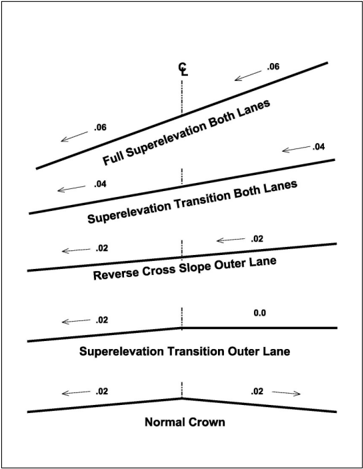
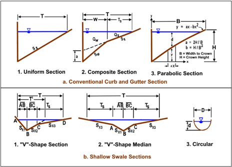
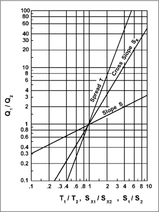

# Chapter 5 - Roadway Pavement Drainage

- Source: hif24006.pdf
- Generated: 2025-12-28T23:40:53+00:00
- Chunk: 5/13
- Estimated tokens: ~12,123
- Total pages: 313
- Type: chapter

## Chapter 5 - Roadway Pavement Drainage

The paved surface of the driving lanes is the critical area of interaction between vehicles and the roadway; effective drainage of the pavement facilitates safe roadway use. Water on the pavement adversely  affects safe  use  of the road, interrupts traffic,  reduces  skid  resistance,  increases potential for hydroplaning, and limits visibility by splash and spray from traffic (AASHTO 2014).

Pavement drainage design involves knowledge and consideration of surface drainage, gutter flow, and inlet capacity. The design of these elements depends on the design rainfall frequency and the allowable spread of stormwater on the pavement surface. This chapter presents information for  the  design  of  roadway  features  to  meet  the  desired  safety  and  serviceability  levels.  The  chapter draws  on  HEC -12,  Drainage  of  Highway  Pavements  (FHWA  1984),  and  AASHTO's  Drainage Manual (2014) for most of the information presented.

## 5.1 Spread

The width of pavement (outward from the face of curb) covered by water during rainfall is called 'spread.'  Spread  at  any  point  on  the  roadway  relates  to  the  intensity  and  duration  of  rainfall. Allowable spread represents the maximum width of pavement covered during the design storm. Designers also evaluate spread associated with a larger (less frequent) storm.

## 5.1.1 Design Frequency and Spread

Highway  storm  drainage  provides  safe  passage  for  vehicles  under  a  set  of  conditions  called  a design storm. The drainage system, including the curb and gutter and additional width such as parking lanes, conveys stormwater to pavement inlets to provide reasonable safety for traffic and pedestrians at a reasonable cost. As spread from the curb increases, the risk of traffic accidents increases  because  of  hydroplaning  and  spray,  along  with  nuisance  to  pedestrian,  bicycle,  and scooter traffic.

When specifying the AEP or return period for the design storm and the allowable spread during such  a  storm,  designers  make  decisions  regarding  risk  of  accidents  and  traffic  delays,  and acceptable costs for the drainage system. Risk associated with water on traffic lanes increases with  increasing  traffic  volume  and  traffic  speed  not  only  for  safety  reasons  but  also  because  of increased  potential  for  delay.  The  safety  of  the  public  represents  the  primary  consideration  for designers in specifying the design frequency and design spread.

State and local Departments of Transportation (DOTs) establish design storm and spread criteria based on consideration of:

- Functional classification of the roadway, and possibly traffic volume within the functional classification.
- Traffic speed, which is a primary factor in hydroplaning when water is on the pavement.
- Existing and projected traffic volume, which may be an indicator of the economic importance of keeping the highway open to traffic. The costs of traffic delays and accidents increase with increasing traffic volumes.
- Cost. Balance between desirable and practicable criteria is  sometimes  necessary  because of  cost,  and  because  of  external  factors  such  as  constrained  rightof-way  (ROW)  or utilities.  The  costs and feasibility of providing for a given design frequency and spread may vary significantly between projects. In some cases, it may be practicable to significantly

upgrade the drainage design and reduce risks at moderate costs. In other instances, costs may be very sensitive to the criteria selected for design.

Designers  consider  inconvenience,  hazards,  and  nuisances  to  pedestrian,  bicycle,  and  other personal transport traffic. In some places, such as in commercial areas, this consideration may assume major importance. Local design practice may also be a major consideration since it can affect the feasibility  of  designing  to  higher  standards,  and  it  influences  public  perception  of acceptable practice.

Designers also consider the relative elevation of the highway and surrounding terrain where water can be drained only through a storm drainage system, as in underpasses and depressed roadway sections.  They  consider  the  potential  for  ponding  to  undesirable  depths  when  selecting  the frequency and spread criteria  and  in  checking  the  design  against  storm  runoff  events  of  lesser frequency than the design event.

Selection  of  design  criteria  for  intermediate  types  of  facilities  may  be  the  most  difficult.  For example, some arterials with relatively high traffic volumes and speeds may not have shoulders which will convey the design runoff without encroaching on the traffic lanes. In these instances, practitioners  typically  assess  the  relative  risks  and  costs  of  various  design  spreads  to  select appropriate design criteria. Table 5.1 provides example minimum design frequencies and spread based on the type of highway and traffic speed.

Along with the situations covered in  Table 5.1, for depressed sections and underpasses where ponded  water  can  be  removed  only  through  the  storm  drainage  system,  designers  frequently consider additional criteria including a 0.02 AEP event. The use of a more severe event, such as a  0.01  AEP  event  to  assess  hazards  at  critical  locations  where  water  can  pond  to  appreciable depths is commonly referred to as a 'check storm.'

Table 5.1. Example minimum design frequency and spread.

| Road Classification                             | Context               |   Design Frequency (AEP) | Design Spread    |
|-------------------------------------------------|-----------------------|--------------------------|------------------|
| Interstate                                      | Varies                |                     0.02 | Shoulder         |
| Principal arterial (divided or bi- directional) | Design speed < 45 mph |                     0.1  | Shoulder + 3 ft  |
| Principal arterial (divided or bi- directional) | Design speed > 45 mph |                     0.1  | Shoulder         |
| Principal arterial (divided or bi- directional) | Sag vertical curve    |                     0.02 | Shoulder + 3 ft  |
| Major or minor collector                        | Design speed < 45 mph |                     0.1  | 1/2 Driving Lane |
| Major or minor collector                        | Design speed > 45 mph |                     0.1  | Shoulder         |
| Major or minor collector                        | Sag vertical curve    |                     0.1  | 1/2 Driving Lane |
| Local streets                                   | Low ADT               |                     0.2  | 1/2 Driving Lane |
| Local streets                                   | High ADT              |                     0.1  | 1/2 Driving Lane |
| Local streets                                   | Sag Point             |                     0.1  | 1/2 Driving Lane |

## 5.1.2 Check Storm Frequency and Spread

Practitioners typically use a check storm any time runoff could cause severe flooding during less frequent (larger) events. Where ponding to undesirable depths could occur, as when a series of inlets terminates at a sag vertical curve, the designer checks the performance of gutters and inlets with an event more severe than the design event.

Designers base selection of the frequency for the check storm on the same considerations used to  select  the  design  storm,  i.e.,  the  consequences  of  spread  exceeding  that  chosen  for  design and the potential for ponding. Where no significant ponding can occur, check storms are typically unnecessary. During the service life of a roadway, there is always a risk that a storm more severe than the design and check storm will occur once or multiple times. When the consequences of such  events  are  potentially  unacceptable,  a  designer  may  employ  risk -based  design  concepts (FHWA 2016). With risk-based design, the designer evaluates the consequences of design flow exceedance and balances the number of occurrences of the consequences against cost and other goals of society.

Each State  and  locality  determine  standards  for  the  criteria  for  spread  during  the  check  event. Examples of criteria for a check storm event include: 1) one lane open to traffic, and 2) one lane free of water. In the first, water may partially of fully cover the lane but at a depth that drivers can drive through at a reduced speed.

## 5.2 Surface Drainage

To facilitate surface drainage, designers avoid flat roadway surfaces. Slope may be parallel to the roadway,  transverse  to  it,  or  both.  The  slope  of  the  roadway  in  a  longitudinal  direction  is  the longitudinal  grade. Designers  refer  to  the  overall  vertical  alignment  of  the  roadway,  including tangent grades and vertical curves, as the profile grade line. The longitudinal grade may represent the slope of the profile grade line, or along a designated offset, such as a gutter grade. Transverse slope is referred to as the 'cross slope.'

When rain falls on a sloped pavement surface, it forms a thin film of water that increases in depth as it flows downgrade. Factors influencing the depth of water on the pavement include the length of the flow path, the texture of the pavement surface, the surface slope, and rainfall intensity. As the depth of water on the pavement increases, the potential for hydroplaning increases. Anderson et al. (1995) provides additional technical information on the mechanics of surface drainage.  This section describes the following surface drainage topics:

- Hydroplaning.
- Longitudinal pavement slope.
- Cross or transverse pavement slope.
- Surface conveyance.
- Superelevation transition.
- Other surface features affecting drainage.

## 5.2.1 Hydroplaning

When a rolling vehicle tire meets a film of water on the roadway, it has the potential to lose contact with the roadway, a condition known as hydroplaning. Ideally, the water is channeled through the tire tread pattern and through the surface roughness of the pavement. Hydroplaning occurs when the drainage capacity of the tire tread pattern and the pavement surface is insufficient to conduct the water away, and the water begins to build up in front of the tire. As this wedge of water builds up in front of the tire, the wedge produces a force that can lift the tire off the pavement surface. This is considered as full dynamic hydroplaning and, since water offers no shear resistance, the tire  loses  its  ability  to  exert  stopping  or  steering  force  on  the  vehicle. The  driver  has  then  lost control  of  the  vehicle.  Hydroplaning  can  occur  at  speeds  of  55  mph  with  a  water  depth  of  0.08 inches  (Anderson  et  al.  1995).  However,  depending  on  a  variety  of  criteria,  hydroplaning  may occur at lower speeds and depths.

Hydroplaning is a function of the water depth, roadway geometry, vehicle speed, tread depth, tire inflation pressure, and pavement texture. The AASHTO Model Drainage Manual (AASHTO 2000) provides methods of calculating when it can occur. In problem areas, hydroplaning hazard may be reduced by:

- Designing the  highway  geometry  to  reduce  the  drainage  path  lengths  of  flow  over  the pavement to prevent flow buildup.
- Increasing the pavement surface texture depth. Grooving of concrete pavement and the use  of  asphalt-aggregate  surface  treatment  (chip  seal)  are  examples  of  surfaces  that inhibit hydroplaning. An increase of pavement surface texture will increase the drainage capacity at the tire pavement interface.
- Using  open graded asphaltic pavements. The open texture prevents the buildup hydrostatic pressure and the corresponding lifting force by allowing the  water to be forced out from under the tire.
- Adding drainage structures to capture water from the pavement to reduce the film of water and reduce the hydroplaning potential.

NASEM (2021) provides an in-depth discussion of hydroplaning and the related variables.

## 5.2.2 Longitudinal Grade

The AASHTO  Policy on Geometric Design (AASHTO 2018) provides suggested  minimum roadway longitudinal grades for safe pavement drainage on tangent grade sections. Based on its citation in 23 CFR 625.4, this Policy contains specific criteria and controls for the design of NHS projects.  [See  23  CFR  625.3(b)  and  625.4(a)]. In  addition,  to  create  safe  roadways  designers consider the following general statements:

- A  minimum  longitudinal  gradient  is  more  important  for  a  curbed  pavement  than  for  an uncurbed pavement since the water is constrained by the curb. However, flat gradients on uncurbed  pavements  can  lead  to  a  spread  problem  if  vegetation  builds  up  along  the pavement edge.
- Desirable  gutter  grades  are  greater  than  or  equal  to  0.5  percent  for  curbed  pavements with an absolute minimum of 0.3 percent. Minimum grades can be maintained in very flat terrain  by  use  of  a  rolling  profile,  or  by  warping  the  cross  slope  to  achieve  rolling  gutter profiles (TxDOT 2019).
- To provide adequate drainage in sag vertical curves, a minimum slope of 0.3 percent is maintained within 50 ft of the low point of the curve. At the low point, the grade passes through zero. This is accomplished when the vertical curve constant, K, is equal to or less than 167 (50 in SI).

The vertical curve constant, K, is:

<!-- formula-not-decoded -->

where:

- K = Vertical curve constant ft/percent (m/percent)
- L = Horizontal length of curve, ft (m)
- Gi = Grade of roadway, percent

of

## Lessons from Experience: Avoiding Slippery Slopes

Designers may benefit from considering these lessons for specific situations:

- On highways where three or more lanes are sloped in the same direction, increase the cross slope of the lowest lanes. For example, slope the two lanes adjacent to the crown line at typical slope and increase the successive lanes, or portions of them, by 0.5 to 1 percent per lane, but not more than a total cross slope of 4 percent.
- When depressed medians are present, slope inside lanes toward the median if conditions warrant.
- Avoid introducing water from median areas to the travel lanes.
- Increase cross slopes in vertical curves where grade passes through zero and in flat sections where it is small.
- Slope shoulders to drain away from the pavement, except with raised, narrow medians and in superelevated curves. Shoulders with a greater cross slope than the roadway assist in reducing the depth of water in the travel lanes.

## 5.2.3 Cross (Transverse) Slope

The AASHTO Policy on Geometric Design of  Highways and Streets specifies an acceptable range of cross slopes (AASHTO 2018). [See 23 CFR 625.3(b) and 625.4(a)]. Summarized in Table 5.2, these cross slopes balance the need for reasonably steep cross slopes for drainage and relatively flat cross slopes for driver comfort and safety. Cross slopes of 2  percent or less have little effect on  driver  effort  in  steering  or  on  friction  demand  for  vehicle  stability  ( Gallaway et  al. 1979). In areas of intense rainfall, a somewhat steeper cross slope (2.5 percent) may be used to facilitate drainage.  When  a  designer  considers  deviating  from  values  in Table 5.2,  the  AASHTO  policy provides other information.

Table 5.2. Typical pavement cross slopes.

| Surface Type *                                      | Range in Rate of Surface Slope, ft/ft (m/m)     |
|-----------------------------------------------------|-------------------------------------------------|
| High-type surface (2-lanes)                         | 0.015 - 0.020                                   |
| High-type surface (3 or more lanes, each direction) | 0.015 - 0.04 (increase 0.005 to 0.010 per lane) |
| Intermediate-type surface                           | 0.015 - 0.030                                   |
| Low-type surface                                    | 0.020 - 0.060                                   |
| Bituminous or concrete shoulders                    | 0.020 - 0.060                                   |
| Shoulders with curbs                                | ≥ 0.040                                         |

*High-, intermediate-, and low-type surfaces describe the relative heights of skidresisting surface textural elements.

## 5.2.4 Surface Conveyance

Surface drainage includes conveyance features adjacent to the paved roadway that collects water from the pavement and carries it parallel to the roadway, although some surface drainage features may flow skewed from or perpendicular to the roadway. Parallel features include curb and gutter sections and median and roadside channels.

## 5.2.4.1 Curb and Gutter

Designers typically use curbs at the outside edge of pavements for low-speed highway facilities, and in some instances, adjacent to shoulders on moderate to high-speed facilities. Curbs serve several purposes:

- Contain surface runoff within the roadway and away from adjacent properties.
- Prevent erosion on fill slopes.
- Provide pavement delineation.
- Enable orderly development of adjacent property.
- Redirect errant vehicles back into the roadway.

Gutters formed in combination with curbs come in various widths. Gutters often have the same cross slopes as that of the pavement or they may have a steeper cross slope than the shoulder or adjacent lane (if present).

For stormwater runoff from cut slopes and other areas that drain toward the roadway, designers provide alternative drainage paths, where  practical, to prevent such flow from entering the roadway.  Where  curbs  are  not  needed  for  traffic  purposes,  shallow ditches at the edge  of pavement  offer advantages over curbed sections and provide channel capacity that is not dependent on spread on the pavement. Section  5.3 provides a detailed discussion of curb and gutter sections.

## 5.2.4.2 Roadside and Median Channels

Designers  commonly  use  roadside  channels  with  uncurbed  roadway  sections  to  convey  runoff from the highway pavement and adjacent areas. Right-of-way limitations and requirements often preclude the use of roadside channels on urban arterials. Designers typically use roadside channels in depressed roadway sections, and other locations with sufficient ROW and where driveways or intersections are infrequent.

access

To  prevent  runoff  from  median  areas  from  running  across  the  travel  lanes,  designers  slope median areas and inside shoulders to a center swale. This design option is particularly useful for high-speed facilities and for facilities with more than two lanes of traffic in each direction. Chapter 6 provides a detailed discussion of roadside and median channels.

## 5.2.5 Other Surface Features Affecting Drainage

Other  roadway  surface  features  affect  roadway  drainage.  These  include  bridge  decks,  median barriers, superelevated roadways, roundabouts, and porous pavements.

## 5.2.5.1 Bridge Decks

Design of bridge deck drainage addresses several challenges unique to the bridge environment in providing for and maintaining adequate drainage systems:

- Deck  structural  and  reinforcing  steel  tends  to  corrode  from  deicing  chemicals,  so  that designs focus on draining treated water to slow the corrosion.

- Water on bridge decks freezes before surface roadways leading to ice-covered bridges.
- Bridge  deck  drainage  gutters  may  have  lower  capacity  than  roadway  gutters because cross slopes may be flatter.
- Parapet-type bridge rails can accumulate roadway debris.
- Scuppers and other deck drains generally have smaller open areas than many roadway inlets and can be easily clogged by debris.
- Bridges lack auxiliary lanes or additional width beyond the travel lanes.
- Bridges over water may be subject to water quality restrictions limiting direct discharge to the water body.
- Bridges  crossing  over  land,  including  other  roadways  or  bridges,  may  have  to  convey water to a safe discharge location.

To address these difficulties in providing for deck drainage systems, designers focus intercepting and redirecting gutter flow from the roadway leading to a bridge before it reaches a bridge whenever possible. For similar reasons, designers avoid zero longitudinal grades and sag vertical curves on bridges. HEC-21 includes detailed coverage of bridge deck drainage systems (FHWA 1993).

## 5.2.5.2 Median Barriers

When  designing  shoulder  areas  adjacent  to  median  barriers,  designers  typically  slope  them toward the center to prevent drainage from running across the traveled pavement.  Where designers use median barriers, they provide inlets or slotted drains to collect  water accumulated against  barriers  at  low  points  or  where  spread  exceeds  allowable  on  grade.  For  superelevated curves, designers provide inlets to collect water before it is redirected back to the roadway by the superelevated roadway geometry.

## 5.2.5.3 Superelevated Horizontal Curves

Designers can accomplish  changes  to  the  roadway  direction  in  the  horizontal  plane by  using circular curves. In many cases, horizontal curves involve super elevating the roadway to facilitate the safe passage of vehicles through a change in direction as shown in Figure 5.1. Superelevation is the transverse slope provided to reduce the tendency of  a vehicle to overturn or to skid laterally outwards by raising the pavement outer edge with respect to inner edge.

As shown in Figure 5.1, the designer provides superelevation by steadily reducing the cross slope on the outer side of the  curve  until  it  is  zero,  and  then  steadily  sloping  the  outer  side  of  the  roadway toward the inner  side,  until  the  inner  side  cross  slope  is  continuous  across  the  entire  roadway. The designer steadily rotates the entire roadway further toward the inner side, until reaching the desired cross slope. The full superelevation cross slope depends on design speed and radius of curvature.  State  DOT  design  manuals  provide  maximum  recommended  values,  for  example,  8 percent  in  temperate  areas  where  snow  and  ice  are  uncommon  and  6  percent  in  areas  where snow and ice are more common. Roadway designers commonly begin the transition from normal crown to superelevated section before the beginning of the horizontal curve, achieve superelevation within the curve, and transition from superelevated back to normal crown.

Superelevation transitions present several challenges for drainage design:

- The increase in contributing pavement runoff when all lanes drain to the same side.
- The flat cross slope during the transition.
- Potential low or flat slope slopes in the longitudinal grade of the roadway gutter.

on full

Figure 5.1 Transition from normal crown to superelevated curve to the left.



Fully superelevated sections present pavement drainage challenges by increasing contributing drainage area to one side. The entire roadway section drains a single direction, rather than each half of the roadway draining toward its edge. The increased drainage length may be partially  offset  by  increased  cross  slope  in  some  cases.  In  addition  to  increasing  the  width  of roadway  draining  to  the  edge,  the  curvature  of  the  roadway  causes  the  cross -roadway  flow  to converge from wide at the high, outer side to narrow at the low, inner side, increasing depth of surface flow.

The  section  of  roadway  where  the  cross  slope  in  the  right  (outer)  lane  passes  through  zero  is important for drainage design because ponding can occur and available head for inlets to remove water  would  also  be  zero.  Flow  in  the  roadway  is  then  governed  by  longitudinal  grade  only.  If there is no longitudinal grade in the same location as a zero cross slope water can build up on the

the pavement in that location. Designers seek to avoid conditions where water is directed across the roadway from the outer side of the curve to the inner side.

The drainage designer also considers the relative changes in the roadway profile grade and the gutter  profile  grade  as  these  do  not  change  at  the  same  rates  in  a  superelevation  transition. Relative to the roadway profile grade, the gutter profile grade may decrease, increase, or even change  direction.  Depth  of  flow  available  at  the  curb  may  decrease  and  spread  may  increase (depending on flow direction).

In superelevation transitions, the roadway design may rotate the roadway cross -section about the centerline,  inner  edge,  or  outer  edge.  If  rotated  about  the  centerline  or  outer  edge,  the  gutter profile on the inner side of the curve may be depressed by the increase of cross slope past the normal  crown  slope  at  full  superelevation.  Combining  the  increased  drainage  distance  of  a superelevated section and a depressed gutter profile grade line can result in significant increase in spread, and in depth of runoff on the inner side of curves. If the roadway is rotated about either edge, the centerline profile grade line will show a 'hump' or 'dip' to reflect the transition and curve that may affect drainage.

Because of the many possible situations for superelevation transitions and the importance of good drainage for safe roadways, drainage and roadway geometry designers coordinate to minimize problem areas created by superelevated curves and transitions. They  consider the profile grade line, both gutter grades, and the rotation of the roadway (centerline, inner edge, or outer edge) in the superelevation transition to avoid flatter areas where water builds up and drains slowly from the roadway and to avoid areas where water is directed from one side of the road to the other.

## 5.2.5.4 Roundabouts

Designers increasingly use circular 'roundabout' intersections as a traffic management technique.  Roundabouts  can  present  unique  drainage  situations.  The  profile  grade  lines  of  the roadways converging or crossing at a roundabout are adjusted to intersect at a common elevation at the center of the roundabout. Traffic turns to the right to enter the roundabout, curves to the left while traveling in  the  roundabout,  turns  to  the  right  to  exit  the  roundabout.  Traffic  proceeds  through roundabouts at speeds lower than the approaching roadway sections. The lower speed facilitates the 'reversing' motion of entering, transiting, and leaving the roundabout.

Typically, the central island of a roundabout is elevated, and roadways approaching a roundabout have a center crown with cross  slopes  of  0.02.  The  cross  slope  on  the  roundabout  circle  is  an adverse superelevation (sloping from the outside of the curve rather than the inside) throughout (NASEM 2007, NASEM 2010). Researchers recommend that the central island be elevated in all classifications of roundabouts  (mini, single-lane, and  multi -lane). If the central island is not elevated, cross slope toward the central island will create ponding near the island, and drainage structures  will  be  needed  to  alleviate  the  ponding  (N ASEM 2010). Multi-lane  roundabouts,  like other multi-lane features, exhibit wider pavement sections, and longer accumulation distances for runoff, than do single-lane features.

The adverse cross slope within the roundabout directs water toward the outside of roundabout. Because the outer edge of the roadway within the roundabout has a circumference than the inner edge, as water flows toward the outer edge of the roundabout the increase of depth resulting from increasing pavement area is mitigated by the circumference.

the larger

larger

Among the intended purposes of roundabouts is to limit traffic speed; because of this, they are inherently low-speed features. The tendency to limit speed also serves to mitigate hydroplaning, even in cases where water ponds on the pavement in depths greater than would be desirable on other roadway features.

intersection

Gutter design at the outer edge of the roundabout determines the spread conditions. The gutters either  direct  water  to  inlets  within  the  roundabout  or  to  gutters  on  roadways  connected  to  the roundabout. Because roundabouts direct water to the periphery and slow traffic speeds, roundabouts can reduce the potential for hydroplaning compared to other configurations.

## 5.2.5.5 Porous Pavement

Primarily  to  improve  stormwater  runoff  quality,  roadway  designers  sometimes  use  porous  or permeable pavements that allow stormwater into the pavement so that it slowly runs through the pavement rather than quickly off over the pavement surface. Porous pavements do not generally affect  stormwater runoff quantities for moderate to large design events because the quantity of water redirected through the pavement is small. However, there may be some quantity effect for smaller storms (Harvey and Smith 2018).

## 5.3 Flow in Gutters

A pavement gutter is a structure at the edge of the roadway that conveys water during a storm runoff event. It may include a portion or all of a travel lane.  Figure 5.2 illustrates typical curb and gutter  and  shallow  swale  sections.  Conventional  curb  and  gutter  sections  commonly  have  a triangular shape with the curb forming the near -vertical leg of the triangle. Conventional gutters typically have a uniform cross slope ( Figure 5.2, a.1), a composite cross slope (Figure 5.2, a.2), or a parabolic section (Figure 5.2, a.3). Shallow swale gutters typically have V-shaped or circular sections as illustrated in Figure 5.2 and are often used in paved median areas.

Figure 5.2. Typical stormwater conveyance sections.



## 5.3.1 Capacity Relationship

Gutter flow calculations estimate the spread of water on the shoulder, parking lane, or pavement section. Izzard stated that the hydraulic radius used in Manning's equation does not adequately describe  the  gutter  cross -section,  particularly  where  the  top  width  of  the  water  surface  may  be more than 40 times the depth at the curb, and modified Manning's equation for gutter flow (Izzard 1946):

<!-- formula-not-decoded -->

where:

Ku =

Unit conversion constant, 0.56 in CU (0.376 in SI)

n =

Manning's coefficient

Q =

Flow rate, ft 3 /s (m 3 /s)

T =

Width of flow (spread), ft (m)

Sx =

Cross slope, ft/ft (m/m)

SL =

Longitudinal grade, ft/ft (m/m)

Equation 5.2 neglects the resistance of the curb face since this resistance is negligible.  Table 5.3 summarizes typical Manning's coefficients for paved gutters. In terms of velocity, the relationship is:

<!-- formula-not-decoded -->

Designers often use spread on  the pavement and flow depth at the curb as criteria for spacing pavement drainage inlets. Equation 5.2 can be solved in terms of T to estimate a spread width given a flow rate:

<!-- formula-not-decoded -->

Table 5.3. Manning's n for street and pavement gutters (FHWA 1977).

| Type of Gutter or Pavement                            |   Manning's n * |
|-------------------------------------------------------|-----------------|
| Concrete gutter, troweled finish                      |           0.012 |
| Asphalt pavement: smooth texture                      |           0.013 |
| Asphalt pavement: rough texture                       |           0.016 |
| Asphalt pavement: smooth texture with concrete gutter |           0.013 |
| Asphalt pavement: rough texture with concrete gutter  |           0.015 |
| Concrete pavement: float finished                     |           0.014 |
| Concrete pavement: broom finished                     |           0.016 |

## 5.3.2 Conventional Curb and Gutter Sections

Conventional curb and gutter sections include a very short wall-like curb with a near-vertical face, and a toe section sloped upward to form the invert of the gutter. Gutters begin at the inside base of the curb and usually extend from the curb face toward the roadway centerline 1.0 to 3.0 ft. As illustrated in Figure 5.2, gutters can have uniform, composite, or curved sections; most commonly, they are uniform.

## 5.3.2.1 Uniform Cross Slope

Uniform gutter sections have a cross slope equal to the cross slope of the shoulder or travel lane adjacent to the gutter. Equations 5.2 and 5.3 describe the gutter flow characteristics in a uniform triangular gutter as illustrated in the following example.

## Example 5.1: Computation of triangular gutter flow.

Objective:

Estimate the spread given a flow rate of 1.8 ft 3 /s (0.051 m 3 /s) and find the gutter flow given a spread of 8.2 ft (2.5 m).

Given: Gutter section illustrated in Figure 5.2 (a.1) .

SL =

0.010 ft/ft (m/m)

Sx =

0.020 ft/ft (m/m)

n = 0.016

Step 1. Compute spread, T, using equation 5.4.

T = [(Q n)/(Ku Sx 1.67 SL 0.5 )] 0.375 = [(1.8)(0.016)/{(0.56)(0.020) 1.67 (0.010) 0.5 }] 0.375 = 9.0 ft

Step 2. Compute Q using equation 5.2.

Q = (Ku/n) Sx 1.67 SL 0.5 T 2.67 = (0.56/0.016))(0.020) 1.67 (0.010) 0.5 (8.2) 2.67 = 1.4 ft 3 /s

Solution: The spread given a flow rate of 1.8 ft 3 /s (0.051 m 3 /s) is 9.0 ft (2.7 m). The gutter flow given a spread of 8.2 ft (2.5 m) is 1.4 ft 3 /s (0.040 m 3 /s).

## 5.3.2.2 Composite Gutters

Gutters with composite sections are depressed in relation to the adjacent pavement slope. Most commonly, designers use gutters with composite sections as the flow approaches a storm drain inlet. Depressed gutters can present a hazard to bicycle traffic.

Because  the  cross -section  is  no  longer  a  simple  triangle,  the  total  flow  is  conceptually  divided between the flow in the depressed section, Qw, and the flow in the side section, Qs. Based on the composite  channel  geometry,  the  fraction  of  the  flow  in  the  depressed  and  side  sections  are represented as:

<!-- formula-not-decoded -->

w o

<!-- formula-not-decoded -->

(5.6)

where:

Q =

Total gutter flow rate, ft 3 /s (m 3 /s)

Qw =

Flow in the depressed section of the gutter, ft 3 /s (m 3 /s)

Qs =

Flow in the gutter section above the depressed section, ft 3 /s (m 3 /s)

Eo =

Ratio of flow in the depressed section (usually the width of a grate) to total gutter flow

The ratio of flow in the depressed section to the total flow is:

<!-- formula-not-decoded -->

where:

Sw = Cross slope in the depressed section, ft/ft (m/m)

As shown in Figure 5.2 (a.2) the depressed section cross slope is:

<!-- formula-not-decoded -->

The following example demonstrates computing flow and spread in a composite gutter.

## Example 5.2: Composite gutter flow.

Objective:

Estimate: A) the flow in a composite gutter at a spread of 8.2 ft (2.5 m) and B) the spread in the gutter at a flow of 4.2 ft 3 /s (0.12 m 3 /s).

Given:

Gutter section illustrated in Figure 5.2 (a.2) with:

W =

2 ft (0.61 m)

SL =

0.01 ft/ft (m/m)

Sx = 0.02 ft/ft (m/m)

n = 0.016

a =

2 inches (51 mm) (gutter depression)

Step A1. Compute the cross slope of the depressed gutter, Sw, and the width of spread from the junction of the gutter and the road to the limit of the spread, Ts.

<!-- formula-not-decoded -->

Ts = T - W = 8.2 - 2.0 = 6.2 ft

## Step A2. Compute Qs from equation 5.2 using Ts.

<!-- formula-not-decoded -->

## Step A3. Determine the gutter flow, Q.

T / W = 8.2 / 2 = 4.10

Sw / Sx = 0.103 / 0.020 = 5.15

Using equation 5.7:

<!-- formula-not-decoded -->

Using equation 5.6:

<!-- formula-not-decoded -->

## Step B1. Select an initial estimate of Qs.

There is not a direct computational solution for estimating spread from flow in a composite gutter, therefore, an iterative approach is used. Select an initial estimate of Qs = 1.4 ft 3 /s.

## Step B2. Compute Qw.

<!-- formula-not-decoded -->

## Step B3. Determine W/T ratio.

<!-- formula-not-decoded -->

<!-- formula-not-decoded -->

Solve for T/W using equation 5.7:

<!-- formula-not-decoded -->

T/W = 4.48

## Step B4. Compute spread based on the assumed Qs.

<!-- formula-not-decoded -->

Step B5. Compute Ts.

<!-- formula-not-decoded -->

## Step B6. Use equation 5.2 to determine Qs for computed Ts .

<!-- formula-not-decoded -->

Step B7. Compare computed Qs with assumed Qs.

Qs assumed = 1.4 &gt; 0.92, Computed Qs not close to assumed. Try again.

## Step B8. Try a new assumed Qs and repeat steps B1 through B7.

Assume Qs = 1.85 ft 3 /s

<!-- formula-not-decoded -->

<!-- formula-not-decoded -->

<!-- formula-not-decoded -->

T / W = 5.55

T = 2.0 (5.55) = 11.1 ft

Ts = 11.1 - 2.0 = 9.1 ft

Qs = 1.85 ft 3 /s

Qs assumed = Qs computed. Computations completed.

Solution: A) The estimated discharge of the gutter for the given spread is 2.3 ft 3 /s (0.065 m 3 /s). B) The estimated spread of the composite gutter for the given discharge is 11.1 ft (3.38 m).

## 5.3.2.3 Gutters with Curved Sections

Older  city  streets  or  highways  with  curved  pavement  sections  sometimes  have  curved  gutter sections. Where the pavement cross -section is curved, gutter capacity varies with configuration of the pavement. For this reason, discharge-spread or discharge-depth-at-the-curb relationships  developed  for  one  pavement  configuration  do  not  apply  to  another  section  with  a different crown height or half width. Appendix B includes procedures for developing conveyance curves for parabolic pavement sections.

## 5.3.3 Shallow Swale Sections

Where  traffic  control  does  not  demand curbs,  designers  typically  use  a  small  swale  section  of circular or V-shape to convey runoff from the pavement. For example, designers use swales to convey  runoff  from  pavement  on  fills  to  protect  the  embankment  from  erosion.  Small  swale sections may have sufficient capacity to convey the flow to a location suitable for interception.

## 5.3.3.1 V-Sections

Equation 5.2 can be used to compute the flow in a shallow V -shaped section by estimating the cross slope, Sx, using the following equation:

<!-- formula-not-decoded -->

The following example demonstrates the analysis of a V-shaped shoulder gutter.

```
Example 5.3: V-shaped roadside shoulder gutter. Objective:
```

Find spread for a design flow of 1.77 ft 3 /s (0.050 m 3 /s).

Given: V-shaped roadside gutter (Figure 5.2 (b.1)) with:

SL =

0.01 ft/ft (m/m)

Sx1 =

0.25 ft/ft (m/m)

Sx3 =

0.02 ft/ft (m/m)

n =

0.016

Sx2 =

0.04 ft/ft (m/m)

TBC =

2.0 ft (0.61 m)

Step 1.  Calculate Sx using equation 5.8 assuming all flow is contained entirely in the V-shaped gutter section determined by Sx1 and Sx2.

Sx =  Sx1 Sx2 / (Sx1 + Sx2) = (0.25) (0.04) / (0.25 + 0.04) = 0.0345 ft/ft the

## Step 2.  Using equation 5.4, find the hypothetical spread, T', assuming all flow contained entirely in the V-shaped gutter.

<!-- formula-not-decoded -->

## Step 3.  Determine if T' is within Sx1 and Sx2.

<!-- formula-not-decoded -->

<!-- formula-not-decoded -->

<!-- formula-not-decoded -->

2.32 ft &lt; T' therefore, spread falls outside V-shaped gutter section. An iterative solution technique is used to solve for the section spread, T, as illustrated in the following steps.

## Step 4.  Solve for the depth at point C, yc, and compute an initial estimate of the spread along TBD.

<!-- formula-not-decoded -->

From the geometry of the triangle formed by the gutter, an initial estimate for dB is determined as:

<!-- formula-not-decoded -->

<!-- formula-not-decoded -->

<!-- formula-not-decoded -->

<!-- formula-not-decoded -->

<!-- formula-not-decoded -->

## Step 5.  With TBD, develop a weighted slope for Sx2 and Sx3.

2.0 ft at Sx2 (0.04) and 7.0 ft at Sx3 (0.02)

<!-- formula-not-decoded -->

Use this slope along with SX1, find Sx using equation 5.9:

<!-- formula-not-decoded -->

## Step 6.  Using equation 5.2, compute the gutter spread using the composite cross slope, Sx.

<!-- formula-not-decoded -->

This 8.5 ft is lower than the assumed value of 9.0 ft.

Therefore, assume TBD = 8.3 ft and repeat step 5 and step 6.

## Step 5 (repeated). 2.0 ft at Sx2 (0.04) and 6.3 ft at Sx3 (0.02).

<!-- formula-not-decoded -->

Use this slope along with Sx1, find Sx using equation 5.6:

<!-- formula-not-decoded -->

## Step 6 (repeated). Using equation 5.2 compute the spread.

<!-- formula-not-decoded -->

## Solution: This value of T is close to the assumed value, therefore, OK.

The following example illustrates analysis of a V-shaped median gutter resulting from a roadway with an inverted crown section.

Example 5.4:

V-shaped median shallow swale.

Objective:

Find A) spread for the design flow of 24.7 ft 3 /s (0.70 m 3 /s) and B) compute the flow for a spread of 23.0 ft (7.0 m).

Given: V-shaped gutter as illustrated in Figure 5.2 (b.2) with:

TAB =

3.28 ft (1 m)

TBC =

3.28 ft (1 m)

SL =

0.01 ft/ft (m/m)

n =

0.016

Sx1 =

0.25 ft/ft (m/m)

Sx2 =

0.25 ft/ft (m/m)

Sx3 =

0.04 ft/ft (m/m)

## Step A1. Assume spread remains within middle 'V' (A to C) and compute Sx.

Sx = (Sx1 Sx2 ) / (Sx1 + Sx2 ) = (0.25) (0.25) / (0.25 + 0.25) = 0.125 ft/ft

## Step A2. Compute the spread from equation 5.4.

T = [(Q n)/(Ku Sx 1.67 SL 0.5 )] 0.375 = [(24.7)(0.016)/{(0.56) (0.125) 1.67  (0.01) 0.5 }] 0.375 = 7.65 ft

Since 'T' is outside Sx1 and Sx2 an iterative approach is used to compute the spread.

## Step A3. Treat one-half of the median gutter as a composite section and solve for T' equal to one-half of the total spread.

Q' for T' = ½ Q = 0.5 (24.7) = 12.4 ft 3 /s

## Step A4. Try Q's = 1.8 ft 3 /s.

Q'w = Q' - Q's =12.4 - 1.8 = 10.6 ft 3 /s

## Step A5. Using equation 5.5, determine the W/T' ratio.

E'o = Q'w/Q' = 10.6/12.4 = 0.85

Sw / Sx = Sx2 / Sx3 = 0.25 / 0.04 = 6.25

W/T' = 0.33 from trial-and-error

## Step A6. Compute spread based on assumed Q's.

T' = W / (W/T') = 3.28 / 0.33 = 9.94 ft

## Step A7. Compute Ts based on assumed Q's.

Ts = T' - W = 9.94 - 3.28 = 6.66 ft

## Step A8. Use equation 5.2 to determine Q's for Ts.

Q's = (Ku/n) Sx3 1.67 SL 0.5  Ts 2.67 = (0.56/0.016) (0.04) 1.67 (0.01) 0.5 (6.66) 2.67 = = 2.56 ft 3 /s

## Step A9. Check computed Q's with assumed Q's.

Q's assumed = 1.8 &lt; 2.56 = Q's computed

Therefore, try a new assumed Q's and repeat steps 4 through 9.

Assume Q's = 0.04

Q'w = 12.0 ft 3 /s

<!-- formula-not-decoded -->

<!-- formula-not-decoded -->

W/T'  = 0.50 by iteration, as in example 5.2 (step 6)

<!-- formula-not-decoded -->

Ts = 1.0 ft

Qs   = 0.39 ft 3 /s

Qs computed = 0.39 close to 0.40 = Qs assumed, therefore OK.

<!-- formula-not-decoded -->

## Step B1. Compute half-section top width.

Analyze in half-section using composite section techniques. Double the computed half width flow rate to get the total discharge:

<!-- formula-not-decoded -->

<!-- formula-not-decoded -->

## Step B2. Determine Qs .

Using equation 5.2:

<!-- formula-not-decoded -->

## Step B3. Determine flow in half-section.

<!-- formula-not-decoded -->

<!-- formula-not-decoded -->

## Solution: A: Estimated spread is 13.12 ft (4.0 m). B: Estimated flow is 49 ft 3 /s (1.4 m 3 /s).

## 5.3.3.2 Circular Sections

Flow in shallow circular gutter sections can be represented by the relationship:

<!-- formula-not-decoded -->

where:

d =

Depth of flow in circular gutter, ft (m)

D =

Diameter of circular gutter, ft (m)

Ku = Unit conversion constant, 0.972 in CU (1.179 in SI)

The  width  of  circular  gutter  section  T w  is  represented  by  the  chord  of  the  arc  which  can  be computed using:

<!-- formula-not-decoded -->

where:

Tw =

Width of circular gutter section, ft (m)

r =

Radius of circular gutter, ft (m)

## Example 5.5: Circular channels.

Objective:

Find flow depth and top width of a circular gutter.

Given: A circular gutter swale as illustrated in Figure 5.2, b.3 with:

D =

4.92 ft (1.5 m)

SL =

0.01 ft/ft (m/m)

n =

0.016

Q =

17.6 ft 3 /s (0.50 m 3 /s)

## Step 1. Determine flow depth.

Use equation 5.10:

d/D = Ku [(Q n)/ (D 2.67 SL 0.5 )] 0.488 = (0.972) [((17.6) (0.016))/ ((4.92) 2.67 (0.01 0.5 )] 0.488  = 0.20

d = D (d/D) = 4.92(0.20) = 0.98 ft

## Step 2. Using equation 5.11, determine Tw.

<!-- formula-not-decoded -->

## Solution: Estimated depth is equal to 0.98 ft (0.3 m) and estimated top width is 3.93 ft (1.2 m).

## 5.3.4 Flow in Sag Vertical Curves

As gutter flow approaches the low point in a sag vertical  curve, the flow can exceed the allowable design  spread  values  because  of  the  continually  decreasing  gutter  slope.  Check  the  spread  in these areas to ensure it remains within allowable limits. If the computed spread exceeds design values, additional inlets can be provided to reduce the flow as it approaches the low point. Chapter 7 discusses sag vertical curves and measures for reducing spread in more detail.

In  vertical  curve  cases  where  a  negative  grade  goes  to  a  lesser  (flatter)  grade,  spread  may increase because conveyance in the gutter decreases.

## 5.3.5 Relative Flow Capacities

Examples 5.1 and 5.2 illustrate the advantage of a composite gutter section. The capacity of the section with a depressed gutter in the examples is 70 percent greater than that of the section with a straight cross slope with all other parameters held constant.

Equation 5.2 can be used to examine the relative effects of changing the values of spread, cross slope, and longitudinal slope on the capacity of a section with a straight cross slope.

To  examine  the  effects  of  cross  slope  on  gutter  capacity,  equation 5.2 can  be  transformed  as follows into a relationship between Sx and Q. Let:

K1 = n / (Ku SL

Then,

Sx 1.67  = K1 Q

and

<!-- formula-not-decoded -->

Similar transformations can be performed to evaluate the effects of changing longitudinal slope and width of spread on gutter capacity resulting in:

<!-- formula-not-decoded -->

<!-- formula-not-decoded -->

Figure 5.3 illustrates that the effects of cross slope are also relatively significant. At a cross slope of 4 percent, a gutter has 10 times the capacity of a gutter of 1 percent cross slope. A gutter at 4 percent  cross  slope  has  3.2  times  the  capacity  of  a  gutter  at  2  percent  cross  slope. Designers generally have  little latitude to vary longitudinal slope to increase  gutter capacity but changes, which change gutter capacity, are frequent.

## 5.3.6 Gutter Flow Time

The flow time in gutters is an important component of the time of concentration for the contributing drainage area to an inlet. To find the gutter flow component of the time of concentration, a method for estimating the average velocity in a reach of gutter is needed. The velocity in a gutter varies with the flow rate and the flow rate varies with the distance along the gutter, i.e., both the velocity and  flow  rate  in  a  gutter  are  spatially  varied.  Designers  can  estimate  the  time  of  flow  using  an average  velocity  obtained  by  integration  of  the  Manning's  equation  for  the  gutter  section  with respect to time (see Appendix B for the derivation):

<!-- formula-not-decoded -->

where:

Va = Average velocity in the gutter section between T1 and T2 locations, ft/s (m/s)

T1

=

Upstream spread, ft (m)

T2 = Downstream spread, ft (m)

KG = Gutter geometry parameter

Ku = Unit conversion constant, 0.84 in CU (0.564 in SI)

The gutter geometry parameter is:

<!-- formula-not-decoded -->

0.5

T 2.67

)

slope



Figure 5.3. Relative effects of spread, cross slope, and longitudinal slope on gutter capacity.

```
Example 5.6: Gutter flow time. Objective: Find the travel time in the gutter for an inlet spacing of 330 ft (100 m).
```

## Given: A triangular gutter section:

T1 =

3.28 ft (1.0 m)

T2 =

9.84 ft (3.0 m)

SL =

0.03 ft/ft (m/m)

Sx =

0.02 ft/ft (m/m)

n = 0.016

Step 1. Compute the gutter geometry parameter.

## Use equation 5.16:

<!-- formula-not-decoded -->

## Step 2. Estimate the average velocity in the gutter.

Use equation 5.15:

Va = Ku KG [(T2 2.67 - T1 2.67 ) / (T2 2 - T1 2. )] = (0.83) (0.79) [((9.84) 2.67 - (3.28) 2.67 ) / ((9.84) 2 - (3.28) 2. )] = 3.22 ft/s

## Step 3. Estimate the travel time in the gutter.

<!-- formula-not-decoded -->

Solution:

Travel time in the gutter between the two spread locations is 1.7 minutes.
