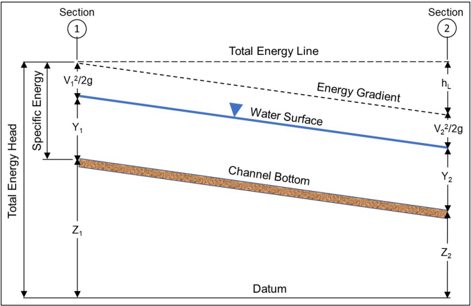
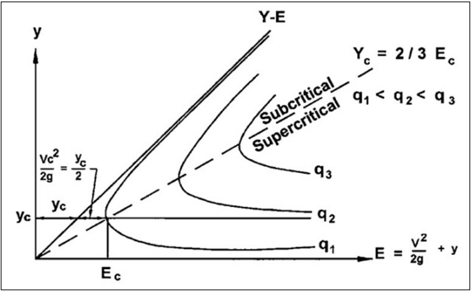
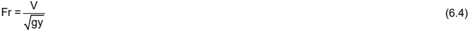
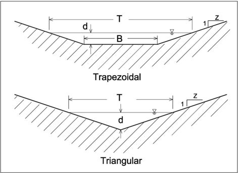
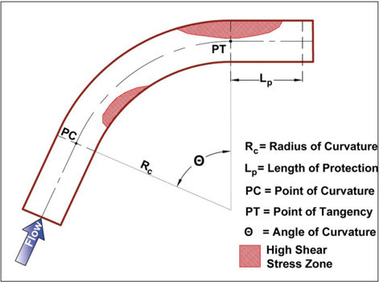
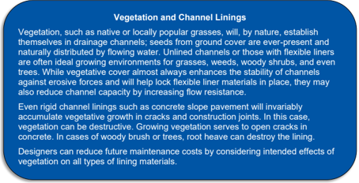
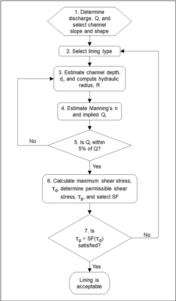

# Chapter 6 - Roadside and Median Channels

- Source: hif24006.pdf
- Generated: 2025-12-28T23:40:53+00:00
- Chunk: 6/13
- Estimated tokens: ~13,315
- Total pages: 313
- Type: chapter

## Chapter 6 - Roadside and Median Channels

Roadside  and  median  channels  are  free water  surface  conveyance  channels  designed  and constructed to collect stormwater from paved  and other surfaces within the right-of-way (ROW) and, in some situations, adjacent areas. These channels provide a flow path to where stormwater can enter the offsite surface drainage system. Before entering the offsite drainage system, these channels  may  route  water  to  an  outfall  structure  or to  a  detention  or  retention  basin  or  other storage component.

Designers commonly specify roadside and median channels with triangular or trapezoidal crosssections. Construction techniques or the need for ongoing maintenance activities over the life of a transportation project may influence the exact cross-section shape, resulting in more rounded cross-sections. The  surface  of  the  channel  may  be vegetated  or  covered  with  other  protective linings.

Limited  ROW  width,  existing  roadside  development, and  established  adjacent  land  uses  often constrain urban roadways and the associated roadside and median channels. Private and public utilities potentially share the ROW with stormwater conveyance features. Such elements include sanitary  sewer  access  holes ,  water  distribution  valves ,  utility  poles   and  conduits,  i llumination poles,  traffic  signal  poles,  signs,  pedestrian  sidewalks,  bicycle  paths,  on-street  parking  lanes, flexible traffic barriers, and accessibility features.

Some  of  these  features  present potential  safety hazards  to the  traveling  public.  While  safety concerns  guide  the  placement  of  those  potential  fixed  objects,  the  location  of  some  of  these ancillary features within the boundaries of roadside channels is often unavoidable.  Median channels for the conveyance of stormwater frequently share the median of divided roadways with illumination standards, signal standards, and  flexible traffic barriers.  Accommodating  all  the features needed for a safe and functional roadway encourages cooperation among the engineering team during the design phase. Designers of drainage features will likely  find  other references such as the AASHTO Roadside Design Guide (AASHTO 2011) helpful.

Although  designed  to  carry  stormwater,  roadside  and  median  channels  also  carry sediment, pollutants, and debris. During certain seasons, channels adjacent to residential areas  may also contain plant material including bloom from trees in the spring and nuts and leaves in the fall  that accumulate in streets and are washed into the drainage facilities. Over time, the accumulation of sediment, debris, and plant materials can obstruct flow in channels and medians. understanding the adjacent land use, and anticipating debris type and occurrence, the designer can facilitate movement of these unintended materials through the channel or provide access for removal, or both.

This chapter presents concepts and relationships for the design of roadside and median channels beginning with open channel flow and channel design parameters. Next, the chapter presents the concepts  and  design  steps  for  stable  channel  design.  Finally,  the chapter  provides  an overall process for designing roadside and median channels.

## 6.1 Open Channel Flow Concepts

The analysis and design of roadside and median channels rely on the principles of open channel flow. The  following  sections  present  summaries  of  several  open  channel  flow  concepts. Chow (1959), FHWA (2008), and many other hydraulic references provide more complete and specific discussion of open channel flow concepts.

By

## 6.1.1 Energy

Conservation of energy is a basic principle in open channel flow. As shown in  Figure 6.1, the total energy (or head) at a given location in an open channel is expressed as the sum of the potential energy (channel bottom elevation plus depth) and kinetic energy (velocity head). (Pressure head is zero in open channel flow and, therefore, excluded from consideration.) The total energy at any cross-section along the channel can be approximated as:

<!-- formula-not-decoded -->

where:

Et =

Total energy, ft (m)

Z =

Elevation of the channel bottom above a given datum, ft (m)

y =

Flow depth, ft (m)

V =

Mean velocity, ft/s (m/s)

g =

Gravitational acceleration, 32.2 ft/s 2  (9.81 m/s 2 )

Figure 6.1. Total energy in open channels.

Figure 6.1 depicts a channel schematic highlighting two  cross-section locations. Balancing energy between cross-section 1 and a downstream cross-section 2, the energy equation becomes:

<!-- formula-not-decoded -->

where:

hL = Energy (head) lost between section 1 and 2 to friction and turbulence, ft (m)

The energy equation states that the total energy head at an upstream cross -section is equal to the total energy head at a downstream cross-section plus the energy head loss between the two sections.

## 6.1.2 Critical, Subcritical, and Supercritical Flow

Hydraulic engineers classify open channel flow situations into critical, subcritical, and supercritical flow  regimes  using  the specific energy of  the  flow  and  a  dimensionless  Froude  number.  The specific  energy,  E, is  the  energy  head  relative  to  the  channel  bottom.  It  is  the  sum  of  the flow depth and velocity head:

<!-- formula-not-decoded -->

For a given discharge and channel roughness, the specific energy changes with channel slope. At mild slopes, flow moves through a channel relatively slowly and with greater depths. As slope increases, velocity increases and depth decreases.  Figure 6.2 illustrates the change in specific energy relative to the depth for three different flow rates,  q1, q2, and q3. The figure reveals that for each of the curves there is a depth at which the specific energy is a minimum.

Figure 6.2. Specific energy diagram.

Critical  flow occurs when the  specific energy is at its minimum  for a given flow and corresponding depth is the critical depth . Figure 6.2 shows that at critical flow, the critical depth is two-thirds of the specific energy. The velocity head is the remaining one-third.

the

Subcritical flow occurs when the depth is greater than critical depth and supercritical flow occurs when the depth is less than critical depth. Hydraulic engineers use the Froude number to identify critical, subcritical, or supercritical flow conditions in a channel. The Froude number is calculated for rectangular channels using the following equation:

where: V = Mean velocity of flow, ft/s (m/s) g = Gravitational acceleration, 32.2 ft/s 2  (9.81 m/s 2 ) y = Flow depth, ft (m)

When the Froude number is less than one, the flow is classified as subcritical . Depth is greater than critical depth, the velocity is slower than critical velocity, and small water disturbances travel both upstream and downstream . Downstream conditions control the flow rate. The control may be a structure or obstruction in the channel, or the control may be the channel roughness. Subcritical flow generally occurs on mild slopes.

surface

When the Froude number is greater than one, the flow is classified as supercritical . Depth is less than critical depth, the velocity is faster than critical velocity, and small water surface disturbances cannot  move  upstream and are  swept  downstream.  Upstream  conditions  control  the  flow  rate. Supercritical flow occurs  only  very  rarely  in  natural  channels  but  is common  in  constructed channels on relatively steep slopes.

When the Froude number is equal to one, the flow is critical. When the Froude number is close to one, small changes in the flow rate, channel geometry, or channel slope can initiate a change in flow regime. A change from subcritical flow to supercritical flow results in higher velocities than anticipated  and  a  change  from  supercritical  to  subcritical  flow  results  in  higher  depths  than anticipated.  Considering  these  changes  and  any  resulting  impacts  on  flow  depth  or  channel stability  will  help  engineers  design  roadside  and  median  channels that  serve  their  intended function.

When  the  Froude  number  is  greater  than one (flow is supercritical)  and  a  change  in  channel condition, such as an obstacle or a reduction in channel slope, occurs, flow may transition  abruptly from supercritical to subcritical in a hydraulic jump . A hydraulic jump results in a rapid increase in depth and reduction in velocity. In making this transition, the jump can dissipate a significant portion of the flow energy.

The turbulence of a hydraulic jump may threaten the stability of a roadside or median channel. Exposing an unprotected channel boundary material, e.g.,  soil, to the turbulence of a hydraulic jump  may  result in  undesirable  scour  and  erosion  of  the  boundary,  altering  the  channel  shape and  resulting  in  long-term  or  recurrent  channel  maintenance  problems.  In  addition,  as  the  flow varies over time (e.g., from the beginning of a runoff event to its peak and recession), the location of a jump along the channel can vary significantly as the Froude number varies with flow.

For  these  reasons, designers  typically  avoid  hydraulic  jump  conditions  in  roadside  and  median channels. The designer may consider the potential for a hydraulic jump in cases where the Froude number is greater than one or where the slope of the channel bottom changes abruptly from steep to  mild.  If  hydraulic  jumps  cannot  be  avoided,  accounting  for  their  likely  presence  allows  the designer to apply measures, such as protective linings, that create a more sustainable design.

## Lessons from Experience: Hydraulic Jumps

Jumps  are common in  the  field,  especially  where  there  is  concrete  lining.  The jumps are generally  small  and  poorly  developed,  but  they  are  often  a source  of  channel  problems. Because  the  slope  in  a  roadside  or  median  channel  is  driven  by  the  ROW  width  and  the grade  of  the  edge  of  pavement,  jump  conditions  occur  but  designers  can  recognize  and mitigate these conditions.

## 6.1.3 Steady Uniform Flow

Typical roadside design practice assumes that flow conditions are both steady and uniform though there  are  situations  where  more  complex  situations  occur. Steady flow does  not  change  over time  and uniform flow does  not  vary  in  depth  over  the  length  of  a  channel.  Therefore,  steady uniform flow neither varies with time nor depth within a given channel segment. Such conditions are unlikely to occur in natural channels but can be assumed in prismatic roadside and median channels. Prismatic channels are those  with slope and cross-section geometry that do not change significantly over their length.

Unsteady flow varies  with  time.  Channels  experience  unsteady  flow  in  every  runoff  event  as runoff increases over time, reaches a peak, and decreases. As a channel receives the runoff, flow and depth in the channel will increase, reach  a  peak ,  and decrease. State Department  of Transportation (DOT) staff may use hydrographs in the design of a roadside channel to evaluate how it performs over a range of flows.

Nonuniform (varied) flow occurs when either flow rate or depth, or both, vary along the channel. Gradually  varied flow  is  nonuniform  flow  in  which  the  depth  and  velocity  change  gradually enough in the flow direction that vertical accelerations can be neglected in estimating the water surface profile  in  the  channel.  A  typical  example  of  gradually  varied  flow  is  the  stream  channel condition upstream of a culvert with ponded flow. Rapidly varied flow is nonuniform flow in which the depth and velocity change so that vertical accelerations cannot be neglected. An example of a rapidly varied flow is the flow profile through a constricted bridge opening.

## 6.1.4 Manning's Equation

Water flows in an open channel because  of the force of gravity. Friction between the water and the channel boundary, and energy loss from turbulence near the boundary, resist  the water flow and cause the loss of energy over distance. In the idealized model of steady uniform flow there are no significant accelerations, streamlines are straight and parallel, and the pressure distribution is  hydrostatic.  This  is  the  simplest  flow  condition  to  analyze,  but  one that  does not occur in the real  world.  However,  for  many  applications,  the  flow  is  essentially  steady  and  any  changes  in width, depth, or direction (resulting in nonuniform flow) are sufficiently small that the flow can be considered uniform.

The depth of flow in steady uniform  flow is the normal depth .  Designers commonly use Manning's equation  to  characterize  steady  uniform flow  conditions  and  to  determine  normal  depth  in  a channel. Manning's equation for discharge is:

<!-- formula-not-decoded -->

where:

Ku =

Unit conversion constant, 1.486 in CU (1.0 in SI)

Q =

Discharge rate, ft/s 3  (m/s 3 )

A =

Cross-sectional flow area, ft 2  (m 2 )

R =

Hydraulic radius, ft (m)

So =

Energy grade line slope, ft/ft (m/m)

n =

Manning's roughness coefficient

Applied  appropriately,  Manning's equation is a useful and reliable representation of steady uniform flow  in  open  channels.  Whenever  the  steady  uniform flow  model  is  appropriate,  or  a reasonable approximation of that condition exists, calculating the discharge capacity of a given channel  section  using  Manning's  equation  is  straightforward.  However,  when  working  with a discharge  from  a  hydrologic  analysis,  designers sizing  a  channel  to  convey  that  discharge will typically use an iterative trial and comparison process.

Manning's roughness coefficient, n, is a critical input for evaluating Manning's equation. Designers usually select an appropriate Manning' s  n  value based on tables  or  procedures  in  reference  materials such as textbooks and hydraulic design manuals. For channels with manufactured boundaries such as concrete, designers  can  reasonably  assume  that  the Manning's n value is constant with different applications and with time. For channels lined with vegetation or flexible materials, on

## Manning's n

rigid, Manning's n is a way of representing energy loss in fluid flow. When using Manning's equation, the value of n accounts for energy losses attributable to all causes (boundary shear, form drag, turbulence, etc.).

the other hand,  the Manning's  n  value  can  vary  quite  dramatically. Factors  influencing this variance can include the type of vegetation, its height relative to flow depth, and its state of growth. Seasonal variations in vegetative vigor, mowing and vegetation management policies procedures, as well as roadside maintenance procedures such as 'blading' slopes and ditches , may involve a wide range of changes to the hydraulic texture of a channel boundary.

Over many decades, researchers have compiled typical Manning's n values for a wide range of channel  conditions. Table  6.1  provides  a  tabulation  of  typical  Manning' s  n  values  for  various channel linings that can be used in roadside channel design including rigid linings, no linings, and rolled  erosion  control  productions  (RECPs) .  Designers  will  find  more  information  on  selecting Manning's n values for roadside and median channels in HEC-15 (FHWA 2005).

## 6.1.5 Superelevation in Bends

Flow around a bend in an open channel induces centrifugal forces because of the change in flow direction (Chow 1959). This results in superelevation (transverse slope) of the water surface at the outside of bends. Without adequate freeboard, superelevation  can cause the flow to splash up  or  over  the  side  of  the  channel.  Superelevation  may  also  expose  channel  linings  to  higher shear stresses. Designers can estimate superelevation using:

<!-- formula-not-decoded -->

and

| where: Δd   | =   | Difference in water surface elevation between the inner and outer banks of the channel in the bend, ft (m)   |
|-------------|-----|--------------------------------------------------------------------------------------------------------------|
| V           | =   | Average velocity, ft/s (m/s)                                                                                 |
| T           | =   | Surface width of the channel, ft (m)                                                                         |
| g           | =   | Gravitational acceleration, 32.2 ft/s 2 (9.81 m/s 2 )                                                        |
| R c         | =   | Radius to the centerline of the channel, ft (m)                                                              |

Table 6.1. Typical channel lining Manning's roughness coefficients (FHWA 2005).

| Lining Category   | Lining Type             |   Manning's n Minimum |   Manning's n Typical |   Manning's n Maximum |
|-------------------|-------------------------|-----------------------|-----------------------|-----------------------|
| Rigid             | Concrete                |                 0.015 |                 0.013 |                 0.011 |
| Rigid             | Grouted Riprap          |                 0.04  |                 0.03  |                 0.028 |
| Rigid             | Stone Masonry           |                 0.042 |                 0.032 |                 0.03  |
| Rigid             | Soil Element            |                 0.025 |                 0.022 |                 0.02  |
| Rigid             | Asphalt                 |                 0.018 |                 0.016 |                 0.016 |
| Unlined           | Bare Soil               |                 0.025 |                 0.02  |                 0.016 |
| Unlined           | Rock Cut                |                 0.045 |                 0.035 |                 0.025 |
| RECP              | Open-weave textile      |                 0.028 |                 0.025 |                 0.022 |
| RECP              | Erosion control blanket |                 0.045 |                 0.035 |                 0.028 |
| RECP              | Turf reinforcement mat  |                 0.036 |                 0.03  |                 0.024 |

Equation 6.6 is valid for subcritical flow conditions. The elevation of the water surface at the outer channel bank will be ∆ d/2 higher than the centerline water surface elevation and the elevation of the water surface at the inner channel bank will be ∆ d/2 lower than the centerline water surface elevation.

Under supercritical flow conditions, the water surface is not influenced by conditions or geometry downstream,  including  bends  in  the  channel.  Bends  intended  to  change  the  direction  of supercritical  flow  may  result  in  potentially  undesirable  hydraulic  conditions  such  as  standing waves oblique to the direction of flow, oblique hydraulic jumps, and directional jets. If supercritical flow conditions approaching a bend are unavoidable, the designer can consider introducing a controlled hydraulic jump to induce subcritical conditions prior to changing direction (Chow 1959).

## 6.2 Channel Design Parameters

For roadside and median channels, the designer uses information including discharge frequency, available  space,  elevation  change,  vegetation type,  freeboard,  and shear stress.  This  section provides information for selecting or computing these design elements.

## 6.2.1 Discharge Frequency

State DOTs typically design roadside and median drainage channels to convey the estimated 0.2 to  0.1  AEP  design  discharges  (FHWA  2005).  However,  designers  can  consider  and  mitigate potential consequences of discharges exceeding the design discharge. For temporary channel linings, designers can use a lower design discharge, e.g., the 0.5 AEP discharge.

## 6.2.2 Channel Geometry

Engineers  often  design  highway  drainage  channels  to  be  trapezoidal  or  triangular .  Figure  6.3 summarizes these channel geometries, but during construction and through years of maintenance activities,  these  shapes  can  vary.  Channel  geometry  (e.g.,  depth,  bottom  width,  top  width,  and side  slopes)  are  frequently  subject  to  the  influence  of  the  roadway  profile  grade  at  the  edge  of pavement, the available ROW width, and the adjacent land use and profile along the ROW line.

Figure 6.3. Channel geometries.

To avoid unstable side slopes,  designers  specify  channel  side  slopes  for roadside  and  median channels that  do not exceed  the  angle  of  repose  of either  the  soil  or  lining  material,  or  both. Designers compute cross-section area, wetted perimeter, and flow top width for triangular ( B = 0) and trapezoidal channels using:

<!-- formula-not-decoded -->

<!-- formula-not-decoded -->

<!-- formula-not-decoded -->

where:

A

P

T

=

=

Cross-sectional area of the channel, ft 2  (m 2 )

Wetted perimeter of the channel, ft (m)

= Surface width of the channel, ft (m)

B = Bottom width, ft (m)

d =

Maximum flow depth, ft (m)

z =

Horizontal side slope dimension 1:z (V:H), dimensionless

Channels immediately adjacent to the roadway may be  influenced by roadside safety needs or features such as traffic barriers. For  example, geometric design criteria frequently specify channel side slopes that are traversable by  errant  vehicles  (1V:3H  or  flatter  with  additional  considerations) (FHWA 2005). In areas where roadside safety may be of concern, the Roadside Design Guide also allows for flatter channel side slopes, considering the functional classification of the roadway and  traffic  volume  ( AASHTO  2011).  Design  of  roadside  and  median  channels,  the  highway

## Lessons from Experience: Channel Shape and Construction

Engineers frequently design roadside and median channels in urban areas as triangles or trapezoids. However, at relatively small scale, they are often difficult to construct consistently. After completion of roadway construction, the actual shape of a channel cross-section is likely to be more rounded, possibly approximating a circle or parabola. This may be largely a factor of the equipment and methods used for construction.

If construction does not significantly alter the width and depth dimensions of the section, a consequential difference in performance among those shapes is unlikely.

geometric and pavement design, and the design of appurtenances (e.g., signing, signals, illumination,  and  the  accommodation  of  utilities)  work  together  to  ensure  proper balancing  of function, safety, utility, and drainage needs.

Example 6.1:

Application of Manning's equation

Objective:

Estimate channel capacity and velocity for a channel lined with a turf

reinforcement mat with an n value of 0.03.

Given: A trapezoidal channel (as shown in Figure 6.3) with the following characteristics:

So =

0.01 ft/ft (m/m)

B =

2.6 ft (0.8 m)

z

= 3

d = 1.6 ft (0.5 m)

## Step 1. Estimate the channel parameters.

Using equations 6.7, 6.8, and 6.9:

A = Bd + zd 2  = (2.6) (1.6) + (3) (1.6) 2 = 11.8 ft 2

P = B + 2d (z 2 +1) 0.5 = (2.6) + (2) (1.6) (3 2 +1) 0.5 = 12.7 ft

R = A/P = 11.8/12.7 = 0.93 ft

## Step 2. Compute the flow capacity using equation 6.5.

<!-- formula-not-decoded -->

## Step 3. Compute the flow velocity.

V = Q/A = 55.7/11.8 = 4.7 ft/s

## Solution: The maximum flow for the channel is 55.7 ft 3 /s (1.58 m 3 /s) with an average velocity of 4.7 ft/s (1.4 m/s).

## 6.2.3 Channel Slope

The  road profile and adjacent land use constraints often heavily influence channel slopes. However,  if  channel  stability  conditions  warrant  and  geometry  is  feasible,  the  designer  may choose to adjust the channel gradient slightly to achieve a more stable condition.

For  steeper  channel  gradients,  designers can use  flexible  or  rigid  linings  to  maintain  stability. Knowledge  of  the  material  likely  to  constitute  the  channel  bottom  (usually the soil) informs  the application of flexible linings. Soil erodibility is an important consideration. Linings, such as stone riprap, wire-enclosed riprap, and  gabion  mattress can  be suitable for protecting very steep channels. See HEC-15 (FHWA 2005) for more information on slope limitations for different lining types. Section 6.3.2 discusses channel lining materials.

## 6.2.4 Freeboard

Freeboard  is  the  vertical  distance  from  the  water  surface  at  the  design  discharge  to  a  predetermined component of the roadway or channel. In a permanent roadside or median channel, a designer may use the bottom of the pavement structure base course as the relevant roadway component  for  defining  freeboard.  The  need  for  freeboard  depends  on  the  consequences  of overflows  escaping  the  channel.  At  a  minimum,  appropriate freeboard  prevents debris, waves, superelevation changes, or fluctuations in water surface from overflowing the sides. However, to accommodate  the  large  variations  in  flow  caused  by  shocks,  standing  waves,  splashing,  and surging in a steep channel, the designer can  consider a freeboard height equal to the total energy depth. For temporary channels, freeboard is optional.

## 6.3 Stable Channel Design

Designers can use stable channel design concepts to specify channel geometry and lining types that  result  in  long-term  stability  and  low  maintenance.  A  channel is stable when the material or the channel lining forming the channel boundary effectively resists the erosive forces of the flow. HEC-15 describes the principles of rigid boundary hydraulics  and provides a detailed presentation of stable channel design concepts related to the design of roadside and median channels (FHWA 2005). This section provides a summary of significant concepts.

## 6.3.1 Shear Stress

The force of friction and the turbulence generated by flowing water (the same forces that  cause head loss) result in shear stress or tractive force on the channel boundaries. The bed material resists this shear stress either by cohesion of the material itself, or by inertia and interlocking of cohesionless particles. To maintain stability, tractive force theory says that the flow -induced shear stress should not produce a force greater than the  resisting force of the bed material. The force resisting the movement of the bed material is the permissible or critical shear stress of the bed material.  In  a  uniform  flow,  the  applied  shear  stress  is  equal  to  the  effective  component  of  the gravitational  force  acting  on  the  body  of  water  parallel  to  the  channel  bottom.  The estimated average shear stress is:

<!-- formula-not-decoded -->

τ γ

where:

τ

γ

=

=

Average shear stress, lb/ft 2  (N/m 2 )

Unit weight of water, 62.4 lb/ft 3  at 60° F (9.81 kN/m 3  at 15° C)

R =

Hydraulic radius, ft (m)

S =

Average bed slope or energy slope, ft/ft (m/m)

The maximum shear stress for a straight channel occurs where flow is deepest (on the channel bed) (Chow 1959). It is computed using maximum depth instead of hydraulic radius:

<!-- formula-not-decoded -->

where:

τ d =

Maximum shear stress, lb/ft 2  (N/m 2 )

d =

Maximum depth of flow, ft (m)

Because shear stress is related to depth of flow and flow is shallower at the channel edges than in the middle of the channel, shear stress is not uniformly distributed along the wetted perimeter of a channel. The maximum shear on the side of a channel is estimated by the following (FHWA 2005):

<!-- formula-not-decoded -->

where:

τ s =

Side shear stress on the channel, lb/ft 2  (N/m 2 )

K1 =

Ratio of channel side to bottom shear stress

Shear stress in the channel at maximum depth, lb/ft 2  (N/m 2 )

τ d =

The value K1 depends on the size and shape of the channel. For triangular channels with rounded bottoms,  there  is  no  sharp  discontinuity  along  the  wetted  perimeter.  Therefore,  computation  of shear  stress  at  any  point  on  the  side  slope  is  related  to  the  depth  at  that  point  using equation 6.11.

The work of Anderson et al. (1970) led to the development of estimates for K1 in trapezoidal and triangular channels (FHWA 2005):

<!-- formula-not-decoded -->

The z value is the horizontal dimension 1:z (V:H)  of side slope. Side slopes steeper than 1:3 (V:H) are at greater risk for failure because of the potential for erosion of the side slopes.

For  noncohesive  linings  such  as  gravel  or  riprap  the  resisting  ability  of  the  lining  is  reduced because the material has the potential to roll or slide out of place. While the reduced shear stress on the channel sides might suggest increased stability in that region of the channel, this may be diminished by the steepness of side slope. For example, when designing a trapezoidal channel lined with gravel or riprap having side slopes steeper than 1:3 the appropriate rock size for the side slopes is estimated as:

<!-- formula-not-decoded -->

where:

D50 =

Riprap or bed material median size, ft (m)

K1 =

Ratio of shear stresses on the sides and bottom of a trapezoidal channel

K2 =

Ratio of tractive force on the sides and bottom of a trapezoidal channel

K2 is a  function  of  the  side  slope  angle  and  the  stone  angle  of  repose  and  is  determined  from equation  6.15.  HEC-15  (FHWA  2005)  provides  the  angle  of  repose  for  gravels  and  riprap  of different types.

<!-- formula-not-decoded -->

where:

Θ =

Angle of side slope

Angle of repose for the channel lining material

Φ =

Flow around bends also creates secondary currents which impose higher shear stresses on the channel sides and bottom compared to straight reaches. Areas of high shear stress in bends are illustrated in Figure 6.4.

The  maximum  shear  stress  in  a  bend  is  a  function  of  the  ratio  of  channel  curvature  to  the  top (water surface) width. This ratio increases as the bend becomes sharper and the maximum shear stress  in  the  bend  increases.  The  bend  shear  stress  can  be  computed sing the following relationship:

<!-- formula-not-decoded -->

where:

τ b =

Bend shear stress, lb/ft 2  (N/m 2 )

Kb =

Ratio of channel bend to bottom shear stress

Maximum channel shear stress, lb/ft 2  (N/m 2 )

τ d =

Kb can be determined from the following equation from Young et al. (1996) adapted from Lane (1955):

<!-- formula-not-decoded -->

where:

Kb =

Ratio of channel bend to bottom shear stress

Rc =

Radius to the centerline of the channel, ft (m)

T =

Top (water surface) width of channel, ft (m)

Figure 6.4. Shear stress distribution in channel bends. Source: HEC-15.

The increased shear stress produced by the bend persists downstream of the bend a distance  Lp, as shown in Figure 6.4. This distance can be computed using the following relationship:

<!-- formula-not-decoded -->

where:

Lp =

Length of protection (length of increased shear stress due to the downstream of the curve point of tangency, ft (m)

nb =

Manning's n in the channel bend

R =

Hydraulic radius, ft (m)

Ku =

Unit conversion constant, 0.604 in CU (0.736 in SI)

## 6.3.2 Lining Materials

Lining materials may be classified as flexible or rigid. Flexible linings can conform to and sustain changes in channel shape while maintaining the overall integrity of the channel. Common flexible lining materials include vegetation and riprap. In contrast, rigid linings cannot change shape and tend to fail when a portion of the channel lining is damaged. Channel shape may change due to frost-heave,  slumping,  piping,  and  other  causes.  Concrete  is  a  common  rigid  lining  material. Flexible  linings  are  general ly  less  expensive,  may  have  a  more  natural  appearance,  and  are typically  more  environmentally  acceptable.  However,  flexible  linings  are  limited  in  the  erosive forces  they  can  sustain  without  damage  to  the  channel  and  lining.  A  rigid  lining  can  typically bend)

provide higher capacity and greater erosion resistance. In some cases , rigid linings may be the only feasible alternative.

Flexible  linings  can  be  either  long-term,  transitional,  or  temporary.  Designers  use  l ong-term flexible  linings  where  the  channel  needs protection  against  erosion  for  the  life  of  the  channel. Long-term lining materials include cobbles, rock riprap, wire-enclosed riprap, gabion mattresses, vegetation,  and turf reinforcement.  State  DOTs  often  choose established  vegetation  as  the primary  long-term  channel  management  strategy;  vegetation  may  be  planned  or  incidental  but will frequently occur eventually.

Designers use transitional flexible linings to provide erosion protection until long-term protection, usually vegetation, can be established. They use temporary channel linings without vegetation to line channels that might be part of a construction site erosion and sediment management strategy, or some other short-term channel situation. State DOT staff can select turf reinforcement either as a transitional approach or as part of a long-term strategy  of providing  additional structure  to the soil/vegetation matrix.

Typical turf reinforcement materials include gravel/soil mixes and turf reinforcement mats (TRMs). A TRM is usually a non- degradable rolled erosion control product (RECP) processed into a threedimensional matrix. A TRM is stiffer, thicker, and denser than  an erosion control blanket, which is typically a degradable product composed of an engineered distribution of natural or polymer fibers bound together to form a continuous mat. Open-weave textiles (OWT) are a degradable RECP composed of natural or polymer  yarns more loosely woven into a matrix. RECPs are laid in the channel and secured with staples or stakes.

such

Construction of rigid concrete linings involves  considerable effort, costly materials, and specialized  construction  equipment.  As  a  result,  the  cost  of  rigid  linings  is  typically  higher than flexible linings. Rigid lining such as concrete paving or grouted riprap is susceptible to failure from undermining, particularly when placed on constructed or disturbed material embankments. It can also be subject to structural instability from overtopping, freeze-thaw cycles, swelling, and excessive soil pore water pressure.  Thermal stress causes ubiquitous cracking of concrete. Over time, water invasion and erosion of the supporting soil through cracks often results in concealed void spaces under the concrete. These concealed void spaces  present the danger of sudden and unexpected collapse during runoff events or under the load of errant vehicles.

as

Prefabricated modular linings, such as interlocking concrete paving blocks, can be an alternative if  shipping distances are not excessive, however these often  involve labor-intensive placement. Modular  linings  are  classified  as  flexible  as  they  can  withstand  some  movement  and  erosion underneath the lining before failing.

In  general,  when  selecting  a  lining,  the  designer  considers the  cost  of  the  lining  that  affords satisfactory  protection  as  the  baseline  for  comparison,  but  will  also  evaluate  constructability, aesthetics, and long-term service. In some regions, State DOTs often use vegetation alone or in combination with other types of linings. Thus, a channel might be lined with vegetation on flatter slopes and with more erosion resistant material on steeper slopes. In cross-section, the channel might  be  lined  with  a  resistant  material  within  the  depth necessary to  carry frequent  flows and lined with vegetation above that depth for protection from less frequent flows.

## 6.3.3 Stable Channel Design Procedure

The FHWA presented the permissible tractive force (shear stress) approach as the  recommended design  procedure  for  channels  with  flexible  linings  in  H EC-15  (FHWA  2005).  The  tractive  force approach necessitates that the shear stresses on the channel bed and banks do not exceed the allowable  amounts  for  the  given  channel  boundary.  Tractive  force  procedures  based  on  shear stress concepts originated largely through research by the Bureau of Reclamation in the 1950s . Based on the actual physical processes involved in maintaining a stable channel, specifically the stresses  developed  at  the  interface  between  flowing  water  and  materials  forming  the  channel boundary, the tractive  force  procedure  is  a  realistic  model  of  the  processes  that  affect  channel linings.

Designers also employ a permissible velocity approach where they assume the channel is stable if the mean velocity in the channel is lower than the maximum permissible velocity for the given channel boundary condition. This approach approximates the physical processes affecting channel linings. Researchers first introduced permissible velocity procedures around the 1920s and  the  Soil  Conservation  Service  (now  the  Natural  Resource  Conservation  Service)  further developed and widely uses the approach.

For stable channel design, this manual uses the permissible tractive force approach building on the shear stress descriptions in Section 6.3.1. When the permissible shear stress is greater than or equal to the computed shear stress, the lining is considered acceptable. The safety factor in the following equation provides for a measure of uncertainty and failure tolerance, and typically ranges from 1.0 to 1.5.

<!-- formula-not-decoded -->

where:

τ p SF = Safety factor

=

Permissible shear stress for the channel lining, lb/ft 2  (N/m 2 )

Flexible linings reduce the shear stress acting directly on the underlying soil surface. Therefore, the erodibility of the underlying soil is a key factor in the performance of flexible linings. Erodibility of noncohesive (granular) soils (plasticity index less than 10) primarily relates to particle size and specific gravity, while in cohesive  (clay or clay -bound)  soils it  largely corresponds  with  the cohesion  and  density  of  the  soil.  Vegetative  and  RECP  lining  performance  relates  to  how  well they protect the underlying soil from shear stress, therefore, the protection offered by these lining types depends on soil type. Figure 6.5 summarizes the basic procedure for designing a flexible lining.

Figure 6.5. Flexible channel lining design process. Source: HEC-15.

## Step 1.   Select design hydrology and channel geometry.

Calculate a design discharge for analysis. Select an initial channel crosssection shape and channel slope.

the

## Vegetated Channel Stability

## Step 2.   Select a trial lining type.

Decide if a long-term lining is appropriate or whether a temporary or transitional lining is adequate. If the long -term lining is a constructed lining that provides protection  immediately,  a  transitional  lining is  not  indicated.  However,  if  the  long-term lining is vegetation that will take time to provide full protection, a transitional lining is also  indicated.  For  example,  the  designer could initially consider an established vegetated channel for the long-term and evaluate whether a bare soil (unlined) is adequate until vegetation is established. The  designer  evaluates  both  the  long-term and temporary or transitional linings in separate analyses to determine their suitability for meeting design objectives.

## Step 3.   Estimate the depth of flow.

The estimated depth may be based on physical limits of the channel  and an initial estimate based on  an  assumed  Manning's  n  value  for  the  lining  type  and  the  design  discharge.  Depending  on how  close  the  initial  estimate  is  to  the  final  estimate,  iterations  of steps  3  through  5  may  be necessary.

## Step 4.   Estimate implied discharge.

Estimate  the implied discharge,  Qi, using the  assumed  Manning's  n  and  estimated flow  depth value from step 3.

## Step 5.   Compare implied and design discharges.

If Qi is within 5 percent of the design discharge, Q, then proceed to step 6. The initial estimate of depth was appropriate. If not, return to  step 3 and select a new estimated flow depth, d i+1.  This can be estimated from the following equation or any other appropriate method.

<!-- formula-not-decoded -->

where:

| d i+1   | =   | Next estimate of depth for computing the implied discharge, ft (m)                |
|---------|-----|-----------------------------------------------------------------------------------|
| d i     | =   | Previous estimate of depth for computing the implied discharge, ft (m)            |
| Q       | =   | Design discharge, ft 3 /s (m 3 /s)                                                |
| Q i     | =   | Implied discharge based on the previous estimate of depth, d i , ft 3 /s (m 3 /s) |

full Designers can improve the long-term performance of drainage features by planning for the establishment of temporary and permanent vegetation coverage. The first year or more following construction of a project, depending on the environment, presents the greatest challenge because the vegetation is not well established. Channels exhibiting erosion or sedimentation during that initial period may never stabilize and may present a recurring maintenance problem. In addition to maintenance issues, an eroding channel may present a safety hazard to vehicles that leave the roadway.

## Step 6.   Calculate shear stresses and select safety factor.

Estimate the shear stress at maximum depth, τ d, using equation 6.11. Determine the permissible shear stress, τ p, according to the methods  described  in  HEC -15 (FHWA  2005). Select an appropriate safety factor.

## Step 7.   Compare the permissible shear stress to the calculated shear stress.

Using equation 6.19, compare the permissible and calculated shear stresses from  step 6. If the permissible  shear  stress  is  adequate,  then  the  lining  is  acceptable.  If  the  permissible  shear  is inadequate,  then  return  to  step 2  and  select  an  alternative  lining  type  with  greater  permissible shear stress. As an alternative, a different channel shape may be selected that results in a lower depth of flow.

When the selected lining is stable the design process is complete.  If desired, other linings may be tested before specifying the preferred lining.

HEC-15 details the tractive force stable channel design procedure for vegetative linings, RECPs, riprap/cobble, and gabion linings. HEC-15 also includes information on special considerations for steep-slope riprap design and design of composite linings.

## Example 6.2:

Channel shear stress and lining stability

Objective:

Estimate the maximum shear stress in a channel with straight and bend sections and determine if the channel lining is stable.

Given: A trapezoidal channel with the following characteristics:

So =

0.01 ft/ft (m/m)

B =

3.0 ft (0.90 m)

z = 3

The channel reach consists of a straight section and a 90-degree bend with a centerline radius of 20.0 ft (6.1 m). The design discharge is 28 ft 3 /s (0.79 m 3 /s). Assume a vegetated lining with a Manning's n value of 0.030. Maximum depth in the channel is 1.3 ft based on the desired freeboard and channel dimensions.

## Step 1. Select design hydrology and channel geometry.

The design hydrology (28 ft 3 /s) and trapezoidal channel geometry were given above.

## Step 2. Select trial lining type.

Assume a vegetative lining with a Manning's n value of 0.030 as given.

## Step 3.  Estimate the depth of flow.

Channel geometry and freeboard limit the maximum depth of flow to 1.3 ft. Assume an initial depth of 1 ft to estimate the implied discharge.

## Step 4. Estimate implied discharge.

A = Bd + zd 2  = (3.0) (1.0) + (3) (1.0) 2 = 6.0 ft 2

<!-- formula-not-decoded -->

R = A/P = 6.0/9.3 = 0.64 ft

Q = (Ku/n) A R (2/3) So (1/2) = (1.486/0.030) (6.0) (0.64) (2/3) (0.01) (1/2) = 22.1 ft 3 /s

## Step 5.   Compare implied and design discharges.

Implied discharge (22 ft 3 /s) is less than the design discharge (28 ft 3 /s) by more than 5 percent. Therefore, recompute with a higher estimate of design discharge and repeat step 4.

When using a 1.1 ft depth, the resulting implied discharge is 27 ft 3 /s which is within the 5 percent tolerance of 28 ft 3 /s. Continue with step 6 using 1.1 ft for the depth.

## Step 6.   Calculate shear stresses and select safety factor.

Permissible shear stress for vegetation depends on the type of vegetation and soils. Using the procedure in HEC-15 permissible shear stress is estimated for this channel as 2.7 lb/ft 2 .

Safety factor selected for this channel is 1.2.

Maximum shear stress in the straight channel is computed as:

<!-- formula-not-decoded -->

Maximum shear stress in the bend is computed starting with computing the flow top width. Next, compute the ratio of bend to bottom shear stress and finally the bend shear stress:

<!-- formula-not-decoded -->

Kb = 2.38 - 0.206(Rc/T) + 0.0073(Rc/T) 2  = 2.38 - 0.206 (20/9.6) +0.0073(20/9.6) 2  = 2.0 lb/ft 2

<!-- formula-not-decoded -->

## Step 7.   Compare the permissible shear stress to the calculated shear stress.

Use equation 6.19 to compare permissible to maximum shear stress in the bend of the channel:

<!-- formula-not-decoded -->

Since the maximum shear stress multiplied by the safety factor is less than the permissible shear stress, the channel is stable in the straight and bend portions of the channel.

## Solution:

The maximum shear stress in the straight and bend sections are 0.69 lb/ft 2 (33.0 Pa) and 1.4 lb/ft 2  ( 67.0 Pa), respectively. Both are less than the permissible shear stress. Therefore, the vegetated channel lining is stable for the design flow.

## 6.4 General Design Procedure

This section presents a general  procedure for designing roadside and median channels. Although each project is unique, the design steps outlined below will typically be applicable.  State and local procedures may also be available and inform the design process.

## Step 1.   Establish a preliminary project drainage plan.

Chapter  3  discussed  the  development  of  a  preliminary  drainage  concept  plan.  For  proposed median or roadside channels, designers may take the following preliminary actions:

- Review municipal master drainage plan(s) and available outfall locations.
- Review  available  ROW,  roadway  schematic,  and  roadway  profile;  locate  public  utilities and traffic control/signage.
- Identify the locations of natural drainage divides and channel outlet points.

- Prepare  existing  and  proposed  plan  and  profile  of  the  proposed  channels.  Include  any constraints on design such as highway and road locations, culverts, and utilities.
- Collect any available site data such as soil types and topographic information.

## Step 2.   Obtain typical cross-section information.

Establish preliminary cross-section  geometric parameters and controlling physical features considering the following:

- Roadway width, auxiliary lanes, shoulders, pedestrian facilities (e.g., sidewalks), and other roadway features when present.
- Adequate channel depth to drain the subbase and minimize freeze-thaw.
- Channel side slopes based on geometric design criteria including safety, economics, soil, aesthetics, and access.

## Step 3.   Select initial channel slope.

Plot  initial slopes  on  the  plan  and  profile.  Note  that  highway  grades  often  control  slopes  on roadside channels. Use the following guides when establishing initial channel slopes:

- Provide a channel slope with sufficient elevation drop  to minimize ponding and sediment accumulation.
- Where possible, avoid features which may influence or restrict slope, such as utility (e.g., electricity and gas) structures.

## Step 4.   Check flow capacities and adjust sections.

Evaluate  the  hydraulic  capacity  of  the  channel  and  confirm  that  it  meets  the  hydraulic  design criteria using the techniques in Section 6.2. The following activities may be appropriate:

- Compute  the  design  discharge  at  the  downstream  end  of  each  channel  segment  (see Chapter 4).
- Set preliminary values for channel size, roughness, and slope  as discussed in Section 6.2 based on long-term conditions and maintenance considerations.
- Determine the maximum allowable depth of channel including freeboard.
- Estimate the flow depth using the design discharge and channel characteristics.
- If the capacity is not adequate, consider possibilities for increasing capacity including:
- Increasing bottom width.
- Flattening channel side slopes.
- Steepening channel slope.
- Providing smoother channel lining.
- Intercepting some flow before it reaches the channel.
- Installing drop inlets and a parallel storm drainpipe beneath the channel to supplement channel capacity.

## Step 5.   Select channel protection.

Follow the procedure outlined in Section 6.3 to complete final design of channels that will involve a lining for stability.

## Step 6.   Check channel transitions and end of channel conditions.

At  c hannel  transitions,  the  designer  may  need  to  employ  more  detailed  hydraulic  evaluations because the assumption of uniform or gradually varied flow is not valid.

- Identify transition locations, e.g., significant changes in channel geometry roughness, or cross-section), channel bends, and channel inlets/outlets.

(slope,

- Review hydraulic conditions upstream and downstream of the transition (flow area, depth, and velocity). If significant changes are observed, perform additional hydraulic evaluations to estimate flow conditions in the vicinity of the transition.  Use  the  energy  equation presented  in equation  6.2  or  other  information  in  Chow  (1959),  FHWA  (2005),  FHWA (2006a), or other hydraulic references to evaluate transition flow conditions.
- Provide  for  gradual  channel  transitions  to  minimize  the potential for  sudden  changes  in hydraulic conditions at channel transitions.

## Step 7.   Analyze outlet points and downstream effects.

In  this  final  step,  the  designer  identifies possible  adverse  consequences  for  discharge  of  water downstream  and  considers appropriate mitigation.  Table  6.2  summarizes possible adverse impacts to downstream and adjacent properties and potential mitigation approaches for each. To achieve a roadside channel system design that meets drainage requirements, protects roadside safety, and avoids adverse downstream consequences, the designer may make several trials of this design procedure before selecting a final design.

Table 6.2. Possible adverse channel outlet impacts and potential mitigation.

| Adverse Impact                                                                     | Potential Mitigation                                                                                                                                            |
|------------------------------------------------------------------------------------|-----------------------------------------------------------------------------------------------------------------------------------------------------------------|
| Increase in discharge.                                                             | Enlarge outlet channel and/or install control structures to provide detention (see FHWA 2002).                                                                  |
| Increase in flow velocity.                                                         | Install velocity control or energy dissipation structure (see FHWA 2006a).                                                                                      |
| Capture of sheet flow previously draining to a different outlet.                   | Increase channel capacity and/or improve lining of downstream channel.                                                                                          |
| Capture of concentrated or channel flow previously draining to a different outlet. | Avoid diversions of existing drainage patterns where possible. If not possible, see mitigations associated with increase in discharge and increase in velocity. |
| Decrease in outlet water quality.                                                  | Select lining types that may provide water quality improvements, e.g., vegetation, or provide other water quality mitigation approaches (see Chapter 11).       |

## Page Intentionally Left Blank
