# Chapter 7 - Inlet Design

- Source: hif24006.pdf
- Generated: 2025-12-28T23:40:53+00:00
- Chunk: 7/13
- Estimated tokens: ~21,005
- Total pages: 313
- Type: chapter

## Chapter 7 - Inlet Design

Stormwater inlets in an urban or roadway environment capture runoff from roadway surfaces to maintain a safe roadway and road corridor for vehicles, pedestrians, bicycles, and other forms of personal transport. This chapter describes the types, uses, and selection of inlets for a variety of applications. It includes information on the hydraulic performance of inlets on grade and in sag locations,  as  well  as  tools  for  selecting  and  sizing  inlets.  The  chapter  provides  a  section  on locating  inlets  and  a  section  on  inlets  in  medians  and  at  embankments.  The  chapter  does  not address bridge deck drainage inlets. The FHWA's HEC-21 document provides information on the analysis and design of bridge deck drainage (FHWA 1993).

## 7.1 Inlet Types, Uses, and Selection

Storm  drain  inlets  collect  runoff  from  gutter  sections,  paved  medians,  roadside  ditches,  and median  ditches and discharge it to an underground  storm drainage system. Inlet selection depends  on  the  intended  use,  hydraulic  efficiency,  clogging  potential,  pedestrian  and  bicycle safety,  loading  conditions,  cost,  and  other  factors.  Inlets  that  will  experience  vehicle  loading, particularly grates, must be able to withstand traffic loads. Conversely, grates draining non traffic areas do not generally need to be as  strong. However, engineers may select grates that withstand traffic  loads  in  non-traffic  areas  to  handle  maintenance  and  construction  equipment  or  errant vehicles. The  following  subsections  discuss  inlet  types  and  uses,  hydraulic  efficiency,  clogging potential, and pedestrian and bicycle safety.

## 7.1.1 Inlet Types and Uses

Inlet design and configuration are determined by their intended function.  Figure 7.1 summarizes the four general inlet types:

- Grate inlets.
- Curb-opening inlets.
- Combination inlets.
- Slotted inlets.

Drainage designers use these inlet types for permanent installations. They also use barrier walls with drainage openings for temporary construction applications.

Grate inlets consist  of  an  opening  in  the  gutter  or ditch covered by a grate. Grate inlets generally perform  satisfactorily  over  a  wide  range  of  gutter grades. They lose capacity with increase in grade, but less than curb-opening inlets. The principal advantage  of  grate  inlets  is  that  they  are  installed along the roadway where the water is flowing. Their principal disadvantage is that they may be clogged by  floating  trash  or  debris . Grate  inlets  are  a  good choice where out-of-control vehicles might wander.

Curb-opening inlets are  vertical  openings  in  the curb covered by a top slab. They are most effective on flatter slopes, in sags, and with flows that carry


significant amounts of floating debris. The interception capacity of curb-opening inlets decreases

as the gutter grade steepens. Consequently, curb-opening inlets are most effective in sags and on grades less than 3 percent.

Combination inlets consist of both a curb-opening inlet and a grate inlet placed in a side-by -side configuration, but the curb opening may extend upstream of the grate. Combination inlets  provide the advantages of both curb-opening and grate inlets and perform as a high-capacity inlet. When the curb opening extends upstream of the grate in a 'sweeper' configuration, the curb-opening inlet acts as a trash interceptor during the initial phases of a storm. Used in a sag configuration, the sweeper inlet can have a curb opening on both ends of the grate.

Figure 7.1. Storm drain inlet types.

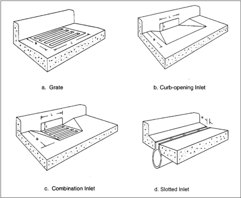

Slotted inlets consist  of  a  pipe  cut  along  the  longitudinal  axis  with  bars  perpendicular  to  the opening to maintain the slotted opening. Slotted inlets can be used in areas where it is desirable to intercept sheet flow before it crosses onto a section of roadway. Their principal advantage is that  they  can  intercept  flow  over  a  wide  section.  However,  the  susceptibility  of  slotted  inlets  to clogging from sediments and debris makes them ill -suited for use in environments where significant sediment or debris loads may be present. Slotted inlets on a longitudinal slope exhibit the same hydraulic capacity as curb openings when debris is not a factor. Slotted drains may also be combined with grates.

from

Barriers  and  barrier  walls used during construction temporarily separate vehicles construction  activities.  Where  pavement  runoff  flows  toward  the  barriers,  drainage  designers provide  for  capture  and  diversion  of  this  runoff  from  the  travel ed way.  Typically,  these  barriers include pre-located rectangular openings to allow water to pass beneath the barriers. Although, these openings create a hydraulic configuration analogous to a curb and gutter, they are different in important ways:

- The  openings  in  each  barrier  are  generally  prefabricated  and  not  customized  based  on the drainage needs.
- The openings are located at regular, closely spaced intervals in a series of barriers that are not selected by the drainage designer.
- The barriers are often located close to the travel ed way potentially reducing or eliminating flow in a gutter.

For  drainage  under  temporary  barriers,  the  drainage  design  estimates  the  contributing  flow  to, and interception capacity of, the barrier openings to assess water depth and spread to maintain safe vehicle use of the roadway. In addition to adapting the tools in this manual for curb inlets, drainage designers can use tools developed by researchers focused specifically on barrier wall drainage, e.g., Kranc et al. (2005).

## 7.1.2 Hydraulic Efficiency

Inlets  primarily function to capture flow on the roadway or in the roadway corridor. Inlet characteristics, inlet location (e.g., on grade versus in a sag), and the flow characteristics (e.g., velocity, depth, and spread) determine the ability to intercept flow.

Several agencies and manufacturers of grates have investigated grate inlet interception capacity. On behalf of the FHWA, the U.S. Bureau of Reclamation (USBR) conducted tests on grate inlets and slotted inlets included in this document  (Burgi and Gober 1977, Burgi 1978a, Burgi 1978b, Pugh 1980). Four of the grates selected for testing were rated highest in bicycle safety tests, three have designs and bar spacing similar to those proven bicycle-safe, and a parallel bar grate was used as a standard with which to compare the performance of others. Table 7.1 summarizes the grate types investigated.

Table 7.1. Inlet grate types and specifications.

| Inlet Grate      | Grate Type   | Longitudinal Bar Spacing *   | Transverse Bar Spacing *   | Figure     |
|------------------|--------------|------------------------------|----------------------------|------------|
| P-1-7/8          | Parallel bar | 1-7/8 inch (48 mm)           | -                          | Figure 7.2 |
| P-1-7/8-4        | Parallel bar | 1-7/8 inch (48 mm)           | 4 inch (102 mm)            | Figure 7.2 |
| P-1-1/8          | Parallel bar | 1-1/8 inch (29 mm)           | -                          | Figure 7.3 |
| Curved Vane      | Curved vane  | 3-1/4 inch (83 mm)           | 4-1/4 inch (108 mm)        | Figure 7.4 |
| 45°- 60 Tilt-Bar | Tilt-bar     | 2-1/4 inch (57 mm)           | 4 inch (102 mm)            | Figure 7.5 |
| 45°- 85 Tilt-Bar | Tilt-bar     | 3-1/4 inch (83 mm)           | 4 inch (102 mm)            | Figure 7.5 |
| 30°- 85 Tilt-Bar | Tilt-bar     | 3-1/4 inch (83 mm)           | 4 inch (102 mm)            | Figure 7.6 |
| Reticuline       | Honeycomb    | Not applicable               | Not applicable             | Figure 7.7 |

*Spacing is on center.

The parallel bar grate (P -1-7/8)  performs better hydraulically than all others but is not considered  bicycle-safe.  The  curved  vane and the P-1-1/8 grates have good hydraulic characteristics with high velocity flows. The other grates tested are hydraulically effective at lower  velocities. Section  7.2.1 and  Section 7.3.1  discuss  the  interception capacity of grate inlets on grade and in sags, respectively.

Several agencies also contributed research to determine the interception capacity of curb-opening inlets. Colorado State  University derived  design  procedures

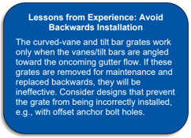

documented in this manual from experimental work (Izzard 1946, Bauer and Woo 1964). Section 7.2.2 and  Section 7.3.2 discuss  the  interception  capacity  of  curb  inlets  on  grade  and  in  sags, respectively.

Figure 7.2. P-1-7/8-4 grate (P-1-7/8 is this grate without transverse rods).

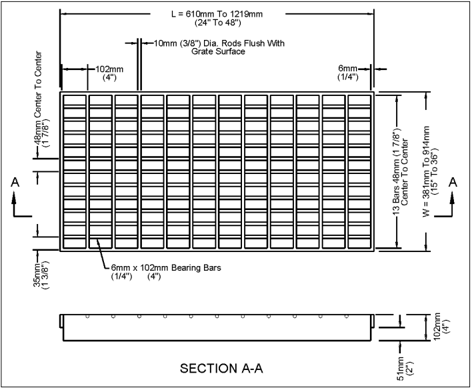

Figure 7.3. P-1-1/8 grate.

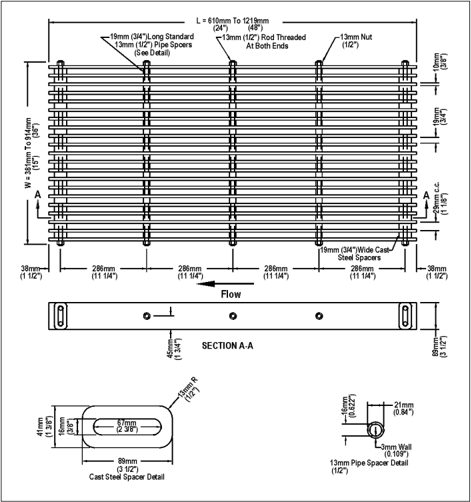

Figure 7.4. Curved vane grate.

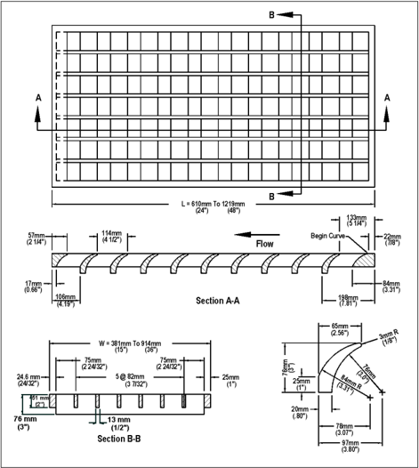

Figure 7.5. Tilt-bar grate: 45°- 60 (2.25 inch) and 45°- 85 (3.25 inch).

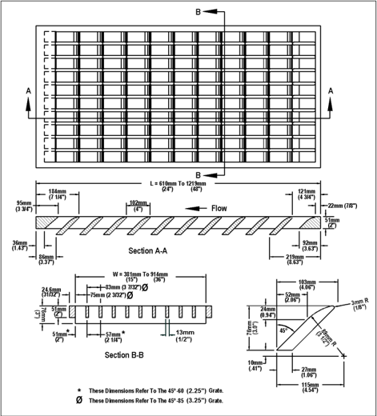

Figure 7.6. Tilt-bar grate: 30°- 85 (3.25 inch).

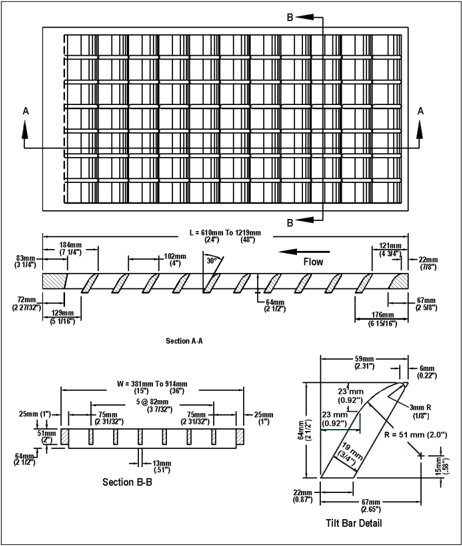

Figure 7.7. Reticuline grate.

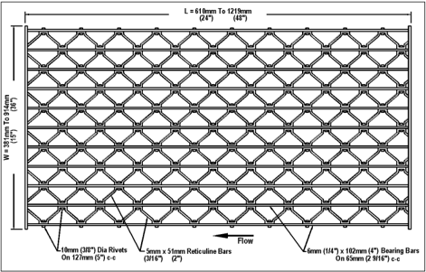

## 7.1.3 Clogging Potential

All types of inlets, including curb-opening inlets, experience clogging,  with those in low points (sag conditions) the most  vulnerable. Attempts  to simulate clogging tendencies  in the laboratory demonstrate the importance of parallel bar spacing in debris handling efficiency. Grates with wider spacings of longitudinal bars pass debris more efficiently. Except for reticuline grates, testers did not conduct trials of grates with lateral bar spacing of less than 4 inches, so they did not supply information concerning debris handling capabilities of many grates. Problems with clogging are largely  local  since  the  quantity  of  debris  varies  significantly  from  one  locality  to  another.  Some localities contend with only a small amount of debris while others experience  extensive clogging of  drainage inlets. Since partial clogging of inlets on grade rarely causes major problems, local experience will indicate where an allowance for reduction in inlet interception capacity advisable.

Table 7.2 provides a ranking of debris handling capabilities of various grates based on laboratory tests  using  simulated  'leaves'  (Burgi  and  Gober  1977).  The  table  shows  a  clear  difference  in efficiency between the grates with the 3-1/4 inch (83 mm) longitudinal bar spacing and those with smaller spacings. The efficiencies shown in the table are suitable for comparisons between the grate designs tested are not an indication of field performance since the testing procedure did not simulate actual field conditions. Some local transportation agencies have developed factors for use of debris handling characteristics with specific inlet configurations. Curb-opening inlets have good debris handling capabilities and are less likely to clog compared with grate inlets.

is

Table 7.2. Average debris handling efficiencies of grates.

|      |                  |   Longitudinal Slope (ft/ft) |   Longitudinal Slope (ft/ft) |
|------|------------------|------------------------------|------------------------------|
| Rank | Grate            |                        0.005 |                         0.04 |
| 1    | Curved Vane      |                       46     |                        61    |
| 2    | 30°- 85 Tilt-Bar |                       44     |                        55    |
| 3    | 45°- 85 Tilt-Bar |                       43     |                        48    |
| 4    | P-1-7/8          |                       32     |                        32    |
| 5    | P-1-7/8-4        |                       18     |                        28    |
| 6    | 45°- 60 Tilt-Bar |                       16     |                        23    |
| 7    | Reticuline       |                       12     |                        16    |
| 8    | P-1-1/8          |                        9     |                        20    |

## 7.1.4 Pedestrian, Bicycle, and ADA Safety

Table 7.3 ranks grates according to relative bicycle and pedestrian safety. Burgi and Gober (1977) and  Burgi  (1978a )  established  the  bicycle  safety  ratings  based  on  a  subjective  test  program. However, all the grates are considered bicycle and pedestrian safe except the P -1-7/8 for most bicycles and the P -1-1/8 grate for very narrow racing bicycle tires. Designers will also consider the potential for scooters and other types of shared micromobility and personal transport  systems and equipment that may have access to areas around drainage inlets.

Table 7.3. Inlet ranking for bicycle and pedestrian safety.

|   Rank | Grate Type        |
|--------|-------------------|
|      1 | P-1-7/8-4         |
|      2 | Reticuline        |
|      3 | P-1-1/8           |
|      4 | 45° - 85 Tilt-Bar |
|      5 | 45° - 60 Tilt-Bar |
|      6 | Curved Vane       |
|      7 | 30° - 85 Tilt-Bar |

In addition, areas where pedestrians using various mobility assistance devices may be found, the Americans  with  Disabilities  Act  (ADA)  has  resulted  in  grates  designated  as  ADA -compliant. Generally,  ADA-compliant  grates  include  smaller  openings  than  non-com pliant  grates  reducing their flow interception efficiency under some conditions. Like other grates, interception efficiency is grate specific. Lottes and Bojanowski (2015) compared the efficiency of a curved vane grate and an ADA-compliant grate with the same dimensions and confirmed a reduction in interception efficiency. However, the magnitude of reductions varies with the design.

## 7.2 Interception Capacity of Inlets on Grade

Inlet interception capacity, Qi, is the flow intercepted by an inlet under a given set of conditions. The  efficiency  of  an  inlet,  E,  is  the  percent  of  total  flow  that  the  inlet  will  intercept  for  those conditions. The efficiency of an inlet changes with changes in cross slope, longitudinal slope, total gutter flow, and, to a lesser extent, pavement roughness. In mathematical form, efficiency, E, is expressed by the following equation:

<!-- formula-not-decoded -->

where:

E = Inlet efficiency

Q = Total gutter flow, ft 3 /s (m 3 /s)

Qi = Intercepted flow, ft 3 /s (m 3 /s)

Bypass (carryover) flow is not intercepted by an inlet and is determined as follows:

<!-- formula-not-decoded -->

where:

Qb = Bypass flow, ft 3 /s (m 3 /s)

The interception capacity of all inlet configurations increases with increasing flow rates, and inlet efficiency  generally  decreases  with  increasing  flow  rates.  Gutter  flow  characteristics  also  affect inlet  interception  capacity.  The  depth  of  water  next  to the curb is  the  major  factor  in  the  interception capacity  of  both  grate  inlets  and  curb-opening  inlets.  The  interception  capacity  of  a  grate  inlet depends on the amount of water flowing over the grate, the size and configuration of the grate, and the velocity of flow in the gutter.

Interception capacity of a curb-opening inlet largely depends on flow depth at the curb and curbopening  length.  Local  gutter  depression  at  a  curb-opening  or  a  continuously  depressed  gutter increase depth at the curb, interception capacity, and efficiency.  Top slab supports placed flush with the curb line can substantially reduce the interception capacity of curb openings. Tests have shown that such supports reduce the effectiveness of openings downstream of the support by as much as 50 percent and, if debris is caught at the support, interception by the downstream portion of  the  opening  may  be  reduced  to  near  zero.  However,  Schalla  (2016)  and  Muhammad  (2018 ) concluded that, in the absence of debris, flush slab supports did not reduce interception. Where feasible, recessing intermediate top slab supports several inches from the curb line and rounding their shape reduces loss of interception capacity.

length.

Slotted inlets function in essentially the same manner as curb-opening inlets, i.e., as weirs with flow entering from the side. Interception capacity depends on flow depth and inlet Efficiency depends on flow depth, inlet length, and total gutter flow.

only.

The  interception capacity of an  equal length combination  inlet consisting of a grate  placed alongside a curb opening on a grade does not differ materially from that of a grate Interception capacity and efficiency depend on the same factors which affect grate capacity and efficiency. A combination inlet consisting of a curb-opening inlet placed upstream of a grate inlet (a sweeper configuration) has a capacity equal to that of the curb-opening length upstream of the grate plus that of the grate. However, capacity of the grate lowers because of the reduced spread and  depth  of  flow  over  the  grate  resulting  from  the  interception  by  the  curb  opening.  This  inlet

configuration has the added advantage of intercepting debris that might otherwise clog the grate and deflect water away from the inlet.

The  following  sections  present  methods  for  estimating  interception  capacity  of  inlets  on  grade. For locally depressed inlets, the quantity of flow reaching the inlet depends on the upstream gutter section geometry and not the locally depressed section geometry.

## 7.2.1 Grate Inlets

Grates can  be effective  highway  pavement  drainage  inlets  where  clogging  with  debris  is  not  a problem. (See Section  7.1.3  for a discussion of clogging potential.)  The  FHWA  sponsored research to develop interception efficiencies for grate inlets (Burgi and Gober 1977, Burgi 1978a, Burgi 1978b, Pugh 1980). Conceptually, flow approaching a grate inlet can be divided into frontal flow (flow in the gutter approaching the  front edge of the grate) and side flow (flow in the gutter beyond  the  front  edge).  The  research  demonstrated  that  grates  intercept  all  frontal  flow  until  a velocity  is  reached  at  which  water  begins  to  splash  over  the  grate.  At  velocities  greater  than 'splash-over' velocity, grate efficiency in intercepting frontal flow is diminished. The research also demonstrated that grates also intercept a portion of the flow along the length of the grate, or the side flow, depending on the cross slope of the pavement, the grate length, and the flow velocity.

The ratio of frontal flow to total gutter flow for a uniform cross slope is expressed as:

<!-- formula-not-decoded -->

where:

Eo =

Frontal flow ratio

Q =

Total gutter flow, ft 3 /s (m 3 /s)

Qw =

Frontal flow in width W, ft 3 /s (m 3 /s)

W =

Width of depressed gutter or grate, ft (m)

T =

Total spread of water, ft (m)

The ratio of side flow, Qs, to total gutter flow is:

<!-- formula-not-decoded -->

When  the  velocity  approaching  the  grate  is  less  than  the  splash-over  velocity,  the  grate  will intercept essentially all frontal flow. Conversely, when the gutter flow velocity exceeds the splashover  velocity  for  the  grate,  only  part  of  the  flow  will  be  intercepted.  The  ratio  of  frontal  flow intercepted to total frontal flow, Rf, is expressed as:

<!-- formula-not-decoded -->

where:

Ku =

Unit conversion constant, 0.09 in CU (0.295 in SI)

V =

Velocity of flow in the gutter, ft/s (m/s)

Vo =

Gutter velocity where splash-over first occurs, ft/s (m/s)

Figure  7.8  provides the splash-over velocity for several grate types for equation 7.5. The approaching gutter flow velocity is computed from the gutter equation (equation 5.3). If the splash-

over velocity is greater than the gutter flow velocity, R f is 1.0 because capture efficiency cannot exceed 100 percent.

Figure 7.8. Splash-over velocity for grate inlets.

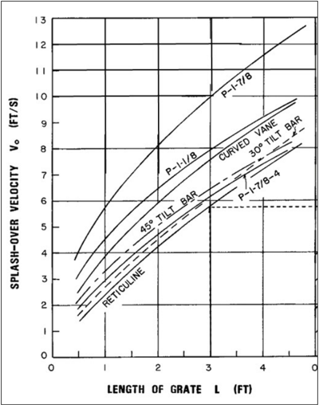

The  inlet  also  intercepts  part  of  the  flow  along  the  side  of  the  grate.  The  ratio  of  side  flow intercepted to total side flow, R s,  or  side  flow  interception  efficiency,  depends  on  the  pavement cross slope, the grate length, and the flow velocity:

<!-- formula-not-decoded -->

where:

Ku = Unit conversion constant, 0.15 in CU (0.0828 in SI)

Equation 7.6 underestimates side flow interception where the velocity is low, and the spread only slightly exceeds the grate width. Error due to this deficiency is small.

The total efficiency of a grate inlet, E, is expressed as:

<!-- formula-not-decoded -->

The first term on the right side of the equation is the ratio of intercepted frontal flow to total gutter flow, and the second term is the ratio of intercepted side flow to total side flow. The second term is insignificant with high velocities and short grates.

Frontal  flow  to  total  gutter  flow  ratio,  E o,  for  grate  inlets  in  composite  gutter  sections  assumes frontal  flow  width  equal  equals  the  depressed  gutter  section  width  which  also  equals  the  grate width.  If  the  grate  width  is  less  than  W,  the  frontal  flow  ratio,  E o,  is  modified  to  evaluate  grate efficiency. As an approximation, the adjusted frontal flow ratio assumes that average velocity in the  gutter  is  applicable  to  the  entire  gutter  width.  Then,  the  adjusted  frontal  flow  ratio,  E' o is calculated by multiplying Eo by a flow area ratio. The area ratio is the gutter flow area in a width equal to the  grate  width  divided  by  the  total  flow  area  in  the  depressed  gutter  section  and  is  applied as follows:

<!-- formula-not-decoded -->

where:

E'o =

Adjusted frontal flow area ratio for grates in composite cross-sections

A'w =

Gutter flow area in a width equal to the grate width, ft 2  (m 2 )

Aw =

Flow area in the depressed gutter width, ft 2  (m 2 )

Equation 7.9 describes the interception capacity of a grate inlet on grade as the efficiency of the grate multiplied by the total gutter flow. The adjusted frontal ratio, E 'o is substituted for E o when the grate width is less than the gutter width.

<!-- formula-not-decoded -->

Example 7.1:

Objective:

Interception capacity of a grate inlet on grade.

Find the interception capacity of different sizes and types of grates.

Given: Given a uniform gutter section where bicycles are not permitted:

T =

9.84 ft (3.0 m)

SL =

0.04 ft/ft (0.04 m/m)

Sx =

0.025 ft/ft (0.025 m/m)

W =

2 ft (0.61 m)

n = 0.016

Grates for evaluation:

- a. P-1-7/8, 2.0 ft x 2.0 ft (0.61 m x 0.61 m)
- b. Reticuline, 2.0 ft x 2.0 ft (0.61 m x 0.61 m)

- c. P-1-7/8, 2.0 ft x 4.0 ft (0.61 m x 1.22 m)
- d. Reticuline, 2.0 ft x 4.0 ft (0.61 m x 1.22 m)

## Step 1. Estimate flow in the gutter.

Using the gutter equation (equation 5.2):

<!-- formula-not-decoded -->

## Step 2. Determine frontal flow ratio, E0.

W/T = 2.0/9.84 = 0.2

From equation 7.3:

<!-- formula-not-decoded -->

## Step 3. Compute the gutter flow velocity.

Using the gutter equation (equation 5.3):

<!-- formula-not-decoded -->

## Step 4.  Determine the frontal flow efficiency.

Using equation 7.5 for the P-1-7/8 grate (2 ft x 2 ft):

From Figure 7.8, the splash-over velocity is approximately 8.2 ft/s.

<!-- formula-not-decoded -->

Repeat the process for the other three grates.

## Step 5. Determine the side flow efficiency.

Using equation 7.6, for the P-1-7/8 grate (2 ft x 2 ft):

<!-- formula-not-decoded -->

Repeat the process for the other three grates.

## Step 6. Compute the interception capacity.

Using equation 7.9, for the P-1-7/8 grate (2 ft x 2 ft):

<!-- formula-not-decoded -->

Repeat the process for the other three grates. Table 7.4 summarizes the results.

Table 7.4. Interception and efficiency results for example.

| Grate Type and Size (width by length)   |   Frontal Flow Efficiency, R f |   Side Flow Efficiency, R s |   Interception, Q i , (ft 3 /s) |
|-----------------------------------------|--------------------------------|-----------------------------|---------------------------------|
| P-1-7/8 (2.0 ft by 2.0 ft)              |                           1    |                       0.038 |                            3.15 |
| Reticuline (2.0 ft by 2.0 ft)           |                           0.88 |                       0.038 |                            2.8  |
| P-1-7/8 (2.0 ft by 4.0 ft)              |                           1    |                       0.163 |                            3.6  |
| Reticuline (2.0 ft by 4.0 ft)           |                           1    |                       0.163 |                            3.6  |

Solution:

Table 7.4 summarizes the interception capacities. The P-1-7/8 parallel bar grate intercepts 48 percent of the total flow compared with 42 percent for the reticuline grate. Increasing the length of the grates would not be cost-effective, because the increase in side flow interception is small.

## 7.2.2 Curb-Opening Inlets

Curb-opening inlets are effective in the drainage of highway pavements where flow depth at the curb is sufficient for the inlet to perform efficiently. Curb openings are less susceptible to clogging compared  with  grate  inlets  and  offer  little  interference  to  traffic  operation.  They  perform  well compared  with  grates  on  flatter  grades  where  grates  would  be  in  traffic  lanes  or  would  be hazardous for pedestrians or bicyclists.

Curb-opening heights vary in dimension; however, a typical maximum height is approximately 4 to 6 inches. The length of the curb-opening inlet required for total interception of gutter flow on a pavement section with a uniform cross slope is expressed as:

<!-- formula-not-decoded -->

where:

LT =

Curb-opening length required to intercept 100 percent of the gutter flow, ft (m)

Ku =

Unit conversion constant, 0.6 in CU (0.817 in SI)

SL =

Longitudinal slope, ft/ft (m/m)

Q =

Gutter flow, ft 3 /s (m 3 /s)

## Alternative On-Grade Curb Opening Design Equation

Laboratory and computational fluid dynamic modeling research suggests that equation 7.10 underestimates the length to intercept 100 percent of the gutter flow, especially for longer (greater than or equal to 10 ft) inlets (Schalla 2016, Muhammad 2018, FHWA 2022a). Therefore, inlets designed with the equation may not capture the intended flow and may allow for additional bypass. The FHWA's researchers prepared an alternative approach that appears to remedy this problem (FHWA 2022a). The FHWA encourages designers to review the technical note describing the research, results, recommendations, and sample computations (FHWA 2022a).

For depressed curb-opening inlets, as shown in Figure 7.9, or curb openings in depressed gutter sections an equivalent cross slope, Se, replaces Sx in equation 7.10. Se is:

<!-- formula-not-decoded -->

where:

S'w = Cross  slope  of  the  gutter  measured  from  the  pavement  cross  slope,  S x , ft/ft (m/m)

Eo = Frontal flow ratio for the depressed section determined by the configuration upstream of the inlet

Sw'  is  computed  as  a/W  or  equivalently,  S w - Sx,  where  S w is  shown  in Figure 7.9. Using  the equivalent cross slope, Se, equation 7.10 becomes:

gutter

<!-- formula-not-decoded -->

Increasing the cross slope or the equivalent cross slope reduces the required curb-opening length for  100  percent  interception.  The  equivalent  cross  slope  can  be  increased  by  use  of  a  continuously depressed gutter section or a locally depressed gutter section.

The  efficiency  of  curb-opening  inlets  shorter  than  the  length  required  for  total  interception  is applicable for either uniform cross slopes or composite cross slopes and is expressed as:

<!-- formula-not-decoded -->

where:

L

= Curb-opening length, ft (m)

Figure 7.9. Depressed curb-opening inlet.

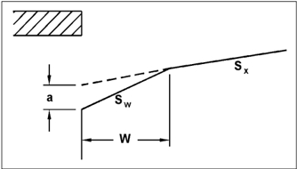

Example 7.2:

Interception capacity of a curb inlets on grade.

Objective:

Find the interception capacity of a curb inlet: A) without a depressed gutter section and B) with a depressed gutter section.

Given: A curb-opening inlet in the following situation:

SL =

0.01 ft/ft (m/m)

Sx =

0.02 ft/ft (m/m)

n =

0.016

Q =

1.77 ft 3 /s (0.050 m 3 /s)

L =

9.84 ft (3.0 m)

For the gutter depression:

a =

1 inch (25.4 mm)

W

= 2 ft (0.61 m)

## Step A1. Determine the length of curb opening required for total interception of gutter flow without gutter depression.

Using equation 7.10:

<!-- formula-not-decoded -->

## Step A2. Compute the curb-opening efficiency without gutter depression.

Using equation 7.13:

<!-- formula-not-decoded -->

<!-- formula-not-decoded -->

## Step A3. Compute the interception capacity without gutter depression.

<!-- formula-not-decoded -->

## Step B1. Determine the W/T ratio for the depressed gutter.

Determine spread, T (see example 5.2(B))

<!-- formula-not-decoded -->

<!-- formula-not-decoded -->

<!-- formula-not-decoded -->

<!-- formula-not-decoded -->

<!-- formula-not-decoded -->

Use equation 5.7 to determine that W/T = 0.24

<!-- formula-not-decoded -->

<!-- formula-not-decoded -->

Use the gutter flow equation (equation 5.2) to obtain Qs.

<!-- formula-not-decoded -->

Since this is close to the assumed Qs no further iterations are necessary.

## Step B2. Determine efficiency of curb opening with the depressed gutter section.

Using equation 7.11:

<!-- formula-not-decoded -->

Using equation 7.12:

<!-- formula-not-decoded -->

Using equation 7.13:

L/LT = 9.84/14.3 = 0.69

<!-- formula-not-decoded -->

## Step B3. Compute curb-opening interception.

Using equation 7.1:

<!-- formula-not-decoded -->

Solution:

A) the interception of the curb inlet without the depressed gutter is 1.08 ft 3 /s (0.031 m 3 /s). B) the interception of the same inlet with a depressed gutter is 1.55 ft 3 /s (0.044 m 3 /s), an increase of approximately 40 percent under these conditions.

The following example illustrates computation of the required curb-opening length to intercept 100 percent of the flow given the gutter flow.

Example 7.3:

Objective:

Curb-opening length on grade.

Find the minimum length of a locally depressed curb-opening inlet required to intercept 100 percent of the gutter flow.

Given: A curb-opening inlet in the following situation:

SL =

0.01 ft/ft (m/m)

Sx =

0.02 ft/ft (m/m)

n =

0.016

Q =

2.26 ft 3 /s (0.064 m 3 /s)

T =

8.2 ft (2.5 m)

For the local depression:

```
a = W = 2.0 ft (0.61 m) Eo = 0.70
```

2.0 inches (51 mm)

Step 1. Compute the composite cross slope for the locally depressed section.

```
Using equation 7.11: S'w = a/W = (2/12) / 2 = 0.0833 Se = Sx + S'w Eo = 0.02 + (0.0833) (0.7) = 0.078
```

Step 2. Compute the length of curb-opening inlet required for 100 percent interception.

Using equation 7.12:

```
LT = KU Q 0.42 SL 0.3 (1 / n Se) 0.6 = (0.60)(2.26) 0.42 (0.01) 0.3 [1/ {(0.016) (0.078)}] 0.6 = 11.7 ft
```

```
Solution: For the given conditions, the curb-opening length for 100 percent interception is
```

11.7 ft (3.56 m).

## 7.2.3 Slotted Inlets

Slotted inlets are effective pavement drainage inlets in some applications. They can be used on curbed or uncurbed sections and offer little interference to traffic operations. Figure 7.10 illustrates an  installation.  Deposition  in  the  pipe  is  the  problem  most  encountered.  The  configuration  of slotted inlets makes them accessible for cleaning with a high-pressure water jet. If use of a slotted inlet includes the need for customized curb or gutter, or both, the cost of customization may lead to other inlet options.

of

Flow interception  by  slotted  inlets  is  like that  of  curb-opening  inlets  because  both  operate  as  a side weir with the flow subjected to lateral acceleration  because  of the cross slope pavement. The FHWA tested slotted inlets with slot widths greater than or equal to 1.75 inches and concluded that the length of slotted inlet required for total interception can be computed by the

equation 7.10.  Similarly,  FHWA  concluded  that  equation 7.13 also  applies  to  slotted  inlets  and can be used to obtain the inlet efficiency for a given inlet length.

For overland flow, FHWA research indicates that 1-, 1.75-, and 2.5-inch-wide slotted drain inlets can capture 100 percent of the approaching flow up to 0.025 ft 3 /s/ft for water depths ranging from 0.38 to 0.56 inches on slopes ranging from 0.005 to 0.09 ft/ft. During tests at a system capacity of 0.040 ft 3 /s/ft, a small amount of splash-over occurred.

## 7.2.4 Combination Inlets

Figure 7.11 depicts a combination inlet that combines a grate inlet with a curb opening. When the curb opening and grate length are equal, as shown, the interception capacity of is the same as the  grate  alone.  The  benefit  of  the  curb  opening  is  to  capture  debris  and  reduce  the  clogging potential of the grate.

Figure 7.12 illustrates a sweeper combination inlet with the curb opening extended upstream of the grate. In this installation the curb opening also intercepts debris that might clog the grate and augments interception capacity. In a sweeper combination inlet, interception capacity equals the sum  of  the  curb  opening  upstream  of  the  grate  plus  the  grate  capacity.  However,  the  grate interception is reduced because the flow captured by the curb opening reduces the frontal flow approaching the grate by the same amount. The following example illustrates computation of the interception capacity of a sweeper combination inlet.

Figure 7.10. Slotted drain inlet at an intersection.

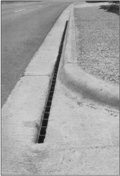

Figure 7.11. Combination curb-opening with 45-degree tilt-bar grate inlet.

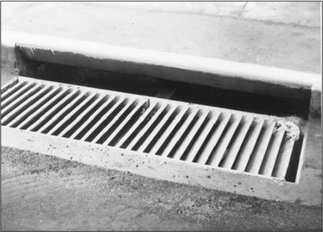

Figure 7.12. Sweeper combination inlet.

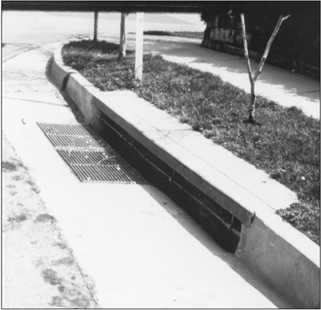

## Example 7.4:

Sweeper combination inlet on grade.

Objective:

Find the interception capacity of a combination inlet with the grate inlet located at the downstream end of the curb opening.

Given: The following composite gutter and flow information:

SL =

0.01 ft/ft (m/m)

Sx =

0.02 ft/ft (m/m)

n

=

0.016

a =

1 inch (25.4 mm)

W =

2 ft (0.61 m)

Q =

1.77 ft 3 /s (0.050 m 3 /s)

Curb-opening length = 9.84 ft (3.0 m)

Curved vane grate is 2 ft x 2 ft (0.61 m x 0.61 m)

## Step 1. Compute the portion of the curb opening contributing to the interception capacity of the combination inlet.

L = 9.84 - 2.0 = 7.84 ft

## Step 2. Determine the frontal flow ratio for the depressed portion of the gutter.

Determine spread, T (see example 5.2(B))

Assume Qs = 0.64 ft 3 /s

<!-- formula-not-decoded -->

<!-- formula-not-decoded -->

## Step 3. Determine the efficiency of the curb opening with the depressed gutter section.

Using equation 7.11:

<!-- formula-not-decoded -->

Using equation 7.12:

<!-- formula-not-decoded -->

<!-- formula-not-decoded -->

Using equation7.13:

<!-- formula-not-decoded -->

<!-- formula-not-decoded -->

## Step 4. Compute the flow approaching the grate.

<!-- formula-not-decoded -->

## Step 5. Estimate the side flow approaching the grate.

Determine spread, T (see example 5.2(B))

Assume Qs = 0.01 ft 3 /s

<!-- formula-not-decoded -->

<!-- formula-not-decoded -->

<!-- formula-not-decoded -->

<!-- formula-not-decoded -->

From equation 5.7:

<!-- formula-not-decoded -->

<!-- formula-not-decoded -->

<!-- formula-not-decoded -->

<!-- formula-not-decoded -->

From equation 5.2:

<!-- formula-not-decoded -->

Since this matches the assumed Qs no further iterations are necessary.

## Step 6. Compute the interception capacity of the grate.

Estimate the flow area in the composite gutter approaching the grate:

<!-- formula-not-decoded -->

Determine velocity, V.

<!-- formula-not-decoded -->

From Figure 7.8, splash-over velocity equals 6 ft/s.

From equation 7.5:

<!-- formula-not-decoded -->

From equation 7.6:

<!-- formula-not-decoded -->

From equation 7.9:

<!-- formula-not-decoded -->

Step 7. Compute the total interception capacity. (Interception capacity of curb opening adjacent to grate is neglected.)

<!-- formula-not-decoded -->

Solution:

The sweeper combination inlet intercepts 1.76 ft 3 /s (0.536 m 3 /s). This represents nearly 100 percent interception of the 1.77 ft 3 /s (0.539 m 3 /s) in the approaching gutter.

## 7.2.5 Comparison of Interception Capacity of Inlets on Grade

Many variables contribute to the interception capacity of inlets on grade including the inlet type and size, the approach gutter/pavement conditions, local or gutter depression, and clogging. Over a range of longitudinal slopes,  Figure 7.13 compares curb-opening inlets, grates, and slotted drain inlets  holding  gutter  flow  at  3.2  ft 3 /s,  cross  slope  at  3  percent,  and  Manning's  n  at  0.016.  The relationship  between  the  curves  shown  may  vary  under  different  conditions  but  is  useful  for general comparisons.

For  example, Figure 7.13 illustrates  that  the  slotted  inlets  and  curb-opening  inlets  shown  lose interception capacity and efficiency as longitudinal slope increases. This occurs because depth at the curb becomes smaller as velocity increases. Factors that encourage flow toward the curb,

such as increasing cross slope, gutter depression, or local inlet depression, increase interception. The effect of depression on curb-opening inlets is illustrated by comparing undepressed curb openings (curves 9 and 10) with depressed curb openings of the same length (curves 11 and 12). The depressed curb openings capture significantly higher flows for these conditions.

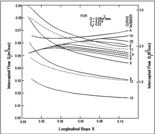

Figure 7.13. Comparison of inlet interception capacity on grade.

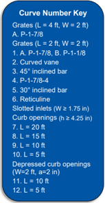

Figure  7.13  also  illustrates  that  interception  for  grate  inlets  can  increase  with  increasing longitudinal  slope  until  the  splash-over  velocity  is  reached.  The  grates  represented  by curves other than 1 and 1A show an increase in interception for an increase in slope because the flow spread is narrowing. However, at greater slopes, they experience a decrease in interception as the splash-over velocity for the grate is reached and flow begins to jump over the grate. The P-17/8 grates (curves 1 and 1A) show an increase in interception at the longitudinal slopes shown because the velocity in the gutter has not reached their splash-over velocity. Based on these performance characteristics curves, parallel bar grates and the curved vane grate are relatively efficient at higher velocities and the reticuline grate is least efficient. At low velocities, the grates perform  equally  well.  However,  some  of  the  grates  such  as  the  reticuline  grate  are  more susceptible to clogging by debris than the parallel bar grate.

Figure  7.13  demonstrates  that  inlet  length  increases  interception.  The  4  ft  grate  (curve  A) intercepts more flow than the 2 ft grate (curve 1A). However, under these conditions, the doubling of length increases interception modestly. Wider grates could increase interception because side flow, not frontal flow, is escaping these grates. The figure reveals greater benefits of lengthening curb opening and slotted inlets under these conditions. Interception increases significantly for the 10 ft curb-opening inlets (curves 9 and 11) compared with the 5 ft counterparts (curves 10 and 12).

Over a range of gutter flow rates, Figure 7.14 compares the same inlet types holding longitudinal slope at 6 percent, cross slope at 3 percent, and Manning's n at 0.016. It shows, for example, that at a 6 percent slope, splash-over begins at about 0.7 ft 3 /s on a reticuline grate. It also illustrates

that with increased discharge, the interception capacity of all inlets increases, and inlet efficiency decreases.

Figure 7.14. Comparison of inlet interception capacity, flow rate variable.

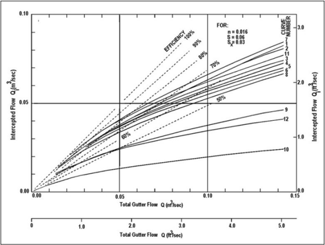

The  performance  characteristics  shown  in  Figure  7.13  and  Figure  7.14  neglect  the  effects  of debris and clogging on inlets. Section 7.1.3 discusses clogging.

## 7.3 Interception Capacity of Inlets in Sag Locations

Inlets  in  sag  locations  operate  as  weirs  under  low  depth  conditions  and  as  orifices  at  greater depths. Orifice flow begins at depths dependent on the grate size, the curb-opening height, or the slot  width  of  the  inlet.  At  depths  between  those  at  which  weir flow  prevails  and  those  at  which orifice flow prevails, flow is in a transition stage. At these depths, control may fluctuate between weir and orifice control. In the transition stage, designers estimate conditions assuming both weir and orifice control and design using the more conservative result.

The efficiency of inlets in passing debris is critical in sag locations because all runoff which enters the sag must be passed through the inlet. Total or partial clogging of inlets can result in hazardous ponded conditions. Because of the potential for clogging, designers prefer combination inlets or curb-opening inlets over grate inlets alone in sag locations.

## 7.3.1 Grate Inlets in Sags

The perimeter and clear opening area of the grate and the depth of water at the curb affect inlet capacity. A grate inlet in a sag location operates as a weir at the perimeter to depths dependent on the size of the grate and as an orifice over the clear opening area at greater depths. Larger grates will operate as weirs to greater depths than smaller grates.

When operating under weir flow conditions, designers estimate interception capacity as:

<!-- formula-not-decoded -->

where:

Qi =

Intercepted flow, ft 3 /s (m 3 /s)

Cw =

Weir coefficient (typically equal to 0.37)

P =

Perimeter of the grate disregarding the side against the curb, ft (m)

d =

Average depth across the grate, ft (m)

g =

Gravitational acceleration, 32.2 ft/s 2  (9.81 m/s 2 )

Figure 7.15 describes the computation of average depth across a grate. The figure also describes the grate width, W, and the grate length, L. The perimeter for estimating weir flow is L + 2W.

Figure 7.15. Profile and plan view grate definition sketch.

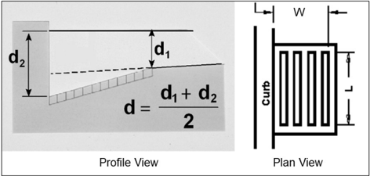

When operating under orifice flow conditions, designers estimate interception capacity as:

<!-- formula-not-decoded -->

where:

Qi =

Intercepted flow ft 3 /s (m 3 /s)

Co =

Orifice coefficient usually taken as 0.67

Ag =

Clear opening area of the grate, ft 2  (m 2 )

d =

Average depth across the grate, ft (m)

g =

Gravitational acceleration, 32.2 ft/s 2  (9.81 m/s 2 )

The clear area of opening of a grate equals the total area (length times width) times an opening ratio.  Burgi (1978b) tested three grate styles for the FHWA and showed that for flat bar grates, such as the P-1-7/8-4 and P-1-1/8 grates, the clear opening equals the total area of the grate less the  area  occupied  by  longitudinal  and  lateral  bars.  The  curved  vane  grate  performed  about  10 percent  better  than  a  grate  with  a  net  opening  equal  to  the  total  area  less  the  area  of  the  bars projected on a horizontal plane. That is, the projected area of the bars in a curved vane grate is 68 percent of the total area of the grate leaving a net opening of 32 percent, however the grate performed  as  a  grate  with  a  net  opening  of  35  percent.  Tilt-bar  grates  were  not  tested, but extrapolation of the testing results indicates a net opening area of 34 percent for the 30-degree tilt-bar and zero for the 45-degree tilt-bar grate. However, the 45-degree tilt-bar grate has greater than zero capacity. The tilt-bar angle and curved vanes enhance interception on grade. However, because of the low opening ratio, tilt- bar and curved vane grates perform poorly in sump locations under orifice flow conditions. Table 7.5 summarizes grate opening ratios.

Table 7.5. Grate opening ratios.

| Grate         |   Opening Ratio |
|---------------|-----------------|
| P-1-7/8-4 *   |            0.8  |
| P-1-7/8       |            0.9  |
| P-1-1/8 *     |            0.6  |
| Reticuline    |            0.8  |
| Curved vane * |            0.35 |
| 30° tilt-bar  |            0.34 |

*Laboratory tested.

Depending on the ponding depth and grate character istics, designers can estimate flow interception based on either weir flow (equation 7.14) or orifice flow (equation 7.15). Under many circumstances, the designer may be unsure which to use. To avoid overestimating interception, or underestimating ponding depth, the designer calculates depth by both equations for a given flow and uses the highest value for the depth.

flow

Clogging  reduces  the  inlet  interception.  Clogging  can  be  represented  as  a  reduction  of  the perimeter length when using the weir flow equation and as a reduction of the opening area when using the orifice flow equation. However, a particular clogging scenario may change the effective opening area to a greater or lesser degree than it changes the effective perimeter. For example, an accumulation of leaves at a curb may block 25 percent of the grate opening area but a smaller percent of the grate perimeter because it only affects the perimeter nearest the curb.

```
Example 7.5: Grate inlet in a sag. Objective: Find the grate size required to maintain allowable spread.
```

Given: The following uniform gutter and flow conditions:

Sx =

0.05 ft/ft (m/m)

SW =

0.05 ft/ft (m/m)

n =

0.016

Q =

6.71 ft 3 /s (0.19 m 3 /s)

T =

9.84 ft (3.0 m 3 /s) (allowable)

```
For the grate (P-1-7/8-4): W = 2.0 ft (0.61 m) Clogging  = 50 percent of clogging from the curb (assumed)
```

## Step 1. Determine the required grate perimeter without clogging for weir flow.

Depth at curb:

<!-- formula-not-decoded -->

Average depth over grate:

<!-- formula-not-decoded -->

Using equation 7.14:

<!-- formula-not-decoded -->

## Step 2. Determine the required grate perimeter with clogging for weir flow.

Assuming 50 percent clogging from the curb:

<!-- formula-not-decoded -->

Solving for L = 5.66 ft

Select a double 2 ft by 3 ft grate.

<!-- formula-not-decoded -->

## Step 3. Check depth of flow at curb for weir flow.

Using equation 7.14:

<!-- formula-not-decoded -->

Therefore, grate size meets spread requirements with clogging.

## Step 4. Determine the required grate opening area without clogging for orifice flow.

Using equation 7.15:

<!-- formula-not-decoded -->

## Step 5. Determine the required grate opening area with clogging for orifice flow.

Assuming 50 percent clogging from the curb:

<!-- formula-not-decoded -->

Solving for L = 2.67 ft

Select a single grate 2 ft by 3 ft.

<!-- formula-not-decoded -->

## Step 6. Check depth of flow at curb for orifice flow.

Using equation 7.15:

<!-- formula-not-decoded -->

Because this depth for orifice flow is less than the depth computed using the weir equation (step 3), the weir equation is used for design and the orifice equation is disregarded.

Solution:

A double 2 ft by 3 ft (0.61 m by 0.91 m) grate 50 percent clogged from the curb is adequate to intercept the design storm flow and meet the design spread. However, the tendency of grate inlets to clog completely warrants consideration of a combination inlet or curb-opening inlet in a sag where ponding can occur, and flanking inlets in long flat vertical curves.

## 7.3.2 Curb-Opening Inlets

Curb-opening inlets operate as weirs in sag vertical curve locations up to a ponding depth equal to  the  opening  height.  At  depths  above  1.4  times  the  opening  height,  the  inlet  operates  as  an orifice  and  between  these  depths,  transition  between  weir  and  orifice  flow  occurs.  The  curbopening height and length, and water depth at the curb affect inlet capacity.

The weir equation for curb-opening inlets without depression is:

<!-- formula-not-decoded -->

where:

Cw =

Weir coefficient (typically equal to 0.37)

L =

Length of curb opening, ft (m)

d =

Depth at curb, ft (m)

g =

Gravitational acceleration, 32.2 ft/s 2  (9.81 m/s 2 )

For non-depressed inlets with a uniform gutter, the curb inlet operates as a weir for depths up to the curb-opening height, h. The weir location for a curb-opening inlet that is not depressed is at the lip of the curb opening and its length is equal to that of the inlet, as shown in Figure 7.16.

At a given flow rate, the effective water depth at the curb can be increased by using a continuously depressed gutter, a locally depressed curb opening, or by increas ing cross slope, thus decreasing the width of spread at the inlet.

Figure 7.16. Curb-opening inlet definition sketch.

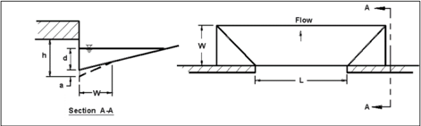

The weir location for a depressed curb-opening inlet is at the edge of the gutter, and the effective weir length depends on the width of the depressed gutter and the length of the curb opening.  The interception capacity of a locally depressed curb-opening inlet operating as a weir is:

<!-- formula-not-decoded -->

where:

Cw =

Weir coefficient (typically equal to 0.29)

L = Length of curb opening, ft (m)

W =

Lateral width of depression, ft (m)

d

=

Depth at the curb measured from the pavement cross-slope (Sx), ft (m)

g = Gravitational acceleration, 32.2 ft/s 2  (9.81 m/s 2

)

The  weir  coefficient  for  a  curb-opening  inlet  is  less than  in equation  7.16  primarily  because experimental tests did not include depth measurements taken at the weir and drawdown occurs between the point where measurements were made and the weir. The weir equation applies to depths at the curb. For weir flow at a depressed curb inlet, the depth at the curb for equation  7.17 must be less than the curb-opening height:

<!-- formula-not-decoded -->

where:

di

= Depth at the curb with local depression, ft (m)

h =

Curb-opening height, ft (m)

d

=

Depth at the curb measured from the pavement cross-slope (Sx), ft (m)

a = Depth of depression, ft (m)

Although laboratory experiments for FHWA did not include curb -opening inlets with a continuously depressed  gutter,  the  FHWA  expects  that  the  effective  weir  length  described  in equation 7.17 would be equaled or exceeded with a continuously depressed gutter. Therefore, equation 7.17 provides conservative estimates of the interception capacity in this situation.

For  curb-opening  lengths  greater  than  12  ft, equation  7.16  for  non-depressed  inlet  produces intercepted  flows  which  exceed  the  values  for  depressed  inlets  computed  using equation 7.17. Since depressed inlets will perform at least as well as non- depressed inlets of the same length, equation 7.16 is most accurate for all curb-opening inlets longer than 12 ft.

Curb-opening  inlets operate as orifices at depths greater than approximately 1.4 times opening  height.  The  interception  capacity  for  depressed  and  undepressed  curb-opening  inlets can be computed as:

<!-- formula-not-decoded -->

where:

Co =

Orifice coefficient, usually taken as 0.67

do =

Effective head on the center of the orifice throat, ft (m)

Ao = Clear area of opening, ft 2  (m 2 )

The  effective  head  on  the  center  of  the  orifice  throat,  d 0,  and  the  clear  opening  area,  A 0,  are computed based on the curb-opening configuration. Figure 7.17 illustrates a horizontal throat, an inclined throat, and a vertical throat. The clear opening area is the length of the curb-opening inlet times the height of the curb-opening inlet as represented in the figure. A limited throat width could reduce the capacity of the curb-opening inlet by causing the inlet to go into orifice flow at depths less  than  the  height  of  the  opening.  Equation 7.19  applies  to  other  configurations  when  the designer appropriately selects the effective head and clear opening area.

the

Figure 7.17. Curb-opening inlet throat configurations.

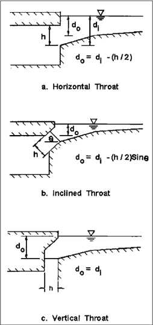

Example 7.6: Curb inlet in a sag.

Objective:

Find curb inlet interception without and with local depression.

Given: Curb-opening inlet in a sump location with:

$$Sx = 0.02 ft/ft (m/m) L = 8.2 ft (2.5 m)$$

```
h = 0.43 ft (0.13 m) T = 8.2 ft   (2.5 m)
```

For the local depression:

```
a = 1 inch (25.4 mm) W = 2 ft (0.61 ft)
```

## Step 1. Determine depth at curb for the undepressed inlet.

<!-- formula-not-decoded -->

Since 0.16 ft &lt; h = 0.43 ft weir flow controls

## Step 2. Estimate Qi for the undepressed inlet.

Use equation 7.16:

<!-- formula-not-decoded -->

## Step 3. Determine depth at curb for the depressed inlet.

```
di = d + a = Sx T + a = (0.02) (8.2) + 1/12 = 0.25 ft
```

Since 0.25 ft &lt; h = 0.43 ft weir flow controls

## Step 4. Estimate Qi for the depressed inlet.

<!-- formula-not-decoded -->

Use equation 7.17:

<!-- formula-not-decoded -->

Solution:

The interception capacity in the sag of the undepressed inlet is 1.6 ft 3 /s (0.045 m 3 /s) and of the depressed inlet is 1.7 ft 3 /s (0.048 m 3 /s). In this case, local depression increased interception by approximately 7 percent.

## 7.3.3 Slotted Inlets

Slotted inlets operate as weirs for depths below approximately 2 inches  and as orifices where the depth at the upstream edge of the slot is greater than about 5 inches. Between these depths, the flow  conditions  are  in  transition  between  weir  and  orifice  flow.  Interception  capacity  varies  with flow depth, cross slope, slot width, and slot length. Slotted drains in sag locations are susceptible to  clogging  from  debris.  Designers  generally  avoid  their  use  in  sag  locations  because  of  the clogging potential.

The interception capacity of a slotted inlet operating as a weir can be computed as:

<!-- formula-not-decoded -->

where:

Cw = Weir coefficient L = Length of slot, ft (m) d = g = Gravitational acceleration, 32.2 ft/s 2  (9.81 m/s 2 )

Depth at curb measured from the normal cross slope, m (ft)

The weir coefficient for a slotted inlet varies with flow depth and slot length, but a typical value is approximately 0.31.

The interception capacity of a slotted inlet operating as an orifice can be computed as:

<!-- formula-not-decoded -->

where:

W

=

Width of slot, ft (m)

Co =

Orifice coefficient (typically equal to 0.8)

L =

Length of slot, ft (m)

d =

Depth of water at slot, ft (m)

g =

Gravitational acceleration, 32.2 ft/s 2  (9.81 m/s 2 )

For  depths  in  the  transition  between  weir  flow  and  orifice  flow,  designers  compute interception capacity using both the weir and orifice equations and use the lowest interception capacity (most conservative) for design. Similarly, when  estimating ponding depth from a given flow designers use both equations and use the highest depth for design.

Example 7.7:

Slotted inlet in a sag.

Objective:

Find the slotted inlet length to limit maximum depth at the inlet to 3.6 inches assuming no clogging.

Given: A slotted inlet located along a curb:

W =

1.75 in (44.5 mm)

Q =

4.9 ft 3 /s (0.14 m 3 /s)

## Step 1. Estimate the inlet length assuming weir flow.

Use equation 7.20:

<!-- formula-not-decoded -->

## Step 2. Estimate the inlet length assuming orifice flow.

Use equation 7.21:

<!-- formula-not-decoded -->

Solution:

The length is computed for both weir and orifice flow at the maximum allowable depth. Weir flow controls because it results in the longest length. A 12 ft (3.7 m) inlet length is needed to meet the depth requirements.

## 7.3.4 Combination Inlets

Combination inlets  (described  in  Section  7.2.4)  perform  well  in  sags  where  hazardous  ponding can occur. The curb-opening length in a combination inlet in sag can equal the length of the grate or  can  be  longer  than  the  grate  on  one  or  both  ends  of  the  grate  in  a  variation  of  a  sweeper configuration.

When ponded depths are sufficiently low that the grate inlet captures the flow operating as a weir, the designer may ignore the curb opening, and compute the interception as described in Section 7.3.1.  If  the  grate  becomes  clogged  and  ineffective,  the  effectiveness  of  the  combination  inlet depends only on the curb opening; designers can estimate it as described in Section 7.3.2.

rate,

When the  ponded  depths  are  sufficiently  high  so  that  both  the  grate  and  the  curb opening  are operating in orifice flow, the capacity of the combination inlet equals the sum of the two operating independently using the orifice equations described in Section 7.3.1  and Section 7.3.2, respectively. Under these conditions, a trial -and-error solution best finds the depth that satisfies both orifice equations and totals to the design flow. In the transition between weir and orifice flow, trial-and-error solutions are also used to find the depth associated with a given design flow.

## Example 7.8:

Combination inlet in a sag.

Objective:

Find the depth at the curb and spread for a clog-free combination inlet and a combination inlet with the grate 100 percent clogged.

Given: A combination inlet in a sag location with the following characteristics:

Q =

5.3 ft 3 /s (0.15 m 3 /s)

Sx =

0.03 ft/ft (m/m)

Grate inlet (P-1-7/8):

W =

2 ft (0.61 m)

L =

4 ft (1.22 m)

Curb-opening inlet:

L =

4 ft (1.22 m)

h =

3.9 inches (100 mm)

## Step 1. Compute average depth over the grate with no clogging.

Assuming grate controls interception with weir flow:

<!-- formula-not-decoded -->

From equation 7.14:

<!-- formula-not-decoded -->

## Step 2. Compute associated curb depth and spread.

<!-- formula-not-decoded -->

T = d / Sx = 0.39 / 0.03 = 13 ft

## Step 3. Compute depth at curb assuming 100 percent clogging of grate.

Assuming orifice flow and using equation 7.19:

<!-- formula-not-decoded -->

<!-- formula-not-decoded -->

<!-- formula-not-decoded -->

Depth at curb is in transition. Orifice flow equation provides conservative estimate of depth.

## Step 4. Compute associated spread.

T = d / Sx = (0.74) / (0.03) = 24.7 ft

Solution:

Depth at curb with no clogging and grate operating is 0.36 ft (0.11 m). With the grate clogged, the depth at the curb is 0.74 ft (0.23 m), approximately twice the amount without clogging. The spread is also twice as large.

## 7.4 Inlet Location

Designers  determine  inlet  location  based  on  geometric  controls that  result  in inlets  at  specific locations (including flanking inlets in sag vertical curves) and that are based on roadway spread criteria. To adequately design the location of the inlets for a given project, designers need:

- Layout or plan sheets suitable for outlining drainage areas.
- Road profiles.
- Typical cross-sections.
- Grading cross-sections.
- Superelevation diagrams.
- Contour maps.

## 7.4.1 Geometric Controls

Roadway geometry determines the location of some drainage inlets. These locations are marked on  plans  prior  to  any  computations  regarding  discharge,  water  spread,  inlet  capacity,  or  flow bypass. Examples of such locations include:

- At all low points in the gutter grade.
- Immediately  up-gradient  of  median  breaks,  entrance/exit  ramp  gores,  cross  walks,  and street intersections, i.e., at any location where water could flow onto the roadway.
- Immediately  up-gradient  of  bridges  (to  prevent  pavement  drainage  from  flowing  onto bridge decks).
- Immediately down-gradient of bridges (to intercept bridge deck drainage).
- Immediately up-gradient of cross-slope reversals.
- Immediately up-gradient from pedestrian cross walks.
- At the end of channels in cut sections.
- On side streets immediately up-gradient from intersections.
- Behind curbs, shoulders, or sidewalks (to drain low areas).

In  addition,  designers  place  roadside  channels  or  inlets  to  intercept  runoff  from  areas  draining toward  the  roadway.  This  applies  to  drainage  from  cut  slopes,  side  streets,  and  other  areas alongside the pavement. Curbed pavement sections and pavement drainage inlets are inefficient means for handling extraneous drainage.

## 7.4.2 Inlet Spacing on Continuous Grades

Design (allowable) spread drives spacing of storm drain inlets between inlets required geometric or other controls. The interception capacity of the upstream inlet will establish the initial spread for the next inlet downstream on a continuous road grade. As flow is contributed to the gutter  section  in  the  downstream  direction,  spread  increases.  The  next  downstream  inlet  is located at or before the point where the spread in the gutter reaches the design spread. Therefore, the spacing of inlets on a continuous grade is a function of the amount of upstream bypass flow, the tributary drainage area, and the gutter/roadway cross slope.

by

For a continuous grade, the designer may establish a uniform design spacing between inlets if the drainage area consists of pavement only or has reasonably uniform runoff characteristics and

is rectangular in shape. In this case, the designer assumes the time of concentration is the same for all inlets.

The following procedure and example illustrate the inlet spacing design process. Designers can implement calculations in a spreadsheet or use automated drainage design software to achieve the same goals. Regardless of the tools used, documentation of the process and results facilitates independent review and future revisions if conditions or criteria change.

## Step 1.   Plan the design sequencing.

In  this  first  step,  the  designer  begins  the  documentation  process  and  plans  the  design  sequencing. This step generally includes the following activities:

- Confirm the design criteria including the design frequency, allowable spread, maximum inlet spacing.
- Mark  plans  with  the  location  of  inlets  which  are  necessary  to  satisfy  geometric  controls such as the locations described in Section 7.4.1.
- Identify a high point to begin, at one end of the job, if possible, and progress toward the low point. Then begin at the next high point and work backward toward the same low point.
- Select a trial drainage area and inlet location below the high point and outline the area on the plan. Depending on the drainage area width, an initial trial might be approximately 300 to  500  ft  long.  Include  any  area  that  may  drain  over  the  curb  and  onto  the  roadway. However, where practical, drainage from large areas behind the curb should intercepted before reaching the roadway or gutter.

## Step 2.   Calculate the gutter discharge.

In step 2, the designer estimates the drainage area to the trial inlet location and the design flow in the gutter approaching the inlet. This step generally includes the following activities:

- Describe the locations of the proposed inlets by number and station.
- Compute the drainage area to the inlet.
- Determine the runoff coefficient, C, the time of concentration, t c, and rainfall intensity for the  inlet  using  the  procedures  from  Chapter  4.  Note  the  minimum  time  of  concentration applicable to the project.
- Calculate  the  design  flow  in  the  gutter  using  the  Rational  Method  or  other  appropriate method from Chapter 4.

## Step 3.   Estimate spread.

In step 3, the designer uses the gutter characteristics and the design flow to estimate the gutter spread as the flow approaches the inlet. This step generally includes the following activities:

- From the roadway profile, determine the gutter longitudinal slope,  S L, at the inlet, considering any superelevation.
- From the cross-section, determine the cross slope, Sx, and the grate gutter width, W.
- Determine the total gutter flow approaching the inlet. The total flow is the flow computed in step 2 plus any bypass flow from the inlet up-gradient. For the most up-gradient inlet in a series, there is no bypass flow.
- Determine the spread, T, and depth at the curb using methods described in Chapter 5.
- Compare the spread with the allowable spread. Compare the depth at the curb with the actual curb height. If the calculated spread is near the allowable spread and the depth at

be and

the curb is less than the actual curb height, continue to step 4. Otherwise, move the inlet to expand or decrease the drainage area to increase or decrease the spread, respectively. The  drainage  area  can  be  expanded  by  increasing  the  length  to  the  inlet  and  it  can  be decreased by  decreasing  the  distance  to  the  inlet.  Then,  repeat  step  2  and  step  3  until appropriate values are obtained.

## Step 4.   Select inlet and compute interception.

The designer selects an inlet type and size and then computes the interception and bypass. This step generally includes the following activities:

- Select the inlet type (grate, curb-opening, or combination) and dimensions.
- If  using  a  grate  or  combination  inlet,  calculate  W/T  to  initiate  the  computation  of  frontal versus side flow.
- Calculate the flow intercepted by the inlet, Qi, using the tools in Section 7.2.
- Determine the bypass flow, Qb.

## Step 5.   Repeat process for the next inlet.

The  designer  repeats  steps  2  through  4  for  each  subsequent  inlet  down-gradient  until  the  low point is reached. For long stretches at a constant gradient, a uniform spacing between inlets of a single type and size is desirable.

For inlet spacing in areas with changing grades, the spacing will vary as the grade changes. If the grade becomes flatter, inlets may be spaced at closer intervals because the spread will exceed the allowable. Conversely, for an increase in slope, the inlet spacing will become longer because of increased capacity in the gutter sections. Additionally, individual transportation agencies may have limitations for spacing due to maintenance constraints.

Find the maximum design inlet spacing for a 2 ft by 3 ft (0.61 m by 0.91 m) P-1-

```
Example 7.9: Inlet spacing on continuous grades. Objective: 7/8-4 grate.
```

Given: The storm drainage system illustrated in Figure 7.18 with:

n =

0.016

Sx =

0.04 ft/ft (m/m)

SL =

0.03 ft/ft (m/m)

W =

2.0 ft (0.61 m)

h =

0.5 ft (0.15 m)) (curb height)

## Design criteria:

```
Allowable spread = 6.6 ft (2.0 m) Design storm = 0.1 AEP (10-year) event Minimum time of concentration = 5 minutes
```

Maximum inlet spacing (for maintenance reasons) = 360 ft (110 m)

Figure 7.18. Storm drainage system for example.

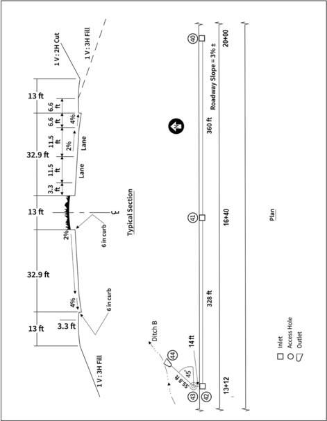

## Step 1. Plan the design sequencing.

Begin at the inlet (labeled # 40) located at station 20+00. The initial drainage area consists of a 42.7 ft wide roadway section with a length of 656 ft. The top of the drainage basin is located at station 26+56.

## Step 2. Calculate the gutter discharge.

Drainage area = (656) (42.7) / 43,560 = 0.64 ac

Estimate runoff coefficient, time of concentration, and rainfall intensity using the Rational Method (Chapter 4).

Runoff coefficient, C = 0.73

Time of concentration, tc, = 3.1 min (use 5 min minimum)

Rainfall intensity from Intensity-Duration-Frequency (IDF) curve: I = 7.1 in/h

Flow from the Rational Method:

<!-- formula-not-decoded -->

## Step 3. Estimate spread.

Determine spread, T, using equation 5.4:

<!-- formula-not-decoded -->

T is less than the allowable spread.

<!-- formula-not-decoded -->

Note: T is less than allowable spread and d is less than the curb height. Proceed to next step.

## Step 4. Select inlet and compute interception.

Select a P-1-7/8-4 grate measuring 2 ft wide by 3 ft long.

<!-- formula-not-decoded -->

Using equation 7.3 for a uniform gutter:

<!-- formula-not-decoded -->

Using equation 5.3:

<!-- formula-not-decoded -->

Using equation 7.5:

Rf = 1.0

Using equation 7.6:

<!-- formula-not-decoded -->

Using equation 7.9:

<!-- formula-not-decoded -->

<!-- formula-not-decoded -->

## Step 5. Repeat process for next inlets.

Next inlet: Inlet # 41 at station 16+40

Drainage area = (360)(42.7)/43560 = 0.35 ac

Estimate runoff coefficient, time of concentration, and rainfall intensity using the Rational Method (Chapter 4).

Runoff coefficient, C = 0.73

Time of concentration, tc, = 1.7 min (use 5 min minimum)

Rainfall intensity from IDF curve: i = 7.1 in/h

Flow from the Rational Method:

Q = CIA/Ku = (0.73)(7.1)(0.35)/(1) = 1.81 ft 3 /s

Total flow to inlet # 41: Q = 0.93 + 1.81 = 2.74 ft 3 /s

T = 5.6 ft (T &lt; T allowable)

d = (5.6) (0.4) = 0.22 ft (d &lt; curb height)

Select P-1-7/8-4 grate 2 ft wide by 3 ft long.

Qi = 2.05 ft 3 /s

Qb = Q- Qi = 2.74- 2.05 = 0.69 ft 3 /s

## Solution:

For the conditions, the inlet spacing on this continuous grade is limited by the maintenance limitation of 360 ft (110 m). The spread and depth are less than the allowable spread and curb height.

## 7.4.3 Flanking Inlets

Low  (sag)  points  in the gutter profile need  inlets to provide  for drainage.  In  addition,  good engineering  practice  includes  flanking  inlets  (inlets  located  on  one  or  both  sides  of  a  low  point inlet) in a sag area that has no outlet except through the drainage system. Figure 7.19 illustrates the location of flanking inlets to act in relief of a low point inlet if it becomes clogged or to reduce spread at the sag.

Figure 7.19. Location of flanking inlets.

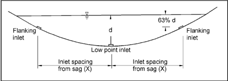

Designers locate and size flanking inlets to receive the design flow when the primary inlet at the bottom of the sag is clogged without exceeding the allowable spread. If the flanking inlets are the same dimension as the primary inlet, they will each intercept one-half the design flow when they are located so that the depth of ponding at the flanking inlets is 63 percent of the depth of ponding at the low point. When flanking inlets differ from the primary inlet, the designer estimates ponding

depths based on inlet performance to determine the capacity of the flanking inlet at the desired depths (AASHTO 2014).

The spacing required for the allowable depth at the curb in a vertical sag curve is:

<!-- formula-not-decoded -->

where:

X =

Maximum distance from bottom of sag to flanking inlet, ft (m)

d =

Depth of water over inlet in bottom of sag, ft (m)

K =

Vertical curve constant, ft/percent (m/percent)

The vertical curve constant is computed from:

<!-- formula-not-decoded -->

where:

L =

Horizontal length of the vertical curve, ft (m)

G1, G2 =

Approach grades, percent

The AASHTO policy on geometrics specifies maximum K values for various design speeds and a maximum 167 ft/percent (50 m/percent) considering drainage (AASHTO 2018).  [See 23 CFR 625.3(b) and 625.4(a)].

## Example 7.10:

Flanking inlet spacing.

Objective:

Determine the location of flanking inlets to function in relief of the inlet at the low point.

Given: A sag vertical curve at an underpass on a 4-lane divided highway. The allowable spread criterion is to stay within the shoulder width of 9.84 ft (3.0 m).

G1 =

-2.5 percent

G2 = +2.5 percent

L =

500 ft (150 m)

Sx =

0.02 ft/ft (m/m)

## Step 1. Find the vertical curve constant, K.

K = L / (G2 - G1) = 500 / (2.5 - (-2.5 )) = 100 ft/percent

## Step 2. Determine depth at curb for design spread.

d = Sx T = (0.02) (9.84) = 0.2 ft

## Step 3.  Determine the flanking inlet locations.

X = (74 d K) 0.5 = ((74) (0.2)(100)) 0.5 = 38.5 ft

Solution:

Flanker inlets located within 38.5 ft (11.7 m) from the sag meet the design spread criterion.

## 7.4.4 Spread in a Sag Curve

The information in Section 7.3 and Section 7.4.3 describes the interception capacity of inlets in sag locations. As the low point approaches, the longitudinal slope decreases increasing spread for any given flow. Except where inlets become clogged, spread on these low approaches to the low point tends to become the critical drainage design criteria rather than the interception capacity of the sag inlet. AASHTO (2018 ) recommends that a gradient of 0.3 percent be maintained within 50 ft of the level point to provide adequate drainage. Inlet locations may be adjusted to avoid excessive spread in the sag curve.

gradient

In  addition,  inlets  may  be  appropriate  between  the  flanking  inlets  and  the  ends  of  the  vertical curves. For major sag points, flanking inlets are added as a safety factor, and are not the primary means of intercepting  flow.  Designers  include  them  to  assist  he  sag  point  inlet  in  the  event  of clogging .

## 7.5 Median and Embankment Inlets

Removal  of  stormwater  at  locations  other  than  the  main  road  surface,  but  within  the  roadway corridor,  drives  the  need  for  inlets  in  roadway  medians  and  to  protect  roadway  embankments. Design  for these environments  uses  principles discussed earlier in this chapter as well additional considerations.

## 7.5.1 Median and Roadside Ditch Inlets

Designers place inlets in medians and roadside ditches to remove water that could cause erosion and in roadside ditches at the intersection of cut and fill slopes to prevent erosion downstream of cut  sections.  In  addition,  designers  provide  median  inlets  to  capture  water  so  that  it  can  be removed from the road corridor without crossing the roadway surface. Pipe culverts under one roadway and cross drainage culverts which are not continuous across the median are also used to redirect flow out of a median ditch.

Designers consider roadside safety when locating median and roadside inlets, pipes, discontinuous cross drainage culverts. Drop inlets flush with the ditch bottom and traffic-safe bar grates  placed  on  the  ends  of  pipes  reduce  hazards  to  errant  vehicles . Figure 7.20 illustrates  a traffic-safe drop inlet in a median ditch like those used for pavement drainage.

Figure 7.20. Median drop inlet with a downstream berm.

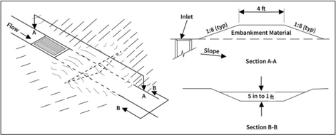

and as

Designers balance drainage requirements, safety, clogging potential, and erosion potential. Where practical,  continuous  cross  drainage  structures  across  the  median  reduce  clogging  and erosion potential compared with non-continuous cross drainage. Because ditches tend to erode at drop inlets, paving around the inlets helps to prevent erosion and may increase the interception capacity of the inlet marginally by acceleration of the flow.

At times, designers use culverts to collect stormwater from medians. These generally need more water depth to intercept median flow than drop inlets. No test results are available on which to base design procedures for estimating the effects of placing grates on culvert inlets, but little effect is expected.

The interception capacity of drop inlets in median ditches on continuous grades depends on the approach depth and velocity, as well as the inlet dimensions and type. Chapter 6 discusses flow in median and roadside ditches and describes Manning's equation for open channels:

<!-- formula-not-decoded -->

| where: Q   | =   | Discharge rate, ft 3 /s (m 3 /s)                       |
|------------|-----|--------------------------------------------------------|
| K u        | =   | Unit conversion constant, 1.49 in CU (1.0 in SI)       |
| n          | =   | Hydraulic resistance variable                          |
| A          | =   | Cross-sectional area of flow, ft 2 (m 2 )              |
| R          | =   | Hydraulic radius (flow area/wetted perimeter), ft, (m) |
| S L        | =   | Bed slope, ft/ft (m/m)                                 |

Interception capacity is based on the ratio of frontal flow to total flow in the median ditch. For a trapezoidal channel, the frontal flow ratio is:

<!-- formula-not-decoded -->

| where:   |    |                                                 |
|----------|----|-------------------------------------------------|
| E o      | =  | Ratio of frontal to total flow                  |
| W        | =  | Inlet width, ft (m)                             |
| B        | =  | Bottom width of the trapezoidal channel, ft (m) |
| d        | =  | Flow depth in the channel, ft (m)               |
| z        | =  | Channel side slope (1:z)                        |

Placement  of  small  berms  down-gradient  of  drop  inlets,  as  shown  in F gure  7.20,  increases interception by impeding bypass flow. If not overtopped, the berm provides for interception of the approach flow. In many cases, the berms are small (less than 6 inches high) and have traffic-safe slopes. Berm height for complete interception on continuous grades or the depth of ponding in sag vertical curves depends on the maximum ponding depth estimated for weir flow in a sag (equation 7.14) or orifice flow in a sag (equation 7.15). In contrast to weir flow at a grate against a curb, the effective perimeter of a grate in an open channel with a berm is 2(L + W) since one side of the grate is not adjacent to a curb and flow is captured from both sides. See Section 7.3.1 for computing ponding depth in a sag.

(7.25)

complete

Inlet interception for median and ditch inlets on grade depends on the capture of frontal and side flow as described in Section  7.2.1 for  grate inlets  at  a  curb.  For  a  ditch  bottom  that  is  approximately equal  to  the  inlet  width,  the  ditch  side  slope  is  used  to  estimate  side  flow  capture.  For  a  ditch bottom wider than the inlet width, the side slope is effectively zero. In this case, a low side slope,

such as 1 percent, is used to estimate side flow capture. Experience indicates that assumptions are conservative.

To avoid overtopping the berm because of the momentum of the water, designers add freeboard to the berm height. The height of freeboard varies with the situation; 0.5 ft is often a good starting point.

Example 7.11:

Median ditch inlet.

Objective:

Find the intercepted and bypassed flows at a 2 ft by 2 ft (0.61 m by 0.91 m) median ditch inlet with a P-1-7/8 parallel bar grate. Determine the berm height needed to provide 100 percent interception.

Given: A median ditch with the following characteristics:

B =

2.0 ft (0.61 m)

n =

0.03

z

= 6

SL =

0.03 ft/ft (0.03 m/m)

Q =

9.9 ft 3 /s (0.28 m 3 /s)

## Step 1. Estimate the channel parameters.

Using equations 6.7, 6.8, and 6.9 for a trapezoidal channel and an initial trial depth of 0.5 ft:

A = Bd + zd 2  = (2.0) (0.5) + (6) (0.5) 2 = 2.50 ft 2

<!-- formula-not-decoded -->

R = A/P = 2.50/8.08 = 0.309 ft

Using equation 7.24:

<!-- formula-not-decoded -->

This flow is close to 9.9 ft 3 /s. No further iterations needed. A depth of 0.5 ft is satisfactory for further computations.

## Step 2. Compute the ratio of frontal to total flow in trapezoidal channel.

Using equation 7.25:

<!-- formula-not-decoded -->

## Step 3. Compute frontal flow efficiency.

V = Q/A = 9.9 / 2.50 = 3.96 ft/s

From Figure 7.8 the splash-over velocity is 8 ft/s, which is greater than the approaching velocity. Therefore, from equation 7.5:

Rf = 1.0

## Step 4. Compute side flow efficiency.

Apply equation 7.6 to solve for Rs. This equation assumes side flow from only one side with the other side being at the curb. Therefore, applying this equation for two sides as in this median ditch is conservative.

<!-- formula-not-decoded -->

<!-- formula-not-decoded -->

both

Note: When the ditch is wider than the inlet, Sx is zero at the edge of the inlet in the bottom of the median ditch. A flat slope, such as Sx = 0.01, can be used in the equation.

## Step 5. Compute total efficiency.

<!-- formula-not-decoded -->

## Step 6.  Compute interception and bypass flow.

<!-- formula-not-decoded -->

<!-- formula-not-decoded -->

## Step 7. Estimate the height of a downstream berm for 100 percent interception.

Assuming the depth results in weir flow, calculate the perimeter, and use equation 7.14:

<!-- formula-not-decoded -->

<!-- formula-not-decoded -->

## Solution:

A P-1-7/8 inlet intercepts about 59 percent of the design flow for the given conditions. To capture 100 percent of the flow, the anticipated ponding depth is 0.55 ft (0.17 m). The berm will be that height plus freeboard to prevent the momentum of flow overtopping the berm.

## 7.5.2 Embankment Inlets

Where  adequate  vegetative  cover  cannot be  established  on  embankment  slopes  to  prevent erosion or  where  flow  running  down  an  embankment  is  concentrated, designers  can  use  inlets with downdrains, swales, or chutes to protect the embankment. Inlets used at embankments and adjacent to bridges differ from other pavement drainage inlets in three respects:

- The  economies  achieved  by  system  design  are  often  not  possible  because  a  series  of inlets is not used.
- A  closed  storm  drainage  system  is  often  not  available  to  receive  the  intercepted  flow; alternatively, it is usually discharged into open chutes or pipe downdrains which terminate at the toe of the fill slope.
- Total  or  near  total  interception  is  sometimes  necessary  to  limit  the  bypass  flow  from running onto a bridge deck.

Figure 7.21 shows a pipe downdrain that confines the flow and cannot cause erosion along the sides.  Pipes  can  be  covered  to  reduce  or  eliminate  interference  with  maintenance  activities  on the fill slopes. Open chutes are often damaged by erosion from water splashing over the sides of the chute due to oscillation in the flow and from spill over the sides at bends in the chute.

High velocity flow discharged from downdrains and chutes may cause erosion when unmitigated. Strategies for minimizing erosion include:

- Extending the discharge point to where erosion would not be problematic.
- Providing well-graded gravel or rock to protect soils.
- Installing an elbow or a 'tee' at the end of the downdrains to redirect the flow.
- Providing  other  types  of  energy  dissipators.  (HEC -14  provides  detailed  information  on energy dissipator design (FHWA 2005)).

Figure 7.21. Embankment inlet and downdrain.

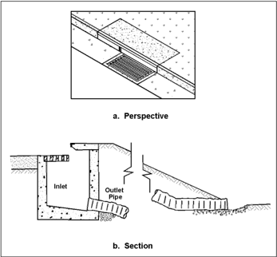

grade.

Section  7.2.1  provides tools and approaches for designing embankment inlets on However, to prevent erosion caused by bypass flow, embankment inlets may necessitate higher or  near  total  interception  efficiencies  than  many  typical  applications  can  achieve.  Grate  inlets intercept little more than the flow conveyed by the gutter width occupied by the grate. Options to increase interception include:

- Combination inlets with the length of curb opening upstream  of the grate (sweeper configuration) sufficient to reduce spread in the gutter to the width of the grate.
- Depressed curb openings.
- Extra width grate inlets with the width based on the design spread.
- Slotted inlets with a length based on the design spread.
