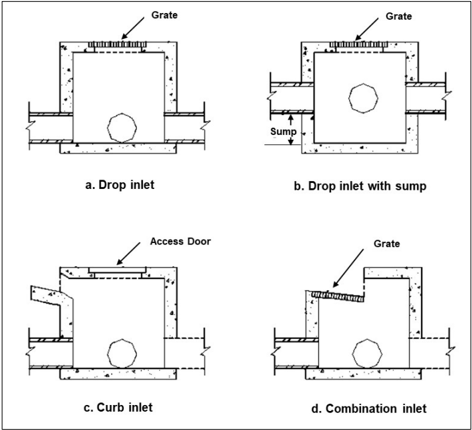
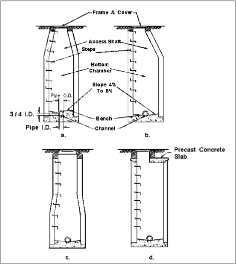
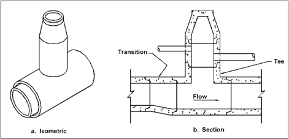
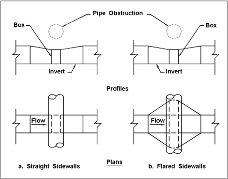
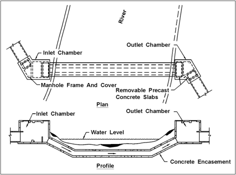

# Chapter 8 - Storm Drain Structures

- Source: hif24006.pdf
- Generated: 2025-12-28T23:40:53+00:00
- Chunk: 8/13
- Estimated tokens: ~4,556
- Total pages: 313
- Type: chapter

## Chapter 8 - Storm Drain Structures

Storm drain structures provide the connections between the ground surface and the storm drain system  and  between  storm  drain  conduits.  These  structures  include  inlets,  access  holes,  and junction chambers. Other miscellaneous storm drain components include transitions, splitters, siphons, and flap gates.

flow drain

Most State DOTs develop their own design standards for commonly used structures resulting in variations  in  the  design  details  of  even  the  simplest  storm  drain  structures.  Recognizing  that design details vary, this chapter describes common  features and functions of storm structures.

## 8.1 Inlet Structures

Inlet  structures,  sometimes  referred  to  as  catch  basins,  allow  surface  water  to  enter  the  storm drainage system. Inlet structures also provide access points for cleaning and inspection.

## 8.1.1 Configuration and Materials

Figure 8.1 illustrates several typical box -shaped inlet structures including a standard drop inlet, inlet  with  a  sump,  curb  inlet,  and  combination  inlet.  Chapter  7  covers  the  hydraulic  design  of surface inlets.

The inlet illustrated in Figure 8.1b captures surface flow in a similar way to a drop inlet but also has a sump that retains sediment and debris transported by stormwater into the storm drainage system.  To  be  effective  and  to  avoid  becoming  an  odor  and  mosquito  nuisance,  inlet  sumps involve  periodic  cleaning.  However,  in  areas  with  site  constraints  that  place  storm  drains  on relatively  flat  slopes,  and  where  the  DOT  follows  a  strict  maintenance  plan,  inlets  can  serve  to collect  sediment  and  debris.  Chapter 11  discusses  storm  drain  inlets  designed  specifically  to remove sediment, oil, and debris.

DOTs most commonly use cast-in-place concrete and pre-cast concrete for inlet construction.

## 8.1.2 Location

Chapter 7 describes inlet spacing based on where they are needed to capture surface flow. Below ground, designers locate inlet structures at the upstream end and at intermediate points along a storm drain line. Designers generally use an iterative process to locate inlet structures to produce an economical and hydraulically effective system.

## 8.2 Access Holes

Access holes provide convenient access to the storm drainage system for inspection maintenance. Access holes also serve as flow junctions and can provide ventilation and pressure relief for storm drainage systems. An access hole provides pressure relief if its access door is not water-tight and allows water to escape to the surface when the hydraulic grade line (HGL) reaches the surface. Designers may select water-tight access doors to prevent escape when warranted.

Access holes do not accept surface flows as inlets do. Where access and surface interception are desirable, designer use inlets rather than access holes.

and water

Figure 8.1. Inlet structures (elevation view).

## 8.2.1 Configuration and Materials

Designers use many configurations but orient the access hole so that workers can safely enter it while facing traffic if traffic  exists.  Access  steps provide a means of convenient access and comply with applicable safety requirements. Using corrosion resistant materials for the steps (e.g., steps coated with neoprene or epoxy, or steps fabricated from rust-resistant material such as stainless steel or aluminum coated with bituminous paint), enhances safety and longevity.

Some access  hole  configurations  do  not  include  steps.  Rather,  maintenance  personnel  supply their  own  ladders  to  avoid  safety  issues  associated  with  rust-damaged  steps  and  to  restrict access.

Typically, the access shaft (cone) provides a minimum  horizontal clear opening of 24 inches. Most access  holes  are  circular  with  the  inside  dimension  of  the  bottom  chamber  being  sufficient  to perform inspection and cleaning operations without difficulty. Bottom chambers typically include a minimum inside diameter of 4 ft with a 5 ft inner diameter access hole being used with larger diameter connecting storm drain pipes.

In some cases, a smaller access shaft aligns concentrically with the bottom chamber.  Figure 8.2a displays a constant diameter bottom chamber up to a conical section a short distance below the top.  In  other  design  configurations,  the  access  shaft  and  bottom  chamber  align  to  provide  a vertical series of steps for easier access. Figure 8.2b illustrates a practice that uses an eccentric cone for the access shaft.

Figure 8.2c shows an option that maintains the bottom chamber diameter to a height sufficient for adequate working space. This design tapers to 3 ft for the access shaft. The frame rests on the broad base of the access shaft. Because of the inward leaning angle of the steps in the access shaft, designers typically limit these configurations to bottom chambers 3 ft in diameter or less.

needs.

Figure 8.2d illustrates a design that minimizes the access shaft height and features a removable flat precast concrete slab that facilitates addressing more extensive maintenance Designers prefer these tangent alignments for access holes with bottom chamber diameters 4 ft or greater.

The size of the bottom chamber limits the size of storm drain conduits that can connect to it. For larger storm drain conduits that are not readily accommodated by typical access hole structure configurations, designers could choose a vertical riser connected to the storm drain pipe with a 'tee' unit as illustrated in Figure 8.3.

The configurations in Figure 8.2 represent variations of channels and benching at the bottom of the access hole. Many access holes do not include benching, which designers refer to as a 'no benching' configuration. Flow channels provide a smooth, continuous path for the flow, reducing turbulence and, therefore, energy losses in the access hole. The bench elevates the bottom of the access hole on either side of the flow channel further increasing the hydraulic efficiency of the access hole. Because of the added cost associated with benching, designers use it when the HGL is  relatively flat  and  there is no appreciable head available. Chapter 9 discusses energy losses and benching in greater detail.

Access  hole  frames  and  covers  provide  adequate  strength  to  support  superimposed  loads, provide a fit between cover and frame, facilitate opening while providing resistance unauthorized  opening  (especially  from  children),  and  prevent  blowouts.  To  differentiate  storm drain access holes from other underground  utility access such as for sanitary  sewers  and communication conduits, good practice includes the words  'STORM DRAIN' or equivalent cast into the top surface of the covers. Blowouts may occur during a flood event when the HGL in the access hole rises above the ground surface with sufficient pressure to move the cover from its normal position  on  the  frame.  To  prevent  blowouts,  designers  can  provide  openings  to  release surcharged flow or secure the cover in the frame with bolts or another type of locking mechanism.

Designers  most  commonly  use  pre-cast  concrete  and  cast-in -place  concrete  when  selecting materials for access  holes. In most  areas, the availability and  competitive cost of pre-cast concrete access holes make them popular. They  may include cast-in-place steps at the desired locations and special transition sections to reduce the diameter of the access hole at the top to accommodate the frame and cover. The transition sections are usually eccentric with one side vertical to accommodate access steps.

to

Figure 8.2. Typical access hole configurations.

Figure 8.3. 'Tee' access hole for large storm drains.

## 8.2.2 Depth, Location, and Spacing

Access hole depth, location, and spacing depend on design criteria related to effectiveness, structural integrity, and maintenance. Chapter 9 (Storm Drain Conduits) describes many of these criteria and how they affect storm drain system design.

hydraulic

The storm drain profile and surface topography contribute to access hole depth. Typically, access hole  depths  range  from  5  to  13  ft.  In  some  circumstances,  for  example,  to  avoid  other  utilities, designers may specify access hole depths outside this range.

Irregular surface topography sometimes results in shallow access holes. When the depth to the invert is only 2 to 3 ft, all maintenance operations can be conducted from the surface. However, because  maintenance  activities  are  not  comfortable  from  the  surface,  even  at  shallow  depths, designers specify the same access hole widths used for bottom chambers of greater depths (4 to 5 ft). To enable a worker to stand in the access hole for maintenance operations, designers will include  a  large  cover  with  a  2.5  to  3.0  ft  opening.  Access  hole  dimensions  typically  conform  to applicable design standards which comply with pertinent safety requirements.

Structurally,  access  holes  withstand  soil  pressure  loads  that  increase  with  depth.  In  addition, access  holes  that  extend  below  the  water  table  withstand  hydrostatic  pressure  and  prevent excessive  seepage.  Since  long  portable  ladders  for  deep  access  holes  would  be  cumbersome and  could  be  dangerous,  designers  provide  access  with  either  steps  or  built-in  ladders  that conform to applicable design standards and safety requirements.

equipment

Access hole location and spacing criteria consider maintenance access and limitations.  Although  these  criteria  vary  from  jurisdiction  to  jurisdiction,  designers  often  place access holes where:

- Two or more storm drains converge.
- Pipe sizes change.
- A change in horizontal alignment occurs.
- A change in vertical alignment occurs.

In addition, designers locate access holes at intermediate points along straight runs of storm drain in  accordance  with  applicable  spacing  criteria. Table 8.1 shows  example  spacing  criteria,  but designers use the criteria from the jurisdiction within which they are working.

Table 8.1. Example access hole spacing criteria (AASHTO 2000).

| Pipe Size (in)   |   Suggested Maximum Spacing (ft) |
|------------------|----------------------------------|
| 12 - 24          |                              300 |
| 27 - 36          |                              400 |
| 42 - 54          |                              500 |
| 60 and up        |                             1000 |

## 8.3 Junction Chambers

A  junction  chamber  is  an  underground  chamber  used  to  join  two  or  more  large  storm  drain conduits. Designers commonly use this type of structure where storm drains are larger than the size that can be accommodated by standard access holes and may be rectangular, circular, or irregular in shape. Unlike access holes, junction chambers do not typically extend to the ground surface  and  can  be  completely  buried.  However,  designers  often  include  riser  structures  to provide  surface  access  or  to  intercept  surface  runoff.  Where  junction  chambers  are  used  as access points for the storm drain system, designers follow the same criteria appropriate for access holes as discussed in Section 8.2.2.

To minimize flow turbulence and, therefore energy losses, in junction chambers, designers can include flow channels and benches in the bottom to guide flow through the chamber. Chapter 9 describes the use of benching and energy loss computations in more detail.

Designers  commonly  use  pre-cast  concrete  and  cast-in -place  concrete  for  junction  chamber construction materials.  Storm  drains  constructed  of  corrugated  metal  may  have  junction  chambers made of the same material.

## 8.4 Other Structural Components

In  addition  to  inlet  structures,  access  holes,  and  junction  chambers,  designers  employ  other structural  components  to  connect  elements  of  a  storm  drain  system  or  to  serve  purposes  not needed in many systems. These include transitions, flow splitters, siphons, and flap gates.

## 8.4.1 Transitions

In  storm  drainage  systems,  transitions  from  one  pipe  size  to  another  typically  occur  in  access holes or junction chambers. Where maintenance access is not needed, designers use transitions to avoid obstructions, to join different pipe sizes, and to join different conduit shapes.  Figure 8.4 illustrates a transition where a rectangular pipe transition is used to avoid an obstruction.  Figure 8.3 illustrates use of a transition upstream of tee type access holes.

Because  abrupt  transitions  increase  turbulence  and  energy  loss,  designers  provide  smooth, gradual  transitions  to  minimize  head  losses  whenever  feasible.  For  example,  when  the  flow velocity is less than 20 ft/s, designers typically use a 5:1 to 10:1 transition ratio for both expansion and contraction in the straight wall configuration shown in  Figure 8.4a. For higher velocities, more gradual transition ratios of 10:1 to 20:1 reduce energy losses further.

Figure 8.4. Transitions to avoid obstruction.

## 8.4.2 Flow Splitters

A flow splitter divides flow in an incoming storm drain conduit into two or more outgoing conduits for  applications  where  high  flows  are  diverted  away  from  locations  with  limited  capacity,  e.g., water quality devices. As with other structures, designers consider how to minimize unavoidable energy loss at the point of flow division and within the structure. Deflectors can guide flow through the structure and reduce energy losses. Where possible, designers avoid regions of flow velocity reduction that can cause deposition of material suspended in the stormwater flow.

the

Designers also seek to avoid capturing debris within the structure. If one of the outgoing conduits is smaller than the incoming conduit carrying debris, the debris can be captured  by the outgoing conduit. Because of sediment deposition and debris capture, flow splitters can maintenance intensive. Although flow splitters can be designed without maintenance access like junction chambers, designers generally provide for maintenance access.

## 8.4.3 Inverted Siphons

An inverted siphon or depressed pipe carries flow under an obstruction such as a utility conduit, stream, or depressed  highway  minimizing  the  energy  loss. Figure  8.5  depicts a twin-barrel inverted  siphon  carrying  flow  under  a  river.  Inverted  siphons  can  consist  of  single  or  multiple become

barrels; however, the American Association of State Highway and Transportation Officials (AASHTO)suggests a minimum of two barrels (AASHTO 2014). Multiple barrels allow one barrel to operate for lower flows with additional barrels becoming active with higher flows. Regardless of the number of barrels, the lowered section of the inverted siphon does not drain by gravity when the flow stops, and the designer may wish to consider means for draining this section after each storm.

Designers can avoid sediment deposits in the lowered section by designing for sufficiently high velocities  over  a  range  of  flows  to  flush  any  deposits.  Designers  can  also  facilitate  flushing  of sediment deposits by limiting the slope of the rising portion of the lowered section to a maximum of 15  percent  or  jurisdictionally specified  value. Designers  may  include  a  sump  in  the  inlet chamber to collect sediment prior to entering the siphon.

To minimize energy losses, debris capture, and sedimentation, designers avoid sharp bends and maintain  a  constant  conduit  section  throughout  the  lowered  section.  Because  inverted  siphons are generally not maintenance free, designers plan for cleaning and maintenance.

Figure 8.5. Twin-barrel inverted siphon.

## 8.4.4 Flap Gates

Designers use flap gates to prevent back-flooding of a drainage system outlet in the presence of high tides or high stages in receiving waters. During rainstorms, properly functioning flap gates open in response to the hydrostatic pressure from the stormwater in the conduit discharge to the receiving waters. With high receiving water levels, the hydrostatic pressure from the receiving water keeps the flap gate in a closed position for the purpose of preventing water allowing

gate, from  entering  the  storm  drain  system.  When  rainstorms  and  high  receiving  water  levels  occur simultaneously, the dominant hydrostatic force, combined  with the weight of the flap determines whether the flap gate opens or closes. To avoid storm drain backups, the designer considers the probability and consequences of the situation where the receiving water hydrostatic force dominates and restricts discharge during a rainstorm.

Sediment, organic materials, and trash can impair the functioning of outlet conduits with flap gates by  reducing  the  conveyance  of  the  conduit.  The  reduction  of  flow  velocity  behind  a  closed  or partially  open  flap  gate  may  also  cause  sediment  deposition  in the  storm  drain  near  the  outlet. Organic  materials  and  trash  from  the  storm  drain  system  or  the  receiving  waters  can  collect between the flap and seat preventing full closure of the flap gate. In addition, where a flap gate is mounted on a pipe projecting  into  a  stream,  the  designer  considers  how  to  protect  the  conduit and  flap  gate  from  damage  by  woody  material  or  ice  during  high  flows.  Flap  gate  installations depend on regular inspection and removal of accumulated sediment, organic materials, and trash to serve their intended function.

## Page Intentionally Left Blank
