# Chapter 9 - Storm Drain Conduits

- Source: hif24006.pdf
- Generated: 2025-12-28T23:40:53+00:00
- Chunk: 9/13
- Estimated tokens: ~22,821
- Total pages: 313
- Type: chapter

## Chapter 9 - Storm Drain Conduits

Within  the  highway  drainage  system,  a  storm  drain  receives  surface  water  through  inlets  and conveys  the  water  through  conduits  to  an  outfall.  Its  components  include  different  lengths  and sizes of pipe or conduit connected by appurtenant structures. Designers term a section of conduit connecting one inlet or appurtenant structure to another a 'segment' or 'run.' Typically, designers use  circular  pipe  for  storm  drain  conduits,  but  they  also  use  a  box  or  other  enclosed  conduit shapes. Appurtenant structures include inlet structures (excluding the actual inlet opening), access holes, junction chambers, and other miscellaneous structures. Chapter 8  presents generalized design considerations for these structures. This  chapter includes information on the computation of energy losses through these structures.

## 9.1 Hydraulics of Storm Drainage Systems

The  design  of  storm  drainage  systems  depends  on  an  understanding  of  the  basic  concepts  of hydrology and fluid flow. Chapter 4 discussed hydrologic concepts. Important hydraulic principles include  open  channel  and  pressure  flow,  classification  of  open  channel  flow,  conservation  of mass,  conservation  of  momentum,  and  conservation  of  energy.  Chapter  6  introduced  some  of these  elements.  Many  textbooks  and  references,  including  HDS -4  (FHWA  2008)  and  Chow (1959), also discuss these topics. The following sections assume that the designer has a basic understanding of these topics.

## 9.1.1 Flow Type Assumptions

The  design  procedures  presented  here  assume  each  storm  drain  segment  has  a steady and uniform flow. Steady means that the discharge does not change with time; uniform means that flow depth in each segment does not change with distance along the conduit. Because of  these assumptions, and since storm drain conduits have regular, prismatic shapes, designers consider the average velocity throughout a segment to be constant.

In actual storm drainage systems under operating conditions, the flow at each inlet varies in time, so  actual  flow  conditions  are  not  truly  steady  or  uniform.  However,  since  the  usual  hydrologic methods for storm drain design estimate the peak flow  at  the  beginning  of  each  run,  using  the steady uniform flow assumption represents a 'conservative' design practice.

## 9.1.2 Open Channel and Pressure Flow

Two  primary  philosophies  exist  for  the  design  of  storm  drains  under  the  steady  uniform  flow assumption. Designers refer to the first as 'open channel' design because the pipes flow partially full. To maintain open channel flow, designers size the segment to maintain a free water surface within the conduit. The pressure above the surface remains at atmospheric pressure. For open channel  flow,  flow  energy  comes  from  the  flow  velocity  (kinetic  energy),  depth  (pressure),  and elevation (potential energy). To maintain the water surface throughout the conduit at atmospheric pressure, the designer keeps flow depth at less than the height of the conduit.

Pressure flow design, the other major method, assumes that the flow in the conduit will be at a pressure greater than atmospheric. Under this condition, no exposed flow surface exists within the  conduit.  In  pressure  flow,  energy  again  comes  from  the  flow  velocity,  depth,  and  elevation. The significant difference here is that the total energy head will be above the top of the conduit and  be  greater  than  the  depth  of  flow  in  the  conduit.  In  this  case,  the  hydraulic  grade  line represents the pressure head level (see Section 9.4 for a discussion of the hydraulic grade line). The designer should remember that the pressure condition is at the design discharge; during the

rising and  falling of discharge,  flow in  the  conduit  will  go  from  zero,  through  open  channel conditions, to pressure flow, then back through open channel conditions. In actual performance, only parts of a system may operate in pressure flow at any given time.

backfill,

For  decades,  highway  agencies  have  considered  the  relative  merits  of  using  open  channel  or pressure flow to control design. For a given flow rate, open channel flow designs involve larger conduit  sizes  than  do  pressure  flow  designs.  While  the  materials  may cost  more  for  storm drainage  systems  based  on  open  channel  flow,  this approach provides  a  margin  of  safety  by adding  capacity  in  the  conduit  to  accommodate  larger  discharges  than  the  design  discharge . Designers often want to include this margin of safety given the inexact nature of runoff estimation methods  and  the technical and financial difficulty of replacing existing storm drains.  When designers add the costs of excavation, trench protection, pipe bedding, trench compaction,  and  other  associated  storm  drain  construction  expenses,  they  typically  find  only minor cost savings from using the smaller conduit allowed by design for pressure flow. The most expensive  decision  designers  make  regarding  storm  drains  is  choosing  to  install them at  all. Having made that decision, designers will wish to maximize associated benefits.

However, some situations may call for pressure flow design. For example, designers may choose to use an existing system that only accommodates the increased flow rates when placed under pressure flow. In such instances, the designer may make a hydraulic and economic analysis of a storm drain using both design methods before final selection.

Most ordinary conditions call for sizing storm drains based on open channel flow at or less than flow full. Designing for full flow is a conservative assumption since the peak flow capacity actually occurs at 93 percent of the full flow depth of a circular  pipe. When using pressure flow, designers will  want  to  ensure  the  joints  can  withstand  the  pressure  to  avoid  exfiltration.  However,  the pressures encountered are usually moderate.

## 9.1.3 Hydraulic Capacity

Storm drain size, shape, slope, and friction resistance control its hydraulic capacity. Several flow friction  formulas describe the  relationship  between  flow  capacity  and  these  parameters.  Engineers most often use Manning's equation for designing storm drains.

Chapter  5 introduced  Manning's  equation  for  computing  the  capacity  for  roadside  and  median channels. For circular storm drains flowing full, Manning's equation becomes:

<!-- formula-not-decoded -->

<!-- formula-not-decoded -->

where:

V =

Mean velocity, ft/s (m/s)

Q =

Rate of flow, ft 3 /s (m 3 /s)

KV =

Unit conversion constant, 0.59 in CU (0.397 in SI)

KQ =

Unit conversion constant, 0.46 in CU (0.312 in SI)

n =

Manning's roughness coefficient

D =

Storm drain diameter, ft (m)

So = Slope of the energy grade line, ft/ft (m/m)

Table 9.1 provides representative values of the Manning' s roughness coefficient for various storm drain materials. Figure 9.1 illustrates storm drain conduit capacity sensitivity to the parameters in

Manning's equation. For example, doubling the diameter of a circular storm drain increases its capacity by a factor of 6.35; doubling the slope increases capacity by a factor of 1.4; but doubling the roughness reduces pipe capacity by 50 percent.

conduit

Figure 9.1. Storm drain capacity sensitivity.

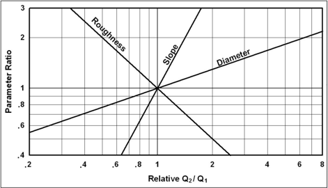

As shown in Figure 9.1, slope and Manning's  roughness  coefficient  represent continuous variables, while storm diameter comes in discrete sizes. For example, circular conduit only comes increments such as 3 inches or 6 inches. To limit  inventory  size,  vendors  typically  stock circular  conduit  on  6-inch  increments  (e.g., 12, 18, 24, and 30 inches) making it readily available, and thus less expensive, sizes  on  3-inch  increments  not  divisible  by 6. For  example,  24-inch  pipe  usually  costs less than 21-inch pipe. While manufacturers often  list  21 -inch  (along  with  15-,  27 -,  and 33-inch), designs rarely use those sizes.

## For circular conduits:

- Peak flow occurs at 93 percent of the height of the circular pipe. Therefore, a design using a circular pipe for full flow will be slightly conservative.
- Velocity in a pipe flowing half-full equals that for full flow.
- Flow velocities for flow depths greater than half-full are greater than velocities at full flow.
- As the depth of flow falls below half-full, the flow velocity drops off rapidly.

## Economies in Pipe Quantities

Pipe sizes   involve  some 'economy of scale.' Often, ordering small quantities of many different pipe sizes costs more than specifying a more frequently used larger pipe size for a project. Within reason,  the  greater  the  total  length  of  a given size pipe on a project, the less that size  will  cost  per  unit  length.  In  addition, larger pipe sizes can provide hydraulic capacity.

drain in

than but

added

Table 9.1 Manning's roughness coefficients for storm drain conduits.

| Type of Culvert                                                                | Roughness or Corrugation           | Manning's n *   |
|--------------------------------------------------------------------------------|------------------------------------|-----------------|
| Concrete Pipe                                                                  | Smooth                             | 0.010-0.011     |
| Concrete Boxes                                                                 | Smooth                             | 0.012-0.015     |
| Spiral Rip Metal Pipe                                                          | Smooth                             | 0.012-0.013     |
| Corrugated Metal Pipe, Pipe-Arch and Box (Manning's n varies with barrel size) | 2-2/3 by 1/2 inch (annular)        | 0.022-0.027     |
| Corrugated Metal Pipe, Pipe-Arch and Box (Manning's n varies with barrel size) | 2-2/3 by 1/2 inch (helical)        | 0.011-0.023     |
| Corrugated Metal Pipe, Pipe-Arch and Box (Manning's n varies with barrel size) | 6 by 1 inch (helical)              | 0.022-0.025     |
| Corrugated Metal Pipe, Pipe-Arch and Box (Manning's n varies with barrel size) | 5 by 1 inch                        | 0.025-0.026     |
| Corrugated Metal Pipe, Pipe-Arch and Box (Manning's n varies with barrel size) | 3 by 1 inch                        | 0.027-0.028     |
| Corrugated Metal Pipe, Pipe-Arch and Box (Manning's n varies with barrel size) | 6 by 2 inch (structural plate)     | 0.033-0.035     |
| Corrugated Metal Pipe, Pipe-Arch and Box (Manning's n varies with barrel size) | 9 by 2-1/2 inch (structural plate) | 0.033-0.037     |
| Corrugated Polyethylene                                                        | Smooth                             | 0.009-0.015     |
| Corrugated Polyethylene                                                        | Corrugated                         | 0.018-0.025     |
| Polyvinyl chloride (PVC)                                                       | Smooth                             | 0.009-0.011     |

*HDS-5 (FHWA 2012a) documents laboratory-derived Manning's n values. Actual field values for culverts may vary depending on the effect of abrasion, corrosion, deflection, and joint conditions.

The shape of a storm drain conduit also influences its capacity. Designers most commonly use circular storm drain conduits; using an alternate shape sometimes increases capacity. Table 9.2 lists the increase in capacity obtained by using alternate conduit shapes with the same height as the  original  circular  shape  but  with  a  different  cross-sectional  area.  Although  these  alternate shapes  generally  cost  more  than  circular  shapes,  specific  project  area  conditions  sometimes warrant their use. For example, limited headroom (vertical clearance) may warrant use of elliptical, pipe-arch, and box shapes. Standard practice orients elliptical and box shapes with the longer dimension horizontal. In case of limited horizontal clearance, orienting elliptical pipe vertically may enhance performance over circular pipe.

Some shapes are not available from suppliers in all locations. Designers may wish to consult industry suppliers in their State before specifying a particular shape to ensure its availability for their project. Commonly, either pipe-arch or elliptical shapes are available, but not both.

Table 9.2. Increase in capacity of alternate shapes based on a circular pipe with the same height.

| Shape       | Area (Percent Increase)   | Conveyance (Percent Increase)   |
|-------------|---------------------------|---------------------------------|
| Circular    | --                        | --                              |
| Oval        | 63                        | 87                              |
| Arch        | 57                        | 78                              |
| Box (B = D) | 27                        | 27                              |

Example 9.1:

Pipe size alternative and capacity.

Objective:

Estimate the pipe diameter to convey the design flow. Consider use of both concrete and helical corrugated metal pipes. Estimate the full flow capacity of the selected pipes.

Given:

Q =

17.6 ft 3 /s (0.50 m 3 /s)

So =

0.015 ft/ft (m/m)

n =

0.013 for concrete, 0.017 for corrugated metal

## Step 1. Estimate the concrete circular pipe diameter.

Using equation 9.2, calculate the reinforced concrete pipe (RCP) diameter.

D = [(Q n)/(KQ So 0.5 )] 0.375 = [(17.6)(0.013) /{(0.46)(0.015) 0.5 }] 0.375  = 1.69 ft (20.3 inches)

Use D = 21-inch diameter standard pipe size.

## Step 2. Estimate helical corrugated metal pipe (CMP) diameter.

Using equation 9.2, calculate the CMP diameter.

<!-- formula-not-decoded -->

Use D = 24-inch diameter standard size. Note that the n value of 0.017 corresponds to the value for a 24-inch CMP, as shown in Table 9.1.

## Step 3. Compute the full flow capacity for the concrete pipe.

<!-- formula-not-decoded -->

V = (KV/n) D 0.67 So 0.5 = (0.59)/(0.013) (1.75) 0.67 (0.015) 0.5 = 8.0 ft/s

## Step 2. Compute the full flow capacity for the helical CMP.

<!-- formula-not-decoded -->

V = (KV/n) D 0.67 So 0.5 = (0.59)/(0.017) (2.0) 0.67 (0.015) 0.5 = 6.8 ft/s

Solution:

The RCP and CMP have design diameters of 21 inches (530 mm) and 24 inches (610 mm), respectively. A rougher surface produces more friction, resulting in a larger diameter. The concrete pipe has a full flow capacity and velocity of 19.3 ft 3 /s (0.55 m 3 /s) and 8.0 ft/s (2.4 m/s). The metal pipe has a full flow capacity and velocity of 21.1 ft 3 /s (0.60 m 3 /s) and 6.8 ft/s (2.1 m/s).

## 9.1.4 Energy Grade Line/Hydraulic Grade Line

The 'energy grade line' (EGL) refers to a conceptual line longitudinally connecting points of total energy  along  a  channel  or  conduit  carrying  water.  Total  energy  includes  elevation  (potential) head,  velocity  head,  and  pressure  head.  Calculating  the  EGL  for  the  full  length  of  the  system represents a critical step in storm drain evaluation. Designers develop the EGL by calculating all losses through the system. The principle of conservation of energy states that the energy head at any cross -section equals that at any other downstream section, plus the losses occurring between.  Designers  typically  describe  the  intervening  losses  as  either  friction  losses  or  form (minor) losses. Understanding and estimating the hydraulic grade line (HGL) elevation depends on knowing the location of the EGL and the velocity at each cross-section.

The HGL in an open channel is the surface level of flowing water at any point along the channel. In closed conduits flowing under pressure, the HGL is a conceptual line like the EGL, but without the velocity component. It describes the level to which water would rise in any connecting system open to the atmosphere (often represented as a vertical tube) at any point along the pipe. When determining  the  acceptability  of  a  proposed  storm  drainage  system,  designers  use  HGL  by establishing the elevation to which water will rise under design conditions.

To determine the elevation of the HGL at any point, subtract the velocity head (V 2 /2g) from the EGL. Energy concepts introduced in Chapter 6 apply to pipe flow as well as open channel flow. Figure 9.2 illustrates the EGLs and HGLs for open channel and pressure flow in pipes.

When water flows through the pipe and a space of air exists between the top of the water and the inside of the pipe, designers consider the flow to be open channel flow, with the HGL at the water surface.  When  the  pipe  flows  full  under  pressure  flow,  the  HGL  will  be  above  the  crown  of  the pipe. When the flow in the pipe just reaches the point where the pipe is flowing full, the energy condition  lies  in  an  unstable  condition  between  open  channel  flow  and  pressure  flow  (with  flo w often oscillating between open channel and pressure conditions) . At this condition, the resistance of the total pipe circumference influences the flow. Under gravity full flow, the HGL coincides with the crown of the pipe.

If the HGL exceeds the top elevation of a storm drain feature such as a junction box, access hole, or inlet, surcharging will occur, and water can flow out of the structure. If not secured, the structure lid can also be displaced, a condition known as a 'blowout.'

Engineers carefully plan designs based on open channel conditions as well, including evaluating the potential for excessive and inadvertent flooding created when a storm event larger than the design storm pressurizes the system. As designers perform hydraulic calculations, they frequently verify  the existence of the desired flow condition. Under  actual operating conditions,  s torm drainage systems may alternate between pressure and open channel flow conditions from one section to another.

Section  9.1.6  presents  m ethods  for  determining  energy  losses  in  a  storm  drain. Section  9.4 presents a suggested detailed procedure for evaluating the EGL and the HGL for storm drainage systems.

Figure 9.2. Hydraulic and energy grade lines in pipe flow.

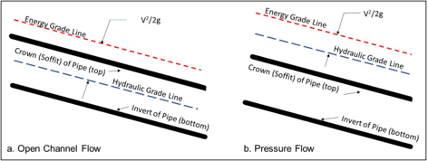

## 9.1.5 Storm Drain Outfalls

All  storm  drains  have  an  outlet  where  flow  from  the  storm  drainage  system  discharges  into  a surface conveyance. The discharge point can be a natural river or stream, an existing stormwater conveyance system, or an existing or proposed channel that conveys stormwater away from the highway. Designers refer to the water surface elevation of the receiving water as the tailwater elevation . Outfall design involves consideration of the flowline or invert (inside bottom) elevation of the proposed storm drain outlet, tailwater elevations, energy dissipation needs, and the outlet structure orientation.

HGL and EGL computations start at the tailwater depth or elevation at the storm drain outfall and proceed upstream. If the tailwater elevation is below the invert elevation of the outlet conduit, the tailwater has no influence on the HGL. If above the invert elevation but below critical depth in the  outfall  pipe,  the  tailwater  also  has  no  influence  on  the  HGL.  Higher  tailwater  elevations, especially those above the crown of the outlet conduit, create backwater conditions the designer considers  in  the  HGL  computations.  In  most  cases,  designers  use  the  greater  of  the  design tailwater elevation or the average of critical depth and the height of the storm drain conduit, (yc + D)/2, as the starting point for HGL evaluation.

If the outfall channel is a river or stream, to adequately determine the elevation of the tailwater in the receiving stream, the designer can  consider the joint or coincidental probability of two hydrologic  events.  Designers  can  evaluate  the  relative  independence  of  the  storm  drainage system discharge by comparing the drainage area of the receiving stream to the area of the storm drainage system. The FHWA's HEC-19 (FHWA 2022b) includes information on the occurrence of coincident flows that are applicable to storm sewers and the receiving streams.

Designers should consider the potential for an excessive tailwater to cause flow to back up the storm  drainage  system  and  out  of  inlets  and  access  holes,  creating  unexpected  and  perhaps hazardous  flooding  conditions.  Flap  gates  placed  at  the  outlet  can  sometimes  alleviate this condition; otherwise, the designer may isolate the storm drain  from the outfall with a pump station (see Chapter 12).

Protection of the storm drain outlet may also depend on energy dissipation . Designers typically use such protection at the outlet to prevent erosion of the outfall bed and banks.  As the HEC-14 (FHWA  2006a) manual for  designing  an  appropriate  dissipator  describes ,  engineers expecting high velocities should provide riprap aprons or energy dissipators.

The orientation  of  the  outfall is another important design consideration. Where  practical, designers  position  the  outlet  of  the  storm  drain  in  the  outfall  channel  to  orient  its  flow  in  a

downstream direction relative to the receiving stream. This will reduce turbulence and potential  for  excessive  erosion.  If  designers  cannot  orient  the  outfall  structure  in  a  downstream direction,  they  will  want  to  consider  the  potential  for  outlet  scour.  For  example,  where  a  storm drain  outfall  discharges  perpendicular  to  the  direction  of  flow  of  the  receiving  channel,  erosion may occur on the opposite channel bank. If erosion potential exists,  designers  may  consider  a channel bank lining of riprap or other suitable material on the bank. Alternatively, they could use an energy dissipator structure at the storm drain outlet.

## 9.1.6 Energy Losses

To compute the HGL and EGL, designers estimate all energy losses in pipe runs and junctions. In addition to the principal energy lost to friction in each conduit run, turbulence causes energy (or head) losses at outlets, inlets, bends, transitions, junctions, and access holes.

## 9.1.6.1 Pipe Friction Losses

Friction or boundary shear loss represents the major loss in a storm drainage system. The head loss due to friction in a pipe is computed as follows:

<!-- formula-not-decoded -->

where:

hf =

Friction loss, ft (m)

Sf =

Friction slope, ft/ft (m/m)

L =

Length of pipe, ft (m)

The friction slope is also the slope of the hydraulic gradient for a particular pipe run. Assuming steady uniform flow (see Section  9.1.1), the friction slope is the same as the pipe slope for partially full flow. Pipe friction loss for full flow in a circular pipe is:

<!-- formula-not-decoded -->

where:

KQ =

Unit conversion constant, 0.46 in CU (0.312 in SI)

## 9.1.6.2 Exit Losses

The exit loss from a storm drain outlet is a function of the change in velocity at the outlet of the pipe. For a sudden expansion such as at an end wall, the exit loss equals:

<!-- formula-not-decoded -->

where:

Vo =

Average outlet velocity

Vd =

Channel velocity downstream of outlet in the direction of the pipe flow

g =

Gravitational acceleration, 32.2 ft/s 2  (9.81 m/s 2 )

the

Note that when Vd = 0, as in a reservoir, the exit loss equals one velocity head. For part full flow where the pipe outlets in a channel with water moving in the same direction as the outlet water, consider the exit loss as virtually zero.

## 9.1.6.3 Bend Losses

Estimate the bend loss coefficient (Hb) for storm drain design (for bends in the pipe run, not in an access hole structure) using the following formula (AASHTO 2014):

<!-- formula-not-decoded -->

where:

∆ = Angle of bend, degrees

## 9.1.6.4 Transition Losses

Figure 9.3 shows an expansion transition. Typically, designers use access holes when pipe size increases; however, in rare cases, expansions without an access hole may be appropriate.

Figure 9.3. Angle of cone for pipe diameter changes.

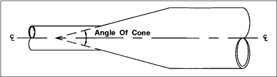

Designers can express energy losses in expansions or contractions in open channel flow in terms of the kinetic energy at the two ends:

<!-- formula-not-decoded -->

where:

Ke =

Expansion coefficient

V1 =

Velocity upstream of transition, ft/s (m/s)

V2 =

Velocity downstream of transition, ft/s (m/s)

g =

Gravitational acceleration, 32.2 ft/s 2  (9.81 m/s 2 )

## Table 9.3 presents typical values of Ke for gradual expansions.

Designers do not use contractions in storm drains because of the potential for clogging and safety hazards  when  transitioning  to  a  smaller  pipe  size.  However,  contractions  have  an  analogous energy loss relationship:

<!-- formula-not-decoded -->

where:

Kc =

Contraction coefficient

V1 =

Velocity upstream of transition, ft/s (m/s)

V2 =

Velocity downstream of transition, ft/s (m/s)

g =

Gravitational acceleration, 32.2 ft/s 2  (9.81 m/s 2 )

Table 9.3. Typical values for Ke for gradual enlargement of pipes in open channel flow.

|          | Angle of Cone   | Angle of Cone   | Angle of Cone   | Angle of Cone   | Angle of Cone   | Angle of Cone   | Angle of Cone   |
|----------|-----------------|-----------------|-----------------|-----------------|-----------------|-----------------|-----------------|
| D 2 /D 1 | 10°             | 20°             | 45°             | 60°             | 90°             | 120°            | 180°            |
| 1.5      | 0.17            | 0.40            | 1.06            | 1.21            | 1.14            | 1.07            | 1.00            |
| 3        | 0.17            | 0.40            | .86             | 1.02            | 1.06            | 1.04            | 1.00            |

## Debris and Clogging

Storm drains invariably transport debris (potentially including litter, vegetative materials, and many other items) off the watershed and into receiving waters. Much of this debris could clog the system, accumulate with other debris, and obstruct the flow of stormwater. Cardboard boxes, branches, and other items with at least one dimension greater than the diameter of the conduits are common.

Although uncommon, persons (particularly children), pets, or livestock can be swept into storm drains. Wild animals often inhabit them during dry periods.

To facilitate passage of debris through the system, and to reduce the risk of trapping people or animals, designers typically ensure the maximum dimension (e.g., diameter) of conduits does not decrease in the downstream direction.

## 9.1.6.5 Junction Losses

Figure 9.4 shows a pipe junction connecting a lateral pipe to a larger trunk pipe without using an access hole structure. Underground  pipe junctions represent  both  potential  debris clogging hazard  points and access  challenges  for  maintenance  staff  in  the  case  of  clogging .  For  these reasons,  designers  use  junction  boxes  with  access as a  preferable  alternative  where  conduits join. The minor loss equation for a pipe junction is a form of the momentum equation as follows:

<!-- formula-not-decoded -->

where:

Hj =

Junction loss, ft (m)

Qo =

Outlet flow, ft 3 /s (m 3 /s)

Qi =

Inlet flow, ft 3 /s (m 3 /s)

Ql =

Lateral flow, ft 3 /s (m 3 /s)

- Vo =

Outlet velocity, ft/s (m/s)

Vi =

Inlet velocity, ft/s (m/s)

Vl =

Lateral velocity, ft/s (m/s)

ho =

Outlet velocity head, ft (m)

hi =

Inlet velocity head, ft (m)

Ao =

Outlet cross-sectional area, ft 2  (m 2 )

Ai =

Inlet cross-sectional area, ft 2 (m 2 )

θj

- = Angle between the inflow trunk pipe and inflow lateral pipe

Figure 9.4. Interior angle definition for pipe junctions.

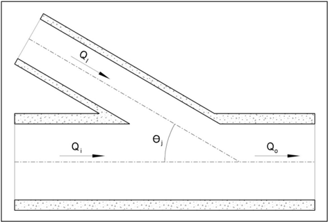

## 9.1.6.6 Approximate Method for Inlet and Access Hole Energy Loss

Estimating inlet and access hole energy losses at the junction between inflow and outflow pipes presents  more  complexity  than  estimating  junction  losses. The Approximate  Method is  the simplest and appropriate only for preliminary design estimates.  The method recognizes that initial layout  of  a  storm  drain  system  begins  at its  upstream  end.  The  designer  estimates  sizes  and establishes  preliminary elevations as the design progresses downstream. The Approximate Method estimates losses across an access hole by multiplying the velocity head of the outflow pipe by a coefficient:

<!-- formula-not-decoded -->

where:

Hah = Head loss across an access hole, ft (m)

Kah

= Head loss coefficient

Vo =

Outlet pipe velocity, ft/s (m/s)

Table 9.4 presents applicable coefficients (Kah) and Figure 9.5 describes the angle of connection for the coefficients. With the estimated head loss, the designer estimates the initial pipe crown drop  across  an  access  hole  (or  inlet)  structure  to  offset  energy  losses  at  the  structure.  The designer then uses the crown drop to establish the appropriate pipe invert elevations.

However,  access  hole  and  inlet  energy  losses  are  more  complex  than  a  simple  proportional relationship to outlet velocity head and interior angle. Therefore, this represents a preliminary estimate only and does not apply to EGL calculations.

Table 9.4. Head loss coefficients.

| Inlet/Access Hole   | Structure Configuration   | K ah       | Source       |
|---------------------|---------------------------|------------|--------------|
| Inlet               | Straight run, square edge | 0.50       | FHWA (2012a) |
| Inlet               | Angled through 90°        | 1.50       | --           |
| Access Hole         | Straight run              | min ~ 0.15 | ASCE (1992)  |
| Access Hole         | 90° angle                 | 1.00       | UDFCD (2001) |
| Access Hole         | 120° angle                | 0.85       | UDFCD (2001) |
| Access Hole         | 135° angle                | 0.75       | UDFCD (2001) |
| Access Hole         | 157.5° angle              | 0.45       | UDFCD (2001) |

Figure 9.5. Interior angle for access holes.

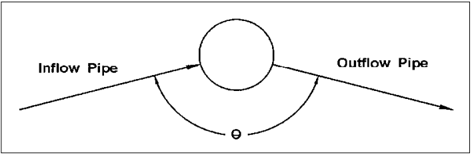

## 9.1.6.7 FHWA Inlet and Access Hole Energy Loss

Other  FHWA  research  has  produced  other  approaches  for  estimating  inlet  and  access  hole energy losses to improve on the Approximate Method (Chang and Kilgore 1989, Chang et al. 1994,  Kilgore  2006,  Kerenyi  et  al.  2006).  These  also  have  limitations,  some  shared  with  the Approximate Method, including:

- Limited  representation  of  very  different  hydraulic  conditions  within  access  holes  when using or developing a single coefficient multiplied by an outlet velocity head.
- Difficulties producing reasonable results on some surcharged systems and systems with supercritical flows leaving the access hole.
- Under-prediction of calculated versus observed access hole flow depths.
- Dependence on relatively complex iterative methods.
- Development of problematic solutions in some situations resulting from limitations in these methods.

To  address  these  issues , the  FHWA  developed  a  more  comprehensive  method  for  estimating losses  in  access  holes  and  inlets.  The  resulting  approach  classifies  access  holes  and  their hydraulic conditions in a manner analogous to inlet control and full flow for culverts (Kilgore 2005, Kilgore 2006, Kerenyi et al. 2006). The method then applies equations in appropriate forms for the given classification. In addition to avoiding the limitations described above, this method has the following benefits:

- Uses hydraulically  sound  fundamentals  for  key  computations  (inlet  control  and  full  flow analogies) as a foundation for extrapolating the method beyond laboratory data.
- Incorporates an approach to handling surcharged systems with the full flow component of the method.
- Avoids problems associated with supercritical flows in outlet pipe by using a culvert inlet control analogy.
- Provides  equivalent  or  better  performance  in  predicting  access  hole  water  depth  and inflow EGL on the extensive FHWA laboratory dataset.
- Presents a direct (non-iterative), simple, and manually verifiable computational procedure.

The method includes three fundamental activities (with terms described in Figure 9.6):

- Determines an initial access hole energy level (E ai) based on inlet control (weir and orifice) or outlet control (partially full and full flow) equations.
- Adjusts  the  initial  access  hole  energy  level  based  on  benching,  inflow  angle(s),  and plunging flows to compute the final calculated energy level (Ea).
- Calculates the exit loss from each inflow pipe and estimating  the energy grade line (EGL o), which will then be used to continue calculations upstream.

Figure 9.6. Access hole energy level definitions.

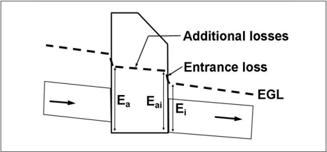

## 9.1.6.7.1 Determining Initial Access Hole Energy Level

Calculate  the  initial  energy  level  in  the  access  hole  structure  (E ai)  as  the  maximum  of  three possible conditions; these determine the hydraulic regime within the structure. The conditions considered for the outlet pipe are:

three

- Outlet control condition: 1) full flow condition-a common occurrence with a surcharged storm  drain  system  or  if  pipe  capacity  limits  flow  in  the  pipe;  and  2)  partially  full  flow condition-considered for an outlet pipe flowing partially full and in subcritical flow.
- Inlet  control  (submerged)  condition:  considered  to  possibly  occur  if  the  opening  in  the access  hole  structure  to  the  outlet  pipe  is  limiting  and  the  resulting  water  depth  in  the access hole is sufficiently high that flow through the opening is treated as an orifice.
- Inlet  control  (unsubmerged) condition: considered to possibly occur if the flow control is also  limited  by  the  opening,  but  the  resulting  water  level  in  the  access  hole  involves treating the opening as a weir.

The  method  addresses  one  of  the  weaknesses  of  other  methodologies:  the  large  reliance  on outflow pipe velocity. The full flow computation uses velocity head, but full flow only applies when the  outflow  pipe  flows  full.  The  two  inlet  control  estimates  depend  only  on  discharge  and  pipe diameter. This improvement recognizes that velocity is not a reliable parameter because:

- In cases where supercritical flow occurs in the outflow pipe, the upstream condition at the access hole, not the velocity head, determines  flow in the outflow pipe and corresponding velocity head.

the

- In the laboratory setting used to derive most coefficients and methods, researchers do not directly measured velocity. They calculate it from depth and the continuity relationship, so. small errors in depth measurement can cause large variations in velocity head.
- Velocities produced in laboratory experiments result from localized hydraulic conditions, which  do  not  necessarily  represent  the  velocities  calculated  based  on  equilibrium  pipe hydraulics in storm drain computations.

Seeking to obtain values for other elements of total outflow pipe energy head (E i), such as outflow pipe  depth  (potential  head)  and  pressure  head,  may  exacerbate  this  issue.  Consider  E i  as  the sum of the potential, pressure, and velocity head components:

<!-- formula-not-decoded -->

where:

Ei =

Outflow pipe energy head, ft (m)

y

=

Outflow pipe depth (potential head), ft (m)

(P / γ ) = Outflow pipe pressure head, ft (m)

(V 2 / 2g) = Outflow pipe velocity head, ft (m)

Solving for equation 9.11 may cause a problem for certain conditions (e.g., where P cannot be assumed  to  equal  atmospheric  pressure).  Designers  can  also  determine  E i  by  subtracting  the outflow  pipe  invert  elevation  (Z i)  from  the  outflow  pipe  energy  grade  line  (EGL i)  (both  known values) at that location:

<!-- formula-not-decoded -->

flow,

Knowing E i  serves as a check on the method. In circumstances with very low computations may result in access hole energy levels less than the outflow pipe energy head. In such cases, the designer sets the access energy level equal to the outflow pipe energy head.

To determine the initial estimate of the access hole energy level, the designer takes the maximum of the three values:

<!-- formula-not-decoded -->

where:

Eaio = Estimated access hole energy level for outlet control (full and partially full flow), ft (m)

Eais

= Estimated access hole energy level for inlet control (submerged), ft (m)

Eaiu = Estimated access hole energy level for inlet control (unsubmerged), ft (m)

In the outlet control condition , the downstream storm drain system limits discharge out of the access hole such that the outflow pipe either flows full or partially full in subcritical flow. The initial structure energy level (Eaio) estimate is:

<!-- formula-not-decoded -->

where:

Hi

= Entrance loss assuming outlet control, calculated using equation 9.16, ft (m)

<!-- formula-not-decoded -->

where:

Ki = Entrance loss coefficient = 0.2 (Kerenyi et al. 2006)

the

As described earlier, using the concept of outflow pipe energy head (E i) and equation 9.13 allows the  designer  to  estimate  energy  level  directly  without  considering  the  water  surface  within  the access hole.  Defining  a  one-dimensional  velocity  head  in  a  location  with  highly  turbulent  multi -directional flow presents a challenge.

Inlet control calculations employ a dimensionless ratio (the discharge intensity) adapted from the analysis  of  culverts.  The  discharge  intensity  (DI)  parameter,  or  the  ratio  of  discharge  to  pipe dimensions, describes the discharge intensity:

<!-- formula-not-decoded -->

where:

A = Area of outflow pipe, ft 2 (m 2 )

Do = Diameter of outflow pipe, ft (m)

The submerged inlet control condition uses  an  orifice  analogy  to  estimate  the  energy  level (Eais). Researchers derived the equation using data with discharge intensities less than or equal to 1.6 resulting in:

<!-- formula-not-decoded -->

Laboratory  analyses  (Kilgore  2005,  Kilgore  2006)  revealed  that unsubmerged inlet  control conditions involve DIs in a 0.0 to 0.5 range (though the equation is not limited to this range). The unsubmerged inlet control condition uses a weir analogy to estimate the energy level (Eaiu):

<!-- formula-not-decoded -->

## 9.1.6.7.2 Adjusting for Benching, Angled Inflow, and Plunging Inflow

Use the initial structure energy level 1 as a basis for estimating additional losses for: 1) discharges entering  the  structure  at  angles  other  than  180  degrees;  2)  benching  configurations;  and  3) plunging  flows  entering  the  structure  at  elevations  above  the  water  depth  in  the  access  hole (treating flows entering a structure from an inlet or elevated incoming pipe as plunging flows).

Use the principle of superposition to estimate the effects of these conditions and apply them to the initial access hole energy level. This additive approach avoids a problem experienced in other methods  where  extreme  values  of energy  losses are obtained when  a  single multiplicative coefficient takes on an extreme value.

The revised access hole energy level (Ea) equals the initial estimate (Eai) modified by each of the three factors covered in this section:

<!-- formula-not-decoded -->

where:

HB = Additional energy loss for benching (floor configuration), ft (m)

Hθ = Additional energy loss for angled inflows other than 180 degrees, ft (m)

HP = Additional energy loss for plunging flows, ft (m)

Ea represents the level of the EGL in the access hole. However, if calculations result in an  Ea less than the outflow pipe energy head (Ei), then set Ea equal to Ei.

Designers may also wish to know the water depth in the access hole (y a).  A  conservative  approach would use Ea as ya for design purposes.

Benching tends to direct flow through the access hole, resulting in a reduction in energy losses. Figure 9.7 illustrates some typical bench configurations. Generally, from Figure 9.7 (a) to (e), the energy losses tend to decrease.

For access hole benching, the additional benching energy loss is:

<!-- formula-not-decoded -->

where:

CB = Energy loss coefficient for benching.

Table  9.5  summarizes  benching  coefficients.  A  negative  value  indicates  water  depth  will  be reduced rather than increased.

Figure 9.7. Access hole benching methods.

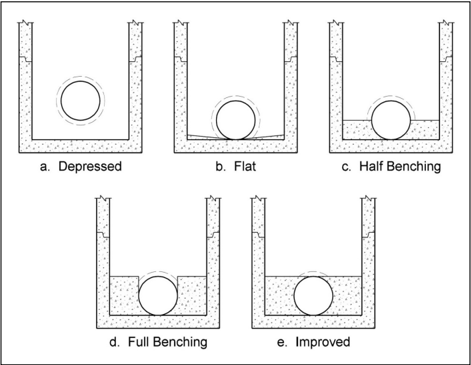

Table 9.5. Values for the coefficient , CB .

| Floor Configuration   |   Bench Submerged * |   Bench Unsubmerged * |
|-----------------------|---------------------|-----------------------|
| Flat (level)          |               -0.05 |                 -0.05 |
| Depressed             |                0    |                  0    |
| Half Benched          |               -0.05 |                 -0.85 |
| Full Benched          |               -0.25 |                 -0.93 |
| Improved              |               -0.6  |                 -0.98 |

Address the effect of skewed inflows entering the structure by considering momentum vectors. To maintain simplicity, the contribution of all inflows contributing to structure and with a hydraulic connection (i.e., not plunging) resolves into a single flow weighted angle ( θ w):

<!-- formula-not-decoded -->

where:

QJ = Contributing flow from inflow pipe, ft 3 /s (m 3 /s)

θJ = Angle measured from the outlet pipe (180 degrees is a straight pipe)

Figure 9.8 illustrates the orientation of the pipe inflow angle measurement. The angle for each of the non-plunging inflow pipes references to the outlet pipe, so that the angle is not greater than 180 degrees. A straight pipe angle is 180 degrees. The summation only includes  non-plunging flows as indicated by the subscript j. If all flows are plunging, set θ w to 180 degrees.

Then, calculate an angled inflow coefficient (C θ ) as follows:

<!-- formula-not-decoded -->

where:

Qo = Flow in outflow pipe, ft 3 /s (m 3 /s)

The angled inflow coefficient approaches zero as θ w approaches 180 degrees and as the relative inflow approaches zero. The additional angle inflow energy loss is:

<!-- formula-not-decoded -->

Plunging inflow describes inflow (pipe or inlet) where the invert of the pipe ( zk) is greater than the estimated structure water depth (approximated by  E ai ). The value of z k  represents the difference between the access hole invert elevation and the inflow pipe invert elevation.

Figure 9.8. Access hole angled inflow definition.

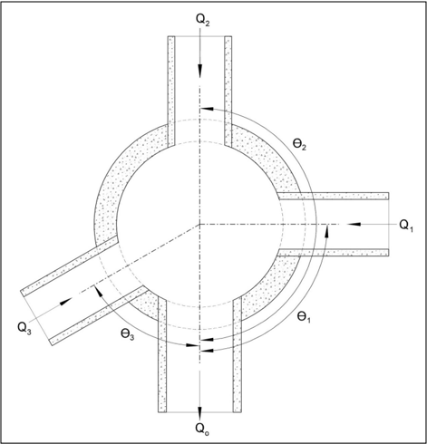

The method determines a relative plunge height ( hk) for a plunging pipe (denoted by the subscript k) as:

<!-- formula-not-decoded -->

This relative plunge height allows determination of the plunging flow coefficient (CP):

<!-- formula-not-decoded -->

As the proportion of plunging flows approaches zero,  CP also approaches zero. Equations 9.24 and 9.25 only apply to conditions where zk &lt; 10Do. If zk &gt; 10Do set it to 10Do.

The additional plunging inflow energy loss is given by:

<!-- formula-not-decoded -->

The method  allows determination of the incremental benching  (H B), inflow angle  (H θ ), and plunging  energy  (H P)  terms.  However,  incremental  losses  can  be  small,  possibly  even  small enough  to  be  'lost  in  the  rounding.'  Alternatively,  compute  H a  by  algebraically  rearranging  the benching, inflow angle, and plunging equations to yield:

<!-- formula-not-decoded -->

Note that the value of Ha should always be positive. If the calculation yields a negative value, the designer sets Ha equal to zero. The revised access hole energy level is:

<!-- formula-not-decoded -->

If the computed estimate of E a is less than the outlet pipe energy (E i), use the higher of the two values for Ea.

Knowing the access hole energy level (E a) and assuming the access hole invert (z a) has the same elevation as the outflow pipe invert (zi) allows determination of the access hole energy grade line (EGLa):

<!-- formula-not-decoded -->

The potentially highly turbulent nature of flow within the access hole makes determination of water depth problematic. However, designers can reasonably use EGL a as a comparison elevation to check for potential surcharging of the system. Research has shown the difficulty of determining velocity head within the access hole, even in controlled laboratory conditions (Kerenyi et al. 2006).

## 9.1.6.7.3 Calculating Inflow Pipe Exit Losses

In  the  final  step,  the  designer  calculates  the  EGL  into  each  inflow  pipe. Non-plunging inflow pipes are  pipes   with  a  hydraulic  connection  to  the  water  in  the  access  hole.  The  designer identifies inflow pipes operating under this condition when the revised access hole energy grade line (Ea) is greater than the inflow pipe invert elevation (Z o). In this case, the inflow pipe energy head equals:

<!-- formula-not-decoded -->

where:

EGLo =

Inflow pipe energy head, ft (m)

Ea =

Revised access hole energy grade line, ft (m)

Ho =

Inflow pipe exit loss, ft (m)

The subscript 'o' is used for the inlet pipe because the equation represents losses at the outlet end of  the  inlet  pipe.  Calculate  exit  loss  in  the  traditional  manner  using  the  inflow  pipe  velocity head since a condition of supercritical flow is not a concern on the inflow pipe. The equation is:

<!-- formula-not-decoded -->

where: Ko =

Exit loss coefficient = 0.4, dimensionless (Kerenyi et al. 2006)

Water  discharging  from plunging inflow pipes freely  falls  into  the  access  hole.  For  plunging pipes, take the inflow pipe energy grade line (EGLo) as the energy grade line calculated from the inflow pipe hydraulics. In this case, EGL o does not depend on access hole water depth and losses. Determining the EGL for the outlet of a pipe has already been described in Section 9.1.5.

For both the non-plunging and plunging cases, use the resulting EGL to continue computations upstream  to  the  next  access  hole.  At  each  access  hole,  repeat  the  three-step  procedure  of estimating: 1) entrance losses from entering the outlet pipe;  2) additional benching, angled inflow, and plunging losses within the access hole, and 3) exit losses leaving the inlet pipe and entering the access hole.

## 9.2 Design Considerations

Design criteria and other design considerations influence design. The following sections discuss several of these considerations, including design and check storm frequency, time concentration  and  discharge  determination,  allowable  high  water  at  inlets  and  access  holes, minimum flow velocities, minimum pipe grades, and alignment.

## 9.2.1 Design Storm Frequency

The storm drain conduit represents one of the most expensive and permanent elements within storm  drainage  systems.  Storm  drains  typically  remain  in  use  longer  than  any  other  system elements. Once installed, DOTs face a high cost to increase capacity or rep air the line. Consequently,  designers  carefully  select  the  design  flood  frequency  for  projected  hydrologic conditions to meet the need of the proposed facility both now and well into the future.

Most State highway agencies consider a 0.1 AEP frequency storm as a minimum for the design of  storm  drains  on  major  highways  in  urban  areas.  Critical  considerations  for  storm  frequency selection  include  traffic  volume,  type  and  use  of  roadway,  speed  limit,  flood  damage  potential, and the needs of the local community. DOTs typically design interstate highways subject to pluvial flooding for  no  less  than  the  0.02  AEP event.  Section  5.1.1  and  Table  5.1  discuss  design frequencies in more detail.

Design of storm drains that drain sag points where runoff can only be removed through the storm drainage system uses a minimum 0.02 AEP frequency storm. Designers size the inlet at the sag point as well as the storm drain pipe leading from the sag point to accommodate this additional runoff. Designers accomplish this by computing the bypass occurring at each inlet during a  0.02 AEP rainfall and accumulating it at the sag point.

To minimize the bypass to the sag point, an alternative approach involves designing the upstream system for a 0.02 AEP  design. Designers evaluate each case on its own merits, assessing the impacts and risk of flooding a sag point.

Following  the  initial  design  of  a  storm  drainage  system,  prudence  recommends  evaluating  the system using a higher check storm. A  0.01  AEP frequency storm is typically recommended for the  check  storm.  Designers  use  the  check  storm  to  evaluate  the  performance  of  the  storm drainage system and determine if the major drainage system is adequate to handle the flooding from a storm of this magnitude.

of

Maximum high water describes the allowable elevation of the water surface (HGL) during the design storm at any given point within a storm drain system including inlets, access holes, or other connections to the ground surface. Before initiating hydraulic evaluation, designers establish the maximum high water at any point to avoid impairment of the intended function of these locations and surface flooding.

## 9.2.2 Time of Concentration and Discharge

Designers most often use the Rational Method to  determine  design  discharges  for storm drain design. As discussed in Section 4.2.2.3,  the  time  of  concentration  strongly influences  the  determination  of  the  design discharge using the Rational Method.

unique

Designers size each inlet and conduit using the drainage area and time of concentration applicable to that location.  Because  each component serves potentially drainage conditions ,  the resulting design flows are not additive moving downstream in a storm drainage system. Because of timing, design flows attenuate.

The time of concentration for each inlet reflects the unique drainage contributing only to that inlet. Typically, this equals the sum  of the times required for water to travel overland to the  pavement gutter and along the length of the gutter between  inlets. Common design practice uses a minimum time of concentration, such as five minutes, when the total travel time to the inlet is less than the minimum.

Similarly, the time of concentration for each

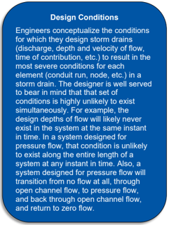

pipe reflects the unique drainage area contributing only to that pipe. Typically, this time consists of two components: 1) the time for overland and gutter flow to reach the first inlet, and 2) the time to flow through the storm drainage system to the upstream end of the pipe.

For each inlet or pipe, the longest time of concentration usually establishes the duration used in selecting the rainfall intensity value for the Rational Method. Designers watch for exceptions to the  general application of  the  Rational  Method when a sub -area (highly  impervious)  of  a  larger area under consideration could dominate the design flow. When this scenario occurs, the designer makes two sets of calculations and uses the larger value for design.

1. Calculate the design flow from the total drainage area with its weighted C value and the intensity associated with the longest time of concentration. This is the general application of the Rational Method.
2. Estimate the time of concentration and associated rainfall intensity for the impervious sub-area alone. Calculate the design flow from the total area using this shorter time of concentration but also reducing the total area to reflect parts of the larger area that cannot reach the design point in the shorter time.

highly

For the second calculation, the designer estimates the portion of the area relevant to the shorter time of concentration using:

<!-- formula-not-decoded -->

where:

Ac =

Part  of  the  larger  primary  area  that  will  contribute  to  the  discharge  during  the time of concentration associated with the smaller, less pervious area, ac (ha)

A =

Area of the larger primary area, ac (ha)

t c1 =

Time of concentration of the smaller, less pervious, area, min

t c2 =

Time of concentration associated with the larger primary area as is used in the first calculation, min

The second calculation uses the weighted C value that results from combining C values of the smaller less pervious tributary area and the area Ac.

## 9.2.3 Minimum Velocity and Grades

Maintaining a self-cleaning velocity in the storm drain system prevents deposition of sediments and  subsequent  loss  of  capacity.  For  this  reason,  designers  typical ly  develop  storm  drains  to maintain  full   flow  pipe  velocities  of  3  ft/s  or  greater.  The  minimum  slope  to  achieve  a  design velocity can be computed from Manning's equation:

<!-- formula-not-decoded -->

where:

Ku =

Unit conversion constant, 2.87 in CU (6.35 in SI)

D =

Diameter, ft (m)

## Conduit Slopes and Velocity

Ideally, the velocity in storm drain conduits will increase slightly with each conduit run, and when flowing as an open channel, flow will be subcritical. Drops in velocity in the downstream direction can result in settlement of sediment and debris both in conduits and in box appurtenances.

High velocities inside the conduits promote impact and abrasion damage from the sand, gravel, cobbles, and debris that invariably make their way into the system. This can shorten the lifespan of the system. The relative cost of conduit of incrementally different sizes is usually not an effective way to save costs.

Since the decision has been made to expend funds to install storm drain, savings on trenching and backfill are minimal when compared to the total cost of the system, and close attention to anticipated hydraulic qualities across the range of operating discharge pays dividends in both lifespan and maintenance effort.

## 9.2.4 Cover, Location, and Alignment

and

Designers consider both minimum maximum cover limits in the design of storm drainage systems. Establishing minimum cover limits ensure the conduits structural stability under live and impact loads. With increasing fill heights, dead load becomes the controlling factor.

For highway applications, designers typically  maintain  minimum  cover  depth  of 3.0 ft where  possible or follow applicable guidelines. Where designs cannot meet this criterion, designers evaluate the storm drains  to  determine  if  they  are  structurally capable of supporting imposed loads.

The Handbook of Steel Drainage and Highway Construction Products (AISI 1983) and the Concrete  Pipe  Design  Manual (ACPA 1978) outline suggested procedures for analyzing loads on buried structures.

Other  materials  (e.g.,  aluminum,  plastics)  have  similar  industry  standard  recommendations in other publications - although recommendations may vary according to the relevant material .

Fill and other dead loads control maximum cover limits. State highway agencies typically provide height of cover tables. These procedures (AISI 1983, ACPA 1978) apply to evaluating special fill or loading conditions.

Most local or state highway agencies maintain standards for storm drain location, typically placing them a short distance behind the curb or in the roadway near the curb. Designers typically prefer to  locate  storm  drains  on  public  property,  although  they  may occasionally place  storm  drains within private property easements. Using private property easements adds cost to a project.

Where possible, designers place storm drains straight between access holes. However, designers may use curved storm drains where necessary to conform to street layout or avoid obstructions. Designers  should  not  develop  curved  storm  drains  in  pipe  sizes  smaller  than  4.0  ft.  For  larger diameter  storm  drains  deflecting  the  joints  to  obtain  the  necessary  curvature  is  not  desirable except  in  very  minor  curvatures.  Many  suppliers  have  long  radius  bends;  this  represents  the preferable  means  of  changing  direction  in  pipes  4.0  ft  in  diameter  and  larger.  The  radius  of curvature specified should coincide with standard curves available for the type of material being used.

and

Vertical alignment of storm drains represents a key feature in the overall design. Elevation at the outfall restricts vertical storm drain alignment. Other governing factors include energy hydraulic  grade  line  management, utilities,  and  other  obstructions.  Gravity flow  utilities  such  as sanitary  sewers  present  the  greatest  challenge,  but  large  water  distribution  lines,  gas  lines, underground  electrical  or  communication  lines,  or  any  other  preexisting utility  may  present  an obstacle. Because utility adjustments are often costly and time-consuming, the storm drain design seeks opportunities to minimize disruption of existing utilities.

## 9.2.5 Maintenance

Design,  construction,  and  maintenance  closely  relate  to  each  other.  Storm  drain  maintenance represents  a  critical  consideration  during  both  design  and  construction.  Common  maintenance

problems  associated  with  storm  drains  include  debris  accumulation,  sedimentation,  erosion, scour, piping, roadway and embankment settlement, and conduit structural damage.

Debris  and  sediment  frequently  accumulate  in  storm  drains,  particularly  during  construction. Designs  for  a  minimum  full  flow  velocity  as  discussed  in  Section 9.2.3 reduce  the  likelihood  of sedimentation. Providing access hole spacing in accordance with the criteria presented in Chapter 8 ensures adequate access for cleaning.

DOTs also frequently report the maintenance issue of scour at storm drain outlets. Riprap aprons or energy dissipators at storm drain outlets can minimize scour.

Following appropriate design and installation specifications avoids piping, roadway embankment settlement, and conduit structural failure.  These problems, when they occur, usually relate to poor construction. Tight specifications along with thorough construction inspections can help reduce these problems.

and

Even in a properly designed and constructed storm drainage system, proper functioning depends on a comprehensive program for storm drain maintenance. Regular inspections detail long-term changes and will indicate appropriate maintenance to ensure safe and continued operation of the system. An appropriate maintenance program includes both periodic inspections supplemental inspections following storm events. Since storm drains exist almost underground, inspection of the system is more difficult than surface facilities. The Culvert Inspection Manual (FHWA 1986) provides information for inspecting storm drains or culverts.

## 9.3 Preliminary Design

Designers create preliminary storm drain plans following a multi -step procedure. This procedure assumes that each conduit will be initially designed to flow full under gravity conditions using the Rational Method. For final design, the design analyzes the HGL and EGL as described in Section 9.4. Designers usually implement these procedures using widely available computational tools.

and entirely

software

## Step 1.   Prepare a working plan for the layout and profile of the storm drain system.

The designer compiles the following initial design information:

- Location of storm drains.
- Flow direction.
- Location of access holes and other structures.
- Number or label assignments to each structure.
- Location of all existing utilities (water, sanitary sewer, gas, underground cables, etc.).

## Step 2.   Determine the hydrologic parameters to each inlet.

Collect the  hydrologic  parameters  for  the  drainage  areas  tributary  to  each  inlet needed  for  the Rational  Method  to  estimate  the  design  discharge  starting  with  the  upstream  most  storm  drain run.

- Run length.
- Incremental drainage area to the inlet at the upstream end of the storm drain run under consideration.
- The runoff coefficient for the drainage area tributary to the inlet at the upstream end of the storm  drain  run  under  consideration.  In  some  cases,  a  composite  runoff  coefficient  will need to be computed.

- Inlet time of concentration.

## Step 3.   Size and locate the pipes.

Using the information from step 3, compute the following for each pipe starting with the upstream most pipe:

- Total  area  draining  to  the  pipe  adding  the  incremental  area  to  the  upstream  areas  that drain to the pipe.
- Cumulative time of concentration to the upstream end of the pipe. System time concentration. For the upstream most storm drain run this value will be the same as the value for the inlet. For all other pipe runs this value is computed comparing the cumul ative (system) time of concentration to the local inlet time of concentration. The cumulative time of concentration is estimated by adding the previous cumulative time of concentration with the  upstream  pipe  travel  time.  (See  Section 9.2.2 for  a  general  discussion  of  times  of concentration.)
- Select  the  larger  of  the  inlet  time  of  concentration  (step  2)  and  the  cumulative  time  of concentration.
- Rainfall  intensity  from  an  intensity-duration-frequency  (IDF) curve  for  the  longer  time  of concentration.
- Design discharge, Q, using the Rational Method.
- Initial pipe slope. The pipe slope will be approximately the slope of the finished roadway. The slope can be modified as needed.

on

- Pipe  size.  Size  the  pipe  using  relationships  presented  in  Section 9.1.3  to  convey  the discharge  by  varying  the  slope  and  pipe  size  as  necessary.  Initially,  designers  size  the storm  drain  so  it  flows  as  close  as  possible  to  full  flow,  or  a  desirable  d/D  ratio,  but  not under pressure. Nominal sizes, usually in 6' increments, will be used. Pipe increments is shown in catalogs, but sizes other than 6' increments ( e.g., 15'  or  21')  is usually more costly than the next larger size 6' increment. The designer decides whether to  go  to  the  next  larger  size  and  have  part  full  flow  or  whether  to  go  to  the  next  smaller size and have pressure flow.
- Full flow capacity for the pipe. Compute the full flow capacity of the selected pipe using equation 9.2.
- Full  and  design  velocity.  Compute  the  full  flow  and  design  flow  velocities  (if  different)  in the conduit. If the pipe is flowing full, the velocities can be determined from V = Q/A. If the pipe is not flowing full, the velocity can be determined from calculations.
- Conduit travel time. Calculate the travel time in the pipe section by dividing the pipe length by the design flow velocity.
- Crown  drop.  Calculate  an  approximate  addition  drop  or  vertical  offset  beyond  the  initial pipe slope at the structure to off-set potential structure energy losses using equation 9.10 introduced in Section 9.1.6.6.
- Invert elevations. Compute the pipe inverts at the upstream and downstream ends of the pipe.

This process results in a preliminary layout of the storm drain system. Section  9.4 describes the methodology for analyzing the system for the HGL and EGL.

of

3'

## 9.4 Hydraulic and Energy Grade Line Evaluation

This section presents a step-by-step procedure for calculation of the EGL and the HGL using the energy loss method. For most storm drainage systems, computer methods are the most efficient means of evaluating the EGL and the HGL. However, it is important that the designer understand the analysis process so that they can better interpret the output from computer generated storm drain designs. Figure 9.9 provides a sketch illustrating use of the two grade lines in developing a storm  drainage  system.  The  following  procedure  can  be  used  as  a  template  to  construct  a spreadsheet to compute the EGL and HGL.

Figure 9.9. Energy and hydraulic grade line illustration.

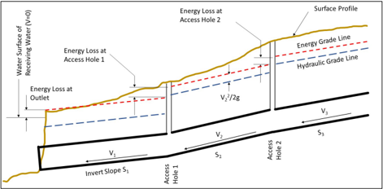

EGL  computations begin at the outfall and are worked upstream taking each junction consideration. Many storm drain systems are designed to function in a subcritical flow regime. In subcritical flow, pipe and access hole losses are summed to determine the upstream EGL levels. If supercritical flow occurs, pipe and access losses are not carried upstream. When a storm drain section  is  identified  as  being  supercritical,  the  designer  advances to  the  next  upstream  pipe section to determine its flow regime. This process continues until the storm drain system returns to  a  subcritical  flow  regime.  The  steps  continue  from  the  preliminary  design  in  Section 9.3 with step 4.

## Step 4.   Determine the tailwater elevation at the storm drain outfall.

The  designer  estimates  the  water  surface  elevation  at  the  discharge  point  of  the  storm  drain system. This may be at a larger body of water such as a pond, lake, or tidally influenced receiving point. In these cases, the receiving water is assumed to have no velocity. The tailwater elevation may also  be  determined  by  a  stream  or  the  critical  depth  in  the  discharge  pipe  if  the  receiving elevation  is  lower  than  the  pipe  invert  elevation. Estimating  the  tailwater  elevation  may  involve coincident flow calculations, tidal condition assumptions, reservoir/detention pond assumptions, or other, unrelated calculations.

into routing

Estimate critical depth in the conduit for the design discharge and calculate the elevation of critical depth at the outfall. If the water surface elevation in the receiving water is below that elevation, critical depth will dominate outfall conditions. If  it is above critical depth, the receiving water will exert some influence on the energy state at the outfall.

From  the  initial  elevation  and  the  corresponding  area  of  flow  and  discharge,  compute  the  total energy at the outfall. The HGL elevation is the initial elevation, the EGL is that, plus the energy head.

## Step 5.   Estimate the HGL and EGL at the downstream end of the next pipe.

Beginning with the outfall pipe, estimate the HGL and EGL at the downstream end of the pipe, but just inside the pipe. The designer determines this from the tailwater elevation, physical pipe characteristics and design flow. This step is repeated for each pipe in the storm drain system. For subsequent pipes the designer uses the energy state in the downstream structure as the tailwater condition.

The designer estimates the EGL  at the downstream end based on one of the conditions comparing the pipe with the downstream EGL shown in Table 9.6. All  cases  apply  for  mildly  sloped pipes.  Cases A and E also apply to steep pipes. For the outfall pipe discharging to a receiving water, the tailwater elevation is substituted for EGLa.

Table 9.6. Case conditions and downstream EGL estimates.

| Case   | Situation                       | EGL o Estimate                                                 |
|--------|---------------------------------|----------------------------------------------------------------|
| A      | EGL a ≥ TOC o (submerged)       | EGL a + exit loss                                              |
| B      | TOC o ≥ EGL a > BOC o +y n      | BOC o + velocity head + exit loss                              |
| C      | BOC o +y n ≥ EGL a > BOC o +y c | BOC o + max(EGL a + exit loss or normal depth + velocity head) |
| D      | BOC o +y c ≥ EGL a > BOC o      | BOC o + normal depth + velocity head                           |
| E      | BOC o ≥ EGL a (plunging pipe)   | BOC o + normal depth + velocity head                           |

## Step 6.   Estimate the HGL and EGL at the upstream end of the outfall pipe.

Compute  the  elevation of the HGL  at  the upstream  end  of the conduit run (next structure upstream).  The  HGL  is  the  depth  of  flow  in  the  conduit  plus  change  in  elevation  of  the  conduit (slope times length).

Table 9.7 summarizes  potential  flow  conditions  within  the  conduit  that  determine  calculation  of the upstream pipe end EGL and HGL. For conditions A, B, and C, the HGL and EGL are computed using pipe friction and minor losses. For condition D, the designer computes the velocity head at normal  depth.  Added  to  the  HGL  elevation,  that  is  the  EGL  elevation  at  the  upper  end  of  the conduit.

Table 9.7. Flow conditions at the upstream end of a conduit.

| Condition   | Situation                                                 | Flow Condition                                            |
|-------------|-----------------------------------------------------------|-----------------------------------------------------------|
| A           | HGL i ≥ TOC i                                             | Full flow (surcharge)                                     |
| B           | TOC i ≥ HGL i > BOC i +y n and TOC i ≥ HGL i > BOC i +y c | Conduit not full but conditions are downstream-controlled |
| C           | BOC i +y n ≥ HGL i > BOC i +y c                           | Subcritical partial flow conditions                       |
| D           | BOC i +y c ≥ HGL i                                        | Supercritical partial flow conditions                     |

## Step 7.   Calculate EGL and HGL in a structure.

the

Most structures include one outlet pipe and one or more inlet pipes, except at the most upstream inlet structures. At each structure, using  the  methods  shown  in  Section  9.1.6, calculate the energy losses through structure.  The  HGL  at  the  structure will  be the HGL at the upstream end of the outflow conduit  (that  was  just  calculated)  and  the losses. The HGL is calculated for the outflow discharge.

the

Consider  each  lateral  or  trunk  line  entering the  structure. The HGL and EGL at structure will be estimated according method in Section 9.1.6.7.

## Step 8.   Repeat steps 5, 6, and 7 for all pipes and structures in the storm drain system.

Continuing  to  work  upstream,  compute  the HGL and EGL at the downstream end of the

next  pipe  (step  5)  and  the  upstream  end  of  each  pipe  based  on  the  HGL  and  EGL  of  the downstream end (step 6). Calculate the HGL and EGL in the next upstream structure (step 7). For a terminal structure, e.g., upstream inlet, no additional computations are needed for that storm drain branch. The designer continues with additional branches, if any.

Both trunk lines and laterals often involve hydraulic drops into a junction as energy controls or to control the depth of trenching. It is desirable to avoid conduit runs that exhibit supercritical flow. Hydraulic jumps inside of conduits are difficult to predict and can result in 'blowouts' or damage to structures. Hydraulic drops are preferable, and do not result in the shortening of travel time and the associated increase in rainfall intensity of high conduit velocities.

## Step 9.   Examine the results.

Compare EGL elevations to topographic elevations. Be sure that the ground surface is above the EGL. Also check that the exterior of the top of conduits is below the pavement structure, adjacent roadside features, and other appurtenances.

The designer now has a complete set of calculations to validate against applicable design criteria. If the designer believes that the system can be improved by changes in conduit diameters, invert elevations, etc., the designer makes the appropriate changes and repeats the process.

| Example 9.2:   | Storm drain design.                                                                                                                                                                                       |
|----------------|-----------------------------------------------------------------------------------------------------------------------------------------------------------------------------------------------------------|
| Objective:     | Determine appropriate pipe sizes and inverts for a storm drain system and evaluate the HGL for the system configuration.                                                                                  |
| Given:         | Table 9.8 summarizes the rainfall data. The pipes are RCP with a Manning's n value of 0.013. Minimum design pipe diameter is 18 inches (460 mm) for maintenance purposes. Minimum cover is 3 ft (0.91 m). |

Table 9.8. Intensity-duration data for example.

| Time (min)       |   5 |   10 |   15 |   20 |   30 |   40 |   50 |   60 |   120 |
|------------------|-----|------|------|------|------|------|------|------|-------|
| Intensity (in/h) | 7.1 |  5.9 |  5.1 |  4.5 |  3.5 |    3 |  2.6 |  2.4 |   1.4 |

## Step 1. Prepare a working plan for the layout and profile of the storm drain system.

Figure  9.10  illustrates  the  proposed  system  layout  including  location  of  storm  drains,  access holes, and other structures. All structures have been numbered for reference.

## Step 2.  Determine the hydrologic parameters for each inlet.

Table  9.9  provides  the  drainage  area  information  to  compute  the  inlet  design  flows.  Use  the Rational Method to compute inlet design flows.

Table 9.9. Drainage area information for example.

|   Structure Number | Structure Type   | Drainage Area (ac)   | Runoff Coefficient   | Time of Concentration (min)   |
|--------------------|------------------|----------------------|----------------------|-------------------------------|
|                 40 | Inlet            | 0.64                 | 0.73                 | 3                             |
|                 41 | Inlet            | 0.35                 | 0.73                 | 2                             |
|                 42 | Inlet            | 0.32                 | 0.73                 | 2                             |
|                 43 | Access hole      | n/a                  | n/a                  | n/a                           |
|                 44 | Outlet           | n/a                  | n/a                  | n/a                           |

## Step 3. Size and locate the pipes.

Figure 9.11 shows the roadway profile grade and ground elevations used as a starting point for the vertical pipe alignment. Size the pipes assuming 100 percent capture by the inlets.

## Step 3a. Size and locate the upstream most pipe (pipe 40-41).

Estimate the design flow for pipe connecting structures 40 and 41. From Table 9.9 for inlet number 40:

A = 0.64 ac

C = 0.73

Inlet time of concentration = 3 min (use minimum time of 5 min)

From Table 9.8:

I = 7.1 in/h

Q = CIA = (0.73)(7.1)(0.64) = 3.3 ft 3 /s

Pipe slope = 0.03 ft/ft (initially calculated from topography).

Estimate pipe diameter assuming full flow using equation 9.2:

D = [(Q n)/(KQ So 0.5 )] 0.375 = [(3.3)(0.013) /{(0.46)(0.03) 0.5 }] 0.375  = 0.8 ft (9.6 inches)

However, minimum pipe diameter is 18 inches. Use 18-inch pipe.

Figure 9.10. Roadway plan and section for example.

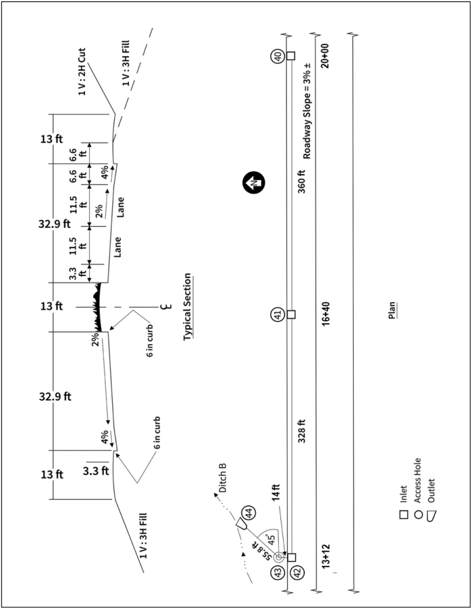

Figure 9.11. Storm drain profiles for example.

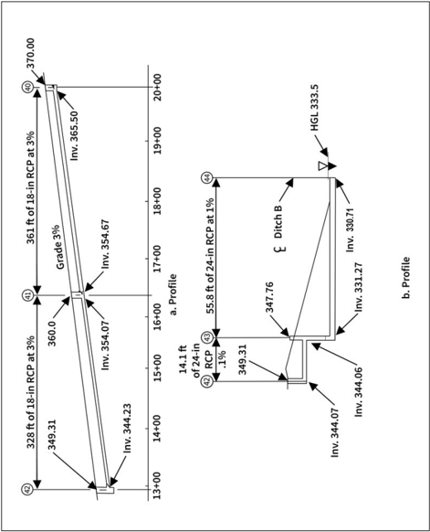

Calculate full pipe capacity using equation 9.2:

<!-- formula-not-decoded -->

Calculate full pipe velocity using equation 9.1:

<!-- formula-not-decoded -->

Calculate the design velocity for a pipe flowing partially full. For this example, use the following approximation (software will calculate Vf from Manning's equation for a partially full circular section):

0.75 Vf if Q is less than or equal to 0.5 Qf

1.1Vf if Q is greater than 0.5 Qf

<!-- formula-not-decoded -->

Calculate the travel time in the pipe to estimate the cumulative time of concentration to downstream pipes:

<!-- formula-not-decoded -->

Since inlet 40 is the most upstream structure no crown drop is needed, therefore, the crown drop is 0 ft.

Calculate the upstream invert elevation:

Zu/s = ground elevation - minimum cover pipe diameter = 370.0 - 3.0 - 1.5 = 365.5 ft

Calculate the downstream invert elevation:

<!-- formula-not-decoded -->

Validate that pipe has adequate cover at the downstream end:

From Figure 9.11, the ground elevation is 360.0 ft.

Invert elevation + minimum cover + pipe diameter = 354.67 + 3.0 + 1.5 = 359.17 ft; less than ground elevation - OK

## Step 3b. Size and locate the next pipe (pipe 41-42).

Estimate the design flow for pipe connecting structures 41 and 42 considering all upstream contributing areas. From Table 9.9:

A = 0.64 + 0.35 = 0.99 ac

C = 0.73

Inlet time of concentration = 2 min

System time of concentration = 3 + 1 = 4 min (use minimum time of 5 min)

From Table 9.8:

I = 7.1 in/h

<!-- formula-not-decoded -->

D = Dmin = 1.5 ft

## Pipe Wall Thickness and Cover

Designers select pipe invert elevations to be no higher than the ground elevation less the sum of the minimum cover, pipe wall thickness, and pipe diameter. This example assumes that the pipe wall thickness is implicitly included in the minimum cover. For jurisdictions where this is not the case, the wall thickness is explicitly added to the invert elevation computation.

V = 8.7 ft/s

Travel time = 0.6 min, use 1 min

Estimate crown drop using equation 9.10, loss coefficient from Table 9.4 equal to 0.5 for an inlet - straight run:

<!-- formula-not-decoded -->

Calculate the upstream invert:

<!-- formula-not-decoded -->

Calculate the downstream invert:

<!-- formula-not-decoded -->

## Step 3c. Size and locate the next pipe (pipe 42 - 43).

Estimate the design flow for pipe connecting structures 42 and 43 considering all upstream contributing areas. From Table 9.9:

<!-- formula-not-decoded -->

C = 0.73

Inlet time of concentration = 2 min

System time of concentration = 3 + 1 + 1 = 5 min (use minimum time of 5 min)

From Table 9.8:

I = 7.1 in/h

<!-- formula-not-decoded -->

D = 1.96 ft = use 2.0 ft

V = 2.6 ft/s

Travel time = 0.09 min, use 0 min

Estimate crown drop using equation 9.10, loss coefficient from Table 9.4 equal to 1.5 for inlet 90° angle:

<!-- formula-not-decoded -->

Calculate the upstream invert:

<!-- formula-not-decoded -->

Calculate the downstream invert:

<!-- formula-not-decoded -->

## Step 3d. Size and locate the next pipe (pipe 43-44).

Q = 6.75 ft 3 /s (no additional CA accumulated and no addition to the system time of concentration)

D = 1.27 ft = use 2.0 ft (to prevent possible clogging, do not reduce conduit size)

V = 6.1 ft/s

Travel time = 0.15 min, use 0 min

<!-- formula-not-decoded -->

Since this is the downstream most pipe, set the downstream invert:

Zd/s =330.71 ft (outfall elevation for the pipe)

Calculate the upstream invert:

<!-- formula-not-decoded -->

This invert results in a crown drop = 344.06 - 331.27 = 12.79 ft (which is greater than 0.87 ft)

Figure 9.11 summarizes the preliminary pipe lengths, diameters, and inverts for the example.

## Step 4. Determine the tailwater elevation at the storm drain outfall.

For the EGL and HGL computations, start at the downstream end at the outfall (structure 44). Computations proceed in the upstream direction. From Figure 9.11:

HGLTW = downstream pool water surface elevation = 333.5 ft

EGLTW = 333.5 ft (assume no velocity head in the pool)

## Step 5. Estimate the HGL and EGL at the downstream end of pipe 43-44 (the outfall pipe).

BOCo = 330.71 ft

<!-- formula-not-decoded -->

Determine the applicable case from Table 9.6:

Is the downstream end of the pipe submerged (EGLTW &gt; TOCo)?

333.5 ft &gt; 332.71 ft is true. Pipe is submerged (case A). Use full pipe flow.

Estimate the energy loss exiting the outfall pipe:

<!-- formula-not-decoded -->

<!-- formula-not-decoded -->

Exit loss for an outfall:

<!-- formula-not-decoded -->

<!-- formula-not-decoded -->

<!-- formula-not-decoded -->

## Step 6. Estimate the HGL and EGL at the upstream end of pipe 43-44.

<!-- formula-not-decoded -->

Determine the flow condition at the upstream end of the outflow pipe from Table 9.7:

HGLi (333.55 ft) &gt; TOCi (333.27 ft), therefore, pipe is flowing full (surcharge) (condition A), and losses are carried upstream as computed.

## Step 7. Calculate EGL and HGL at structure 43.

<!-- formula-not-decoded -->

Compute Eaio using equations 9.14 and 9.15:

<!-- formula-not-decoded -->

<!-- formula-not-decoded -->

Discharge intensity for outflow pipe (pipe 43-44):

<!-- formula-not-decoded -->

Compute Eais using equation 9.17:

<!-- formula-not-decoded -->

Compute Eaiu using equation 9.18:

<!-- formula-not-decoded -->

Select maximum (to two decimal places): Eai = 2.36 ft

Compute Ea:

For benching:

CB = -0.05, Eai / D &lt; 1, therefore, assume flat bench, unsubmerged access hole

For angled inflow:

Cθ = 0.0 because the flow is plunging and θw = 180 even though there is a 45-degree bend

For plunging flow:

<!-- formula-not-decoded -->

<!-- formula-not-decoded -->

Cp = (Σ(Qk hk))/Qo = ((6.75)(5.25))/(6.75) = 5.25 (only one inflow)

Check to ensure net energy. Is Eai &gt; Ei ? Since 2.36 &gt; 2.35 OK

<!-- formula-not-decoded -->

Ea = Eai + Ha = 2.36 ft + 0.05 ft = 2.41 ft

<!-- formula-not-decoded -->

Ground elevation = 347.76 ft. Since 347.76 ft &gt; 333.68 ft  HGL is OK

## Step 8. Repeat steps 5, 6, and 7 for all pipes and structures in the storm drain system.

Continue upstream with all pipes entering the structure analyzed in the previous step. In this example, only one pipe enters structure 43. Go to step 5 for this pipe.

## Step 5 (for next pipe). Estimate the HGL and EGL at the downstream end of pipe 42-43.

One pipe enters structure 43 from structure 42 (pipe 42-43):

D = 2.0 ft

Q = 6.75 ft 3 /s

L = 14.1 ft

BOCo = 344.06 ft

<!-- formula-not-decoded -->

Determine the applicable case from Table 9.6:

Is the downstream end of the pipe submerged (EGLa &gt; TOCo)?

EGLa (333.68 ft) &gt; TOCo (346.06 ft) is not true. Pipe outlet is not submerged (case A).

Is the pipe plunging (EGLa &lt; BOCo)?

EGLa (333.68 ft) &lt; BOCo (344.06 ft) is true. Pipe is not plunging (case E)

V = 2.6 ft/s (part full flow)

<!-- formula-not-decoded -->

<!-- formula-not-decoded -->

V 2 /2g = (2.6) 2 /(2)(32.2)= 0.10 ft yc = 0.80 ft

Ho = 0.0

<!-- formula-not-decoded -->

<!-- formula-not-decoded -->

## Step 6. Estimate the HGL and EGL at the upstream end of pipe 42-43.

BOCi = 344.07 ft

<!-- formula-not-decoded -->

Pipe not full, so Sf = pipe slope. However, recall that the D/S conduit invert was dropped 2-3 inches, changing the original design slope.

<!-- formula-not-decoded -->

<!-- formula-not-decoded -->

No other losses in conduit: Hb, Hc, He, Hj = 0

Total pipe loss = 0.01 ft

<!-- formula-not-decoded -->

<!-- formula-not-decoded -->

<!-- formula-not-decoded -->

Determine the flow condition at the upstream end of the outflow pipe from Table 9.7:

HGLi (345.63 ft) &lt; TOCi (346.07 ft), therefore not full flow (surcharged) (condition A).

yn = 1.56 ft yc = 0.8 ft

BOCi +yn (344.07+1.56 = 345.63 ft) ≥ HGLi (345.63 ft) &gt; BOCi +yc (344.07+0.8 = 344.87 ft), therefore subcritical partial flow conditions (condition C). Therefore, losses are carried upstream as computed.

## Step 7. Calculate EGL and HGL at structure 42.

<!-- formula-not-decoded -->

Compute Eaio using equations 9.14 and 9.15:

<!-- formula-not-decoded -->

<!-- formula-not-decoded -->

Discharge intensity for the outflow pipe (pipe 42-43):

<!-- formula-not-decoded -->

Compute Eais using equation 9.17:

<!-- formula-not-decoded -->

Compute Eaiu using equation 9.18:

<!-- formula-not-decoded -->

Select maximum (to two decimal places): Eai = 1.68 ft

CB = -0.05, Eai / D &lt; 1, so assume flat bench, unsubmerged access hole

<!-- formula-not-decoded -->

Plunging flow:

<!-- formula-not-decoded -->

<!-- formula-not-decoded -->

<!-- formula-not-decoded -->

Check to ensure net energy:

Eai &gt; Ei ? 1.68 ft &gt; 1.66 ft therefore, OK

<!-- formula-not-decoded -->

<!-- formula-not-decoded -->

<!-- formula-not-decoded -->

Surf. Elev. = 349.31 ft, 349.31 ft &gt; 345.82 ft, therefore, surface elev. exceeds HGL. OK

## Step 8. Repeat steps 5, 6, and 7 for all pipes and structures in the storm drain system.

Continue upstream with all pipes entering the structure analyzed in the previous step. In this example, only one pipe enters structure 42. Go to step 5 for this pipe.

## Step 5 (for next pipe). Estimate the HGL and EGL at the downstream end of pipe 41-42.

D = 1.5 ft

Q = 5.1 ft 3 /s

L = 328 ft

BOCo = 344.23 ft

<!-- formula-not-decoded -->

Determine the applicable case from Table 9.6:

Is the downstream end of the pipe submerged (EGLa &gt; TOCo)?

EGLa (345.81 ft) &gt; TOCo (345.73 ft) is true. Pipe outlet is submerged (case A).

With submerged outlet: V = Q/A = 5.1/[( π /4)(1.5) 2 ] = 2.9 ft/s

<!-- formula-not-decoded -->

<!-- formula-not-decoded -->

<!-- formula-not-decoded -->

<!-- formula-not-decoded -->

## Step 6. Estimate the HGL and EGL at the upstream end of pipe 41-42.

BOCi = 354.07 ft

<!-- formula-not-decoded -->

<!-- formula-not-decoded -->

<!-- formula-not-decoded -->

No other conduit losses: Hb, Hc, He, Hj = 0.0

Total pipe loss = 0.78 ft

<!-- formula-not-decoded -->

<!-- formula-not-decoded -->

Determine the flow condition at the upstream end of the outflow pipe from Table 9.7:

HGLi (346.51 ft) &lt; TOCi (355.57 ft), therefore, pipe is not flowing full (surcharge) (condition A).

Estimate yn and yc:

Q/Qf = 5.1 / 18.1 = 0.28

V/Vf = 0.86

V = (0.86)(10.3) = 8.86 ft/s yn / D = 0.37

yn = (0.37) (1.5) = 0.56 ft

V 2 /2g = (8.86) 2 /(2)(32.2) = 1.22 ft yc = 0.87 ft

BOCi +yc (354.07 + 0.87 = 354.94 ft) ≥ HGLi (346.51 ft), therefore, supercritical partial flow conditions (condition D). Pipe losses not carried upstream. Recompute HGLi and EGLi.

<!-- formula-not-decoded -->

<!-- formula-not-decoded -->

In this conduit, the flow is in a supercritical regime. Given that the D/S portion of the conduit is nearly submerged by the access hole, there would likely be a hydraulic jump somewhere within the barrel. Important observations are that the energy should not decrease when moving up the conduit and assumptions of full flow could yield erroneous results.

## Step 7. Calculate EGL and HGL at structure 41.

<!-- formula-not-decoded -->

Since condition D was identified in the previous step, Eaio = 0.00 ft

Discharge intensity for the outflow pipe (pipe 41-42):

<!-- formula-not-decoded -->

Compute Eais using equation 9.17:

<!-- formula-not-decoded -->

Compute Eaiu using equation 9.18:

<!-- formula-not-decoded -->

Select maximum (to two decimal places): Eai = 1.33 ft

CB = -0.05, Eai / D &lt; 1, so assume flat bench, unsubmerged access hole

<!-- formula-not-decoded -->

<!-- formula-not-decoded -->

<!-- formula-not-decoded -->

<!-- formula-not-decoded -->

Check to ensure net energy:

Is Eai &gt; Ei ?

1.33 ft &gt; 1.78 ft is not true. Since Eai is less than Ei, use Ei as the net energy.

Ea = Ei = 1.78 ft

<!-- formula-not-decoded -->

Surface elevation (360.0 ft) &gt; EGLa (355.85 ft) therefore HGL OK.

## Step 8. Repeat steps 5, 6, and 7 for all pipes and structures in the storm drain system.

Continue upstream with all pipes entering the structure analyzed in the previous step. In this example, only one pipe enters structure 41. Go to step 5 for this pipe.

## Step 5 (for next pipe). Estimate the HGL and EGL at the downstream end of pipe 40-41.

D = 1.5 ft

Q = 3.3 ft 3 /s

L = 361.0 ft

BOCo = 354.67 ft

<!-- formula-not-decoded -->

Determine the applicable case from Table 9.6:

Is the downstream end of the pipe submerged (EGLa &gt; TOCo)?

355.85 ft &gt; 356.17 ft is not true. Pipe is not submerged (case A).

Is the pipe plunging (EGLa &lt; BOCo)?

355.85 ft &lt; 354.67 ft is not true. Pipe is not plunging (case E).

Need to determine normal and critical depth to make case determination:

Q/Qf = 3.3 / 18.1 = 0.18

V/Vf = 0.74

<!-- formula-not-decoded -->

## Step 6. Estimate the HGL and EGL at the upstream end of pipe 40-41.

BOCi = 365.50 ft

<!-- formula-not-decoded -->

Since yn (0.45 ft) &lt; yc (0.67 ft) pipe flow is supercritical. The flow condition (Table 9.7) is supercritical partial flow (condition D). Pipe energy losses are not carried upstream.

<!-- formula-not-decoded -->

<!-- formula-not-decoded -->

Given that the downstream portion of the conduit is partially submerged by the access hole, there would likely be a hydraulic jump somewhere within the barrel.

## Step 7. Calculate EGL and HGL at structure 40.

Structure 40 is a terminal inlet with no incoming pipe.

<!-- formula-not-decoded -->

Since condition D was identified in the previous step, Eaio = 0.00 ft

Discharge intensity for the outflow pipe (pipe 40-41):

<!-- formula-not-decoded -->

Compute Eais using equation 9.17:

<!-- formula-not-decoded -->

Compute Eaiu using equation 9.18:

<!-- formula-not-decoded -->

Select maximum (to two decimal places): Eai = 1.00 ft

CB = 0.0 (No inflow pipes, benching not a factor)

Cθ = 0.0 (No inflow pipes, angled inflow not a factor)

Plunging flow from the inlet:

zk = 370.0 ft - 365.50 ft = 4.50 ft

<!-- formula-not-decoded -->

<!-- formula-not-decoded -->

Check to ensure net energy:

Is Eai &gt; Ei?

1.00 ft &gt; 1.35 ft, not true. Since Eai is less than Ei, use Ei as the net energy.

Ea = Ei = 1.35 ft

EGLa = Ea + BOCi = 1.35 ft + 365.50 ft = 366.85 ft

Surf. Elev. = 370.0 ft, 370.0 ft &gt; 366.85 ft, therefore, surface elevation exceeds HGL, OK

## Step 8. Repeat steps 5, 6, and 7 for all pipes and structures in the storm drain system.

Continue upstream with all pipes entering the structure analyzed in the previous step. In this example, structure 40 is a terminal structure with no incoming pipes. Go to step 9.

## Step 9. Examine the results.

The designer compares the EGL and HGL elevations with ground elevations and confirms minimum cover satisfied. The designer also confirms that the pipe sizes and inverts are reasonable and considers ways to improve the design.

## Solution:

The example illustrates many of the situations that may occur in designing a storm drain system. Many software tools are available to perform these computations but not all use the full energy loss method illustrated here. The designer may also develop spreadsheets to perform the computations.
