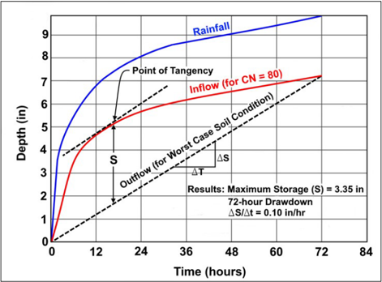
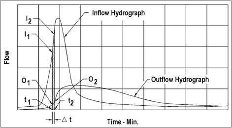
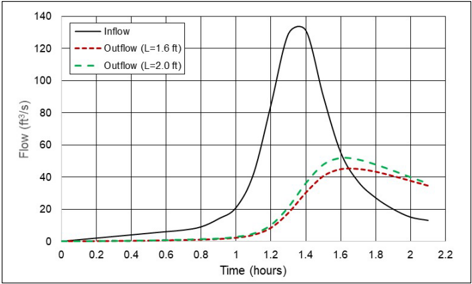
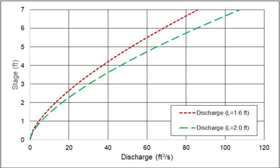

# Chapter 10 - Detention and Retention: 10.4.1 Water Budget Components & 22 more sections

- Source: hif24006.pdf
- Generated: 2025-12-28T23:40:53+00:00
- Chunk: 11/13
- Estimated tokens: ~5,320
- Total pages: 313
- Type: sections

## 10.4.1 Water Budget Components

Designers can compute average annual runoff using a weighted runoff coefficient for the tributary drainage area multiplied by the average annual rainfall volume. Base infiltration and exfiltration on site- specific soils testing data. Approximate evaporation using the mean monthly evaporation or free water surface evaporation data for the area of interest.

runoff, pan

Analyzing infiltration involves knowledge of soil permeabilities and hydrogeologic conditions in the vicinity of the basin. Although county soils reports often publish infiltration rates, designers may secure field measurements when site-specific estimates  for these parameters are important for the water budget. This is particularly important in karst areas where the hydrogeologic phenomenon controlling infiltration rates may be complex.

HDS-2 (FHWA 2002) provides a detailed discussion on water budgets, specifically as they relate to wetland applications for roadway projects.

| Example 10.13: Water budget of a retention pond.                                                                     | Example 10.13: Water budget of a retention pond.                                                                                                                                                                                                                                                      |
|----------------------------------------------------------------------------------------------------------------------|-------------------------------------------------------------------------------------------------------------------------------------------------------------------------------------------------------------------------------------------------------------------------------------------------------|
| Objective:                                                                                                           | For average annual conditions, determine if the facility will function as a wet pond with a permanent pool.                                                                                                                                                                                           |
| Given:                                                                                                               | A shallow basin with characteristics including average surface area (A s ), bottom area (A B ), watershed area (A), post-development runoff coefficient (C D ), average infiltration rate for soils (F a ), average annual rainfall from rainfall records (P a ), and mean annual evaporation (E a ). |
| A s A B A C D F a P a E a                                                                                            | = 3 ac (1.21 ha) = 2 ac (0.81 ha) = 100 ac (40.5 ha) = 0.3 = 0.1 in/h (2.5 mm/h) = 50 inches (127 cm) = 35 inches (89 cm)                                                                                                                                                                             |
| Step 1.Compute average annual runoff.                                                                                | Step 1.Compute average annual runoff.                                                                                                                                                                                                                                                                 |
| Runoff = C Q D A (modification of equation 4.1) Runoff = (0.3) (4.17 ft) (100 ac) (43,560 ft 2 /ac) = 5,445,000 ft 3 | Runoff = C Q D A (modification of equation 4.1) Runoff = (0.3) (4.17 ft) (100 ac) (43,560 ft 2 /ac) = 5,445,000 ft 3                                                                                                                                                                                  |
| Step 2. Estimate the average annual evaporation.                                                                     | Step 2. Estimate the average annual evaporation.                                                                                                                                                                                                                                                      |
| Evaporation = E a A s = (2.92 ft) (3 ac) (43,560 ft 2 /ac) = 381,150 ft 3                                            | Evaporation = E a A s = (2.92 ft) (3 ac) (43,560 ft 2 /ac) = 381,150 ft 3                                                                                                                                                                                                                             |
| Step 3. Estimate the average annual infiltration.                                                                    | Step 3. Estimate the average annual infiltration.                                                                                                                                                                                                                                                     |
| Infiltration                                                                                                         | = (F a ) (time) (A B ) = (0.01 in/h) (24 h/day) (365 days/yr) (2.0 ac) (43,560 ft 2 /ac) = 6,359,760 ft 3                                                                                                                                                                                             |

## Step 4.  Estimate the runoff (or inflow) less evaporation and infiltration losses.

Assuming no basin outflow and no change in storage, the runoff (or inflow) less evaporation and infiltration losses is:

Net Budget = 5,445,000 - 381,150 - 6,359,760 = -1,295,910 ft 3

Since the average annual losses exceed the average annual rainfall, the proposed facility will not function as a wet pond with a permanent pool. If the facility needs to function with a permanent pool, accomplish that by reducing the pool size.

## Step 5.  Revise the pool surface area.

Pool surface and bottom areas equal 2.0 ac and 1.0 ac, respectively.

## Step 6. Recompute the evaporation and infiltration.

Evaporation  = (2.92 inches) (2.0 ac) (43560 ft 2 /ac) = 254,100 ft 3

Infiltration = (0.01) (24) (365) (1.0) (43560/12) = 3,179,880 ft 3

## Step 7. Estimate revised runoff less evaporation and infiltration losses.

Net Budget   = 5,495,000 - 254,100 - 3,179,880 = 2,011,020 ft 3

Solution:

The revised facility appears able to function as a wet pond with a permanent pool. However, these calculations use average precipitation, evaporation, and losses. During years of low rainfall, the pool may not persist.

## 10.4.2 Water Budget for Landlocked Storage

Designers  can  evaluate  watershed  areas  which  drain  to  central  depressions  with  no  positive (gravity-driven) outlet using a mass flow routing procedure to estimate flood elevations. Typical examples include retention basins in karst topography or other areas having high infiltration rates. Although  this  procedure  is  fairly  straightforward,  the  evaluation  of  basin  outflow  is  a  complex hydrologic phenomenon that depends on good field measurements and a thorough understanding of local conditions. Since  outflow rates for flooded conditions are difficult to calculate, measurements are desirable.

field

Figure 10.28 illustrates a mass routing procedure for the analysis of landlocked retention areas. The step-by-step procedure is:

## Step 1.   Obtain cumulative rainfall data for the design storm.

If no local criteria are available, AASHTO (2014) suggests a 0.01 AEP, 10-day storm.

## Step 2.   Calculate the cumulative inflow.

Using the rainfall data from step 1 and an appropriate runoff hydrograph method (see Chapter 4), estimate the cumulative inflow.

## Step 3.   Develop the basin outflow.

From  field  measurements  of  hydraulic  conductivity  or  infiltration,  considering  worst -case  water table  conditions,  estimate  the  basin  outflow.  Establish  hydraulic  conductivity/infiltration  using  in situ  test  methods.  Then,  plot  the  mass  outflow  with  a  slope corresponding  to  the  worst-case outflow.

## Step 4.   Draw tangent line.

Draw  a  line  tangent  to  the  mass  inflow  curve  from  step  2  having  a  slope  parallel  to  the  mass outflow line from step 3.

## Step 5.   Locate the point of tangency.

Locate the point of tangency between the mass inflow curve of step 2 and the tangent line drawn for  step 4. The distance from this point of tangency and the mass outflow line multiplied by the drainage area represents the maximum storage required for the design runoff.

Figure 10.28. Mass routing procedure.

## Step 6.   Determine the flood elevation.

Estimate the flood elevation associated with the maximum storage volume determined in step 5. Use  this  flood  elevation  to  evaluate  flood  protection  requirements  of  the  project.  Establish  the zero-volume elevation as the normal wet season water surface or water table elevation or the pit bottom, whichever is highest.

If runoff from a project area discharges into a drainage system  tributary to the landlocked depression,  the  pre-development  discharge  requirements  for  the  project  may  include  detention storage facilities.

## 10.5  Storage Routing

Most  commonly,  designers  route  the  inflow  hydrograph  through  a  detention  pond  using  the storage-Indication  or  modified  Puls  method.  This  method  derives  from  the  continuity  equation which states that the inflow minus the outflow equals the change in storage. By taking the average of two closely spaced inflows and two closely spaced outflows, the discretized continuity equation is expressed by:

<!-- formula-not-decoded -->

<!-- formula-not-decoded -->

where:

ΔS =

Change in storage, ft 3  (m 3 )

Δt =

Time interval, min

l =

Inflow, ft 3 (m 3 )

O =

Outflow, ft 3 (m 3 )

Subscripts 1 and 2 refer to the beginning and end of the time interval, respectively. Figure 10.29 illustrates  the  routing  process  graphically  with  the  inflow  hydrograph  as  the  input  to  the  routing and  the  outflow  hydrograph  as  the  result  of  the  routing. HDS-2 (FHWA 2002) provides a more detailed description of storage routing.

Figure 10.29. Inflow and routed outflow hydrographs.

## 10.6  Detention Design Procedure

Detention basin design has the hydrologic goals of identifying both the outlet structure characteristics  (discharge  pipe,  weirs,  and  orifices)  and  the  storage  geometry  that  will  limit  the computed post-development peak flow out of the detention basin so that it does not exceed the target  discharge  (commonly  the  peak  flow under  pre-development  conditions).  Both  the  target discharge and the outlet structure characteristics influence the stage-storage-discharge relationship. Because of this interdependence, detention design uses an iterative procedure. The design procedure begins with some assumptions about the outlet structure characteristics. Then the  designer  applies  the  storage  routing  procedure  to  determine  whether  the  design  meets  the target  discharge  requirement.  If  the  routed  discharge  exceeds  the  target  discharge,  then  the designer  adjusts  the  design  to  reduce  the  discharge  until  the  target  is  met.  Conversely,  if  the routed  discharge  is  significantly  below  the  target  discharge,  the  designer  may  also  adjust  the design to reduce the needed storage and potentially reduce the cost of the facility.

## Four inputs support the design:

- Initial conditions. Establish initial conditions, including setting the time interval Δt, the storm time at which computations end, and the initial outflow O1 and storage S1.
- Inflow hydrograph. Compute the design storm inflow hydrograph and the target maximum discharge,  qo,  for  the  design  storm.  The  design storm  inflow  hydrograph  is  usually  the output  from  the  convolution  of  a  rainfall -excess hyetograph and  a  unit  hydrograph,  with the post-development conditions used to compute the rainfall excess. The discharge is usually the peak flow of the pre-development hydrograph. See Chapter 4.

target

- Stage-storage relationship. Obtain topographic information and compute the stagestorage relationship. See Section 10.3.2.
- Stage-discharge relationship. Set the riser characteristics (i.e., number of stages, type of outlet, and values of the discharge coefficients). See Section 10.3.3.

The  designer  routes  the  inflow  hydrograph through  the  current  basin  design  using  the  routing procedure introduced in Section 10.5 based on the initial conditions, stage-storage relationship, and stage-discharge relationship. After routing, the designer compares its peak flow of the outflow hydrograph to the target discharge q o.  If  it  is  greater  than  q o,  then  the  capacity  of  the  assumed outlet configuration is too large. Thus, the designer will decrease the weir lengths or orifice areas. If  the  peak  flow  of  the  outflow  is  less  than  the  target  discharge  q o,  the  assumed outlet configuration meets the target, but may be overdesigned. The designer can increase the weir lengths or orifice areas. Any adjustment to the riser structure involves recomputing the stage-discharge relationship followed  by  rerouting  the  inflow  hydrograph.  When  the  peak  outflow  approximately  equals  the target discharge, the assumed outlet facility is a reasonable design.

The  designer  estimates  required  storage  by  the  largest  value  of  storage  associated  with  the outflow hydrograph. The designer uses the maximum storage as input to the stage-storage curve to estimate the depth of storage. The designer evaluates the computed design for safety and cost.

## Example 10.14: Detention basin design process.

Objective:

Design a detention basin storage and outlet structure.

Given: A watershed described as:

A =

38 acres (15.8 hectares)

AEP = 0.1

## Step 1. Determine the hydrologic goals for the detention basin.

Using an appropriate hydrologic method, the pre-development and post-development peaks are:

qpb = 50 ft 3 /s qpb = 131 ft 3 /s

Development within the watershed increased the 0.1 AEP discharge by 162 percent. The detention basin design goal is to reduce the peak flow from 131 ft³/s to 50 ft³/s.

## Step 2. Establish inflow hydrograph.

Develop an input hydrograph for design. Figure 10.30 displays the inflow hydrograph with a peak of 131 ft 3 /s. Use the ordinates on a 0.1-hour increment for a 2-hour period of the 24-hour storm; discharges for the remainder of the 24-hour storm duration are either zero or very small.

Figure 10.30. Inflow and routed outflow hydrographs for detention basin example.

## Step 3. Develop stage-storage curve.

Compute the stage-storage relationship from topographic information. Table 10.11 shows the estimated surface areas at the site from the topography at an increment of 0.5 ft. Multiply the average area (column 3) and the incremental depth of 0.5 ft to yield the incremental storage (column 4). Accumulate the incremental storage values to compute a cumulative storage at each elevation.

## Step 4. Develop stage-discharge curve.

The designer selects a one-stage riser with a weir. Make an initial estimate of the weir length using the weir equation, with an assumed depth of 4.9 ft and the target outflow discharge of 50 ft 3 /s from step 1:

<!-- formula-not-decoded -->

Use an initial weir length of 1.6 ft. Figure 10.31 summaries the resulting stage-discharge curve.

## Step 5. Perform routing to estimate peak outflow and maximum storage.

Route the inflow hydrograph with the storage-indication method introduced in Section 10.5. Figure 10.30 gives the results when the weir length is 1.6 ft. The peak outflow of 45 ft³/s occurs at approximately 1.6 hours.

From Figure 10.31, a discharge of 45 ft 3 /s occurs when the stage in the pond is approximately 4.5 ft. From Table 10.11, the storage at this stage is approximately 160,000 ft 3 .

Table 10.11. Derivation of stage-storage relationship.

| (1) Depth, h (ft)   | (2) Surface Area, A (ft 2 )   | (3) Average Area (ft 2 )   | (4) Incremental Storage (ft 3 )   | (5) Storage Volume, V s (ft 3 )   |
|---------------------|-------------------------------|----------------------------|-----------------------------------|-----------------------------------|
| 0.00                | 33,500                        | -                          | -                                 | 0                                 |
| -                   | -                             | 33,650                     | 16,825                            | -                                 |
| 0.50                | 33,800                        | -                          | -                                 | 16,825                            |
| -                   | -                             | 34,050                     | 17,025                            | -                                 |
| 1.00                | 34,300                        | -                          | -                                 | 33,850                            |
| -                   | -                             | 34,450                     | 17,225                            | -                                 |
| 1.50                | 34,600                        | -                          | -                                 | 51,075                            |
| -                   | -                             | 34,950                     | 17,475                            | -                                 |
| 2.00                | 35,300                        | -                          | -                                 | 68,550                            |
| -                   | -                             | 35,500                     | 17,750                            | -                                 |
| 2.50                | 35,700                        | -                          | -                                 | 86,300                            |
| -                   | -                             | 35,950                     | 17,975                            | -                                 |
| 3.00                | 36,200                        | -                          | -                                 | 104,275                           |
| -                   | -                             | 36,500                     | 18,250                            | -                                 |
| 3.50                | 36,800                        | -                          | -                                 | 122,525                           |
| -                   | -                             | 37,150                     | 18,575                            | -                                 |
| 4.00                | 37,500                        | -                          | -                                 | 141,100                           |
| -                   | -                             | 37,750                     | 18,875                            | -                                 |
| 4.50                | 38,000                        | -                          | -                                 | 159,975                           |
| -                   | -                             | 38,400                     | 19,200                            | -                                 |
| 5.00                | 38,800                        | -                          | -                                 | 179,175                           |

## Step 6. Confirm compliance with design criteria.

Since the computed peak with L = 1.6 ft is less than the allowable peak (50 ft³/s), reduce the required storage volume by allowing a higher peak flow to leave the basin.

To accomplish this, increase the weir length to 2.0 ft and repeat the computations. Figure 10.31 summarizes the stage-discharge curve for the new weir length. Figure 10.30 shows the routed the inflow hydrograph with a resulting peak flow of 52 ft³/s. This exceeds the allowable peak of 50 ft³/s.

Figure 10.31. Stage-discharge curves for detention basin example with weir lengths of 1.6 and 2.0 ft.

## Solution:

It is appropriate to evaluate whether an additional iteration on weir length is worthwhile, especially in the context of available constructed weir lengths. The 1.6 ft (0.5 m) length meets the design requirement; the 2.0 ft (0.61 m) length does not. If an intermediate length is constructible, further analysis may be warranted. If not, select the 1.6 ft (0.5 m) length.
