# Chapter 10 - Detention and Retention: Chapter 10 - Detention and Retention & 90 more sections

- Source: hif24006.pdf
- Generated: 2025-12-28T23:40:53+00:00
- Chunk: 10/13
- Estimated tokens: ~24,181
- Total pages: 313
- Type: sections

## Chapter 10 - Detention and Retention

Land  development,  including  road  construction,  can  significantly  change  runoff  characteristics. These activities convert natural pervious areas to impervious areas and alter drainage pathways . Increased imperviousness causes an increased volume of runoff because of reduced infiltration and typically reduce runoff times causing an increase in runoff peaks. In addition, land development  generally  decreases  the  natural  storage  of  a  watershed  by  removing  trees  and vegetation, which reduces the volume of interception storage, and by site grading, which reduces the volume of depression storage.

In urban areas, lined channels, storm drains, and curb and gutter systems often replace natural drainage systems. These constructed systems produce an increase in runoff volume and peak flow,  as  well  as  a  reduction  in  the  time  to  peak  of  the  runoff  hydrograph. Figure 10.1 illustrates this effect, comparing a predevelopment and post-development runoff hydrograph. As the figure shows, the post-development runoff hydrograph displays a higher and earlier peak runoff. Surface runoff  velocities also increase,  which  can  increase  surface  rill  and  gully  erosion  rates.  Higher stream  velocities  may  also  increase  rates  of  bed-load  movement.  Designers  use  detention, retention, or both to mitigate the hydrologic effects of land development and urbanization.

Figure 10.1. Controlled and uncontrolled hydrographs.

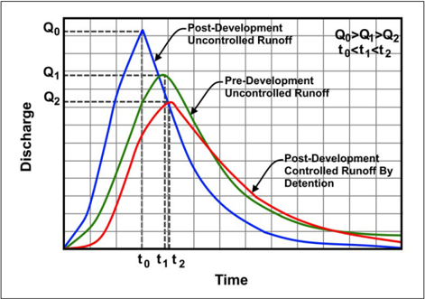

## 10.1  Design Objectives and Challenges

Designers  follow  applicable  design  criteria for  detention  and  retention  facilities.  They also address other important features of these facilities including release timing, safety, and maintenance.

## 10.1.1 Design Events

To mitigate the detrimental stormwater runoff effects of land development, designers have several tools that can limit peak  flow  rates  from  developed  areas  to those  that  occurred  prior  to  development. Designers  can  use  these  tools  to  mitigate one, two, or more design event events, for example the 0.5, 0.1, and 0.01 AEP events. The 'post-development controlled runoff by detention' hydrograph in Figure 10.1 illustrates  the  potential  effect  of  storage  in

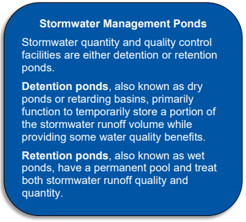

mitigating increased runoff caused by land development.

The  storage  of  stormwater  can  reduce  the  frequency  and  extent  of  downstream  flooding,  soil erosion,  sedimentation,  and  water  pollution.  Designers  have  also  used  detention  and  retention facilities  to  reduce  the  costs  of  large  storm  drainage  systems  by  reducing  the  required  size  for downstream storm drain conveyance systems.

levels.

Local  government  bodies  typically  establish  specific  design  criteria  for  peak  flow  attenuation. Some jurisdictions also require that flow volume be controlled to pre-development Controlling flow volume is only practical when site conditions permit infiltration. To compensate for  the  increase in flow volume, some jurisdictions require that the peak post-development flow be reduced to below pre-development levels.

Some  detention/retention  facilities  are  designed  for  control  of  runoff  from  only  a  single  storm frequency. However, single storm criteria have been found to be rather ineffective since such a design may provide little control of other storms. For example, design for the control of frequent storms (less frequent AEPs) provides little attenuation of lower frequency higher magnitude storm events.  Similarly,  design  for  less  frequent  large  storms  provides  little  attenuation  for  the  more frequent smaller storms. Some jurisdictions enforce multiple storm regulatory criteria which dictate that multiple storm frequencies be attenuated in a single design. A common criterion would be to regulate the 0.5, 0.1, and 0.01 AEP events.

## 10.1.2 Release Timing

The timing of releases from stormwater control facilities can be critical to the proper functioning of overall stormwater systems. As illustrated in  Figure 10.1, stormwater quantity control structures reduce the peak flow  and increase the duration of the hydrograph at the point of release. However, in some instances this shifting of hydrograph peak times and durations can cause adverse effects downstream.

For  example,  where  the  drainage  area  being  controlled  is  in  a  downstream  portion  of  a  larger watershed, delaying the peak and extending the recession limb of the hydrograph may result in a higher peak on the main channel as illustrated in  Figure 10.2. In this example, this can occur if the reduced peak on the controlled tributary watershed is delayed so that it reaches the mainstem

at  or  near  the  time  of  the  mainstem  peak.  With  multiple  detention  facilities  in  a  watershed, designers will consider the effects of detention on hydrograph  timing downstream  to  avoid creating flooding problems.

Figure 10.2. Example of cumulative hydrograph with and without detention.

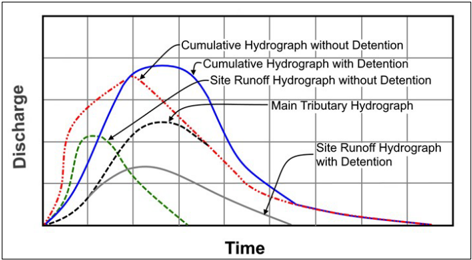

## 10.1.3 Safety

Detention designers promote safe facilities by preventing public trespass, providing emergency escape aids, and eliminating other hazards. Preventing public trespass recognizes that children and adults may be attracted to the site, regardless of whether the site is intended for their use. For example, the designer may use fences to enclose ponds to limit access. Ideally,  designers locate detention basins away from busy streets and intersections.

Designers  consider  inflow  and  outflow  structures  with  safety  in  mind.  For  example,  removable, hydraulically efficient grates and bars may cover the ends of inlet and outlet pipes, particularly if they connect with an underground storm drain system or otherwise present a safety hazard. Safer design of outflow structures would also limit flow velocities at points where people could be drawn into the discharge stream.

Where a detention basin incorporates active recreation areas, designers use mild bottom slopes along the periphery of the basin. Persons who enter a detention pond or basin while stormwater is being discharged may be at risk. The force of the currents may push a person into an outflow structure or may  hold a victim under the water where a bottom discharge is used. Urban Stormwater  Management (APWA 1981) discusses several design precautions intended improve safety .

## 10.1.4 Maintenance

Stormwater management facilities depend on proper maintenance to function as intended over time. Depending on the facility type and location, appropriate periodic maintenance may include:

- Scheduled inspections may occur for the first few months after construction and on an annual  basis  thereafter.  In  addition, inspections  during  and  after  major  storm  events

to

ensure that the inlet  and  outlet  structures  continue functioning by  either  identifying  damage or  clogging  or  confirming  that  none has  occurred. They  also  can  identify  erosion  on embankment side slopes and evidence of soil piping that can degrade the facility.

- Mowing at least twice a year discourages woody growth and controls weeds.
- Sediment, debris, and litter control at  least  twice  a  year  maintains  functionality  and reduces  clogging  potential .  In  particular,  removing accumulated  sediment,  debris,  and trash around outlet structures prevents clogging of the control device.
- Standing water or soggy conditions within the lower stage of a storage facility can create nuisance  conditions  such  as  odors,  insects,  and  weeds. Nuisance  control, such  as providing allowance for positive drainage during design, minimizes these problems.
- Inlet and outlet devices, and standpipe or riser structures deteriorate with time, necessitating structural  repairs  and  replacement . The actual life of a structural component will depend on individual site-specific factors, such as soil conditions.

## 10.2  Storage Facility Types

Designers classify stormwater quantity control facilities as either detention or retention facilities. Detention  facilities  (dry  ponds)  store  and  release  or  attenuate  stormwater  runoff  by  a  control structure  or  other  release  mechanism.  Extended  detention  usually  releases  stormwater  over  a period of days. Retention facilities (wet ponds) maintain a permanent pool and release stormwater via evaporation and infiltration as well as through surface releases using a control structure.

## 10.2.1 Detention Facilities

Highway and municipal stormwater management plans (SWMPs) most often use the detention concept  to  limit  the  peak  outflow  rate  to  that  which  existed  from  the  same  watershed  before development for a specific range of flood frequencies. Following SWMPs, designers may provide detention storage at one or more locations, either above ground or below ground or both. These locations may exist as impoundments; collection and conveyance facilities; underground tanks; and on-site facilities such as parking lots, pavements, and basins. Detention ponds are the most common type of storage facility used for controlling stormwater runoff peak flows. The majority of these are dry ponds which release all the runoff temporarily detained during a storm.

Designers recommend detention facilities where the facilities will have clear hydrologic, hydraulic, and  cost  benefits.  Additionally,  local  ordinances  may  require  some  detention  facilities;  in  such cases, the governing agency determines appropriate construction which may typically include:

- Design rainfall frequency, intensity, and duration consistent with highway standards and local requirements.
- The outlet structure limits the maximum outflow to allowable release rates. The maximum release rate may be a function of existing or developed runoff rates, downstream channel capacity, potential flooding conditions, and local ordinances.
- Detention  facility  size,  shape,  and  depth  provides  sufficient  volume  to  satisfy  project storage requirements. Designers determine this by routing the inflow hydrograph through the  facility.  Section 10.3.1  outlines  techniques  designers  can  use  to  estimate  an  initial storage volume. Section 10.4 provides a discussion of storage routing techniques.
- An  auxiliary outlet that allows overflow potentially resulting from excessive  inflow or clogging  of  the  main  outlet.  This  outlet  is  positioned  such  that  overflows  will  follow  a predetermined route. Preferably, such outflows discharge into open channels, swales, or other approved storage or conveyance features.

- The system releases  excess  stormwater  expeditiously  to  ensure  that  the  entire  storage volume is available for subsequent storms and to minimize hazards. A dry pond, which is a facility with no permanent pool, may need a paved low flow channel to ensure com plete removal of water and to aid in nuisance control.
- The facility typically satisfies Federal (see Chapter 2) and State statutes and recognizes local ordinances.
- Provides access for maintenance.
- Avoids being an 'attractive nuisance,' which may involve fencing and signage.

Figure 10.3 shows a schematic of the cross-section of a detention basin with a single-stage riser. A pool forms behind the retaining structure. The hydrograph of the post-development flood runoff enters the pool at the upper end of the detention basin. Water can be discharged from the pool through a pipe that passes through or around the detention structure. The size of the pipe can serve to limit the outflow rate, thus forming a permanent pool, with the permanent pool elevation changing only through evaporation and infiltration losses.

Figure 10.3. Schematic cross-section of a detention basin with a single-stage riser.

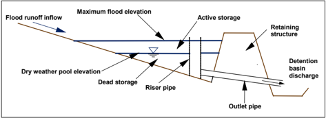

Using  a permanent pool has several  advantages, including water quality control, aesthetic considerations,  and  wildlife  habitat  improvement.  A  permanent  pool  also  increases  the  total storage volume, involving both a larger retaining structure and a larger commitment of land, both of which increase project cost.

Figure 10.3 does not show several other elements of detention basin design. The designer may determine that the riser inlet should be fitted with both an antivortex device and a trash rack. The antivortex device prevents the formation of a vortex, thus maintaining the hydraulic efficiency of the outlet structure. The trash rack prevents high  velocity flows from sucking trash (and people) into the riser.

All  detention  basins  should  have  an  emergency  spillway  to  pass  runoff  from  very  large  flood events, so the retaining structure is not overtopped and washed out. The elevation of the bottom of the emergency spillway, which will pass high flows around the retaining structure, is above the elevation of the riser outlet, but below the top of the retaining structure. Designers call the zone between the detention or surcharge storage zone.

Various  methods  exist  for  the  planning  and  design  of  stormwater  detention  facilities.  Design involves the simultaneous sizing of the storage volume characteristics and the riser/outlet characteristics. Some stormwater management (SWM) methods ('planning methods') only apply to  estimating  the  volume  of  storage  that  would  meet  the  intent  of  the  SWM  policies.  Designers

use other planning methods to determine the characteristics of the outlet facility. Ultimately, the designer  selects  the  final  design  using  a  method  that  simultaneously  estimates  the  volume  of storage and the characteristics of the outlet facility.

The simultaneous solution is important because there is a wide array of feasible solutions for any one site and set of design conditions. When designers separately determine storage volume and outlet facility characteristics, they may produce an ineffective, and possibly incorrect, design. In summary, planning methods provide less accuracy and involve less effort than design methods.

## 10.2.2 Retention Facilities

In  addition  to  stormwater  storage,  retention  facilities (e.g.,  wet  ponds )  may  be  used  for  water supply,  recreation,  pollutant  removal,  aesthetics,  and  groundwater  recharge.  As  discussed  in Chapter  11, infiltration facilities provide significant water quality benefits, and groundwater  recharge  is  not  a  primary  goal  of  highway  stormwater  management,  the  use  of infiltration basins and swales can provide this secondary benefit in tandem with retention facilities.

although

Designers typically develop retention facilities to provide the dual functions of stormwater quantity and  quality  control.  These  facilities  may  be  provided  on  the  surface  or  buried.  The  facility  may have a permanent pool, which typically provides pollutant control.

Design criteria for retention facilities are the same as those for detention facilities except they may not include provisions for treating the runoff of lower frequency high magnitude storms. However, designers may apply the following additional criteria:

- Provide sufficient depth and volume below the normal pool level for any desired multiple use activity including pollutant removal.
- Include shoreline protection where erosion from wave action is expected.
- Provide that capability to lower the pool elevation or drain the basin for cleaning, shoreline maintenance, and emergency operations.
- Design dikes or dams with a safety factor commensurate with applicable regulations.
- Consider  safety  benching  below  the  permanent  water  line  at  the  toe  of  steep  slopes  to guard against accidental drowning.
- Size the emergency spillway and storage volume when closely spaced flood events could prevent complete draining between events.
- Complete detailed engineering geological studies to ensure that the facility will function as planned.

The  FHWA  (1979) provides additional information on underground detention and retention facilities.

## 10.3  Detention and Retention Design Information

This chapter introduces preliminary design activities for stormwater detention and retention including  estimating  the  storage  volume  of  the  stormwater  detention  need,  developing  stagestorage relationships, and developing stage-discharge relationships.

## 10.3.1 Preliminary Storage Volume

Designers estimate a preliminary estimate of storage to accomplish the hydrograph attenuation goals.  The  following  sections  present  several  methods  for  determining  an  initial  estimate  of

storage.  Because  each  method  provides  preliminary  estimates  only,  the  designer  may  apply several of the methods and use engineering judgment to select an initial storage estimate.

## 10.3.1.1 Loss-of-Natural-Storage Method

The  loss -of-natural-storage method  estimates   volumes  based on  the volume  of  lost natural storage. This approach is conservative for detention volume estimates, but is more appropriate for estimating retention volumes:

<!-- formula-not-decoded -->

where:

Qs = Storage needed, inch (mm)

Qa =

Runoff depth for post-development watershed condition, inch (mm)

Qb =

Runoff depth for pre-development watershed condition, inch (mm)

Designers often refer to the variable Q as a volume even though it has the dimension of a depth. It represents the volume  of water at the  computed  depth  spread uniformly  over the entire watershed. The designer computes the volume of storage, Vs, by multiplying Qs by:

<!-- formula-not-decoded -->

where:

α =

Unit conversion constant, 3,630 in CU (10 in SI)

A =

Drainage area, ac (ha)

The designer can compute the runoff depths Q a and Qb of equation 10.1 using any one of several methods.  For  the  Natural  Resources  Conservation  Service  (NRCS)  method,  apply  the  NRCS runoff  equation  (SCS  1986)  using  the  post-development  and  pre-development  curve  numbers (CNs). Using the Rational Method to estimate peak flows, the runoff depths, Q, is:

<!-- formula-not-decoded -->

where:

qp =

peak flow, ft 3 /s (m 3 /s)

α =

Unit conversion constant, 0.0165 in CU (6.0 in SI)

A =

Drainage area, ac (ha)

t c =

Time of concentration, min

Solve equation 10.3 for both the pre- and post-development conditions by using the appropriate values of qp and tc. Then compute the runoff depth difference by entering the values into equation 10.1, ultimately using it to compute the volume of storage with equation 10.2.

| Example 10.1:   | Storage estimate for a detention pond.                                                      |
|-----------------|---------------------------------------------------------------------------------------------|
| Objective:      | Estimate the storage needed for a detention pond using the loss-of-natural- storage method. |

Given:

An existing watershed under development with the following characteristics:

A =

5.7 ac (2.3 ha)

C =

0.2 and 0.45 (existing and developed conditions, respectively)

- t c = 18 and 11 min (existing and developed conditions, respectively)

I

= 3.1 in/h (79 mm/h) and 4.0 in/h (102 mm/h), (existing and  developed conditions, respectively), using local intensity-duration-frequency (IDF) curves

## Step 1. Calculate the peak flows for the existing and developed conditions.

qpb = (1/ α) Cb ib A = (0.2)(3.1)(5.7) = 3.5 ft 3 /s qpa = (1/ α) Ca ia A = (0.45)(4.0)(5.7) = 10.3 ft 3 /s

## Step 2. Estimate the runoff depths.

Using equation 10.3:

Qb = α[(qpb tc)/A] = (1/60.5)[3.5(18)/5.7] = 0.18 inches

Qa = α[(qpa tc)/A] = (1/60.5)[10.3(11)/5.7] = 0.33 inches

## Step 3. Compute the depth and volume of storage.

Using equation 10.1:

QS = Qa - Qb = 0.33 - 0.18 = 0.15 inches

Using equation 10.2:

VS = α AQS = 3630 (5.7) (0.15) = 3,100 ft 3

## Solution:

The detention pond needs 3,100 ft 3  (88 m 3 ) of storage.

## 10.3.1.2 Actual Inflow/Estimated Release Method

The actual inflow/estimated release method of estimating detention storage volume uses an inflow hydrograph (post-development) and the target peak flow release for the design event. The method estimates  the  outflow  hydrograph  by  sketching  an  assumed  outflow  curve  as  shown  in Figure 10.4. This limits the peak of the estimated outflow hydrograph such that it does not exceed the desired  peak  outflow  from  the  detention  basin.  The  shaded  area  between  the  inflow  and  the approximated outflow hydrographs represents the estimated storage needed. To determine the necessary storage, measure or mathematically compute the shaded area using a reasonable time period and appropriate hydrograph ordinates.

Figure 10.4. Estimating storage using the actual inflow/estimated release of hydrograph method.

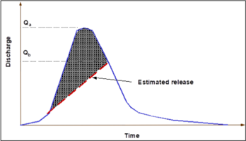

## 10.3.1.3 Rational Method Triangular Hydrograph Method

Designers can obtain a preliminary estimate of the storage volume required for peak attenuation from a simplified design procedure that replaces the actual inflow and hydrographs with simplified triangular shapes. This method works best with the Rational Method. Figure 10.5 illustrates the procedure. The area above the outflow hydrograph and inside the inflow hydrograph represents the estimated storage volume:

flow outflow

<!-- formula-not-decoded -->

where:

Vs =

Storage volume estimate, ft 3  (m 3 )

qi =

Peak inflow rate into the basin, ft 3 /s (m 3 /s)

qo =

Peak outflow rate out of the basin, ft 3 /s (m 3 /s)

t i =

Duration of basin inflow, s

The duration of basin inflow equal s two times the time of concentration. The triangular hydrograph procedure, originally described by Boyd (1981), compares favorably with more complete design procedures involving reservoir routing.

Figure 10.5. Triangular hydrograph method.

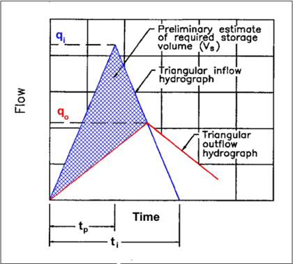

## 10.3.1.4 NRCS TR-55 Procedure

TR-55 (SCS 1986) describes a method for estimating required storage volumes based on peak inflow  and  outflow  rates.  The  method  uses  average  storage  and  routing  effects  observed  for  a large number of structures. This procedure for estimating storage volume may have errors and, therefore, is only useful for preliminary estimates.

The procedure to estimate required detention storage follows (SCS 1986):

## Step 1. Compute discharges.

Determine the peak inflow and outflow discharges q i and qo, which correspond to the post-  and pre-development flows, respectively.

## Step 2. Compute qo/qi and Rq.

Calculate the ratio qo/qi, which is equal to Rq.

## Step 3. Calculate the ratio Vs/Vr for graphical method or compute Rs for arithmetic method.

Calculate Rs:

<!-- formula-not-decoded -->

The coefficients C O, C1, C2, and C 3 are a function of the NRCS rainfall distribution and are provided in Table 10.1.

Table 10.1. Coefficients for the NRCS detention volume method.

| Rainfall Distribution   |   C 0 |   C 1 |   C 2 |    C 3 |
|-------------------------|-------|-------|-------|--------|
| I or IA                 | 0.66  | -1.76 |  1.96 | -0.73  |
| II or III               | 0.682 | -1.43 |  1.64 | -0.804 |

## Step 4.   Determine the storage volume, Vs.

<!-- formula-not-decoded -->

S S a where:

α =

Unit conversion constant, 3,630 in CU (10 in SI)

Qa =

Post-development depth of runoff, inches (mm)

A =

Drainage area, ac (ha)

## Example 10.2:

Estimation of needed detention pond storage.

Objective:

Estimate the needed storage of a detention facility by using the actual inflow hydrograph, Rational Method triangular hydrograph, and NRCS TR-55 methods.

Given:

The post-developed (improved conditions) peak flow of 31.1 ft 3 /s (0.88 m 3 /s) is limited to an outflow rate from the proposed detention facility of 19.4 ft 3 /s (0.55 m 3 /s). This limiting outflow is a constraint imposed by the downstream receiving water course and is the maximum outflow rate from the drainage area for unimproved conditions. Drainage area, A, equals 43.4 acres.

## Step 1. Estimate storage using the actual inflow/estimated release method.

Figure 10.6 illustrates the existing conditions and proposed conditions hydrographs. Assuming the proposed detention facility will produce an outflow hydrograph similar to existing conditions, determine the required detention volume as the area above the existing hydrograph and below the proposed hydrograph. Using the scale on Figure 10.6, 1 inch 2 equals 22,500 ft 3 . Measuring the area between the two hydrographs yields an area of 1.5 inches 2 , which converts to the following volume:

Vs = (1.5 inches 2 ) (22,500 ft 3 /inch 2 ) = 33,750 ft 3

Figure 10.6. Hydrograph for existing and proposed conditions.

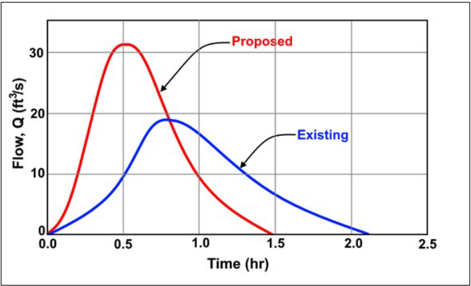

## Step 2. Calculate storage using the Rational Method Triangular Hydrograph method.

The inflow rate into the detention basin (qi) is 31.1 ft 3 /s. The peak flow rate out of the basin (qo) is set to be = 19.4 ft 3 /s.

Using equation 10.4, compute the initial storage volume as:

Vs = 0.5 ti (qi - qo) = (0.5)( 1.43 h x (60 min/h)(60 s/min) )(31.1 - 19.4) = 30,116 ft 3

## Step 3. Determine storage using the NRCS TR-55 Method. Calculate Rq.

As previously noted, the inflow discharge is 31.1 ft 3 /s, and the outflow discharge is set to be 19.4 ft 3 /s by local ordinance.

The ratio of basin inflow to basin outflow is:

<!-- formula-not-decoded -->

## Step 4. Determine Vs / Vr.

With qo / qi = 0.62 and a Type II Storm, calculate Rs using equation 10.5 and the coefficients from Table 10.1 . Qa = 0.43 inches.

<!-- formula-not-decoded -->

<!-- formula-not-decoded -->

Step 5. Calculate the preliminary estimated storage volume (Vs) using the NRCS TR-55 Method and equation 10.6.

Vs = α Rs Q a A = (3630) (0.23) (0.43) (43. 4 ) = 15, 600 ft 3

Solution:

The hydrograph and triangular hydrograph methods result in the most consistent and conservative estimates, whereas the NRCS TR-55 method is less conservative.

## 10.3.2 Stage-Storage Relationship

A stage-storage relationship  links  the  depth  of  water  and  storage  volume  in  the  storage  facility and depends on the topography at the site of the storage structure. Figure 10.7 illustrates a typical stage-storage curve. Calculate the volume of storage by using simple geometric formulas expressed as a function of storage depth. After estimating the required storage as described in the  previous  section,  determine  the  configuration of  the  storage  basin  to  develop  the  stage -storage  curve.  The  following  relationships  can  be  used  for  computing  the  volumes  at  specific depths of geometric shapes commonly used for storage facilities.

## 10.3.2.1 Rectangular Basins

Figure  10.8  provides  a  schematic  of  a  rectangular  basin,  a  common  shape  for  underground storage. Compute the volume of a rectangular basin by dividing the volume into rectangular and triangular shapes. If the basin is not on a slope, then the geometry will consist only of rectangular shapes.

Volumes of rectangular and triangular shapes, respectively, are:

<!-- formula-not-decoded -->

<!-- formula-not-decoded -->

where:

V =

Volume at a specific depth, ft 3  (m 3 )

D =

Depth of ponding for that shape, ft (m)

W =

Width of basin at base, ft (m)

L =

Length of basin at base, ft (m)

S =

Slope of basin, ft/ft (m/m)

Figure 10.7. Stage-storage curve.

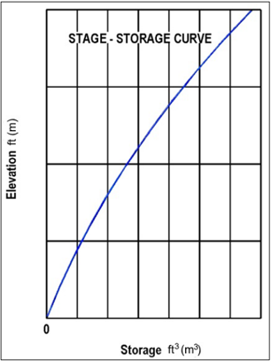

Figure 10.8. Rectangular basin.

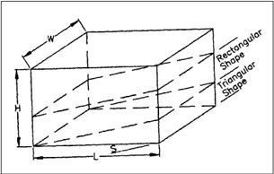

A  special  case,  rarely  permitted  by  site,  occurs  with  a  horizontal  rectangular  bottom  area  and vertical  sides.  In  this  case,  the  storage  simply  equals  the  bottom  area  (i.e.,  length  times  width) multiplied  by  the  depth  of  storage.  If  the  relationship  is  plotted  in  a  Cartesian  axis  system  with storage as the ordinate and stage as the abscissa, the stage-storage relationship will be a straight line with a slope equal to the surface area of the storage facility.

A variation on the rectangular basin occurs where the bottom of the storage facility is a rectangle (L x W), the longitudinal cross- section is a trapezoid, and the ends are vertical. In this case, the stage-storage relationship is given by:

<!-- formula-not-decoded -->

where:

θ =

Angle of side slopes

h =

Height above bottom of basin, ft (m)

Graphing equation 10.9 results in a stage-storage relationship with the shape of a second-order polynomial with a zero intercept and a shape that depends on the values of L, W, and θ .

## Example 10.3: Storage estimate of rectangular basin.

Objective:

Estimate the maximum volume of a rectangular basin.

Given:

Consider a rectangular basin:

L = 656 ft (200 m)

W =

328 ft (100 m)

Z = 2

Step 1.   Apply equation 10.7, which becomes:

( ) 2 S = 2Lh  +  L W h

## Step 2. Calculate storage using equation 10.9.

Calculate the storage at a depth of 4.9 ft (1.5 m) as follows:

S = 1,312h 2  + 215,200h = 1,312 (4.9) 2  + 215,200 (4.9) = 1,086,000 ft 3

## Solution:

The maximum volume of the trapezoidal basin is 1,086,000 ft 3  (30,800 m 3 ).

## 10.3.2.2 Trapezoidal Basins

Figure 10.9 schematically represents a trapezoidal basin. Calculate the volume of a trapezoidal basin by dividing the volume into components of triangular and rectangular shape and applying equation 10.10. 'Z' in this equation equals the ratio of the horizontal to vertical components of the side slope. For example, if the side slope is 1 to 2 (V:H), 'Z' equals 2.

<!-- formula-not-decoded -->

where:

V =

Volume at a specific depth, ft 3  (m 3 )

D =

Depth of ponding or basin, ft (m)

L =

Length of basin at base, ft (m)

W =

Width of basin at base, ft (m)

r =

Ratio of width to length of basin at the base

Z =

Side slope factor; ratio of horizontal to vertical components of side slope

Estimate the trial dimensions of a basin by rearranging the equation for volume in terms of basin length:

<!-- formula-not-decoded -->

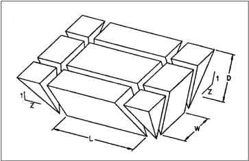

Figure 10.9. Trapezoidal basin.

| Example 10.4:   | Stage-storage curve of a trapezoidal basin.                                                                                                                                      |
|-----------------|----------------------------------------------------------------------------------------------------------------------------------------------------------------------------------|
| Objective:      | Find the dimensions of the basin at its base and develop a stage-storage curve for the basin.                                                                                    |
| Given:          | Estimated storage volume (V); depth available for storage during a 0.1 AEP event (D); available freeboard (F B ); basin side slopes (Z); and width-to-length ratio of basin (r). |
| V               | = 30,016 ft 3 (850 m 3 )                                                                                                                                                         |
| D               | = 5.25 ft (1.6 m)                                                                                                                                                                |
| F B             | = 2.0 ft (0.6 m)                                                                                                                                                                 |
| Z               | = 3 (V:H = 1:3)                                                                                                                                                                  |
| r               | = 0.5                                                                                                                                                                            |

Develop a stage-storage curve for the basin assuming that the base elevation of the basin equals 32.8 ft (10.0 m), and the crest of the embankment is at 40.0 ft (12.2 m). Determine this crest elevation by adding the 5.25 ft (1.6 m) of available depth plus the 2.0 ft (0.6 m) of freeboard.

## Step 1. Establish the basin dimensions.

Substituting the given values in equation 10.11:

<!-- formula-not-decoded -->

<!-- formula-not-decoded -->

L = 82.82 ft, use L = 85 ft

W = 0.5 L = 42.5 ft, use W = 43 ft

Therefore, select an 85-ft by 43-ft basin.

## Step 2. Develop the stage-storage relationship.

By varying the depth (D) in equation 10.10, develop a stage-storage relationship for the trapezoidal basin. Table 10.2 summarizes the results.

Table 10.2. Stage-storage relationship.

|   Depth (ft) |   Stage (ft) | Storage Volume (ft 3 )   |
|--------------|--------------|--------------------------|
|         0    |        32.81 | 0                        |
|         0.66 |        33.46 | 2,567                    |
|         1.31 |        34.12 | 5,425                    |
|         1.97 |        34.77 | 8,774                    |
|         2.62 |        35.43 | 12,455                   |
|         3.28 |        36.09 | 16,548                   |
|         3.94 |        36.75 | 21,074                   |
|         4.59 |        37.4  | 26,052                   |
|         5.25 |        38.06 | 31,503                   |
|         5.91 |        38.71 | 37,413                   |
|         6.56 |        39.37 | 43,906                   |

## Solution: Table provides the stage-storage curve.

## 10.3.2.3 Pipes and Conduits

Figure 10.10 provides  a  definition  sketch  for  a  generalized  prism  in  a  pipe  or  other  shape  of conduit. To provide for sediment transport through the conduit, designers place the conduit on a slope.  The  prismoidal  formula  provides  an  estimate  of  storage  volume  based  on estimates  of cross-sectional areas at three locations:

<!-- formula-not-decoded -->

where:

V =

Volume of storage, ft 3  (m 3 )

L =

Length of section, ft (m)

A1 =

Cross-sectional area of flow at base, ft 2  (m 2 )

A2 =

Cross-sectional area of flow at top, ft 2  (m 2 )

M =

Cross-sectional area of flow at midsection, ft 2  (m 2 )

Figure 10.10. Definition sketch for prismoidal formula.

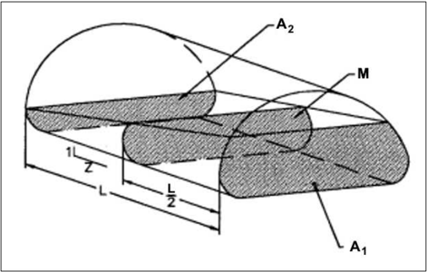

For a circular conduit, as illustrated in  Figure 10.11, an exact storage volume results from when d ≤ 2r:

<!-- formula-not-decoded -->

<!-- formula-not-decoded -->

<!-- formula-not-decoded -->

<!-- formula-not-decoded -->

| where: V   | =   | Volume of storage, ft 3 (m 3 )                   |
|------------|-----|--------------------------------------------------|
| B          | =   | Cross-sectional end area at depth d, ft 2 (m 2 ) |
| H          | =   | Wetted pipe length, ft (m)                       |
| r          | =   | Pipe radius, ft (m)                              |

α =

Angle as described in Figure 10.11, radians

a, c = Distances as described in Figure 10.11, ft (m)

d =

Flow depth in pipe, ft (m)

To assist in the determination of the cross-sectional area of B, the area of the associated circular segment is:

<!-- formula-not-decoded -->

where:

As = Segment area, ft 2  (m 2 )

Compute the wetted area as follows:

For d ≤ r; B = As

For d &gt; r; B = A - As

A is the total pipe area. Alternatively, various texts, such as Brater and King (1976), contain tables and charts for use in determining the depths and areas described in the above equations.

Figure 10.11. Definition sketch for a circular conduit.

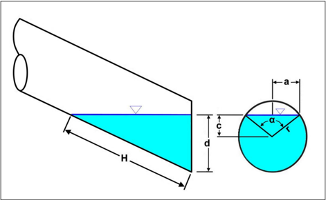

Example 10.5: Estimation of pipe storage.

Objective:

Develop a stage-storage tabulation between elevations 98 ft (30 m) and 103 ft (31.5 m)

Given:

A storm drain pipe having the following properties:

D =

60 inches (1500 mm)

S =

0.01 ft/ft (m/m)

L =

820 ft (250 m)

Invert =

98 ft (30 m)

## Step 1. Solve for the volume of storage.

Using equations 10.13 and 10.17:

V = H [(2/3 a 3  + c B) / (r + c)]

As = ( α - sin α ) (r 2 / 2)

Note that: B = As for d ≤ r

B = A - As for d &gt; r

## Step 2. Tabulate storm drain pipe stage-storage curve.

Table 10.3 summarizes the results.

Table 10.3. Storm drain pipe stage-storage relationship.

|   d (ft) |   a (ft) |   c (ft) |   H (ft) |   alpha (rad) |   B (ft 2 ) |   V (ft 3 ) |
|----------|----------|----------|----------|---------------|-------------|-------------|
|      0   |     0    |    -2.46 |        0 |         0     |        0    |         0   |
|      0.7 |     1.67 |    -1.8  |       66 |         1.495 |        1.5  |        41.6 |
|      1.3 |     2.18 |    -1.15 |      131 |         2.171 |        4.1  |       222.8 |
|      2   |     2.41 |    -0.49 |      197 |         2.739 |        7.1  |       588.8 |
|      2.6 |     2.45 |     0.16 |      262 |         3.008 |       10.3  |      1159.9 |
|      3.3 |     2.32 |     0.82 |      328 |         2.462 |       13.5  |      1940   |
|      3.9 |     1.97 |     1.48 |      394 |         1.855 |       16.3  |      2917.3 |
|      4.6 |     1.23 |     2.13 |      459 |         1.045 |       18.5  |      4061.1 |
|      4.9 |     0    |     2.46 |      492 |         0     |       19.01 |      4676.9 |

Solution:

Table provides the tabular pipe stage-storage curve.

## 10.3.2.4 Irregular Basins

Rectangular and trapezoidal basins often oversimplify  common detention and retention basins. However,  the  concepts  used  to  derive  the  stage-storage relationship  for  the  simple  forms  also apply to deriving the stage-storage relationship for an actual site that exhibits irregular shapes. The stage-storage relationship is derived as a discrete function (i.e., a set of points) from contours on topographic mapping.

Designers usually develop the storage volume for irregular basins using a topographic map and the average-end area or conic section formulas. The average-end area formula is expressed as:

<!-- formula-not-decoded -->

where:

V1,2 =

Storage volume between elevations 1 and 2, ft 3  (m 3 )

A1 =

Horizontal area at elevation 1, ft 2  (m 2 )

A2 =

Horizontal area at elevation 2, ft 2  (m 2 )

d =

Change in elevation between points 1 and 2, ft (m)

Generally, the average-end area formula approximates irregular basin storage volume well when calculating volumes with small changes in elevation between respective elevations or when the basin width or length is changing but not both.

The  conic  section  formula  approximates  irregular  basin  storage  volume  more  accurately  when both length and width of a basin are changing as shown in  Figure 10.12. The conic approximation is:

<!-- formula-not-decoded -->

where:

V

=

Volume of frustum of a pyramid, ft 3  (m 3 )

A1 =

Surface area at elevation 1, ft 2  (m 2 )

A2 =

Surface area at elevation 2, ft 2  (m 2 )

d =

Change in elevation between points 1 and 2, ft (m)

Figure 10.12. Definition sketch for irregular basins.

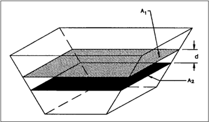

Example 10.6 : Storage estimate of basin for an irregular basin.

Objective:

Estimate the maximum volume using topography and average area method.

Given:

Topographic map for site shown in Figure 10.13.

## Step 1. Using average area method, develop a stage-storage curve.

The area bounded by each 1-ft contour line is estimated and the average area within adjacent contours is computed. Using equation 10.9 compute the stage-storage relationship which is summarized in Table 10.4 and plotted in Figure 10.14.

Solution:

Based on the contours of the site, the maximum storage is 61,985 ft 3  (1760 m 3 ).

Figure 10.13. Topographic map for deriving stage-storage relationship at site of structure (section 5+20).

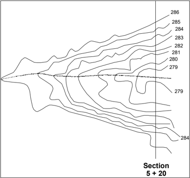

Figure 10.14. Stage-storage relationship.

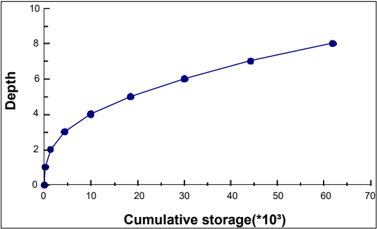

Table 10.4. Derivation of stage-storage relationship for example irregular basin.

| Contour Elevation (ft)   | Total Area within Contour Elevation (ft 2 )   | Average Area (ft 2 )   | Contour Interval (ft)   | Depth (ft)   | Change in Storage (ft 2 )   | Cumulative Storage (ft 3 )   |
|--------------------------|-----------------------------------------------|------------------------|-------------------------|--------------|-----------------------------|------------------------------|
| 278                      | 0                                             |                        |                         | 0            |                             | 0                            |
|                          |                                               | 245                    | 1                       |              | 245                         |                              |
| 279                      | 490                                           |                        |                         | 1            |                             | 245                          |
|                          |                                               | 1,115                  | 1                       |              | 1,115                       |                              |
| 280                      | 1,740                                         |                        |                         | 2            |                             | 1,360                        |
|                          |                                               | 3,015                  | 1                       |              | 3,015                       |                              |
| 281                      | 4,290                                         |                        |                         | 3            |                             | 4,375                        |
|                          |                                               | 5,585                  | 1                       |              | 5,585                       |                              |
| 282                      | 6,880                                         |                        |                         | 4            |                             | 9,960                        |
|                          |                                               | 8,600                  | 1                       |              | 8,600                       |                              |
| 283                      | 10,320                                        |                        |                         | 5            |                             | 18,560                       |
|                          |                                               | 11,575                 | 1                       |              | 11,575                      |                              |
| 284                      | 12,830                                        |                        |                         | 6            |                             | 30,135                       |
|                          |                                               | 14,165                 | 1                       |              | 14,165                      |                              |
| 285                      | 15,500                                        |                        |                         | 7            |                             | 44,300                       |
|                          |                                               | 17,685                 | 1                       |              | 17,685                      |                              |
| 286                      | 19,870                                        |                        |                         | 8            |                             | 61,985                       |

Many storage facilities include a permanent pool. In such cases, the elevation of the weir or the bottom of the orifice is set above the elevation of the bottom of the pond. Storage below the outlet elevation is called dead storage. Storage above the outlet elevation is called active storage. Total storage equals the sum of the active and dead storages.

| Example 10.7:   | Dead and active storage.                                                            |
|-----------------|-------------------------------------------------------------------------------------|
| Objective:      | Determine dead and active storages.                                                 |
| Given:          | A storage facility with dead and active storage with the following characteristics. |
| Δh              | = 0.25 ft (0.076 m)                                                                 |
| A b             | = 2,000 ft 2 (186 m 2 ) (bottom surface)                                            |

## Step 1. Establish depth increment.

Use a topographic map of the detention facility site to measure areas. Use a depth increment of 0.25 ft for computation.

## Step 2. Tabulate stage-active storage relationship.

Table 10.5 can be used to illustrate the development of stage-active storage relationship. Column 2 gives the areas and column 3 gives the average areas. The incremental volumes equal the product of the change in depth, 0.25 ft, and the average area. The total storage at a given depth is the sum of the incremental storages up to and including that depth.

Table 10.5. Computation of stage-active storage relationship for example basin.

| (1) Depth h (ft)   | (2) Surface Area, A (ft 2 )   | (3) Average Area, A (ft 2 )   | (4) Incremental Volume ΔV (ft 3 )   | (5) Total Volume V (ft 3 )   | (6) Dead Storage V d (ft 3 )   | (7) Active Storage V a (ft 3 )   |
|--------------------|-------------------------------|-------------------------------|-------------------------------------|------------------------------|--------------------------------|----------------------------------|
| 0                  | 2,000                         | -                             | -                                   | 0                            | 0                              | 0                                |
| -                  | -                             | 2,100                         | 525.0                               | -                            | -                              | -                                |
| 0.25               | 2,200                         | -                             | -                                   | 525.0                        | 525.0                          | 0                                |
| -                  | -                             | 2,250                         | 562.5                               | -                            | -                              | -                                |
| 0.50               | 2,300                         | -                             | -                                   | 1087.5                       | 1087.5                         | 0                                |
| -                  | -                             | 2,400                         | 600.0                               | -                            | -                              | -                                |
| 0.75               | 2,500                         | -                             | -                                   | 1687.5                       | 1087.5                         | 600.0                            |
| -                  | -                             | 2,650                         | 662.5                               | -                            | -                              | -                                |
| 1.00               | 2,800                         | -                             | -                                   | 2350.0                       | 1087.5                         | 1262.5                           |
| -                  | -                             | 2,900                         | 725.0                               | -                            | -                              | -                                |
| 1.25               | 3,000                         | -                             | -                                   | 3075.0                       | 1087.5                         | 1987.5                           |
| -                  | -                             | 3,050                         | 762.5                               | -                            | -                              | -                                |
| 1.50               | 3,100                         | -                             | -                                   | 3837.5                       | 1087.5                         | 2750.0                           |

Solution:

If the outlet facility has a minimum elevation of 0.5 ft (0.15 m), all storage below this elevation is dead storage. The active storage is 0.0 at an elevation of 0.5 ft (0.15 m). The active storage above 0.5 ft (0.15 m) equals the difference between the total storage and the dead storage. The stage (column 1) versus active storage (column 7) would be used when designing a storage facility.

## 10.3.3 Stage-Discharge Relationship (Performance Curve)

A  stage-discharge  (performance)  curve  describes the  relationship  between  the  depth  of  water and the discharge or outflow from a storage facility. A typical storage facility has both a principal and an emergency outlet. The principal outlet usually conveys the design flood without allowing flow to enter the emergency outlet for flooding events up to the design flood for the principal outlet. The principal outlet structure typically consists of combinations of pipe culverts, weirs, orifices, or other  appropriate  hydraulic  controls  selected  to  satisfy  single  or  multiple  applicable  hydrologic criteria. Designers develop composite stage-discharge curves by estimating the cumulative effects of the discharge rating relationships for each component of the outlet structure.

## 10.3.3.1 Discharge Pipes

Detention facilities typically have discharge pipes as part of the outlet structure and may also have a riser. The design of these pipes can be for either single or multistage discharges. A single step discharge  system  consists  of  a  single  culvert  entrance  system  and  is  not  designed  to  carry emergency flows. A multi -stage outlet structure adds a riser at the inlet end of the pipe. The design of an inlet structure allows the design discharge to pass through a weir or orifice in the lower levels of  the  structure  and  the  emergency  flows  to  pass  over  the  top  of  the  structure  or  through  an emergency spillway. The design of the pipe allows it to carry the full range of flows from a drainage area.

For outlets without a riser, the facility design resembles a simple culvert.  HDS-5 (FHWA 2012a) outlines  appropriate  design  procedures .  For  multistage  control  structures,  design  of  the  inlet control structure considers both the design flow  and the emergency flows. Designers develop a stage-discharge  curve  for  the  full  range  of  flows  the  structure  would  experience.  Typically,  the design flows are orifice flow through whatever shape the designer has chosen while typically the higher flows are weir flow over the top of the control structure. Designers can use the equations in Section 10.3.3.2 for orifices and the equations in Section  10.3.3.3 for weirs. Designers select the pipe to carry all flows considered in the design of the control structure.

In designing a multistage structure, the designer first develops peak flows that must be passed through  the  facility.  Next,  the  designer  selects  a  pipe  that  passes  the  peak  flow within the allowable headwater and develops a performance curve for the pipe. Third, the designer develops a  stage-discharge  curve  for  the  inlet  control  structure,  recognizing  that  the  headwater  for  the discharge pipe will be the tailwater that needs to be considered in designing the inlet structure. Last, the designer uses the stage-discharge curve in the basin routing procedure.

| Example 10.8: Objective:   | Sizing detention basin outlet pipe. Find the size pipe needed to carry the maximum allowable flow rate from the detention basin.                                                                                                                                 |
|----------------------------|------------------------------------------------------------------------------------------------------------------------------------------------------------------------------------------------------------------------------------------------------------------|
| Given:                     | The maximum head on pipe (H max ), inlet invert elevation, length (L), slope (S), roughness (n), and square edge entrance coefficient (K e ), for a corrugated steel discharge pipe as shown in Figure 10.3. The discharge pipe outfall is free (not submerged). |
| H max                      | = 2.3 ft (0.75 m)                                                                                                                                                                                                                                                |
| Invert                     | = 32.8 ft (10.0 m)                                                                                                                                                                                                                                               |
| L                          | = 164 ft (50 m)                                                                                                                                                                                                                                                  |
| S                          | = 0.04 ft/ft (m/m)                                                                                                                                                                                                                                               |
| n                          | = 0.024                                                                                                                                                                                                                                                          |

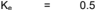

## Step 1. Evaluate the pipe for inlet and outlet control.

Using the same discharges from example 10.2, the maximum predeveloped discharge from the watershed is 19.4 ft 3 /s (0.55 m 3 /s). Since the discharge pipe can function under inlet or outlet control, the pipe size will be evaluated for both conditions. The larger pipe size will be selected for the final design.

## Step 2. Size the pipe for inlet control.

Using HDS-5 (FHWA 2012a) yields the relationship between head on the pipe and the resulting discharge for inlet control. The analysis shows the pipe diameter that will carry the flow under the specified conditions is 30 inches.

## Step 3. Size the pipe for outlet control.

Using HDS-5 (FHWA 2012a) yields the relationship between head on the pipe and discharge for barrel (outlet) control. The analysis shows the pipe diameter that will carry the flow under the specified conditions is 27 inches.

## Solution: For the design, select pipe diameter equal to 30 inches (750 mm).

## 10.3.3.2 Orifices

Figure 10.15 shows a schematic of a tank with a hole of area in its bottom. Assuming all losses can be neglected, write Bernoulli's equation between a point on the surface of the pool (point 1) and a point in the cross-section of the orifice (point 2):

<!-- formula-not-decoded -->

where:

P =

Pressure, lb/ft 2 (N/m 2  or Pa)

V =

Velocity, ft/s (m/s)

γ =

Specific weight, lb/ft 3 (N/m 3 )

z =

Height above datum, ft (m)

g =

Gravitational acceleration, 32.2 ft/s 2  (9.81 m/s 2 )

Figure 10.15. Schematic diagram of flow through an orifice.

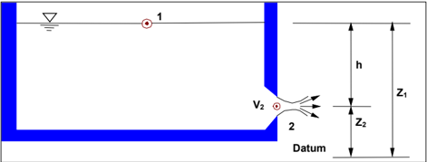

This can be simplified by assuming: 1) the pressure at both points is atmospheric, therefore p1 = p2; 2) the surface area of the pool A1 is very large relative to the area of the orifice A2, so from the continuity equation V1 is essentially zero; and 3) z1 - z2 = h. Equation 10.20 becomes:

<!-- formula-not-decoded -->

Solving for V2 and substituting it into the continuity equation yields:

<!-- formula-not-decoded -->

Equation  10.22  assumes  ideal  conditions  with  zero  energy  losses  and   atmospheric  pressure across the opening of the orifice. It is actually atmospheric at a point below the orifice, where the cross-sectional  area  of  the  discharging  water  is  slightly  smaller  than the  area  of  the  orifice.  To account for these conditions, the orifice flow equation introduces a discharge coefficient:

<!-- formula-not-decoded -->

where:

| Q   | =   | Orifice flow rate, ft 3 /s (m 3 /s)                                             |
|-----|-----|---------------------------------------------------------------------------------|
| C o | =   | Discharge coefficient                                                           |
| A o | =   | Area of orifice, ft 2 (m 2 )                                                    |
| h o | =   | Effective head on the orifice measured from the centroid of the opening, ft (m) |
| g   | =   | Gravitational acceleration, 32.2 ft/s 2 (9.81 m/s 2 )                           |

Values of Co range from 0.5 to 1.0, with a value of 0.6 commonly used, for square-edged, uniform orifice entrance conditions. For ragged edged orifices, such as those resulting from the use of an acetylene torch to cut orifice openings in corrugated pipe, use a value of 0.4.

If  the  orifice  is  not  horizontal,  the  depth,  h,  is  usually  measured  from  the  center  of  area  of  the orifice.

If the orifice discharges as a free outfall, i.e., unsubmerged,  then  measure  the  effective head from the centerline of the orifice to the upstream water surface elevation. For submerged  orifice  discharge,  the  effective head  equals  the  difference  in  elevation  of the upstream and downstream surfaces.  Figure  10.16  shows this latter condition of a submerged discharge.

openings.

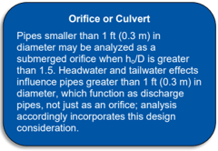

Designers use orifice plates on structures to control outflow from a detention pond. As shown in Figure  10.17, orifice plates consist of multiple Compute  flow  through  multiple  orifices  by summing the flow through individual orifices. For multiple orifices of the same size and under the influence of the same effective head, multiplying the discharge for a single orifice by the number of openings yields the total flow.

Figure 10.16. Definition sketch for orifice flow submergence.

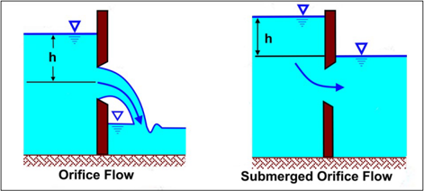

Figure 10.17. Orifice plate with multiple openings.

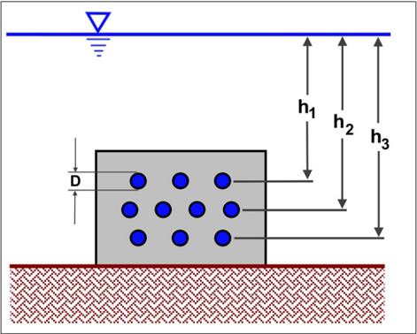

Example 10.9: Orifice flow through an orifice plate.

Objective:

Estimate total discharge through an orifice plate with multiple openings.

Given:

Given the orifice plate in Figure 10.17 with a free discharge and:

D =

1.0 inch or 0.0833 ft (25 mm)

h1 =

3.61 ft (1.1 m)

h2 = 3.94 ft (1.2 m)

h3 =

4.26 ft (1.3 m)

## Step 1. Use a modification of equation 10.23 to calculate the flows for each row of orifices.

Q1 = (0.6) [(3)(π*0.0833 2  / 4)] [2*32.2*3.61] 0.5 = 0.15 ft 3 /s

Q2 = (0.6) [(4)(π*0.0833 2  / 4)] [2*32.2*3.94] 0.5  = 0.21

Q3 = (0.6) [(3)(π*0.0833 2  / 4)] [2*32.2*4.26] 0.5 = 0.16

## Step 2.  Sum the orifice flows for each row of equal heads to arrive at the total flow.

<!-- formula-not-decoded -->

Solution:

The flow through the orifice plate equals 0.52 ft 3 /s (0.015 m 3 /s).

## Example 10.10: Orifice stage-discharge rating curve.

Objective:

Develop the stage-discharge rating curve between 32.80 ft (10 m) and 39.37 ft (12.0 m).

Given:

Given the circular orifice in Figure 10.16(a) with:

D =

0.49 ft (0.15 m)

invert =

32.80 ft (10.0 m)

Co =

0.60

Using equation 10.23 with D = 0.49 ft yields the following relationship between the effective head on the orifice (ho) and the resulting discharge:

<!-- formula-not-decoded -->

For D = 3.3 ft, ho = 3.3 - (0.49)/2 = 3.06

<!-- formula-not-decoded -->

Table 10.6 summarizes the stage-discharge curve.

Solution:

The table summarizes the stage-discharge tabulation for the orifice.

## 10.3.3.3 Weirs

The following sections provide relationships for sharp-crested, broad-crested,  V -notch, and proportional weirs.

## 10.3.3.3.1 Sharp-Crested Weirs

Consider the cross-section shown in Figure 10.18. Point 1 is located upstream of the  weir at a distance  where  the weir does  not  influence  the  flow  characteristics.  Point 2  is  at  the  weir.  The following analysis assumes: (1) ideal flow, (2) frictionless flow, (3) critical  flow  conditions  at  the obstruction, and (4) the obstruction has a unit width perpendicular to the direction of flow.

For the critical flow conditions, the following equations describe the hydraulics at the obstruction:

<!-- formula-not-decoded -->

<!-- formula-not-decoded -->

<!-- formula-not-decoded -->

where:

Fr =

Froude number

Vc =

Critical velocity, ft/s (m/s)

yc =

Critical depth, ft (m/s)

qu =

Discharge rate per unit width, ft 2 /s (m 2 /s)

Ec =

Minimum specific energy, ft (m)

Table 10.6. Stage-discharge orifice flow example.

|   Depth (ft) |   Stage (ft) |   Discharge (ft 3 /s) |
|--------------|--------------|-----------------------|
|          0   |         32.8 |                  0    |
|          0.7 |         33.5 |                  0.61 |
|          1.3 |         34.1 |                  0.93 |
|          2   |         34.8 |                  1.2  |
|          2.6 |         35.4 |                  1.39 |
|          3.3 |         36.1 |                  1.59 |
|          3.9 |         36.7 |                  1.74 |
|          4.6 |         37.4 |                  1.89 |
|          5.2 |         38.1 |                  2.04 |
|          5.9 |         38.7 |                  2.16 |
|          6.6 |         39.4 |                  2.29 |

Figure 10.18. Schematic diagram of flow over a sharp-crested weir

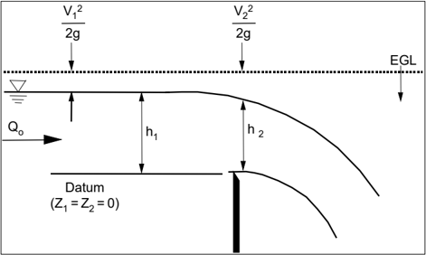

Assuming hydrostatic pressure at sections 1 and 2, then Pi/γ = hi. Thus, Bernoulli's equation is:

<!-- formula-not-decoded -->

By setting the datum at the top of the weir, z1 = z2 = 0, assuming that the velocity head at section 1 is much smaller than the velocity head at section 2, and recalling that the flow passes through critical depth as it passes over the weir, then V2 = VC and h2 = yC, reducing equation 10.27 to:

<!-- formula-not-decoded -->

The velocity head is Vc 2 /2g = yc/2. Defining h = h1, then:

<!-- formula-not-decoded -->

Solving equation 10.25 for qu, it then follows that:

<!-- formula-not-decoded -->

Letting Q = Lqu, the general weir equation is:

<!-- formula-not-decoded -->

where:

Q =

Discharge over a horizontal weir, ft 3 /s (m 3 /s)

h =

Head (depth) of approach flow above the weir, ft (m)

L =

Weir length, ft (m)

g =

Gravitational acceleration, 32.2 ft/s 2  (9.81 m/s 2 ).

Equation 10.31 represents ideal flow over a weir.  Because actual weirs perform less efficiently, engineers modify the equation by the addition of a weir coefficient,  Cw  The  value  of  Cw  depends on the  type of weir, head,  weir height, and other factors.  It also  includes the initial quotient in equation 10.31.

<!-- formula-not-decoded -->

For the sharp-crested weir of this derivation, values  of  C w  can  range  from  0.27  to  0.38. The  range reflects the variation in losses

## Weir Coefficient

It is significant to note that many presentations of the weir equation embed the 2g into the coefficient, Cw, making it a dimensioned rather than dimensionless quantity. By keeping the gravity term in the equation, Cw becomes a property of a specific weir type and not dependent on the system of units.

from alternative weir/flow configurations. Losses depend on the depth of flow over approaching the weir, weir length, weir thickness, and weir height. Even laboratory studies  have difficulty accurately estimating  Cw.  Designers can use a value of 0.37 for sharp-crested rectangular weirs where more information is not available.

and

Equation  10.32  provides the discharge relationship for sharp-crested weirs with no contractions (illustrated in Figure 10.19). Designers typically treat flow over the top edge  of a riser pipe as flow over a sharp-crested weir with no end constrictions.

end

Equation 10.33 provides  the  discharge  equation  for  sharp-crested  weirs  with  end  contractions (illustrated  in Figure 10.19).  As  indicated  above,  the  value  of  the  coefficient  C w varies  with  the ratio  h/hc  (see  Figure  10.20 for  definition  of  terms).  For  values  of  the  ratio  h/h c  less  than  0.3, designers often use a constant Cw of 0.415.

<!-- formula-not-decoded -->

Submergence affects sharp-crested weirs when the tailwater rises above the weir crest elevation, as shown in Figure 10.20. These effects reduce discharge over the weir. The discharge equation for a submerged sharp-crested weir is (Brater and King 1976):

<!-- formula-not-decoded -->

where:

Qs =

Submerged flow, ft 3 /s (m 3 /s)

Q =

Unsubmerged weir flow, ft 3 /s (m 3 /s)

h1 =

Upstream head above crest, ft (m)

h2 =

Downstream head above crest, ft (m)

Figure 10.19. Sharp-crested weir contractions.

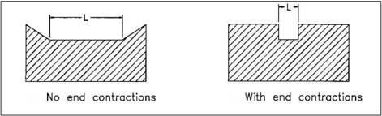

Figure 10.20. Sharp-crested weir submergence.

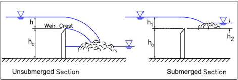

## 10.3.3.3.2 Broad-Crested Weir

Equation 10.32 also applies to a broad-crested weir. If the upstream edge of a broad-crested weir is so rounded as to prevent contraction and if the slope of the crest is as great as the loss of head due to friction, flow will pass through critical depth at the weir crest; this gives the maximum weir coefficient value of 0.41. For sharp corners on the broad-crested weir, use a minimum value of 0.29. Table 10.7 provides additional information on Cw values as a function of weir crest breadth and head.

## 10.3.3.3.3 V-Notch Weir

Figure 10.21 illustrates discharge through a v -notch weir. Calculate discharge from  (Brater and King 1976):

<!-- formula-not-decoded -->

where:

Q =

Discharge, ft 3 /s (m 3 /s)

Θ =

Angle of v-notch, degrees

h =

Head on apex of v-notch, ft (m)

Cw =

Weir coefficient for a v-notch weir (typically equal to 0.31)

Table 10.7. Broad-crested weir coefficient values (adapted from Brater and King 1976).

| Head * (ft)   |   Breadth of Weir Crest (ft) |   Breadth of Weir Crest (ft) |   Breadth of Weir Crest (ft) |   Breadth of Weir Crest (ft) |   Breadth of Weir Crest (ft) |   Breadth of Weir Crest (ft) |   Breadth of Weir Crest (ft) |   Breadth of Weir Crest (ft) |   Breadth of Weir Crest (ft) |   Breadth of Weir Crest (ft) |   Breadth of Weir Crest (ft) |
|---------------|------------------------------|------------------------------|------------------------------|------------------------------|------------------------------|------------------------------|------------------------------|------------------------------|------------------------------|------------------------------|------------------------------|
| Head * (ft)   |                         0.5  |                         0.75 |                         1    |                         1.5  |                         2    |                         2.5  |                         3    |                         4    |                         5    |                        10    |                        15    |
| 0.2           |                         0.35 |                         0.34 |                         0.34 |                         0.33 |                         0.32 |                         0.31 |                         0.3  |                         0.3  |                         0.29 |                         0.31 |                         0.33 |
| 0.4           |                         0.36 |                         0.35 |                         0.34 |                         0.33 |                         0.33 |                         0.32 |                         0.32 |                         0.32 |                         0.31 |                         0.32 |                         0.34 |
| 0.6           |                         0.38 |                         0.36 |                         0.34 |                         0.33 |                         0.33 |                         0.32 |                         0.33 |                         0.34 |                         0.34 |                         0.34 |                         0.34 |
| 0.8           |                         0.41 |                         0.38 |                         0.36 |                         0.33 |                         0.32 |                         0.32 |                         0.33 |                         0.33 |                         0.33 |                         0.34 |                         0.33 |
| 1.0           |                         0.41 |                         0.39 |                         0.37 |                         0.34 |                         0.33 |                         0.33 |                         0.33 |                         0.33 |                         0.33 |                         0.33 |                         0.33 |
| 1.2           |                         0.41 |                         0.4  |                         0.38 |                         0.36 |                         0.34 |                         0.33 |                         0.33 |                         0.33 |                         0.33 |                         0.34 |                         0.33 |
| 1.4           |                         0.41 |                         0.41 |                         0.4  |                         0.36 |                         0.35 |                         0.33 |                         0.33 |                         0.33 |                         0.33 |                         0.33 |                         0.33 |
| 1.6           |                         0.41 |                         0.41 |                         0.41 |                         0.38 |                         0.36 |                         0.34 |                         0.33 |                         0.33 |                         0.33 |                         0.33 |                         0.33 |
| 1.8           |                         0.41 |                         0.41 |                         0.41 |                         0.38 |                         0.36 |                         0.34 |                         0.33 |                         0.33 |                         0.33 |                         0.33 |                         0.33 |
| 2.0           |                         0.41 |                         0.41 |                         0.41 |                         0.38 |                         0.36 |                         0.34 |                         0.34 |                         0.33 |                         0.33 |                         0.33 |                         0.33 |
| 2.5           |                         0.41 |                         0.41 |                         0.41 |                         0.41 |                         0.38 |                         0.36 |                         0.35 |                         0.34 |                         0.33 |                         0.33 |                         0.33 |
| 3.0           |                         0.41 |                         0.41 |                         0.41 |                         0.41 |                         0.4  |                         0.38 |                         0.36 |                         0.34 |                         0.33 |                         0.33 |                         0.33 |
| 3.5           |                         0.41 |                         0.41 |                         0.41 |                         0.41 |                         0.41 |                         0.4  |                         0.37 |                         0.34 |                         0.33 |                         0.33 |                         0.33 |
| 4.0           |                         0.41 |                         0.41 |                         0.41 |                         0.41 |                         0.41 |                         0.41 |                         0.38 |                         0.35 |                         0.34 |                         0.33 |                         0.33 |
| 4.5           |                         0.41 |                         0.41 |                         0.41 |                         0.41 |                         0.41 |                         0.41 |                         0.41 |                         0.36 |                         0.34 |                         0.33 |                         0.33 |
| 5.0           |                         0.41 |                         0.41 |                         0.41 |                         0.41 |                         0.41 |                         0.41 |                         0.41 |                         0.38 |                         0.35 |                         0.33 |                         0.33 |
| 5.5           |                         0.41 |                         0.41 |                         0.41 |                         0.41 |                         0.41 |                         0.41 |                         0.41 |                         0.41 |                         0.36 |                         0.33 |                         0.33 |

*Measured a distance at least 2.5 times critical depth upstream of the weir.

Figure 10.21. V-notch weir.

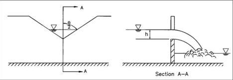

## 10.3.3.3.4 Proportional Weir

Although more complex to design and construct, a proportional weir may significantly reduce the required storage volume for a given site. The proportional weir differs from other control devices by  having  a  linear  head -discharge  relationship.  This  relationship  is  achieved  by  allowing  the discharge  area  to  vary  nonlinearly  with  head  with  a  configuration  shown  in Figure 10.22.  The following equation describes the relations between the dimensions of a proportional weir (Sandvik 1985):

<!-- formula-not-decoded -->

Discharge for a proportional weir is (Sandvik 1985):

<!-- formula-not-decoded -->

where:

Q =

Discharge, m 3 /s (ft 3 /s)

h =

Head above horizontal sill, ft (m)

Cw =

Weir coefficient for a proportional weir (typically equal to 0.62)

Figure 10.22. Proportional weir.

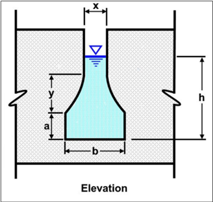

Example 10.11: Detention pond riser hydraulics.

Objective: Establish a stage-discharge rating curve for a riser pipe for water surface elevations in the pond between 32.8 ft (10.0 m) and 39.4 ft (12.0 m).

Given: The diameter (D), crest elevation (EL), and weir height (Hc) for a riser pipe as shown in Figure 10.23 with the following characteristics:

D = 1.74 ft (0.53 m)

EL = 35.4 ft (10.8 m)

Hc = 2.6 ft (0.8 m)

Since the riser pipe functions as both a weir and an orifice (depending on stage), develop the rating by comparing the stage-discharge produced by both weir and orifice flow.

## Step 1. Establish relationship between orifice flow and head.

Using equation 10.23 for orifices with D = 1.74 ft yields the following relationship between the effective head on the orifice (Ho) and the resulting discharge:

<!-- formula-not-decoded -->

= 11.44 ho 0.5

Figure 10.23. Riser pipe configuration for example.

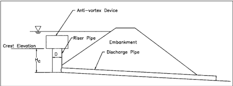

## Step 2. Establish relationship between weir flow and head.

Using the dimensionless equation 10.32 for sharp-crested weirs with CW = 0.41 (h/hc assumed less than 0.3), and L = pipe circumference = 5.5 ft yields the following relationship between the effective head on the riser (h) and the resulting discharge:

<!-- formula-not-decoded -->

## Step 3. Tabulate stage-discharge relationship.

Using the relationships established in steps 1 and 2, develop the stage-discharge curve, shown in Table 10.8.

Solution:

Table 10.8. Stage-discharge relationship.

|   Stage (ft) |   Effective Head (ft) | Orifice Flow (ft 3 /s)   | Weir Flow (ft 3 /s)   |
|--------------|-----------------------|--------------------------|-----------------------|
|         32.8 |                  0    | 0                        | 0                     |
|         35.4 |                  0    | 0                        | 0                     |
|         35.8 |                  0.33 | 6.6                      | 3.5 *                 |
|         36.1 |                  0.66 | 9.2 *                    | 9.8                   |
|         36.7 |                  1.31 | 13.1 *                   | 27.5                  |
|         37.4 |                  1.97 | 15.9 *                   | 50.6                  |
|         38.1 |                  2.63 | 18.7 *                   | 77.7                  |
|         38.7 |                  3.28 | 20.8 *                   | 108.8                 |
|         39.4 |                  3.94 | 22.6 *                   | 143.2                 |

*Designates controlling flow.

The flow condition (orifice or weir) producing the lowest discharge for a given stage determines the controlling relationship. As illustrated in Table 10.8, at a stage of 35.76 ft (10.9 m) weir flow controls the discharge through the riser. However, at and above a stage of 36.09 ft (11.0 m), orifice flow controls the discharge through the riser.

## 10.3.3.4 Auxiliary Spillway

An auxiliary (emergency) spillway provides a controlled overflow relief for storm flows exceeding the design discharge for the storage facility. A broad-crested overflow weir, as shown in Figure 10.24, represents a suitable emergency spillway for highway detention facilities. The transverse cross-section of the weir cut is typically trapezoidal in shape  for ease  of construction.  The embankment  height  is  typically  at  an  elevation  1  ft  to  2  ft  above  the  maximum  design  storage elevation. It is preferable to have a freeboard of 2 ft minimum. However, for very impoundments, less than 1- to 2-acre surface area an absolute minimum of 1-foot of freeboard may  be acceptable  (UDFCD  2001).  The  USDA -NRCS  Engin eering Field Handbook  (2021) provides design information for auxiliary spillways.

## 10.3.3.5 Composite Stage-Discharge Relationships

Presented earlier in this chapter,  Figure 10.3 shows a schematic of a basin with an outlet structure consisting  of  a  riser  and  a  pipe  outlet  that  together  form  the  outlet  structure  controlling  the discharge  from  the  basin.  The  riser  may  include  one  or  more  weir  or  orifice  openings.  The designer evaluates the outlet structure to develop a composite stage-discharge curve. In addition to determining the diameter of the pipe outlet, the designer also establishes invert elevations of the pipe. For a basin with a permanent pool, both the volume of dead storage and corresponding elevation of the permanent pool are set.

small the

In the sizing of outlet structures, the designer determines both the required volume of storage and the physical characteristics of the structure including the outlet pipe dimensions; the dimensions; orifice and weir dimensions; and the elevations of  the pipe outlet, weirs, and orifices. A single-stage riser provides for a single control feature suitable for satisfying a single hydrologic criterion. A multiple-stage riser provides for multiple hydrologic criteria.

riser

Figure 10.24. Profile and cross-section of excavated earth spillway. Source: USDA-NRCS (2021).

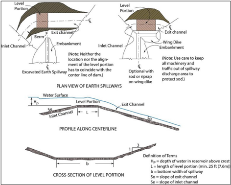

Estimating the characteristics of an outlet structure uses the following inputs:

of

- Watershed characteristics, including area, preand post-development times concentration, and pre-  and  post-development  curve  numbers  (assuming  NRCS  CN procedures are used for abstractions).
- Rainfall depth(s) for the design storm(s).
- Characteristics of the riser and outlet pipe structure, including pipe roughness (n), length, and an initial estimate of the diameter.
- Elevation information, including stage vs. storage values, the wet pond elevation, if applicable, and the elevation of the centerline of the pipe.
- Hydrologic and hydraulic models, including a model for estimating peak flows and runoff depths,  a  model  for  estimating  the  volume  of  storage  as  a  function  of  preand postdevelopment  peak  flows,  and  a  model  for  estimating  weir  and  orifice  coefficients,  as appropriate.

## 10.3.3.5.1 Single-Stage Risers

Single-stage  risers,  as  shown  in  Figure 10.25,  provide  runoff  control  for  cases  where  practice specifies one exceedance frequency. The following procedure estimates both characteristics and the volume of storage (adapted from Woodward 1983).

the

Figure 10.25. Single-stage riser characteristics for (a) weir flow and (b) orifice flow.

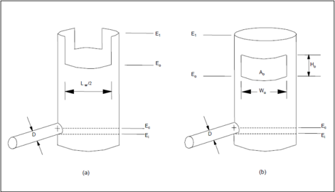

## Step 1.   Design the culvert barrel.

Design the culvert barrel using the procedures of HDS -5 (FHWA 2012a) and set the culvert invert elevation. To simplify the riser design, the designer selects a culvert so that the maximum culvert headwater, which is based on the maximum outlet design discharge, is no higher than the invert of  the  orifice  opening  (or  weir).  If  this  is  not  the  case,  this  condition  'submerges'  the  opening forcing the designer into an iterative procedure to establish the stage-discharge relationship.

## Step 2.   Estimate the preliminary storage volume.

Estimate  the  preliminary  storage  volume,  V s,  using  one  of  the  techniques  described  in  Section 10.3.1.

## Step 3.   Estimate the dead storage.

Using the elevation E o of either the weir or the bottom of the orifice, obtain the volume of dead storage Vd from the elevation-storage curve.

## Step 4.   Estimate the total storage needed.

Compute the total storage:

<!-- formula-not-decoded -->

## Step 5.   Obtain highest water surface elevation.

Enter the elevation-storage curve with Vt to obtain the water surface elevation, El.

riser

## Step 6.   Size the outlet opening.

For an orifice, determine its characteristics:

- Assume an orifice height, Ho.
- Compute the area of the orifice opening assuming unsubmerged flow, A:

<!-- formula-not-decoded -->

where:

Ao =

Orifice opening area, ft 2  (m 2 )

Qpb =

Discharge through the orifice (pre-development), ft 3 /s (m 3 /s)

E1 =

Water surface elevation upstream of the orifice, ft (m)

Eo =

Elevation of the bottom of the orifice, ft (m)

g =

Gravitational acceleration, 32.2 ft/s 2  (9.81 m/s 2 )

Ho/2 adjusts for head being measured from the center of the orifice.

For a rectangular orifice, compute the width of the orifice opening Wo:

<!-- formula-not-decoded -->

For a weir, determine the weir length for unsubmerged flow:

<!-- formula-not-decoded -->

## Step 7.   Verify performance with storage routing.

Verify the design performance using storage routing. (The approximate procedures for estimating storage volume do not account for performance of the outlet structure throughout the passage of the inflow hydrograph and may result in an under- or over-design.)

Example 10.12: Single-stage riser design.

Objective:

Reduce the post-development 0.5 AEP peak flow to the pre-development peak flow.

Given: A  single-stage  riser  is  being  designed  for  a  pond.  It  must  reduce  postdevelopment 0.5 AEP peak  to  the  pre-development  peak  flow.  The  outlet  structure  will  consist  of  an  outlet  pipe culvert and a riser with a rectangular orifice. The pond will include permanent pool elevation for water quality purposes.

A =

11.2 ac (4.53 ha)

Q2,post =

17.7 ft 3 /s (0.5 m 3 /s)

Q2,pre =

2.8 ft 3 /s (0.08 m 3 /s)

Invert =

96.8 ft (29.5 m) (pond bottom)

ELpool = 98.8 ft (30.1 m) (dead storage)

## Step 1.  Select culvert size, slope, and material.

First, select and locate a culvert barrel so that the headwater at the culvert entrance under the design discharge does not reach the invert of the orifice forcing it to operate under submerged conditions. Use the procedures of HDS-5 (FHWA 2012a) and consider the site constraints on culvert slope and invert location.

D =

36 inches (910 mm)

L =

34.4 ft (10.5 m)

n =

0.012 (reinforced concrete pipe)

If the selected size is not available, specify the next available larger size. Place the entrance invert at an elevation of 96.1 ft (29.3 m). The designer selects the culvert inlet so that the culvert headwater, i.e., the depth of water inside the riser, does not rise above the lowest riser opening for the design conditions, where possible. The designer also adjusts the culvert invert to be compatible with site conditions.

## Step 2.  Develop Stage-storage curve.

Section 10.3.2 gives details on constructing a stage-storage relationship. For this example, Table 10.9 gives the stage-storage relationship at the site of the detention structure. Based on the permanent pool elevation, interpolate the dead storage from the stage-storage curve to be 13,400 ft 3 .

## Step 3.  Estimate total storage.

Compute the active storage using one of the methods presented in Section  10.3.1, estimating it at 23,700 ft 3 . The total storage equals the sum of the active and dead storages, 37,100 ft 3 .

## Step 4.  Find the maximum stage.

Find  the  elevation  corresponding  to  the  total  storage  by  interpolating  the  stage-storage curve, which is 101.4 ft.

## Step 5.  Compute orifice flow.

The  orifice invert was  established  at an  elevation of 98.8 ft to create  the  permanent  pool. Assuming an initial orifice height of 0.5 ft, compute the area of the orifice in the riser with equation 10.39 to create an outflow of 2.8 ft 3 /s at the assumed stage in the pond:

<!-- formula-not-decoded -->

<!-- formula-not-decoded -->

## Solution:

One possible orifice is 0.5 ft by 0.76 ft. If the calculated dimensions are not practical construction sizes, conduct an iterative trial process with practical dimensions resulting in the same performance until finding suitable dimensions. It is not usually appropriate to select the next larger available dimensions because this will allow excessive discharge through the orifice. Using storage routing, check the design before finalizing. The diameter of the riser (if it is also circular) usually equals 2 to 3 times the diameter of the outlet culvert.

Table 10.9. Stage-storage curve.

|   Elevation (ft) | Volume (ft 3 )   |
|------------------|------------------|
|             96.8 | 0                |
|             97   | 1,390            |
|             97.5 | 4,410            |
|             98   | 7,620            |
|             98.5 | 11,240           |
|             99   | 15,540           |
|             99.5 | 19,850           |
|            100   | 24,440           |
|            100.5 | 29,280           |
|            101   | 34,120           |
|            101.5 | 39,940           |
|            102   | 46,170           |
|            102.5 | 52,860           |
|            103   | 60,120           |
|            103.5 | 68,420           |
|            104   | 77,990           |
|            104.5 | 88,030           |

## 10.3.3.5.2 Multiple-Stage Risers

Designers use multi-stage risers where two or more exceedance frequencies apply.  Figure 10.26 depicts  a  two-stage  riser,  which  is  similar  to  the  single-stage  riser  except  that  it  includes  either two weirs or a weir and an orifice. For the weir/orifice combination, the orifice controls the more frequent  event,  and  the  weir  controls  the  larger  event.  Designers  refer  to  the  runoff  from  the smaller and larger events as the low-stage and high-stage events, respectively. Recognizing that the two events will not occur simultaneously, designers control the high-stage event using both the low-stage weir or orifice and the high-stage weir.

The procedure for a multi-stage riser follows the same general steps as for the single -stage riser, except the designer determines both the high-stage weir and low -stage outlet characteristics. The procedure uses the same inputs for sizing a two-stage riser as for a single-stage riser but relies on computing many of the values for both the low-stage and the one or more high-stage events.

Designers can size a two-stage riser for the cases where the low -stage outlet is either a weir or an orifice and the high-stage outlet is a weir using the following steps:

## Step 1.   Design culvert barrel.

Design the culvert barrel using the same process as for the single-stage riser.  For the multi-stage riser, the maximum design discharge corresponds to the highest-stage event.

Figure 10.26. Two-stage riser.

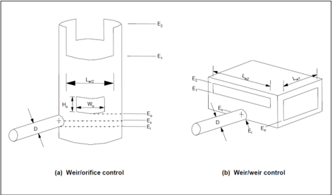

## Step 2.   Design the low-stage opening.

Design the low-stage opening as described for a single-stage riser. If the low -stage opening is a weir of the configuration shown in  Figure 10.26(b), it operates independently up to an elevation equal to the invert of the high-stage weir.

## Step 3.   Estimate the high-stage storage volume.

Estimate the appropriate high-stage storage volume, Vs2 (Section 10.3.1).

## Step 4.   Compute the high-stage storage.

Compute the total high-stage storage:

<!-- formula-not-decoded -->

## Step 5.   Obtain the water surface elevation.

Enter the elevation-storage curve with Vt2 to obtain the water surface elevation, E2.

## Step 6.   Estimate discharge through the low-stage opening.

Estimate the discharge through the low-stage opening during the high-stage event.

If the low-stage outlet is an orifice, the discharge is:

<!-- formula-not-decoded -->

If the low-stage outlet is a weir, the discharge is:

q

o2 =C

2gL

(

E

-

E

1.5

)

w1

w1

2

0

=

## Step 7.   Set high-stage invert.

Set the invert of the high-stage weir equal to E1 (maximum elevation during the low-stage event).

## Step 8.   Compute high-stage weir length.

Compute the high-stage weir length:

<!-- formula-not-decoded -->

## Step 9.   Analyze additional high-stage openings.

If  designing  additional  high-stage  openings,  repeat  steps  3  through  8  accounting  for  all other openings that are active during the event.

## Step 10.  Verify with routing.

Verify  the  design  performance  using  storage  routing  to  confirm  that  the  outlet  structure  and storage volume perform as intended.

Table 10.10 summarizes  a  composite  stage-discharge  relationship  for  an  outlet  control  device consisting of a low flow orifice and a riser pipe connected to an outflow pipe. The structure also includes an emergency spillway. Table 10.6, Table 10.8, and emergency spillway computations summarize the individually  calculated  components.  Using  the  methods  in  Section  10.3.3.4,  the spillway passes 0, 39.55, and 55.8 ft 3 /s at elevations of 38.1, 38.7, and 39.4 ft, respectively. The total discharge equals the sum of individual components at each stage.

Figure 10.27 illustrates the same information. Initially, the low flow orifice controls the discharge. At an elevation of 35.4 ft the water surface in the storage facility reaches the top of the riser pipe and begins to flow into the riser. The flow at this point equals a combination of the flows through the orifice and the riser. Orifice flow through the riser controls the riser discharge above a stage of 36.1 ft. At an elevation of 38.0 ft, flow begins to pass over the emergency spillway. Beyond this point, the total discharge from the facility equals the sum of the flows through the low flow orifice, the riser pipe, and the emergency spillway. Additionally, the designer ensures that the outlet pipe from the detention basin is large enough to carry the total flows from the low orifice and the riser section so that the outlet pipe does not limit the flow from the basin.

Table 10.10. Composite stage-discharge tabulation.

|   Stage (ft) |   Low Flow Orifice (ft 3 /s) |   Riser Orifice Flow (ft 3 /s) |   Emergency Spillway (ft 3 /s) |   Total Discharge (ft 3 /s) |
|--------------|------------------------------|--------------------------------|--------------------------------|-----------------------------|
|         32.8 |                         0    |                           0    |                           0    |                        0    |
|         33.5 |                         0.61 |                           0    |                           0    |                        0.61 |
|         34.1 |                         0.93 |                           0    |                           0    |                        0.93 |
|         34.8 |                         1.2  |                           0    |                           0    |                        1.2  |
|         35.4 |                         1.39 |                           0    |                           0    |                        1.39 |
|         36.1 |                         1.59 |                           9.18 |                           0    |                       10.77 |
|         36.7 |                         1.74 |                          13.07 |                           0    |                       14.81 |
|         37.4 |                         1.89 |                          15.89 |                           0    |                       17.78 |
|         38.1 |                         2.04 |                          18.72 |                           0    |                       20.76 |
|         38.7 |                         2.16 |                          20.84 |                          39.55 |                       62.55 |
|         39.4 |                         2.29 |                          22.6  |                          55.8  |                       80.69 |

Figure 10.27. Typical composite stage-discharge relationship.

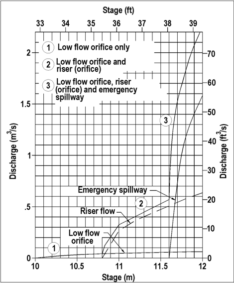

## 10.4  Water Budgets for Wet Ponds

Designers  prepare  water  budgets  for  permanent  pool  facilities  to  confirm  that  the  pool  will  be present  under  the  conditions  intended  by  the  designer.  At  a  minimum,  these  typically  include average rainfall conditions but may also include alternative wet or dry conditions. A water budget considers all significant inflows and outflows, including, but not limited to, rainfall, infiltration, exfiltration, evaporation, and outflow.
