# Chapter 11 - Urban Stormwater Quality

- Source: hif24006.pdf
- Generated: 2025-12-28T23:40:53+00:00
- Chunk: 12/13
- Estimated tokens: ~10,367
- Total pages: 313
- Type: chapter

## Chapter 11 - Urban Stormwater Quality

This  chapter  provides  an  overview  of  urban  stormwater  quality  practices  specific  to  roadway applications. The purpose of an urban  best management practice (BMP) is to mitigate the adverse impacts  of  development  activity.  BMPs  can  provide  stormwater  control  benefits  and  pollutant removal capabilities.  Evaluation  of  the  available  BMP  options  considers  sitespecific  conditions and  overall  watershed  management  objectives.  Often,  requirements  for  water  quality  practices derive  from  those  for  the  National  Pollution  Discharge  Elimination  System  (NPDES) Program under the Clean Water Act as discussed in Chapter 2. [33 U.S.C. § 1342]. Local ordinances and regulations  vary  and  may  not  require  water  quality  practices  in  specific  project  locations.  Early coordination  with  project  environmental  specialists  assists  in  the  recognition  of  water  quality requirements and can facilitate identification and design of effective BMPs.

## 11.1  BMP Alternatives and Selection

Engineers  consider  several  factors  to  determine  the  suitability  of  a  particular  BMP:  physical conditions  at  the  site,  the  watershed  area,  stormwater  quantity  objectives,  and  water  quality objectives. Malhotra and Normann (1994) developed a matrix of site selection criteria for several BMPs and outlined site selection restrictions for each BMP. The Watershed-Based Stormwater Mitigation Toolbox (WBSMT), a spreadsheet-based planning level tool, uses nationally available geographic information systems (GIS) data to help State Departments of Transportation (DOTs) identify and prioritize potential stormwater runoff mitigation opportunities (NASEM 2017).

Schueler (1987) provided a comparative analysis of pollutant removal for various BMP designs. Generally, BMPs provide high pollutant  removal  for  non-soluble  particulate pollutants, such as suspended sediment and trace  metals.  BMPs  typically  achieve  much lower rates for soluble pollutants, such as phosphorus and nitrogen.

An important parameter BMP designers consider  is  the  runoff  volume  treated,  often called the first flush volume or the water quality volume  (WQ V). This initial flush of runoff  carries  the  most  significant  non-point pollutant  loads.  Methods  to  quantify  the  first flush or V  WQvary. Most commonly, engineers estimate first flush volume as:

- The first 0.5 inch of runoff impervious area.
- The first 0.5 inch of runoff of the entire catchment area.
- The first 1.0 inch of rainfall resulting in runoff from the entire catchment area.

minor

In  general  terms,  the  greater  the  volume  treated,  the  better  the  pollutant  removal  efficiency. However, treating volumes in excess of 1.0 inch of catchment area results in only improvements in pollutant removal efficiency (Schueler 1987).

## Best Management Practices

In 1977, the Clean Water Act (CWA) introduced the concept and term, 'best management practices' (BMPs) as an approach to controlling water pollution. BMPs manage stormwater by mitigating:

- Quantity - attenuate urbanized peak flows and store runoff volumes.
- Quality - reduce pollutant loads.
- Source - prevent or reduce the introduction of pollutants to stormwater with nonstructural measures.

of

In  addition  to  Malhotra  and  Normann  (1994)  and  Schueler  (1987),  researchers  have  created additional resources addressing BMP selection, performance, and evaluation of alternatives:

- Stormwater  Best  Management  Practices  in  an  Ultra-Urban  Setting:  Selection  and Monitoring (FHWA 2000).
- State of the Practice in Data Collection and Performance Measurement (FHWA 2014a).
- Stochastic  Empirical  Loading  and  Dilution  Model  (SELDM) for  evaluating  the  adverse effects of runoff from highway projects (Granato 2013).

## 11.2  Pollutant Loads

Estimated pollutant loadings for both pre- and post-development scenarios indicate the impact of highway development activities in a watershed. Several methods and models employ algorithms for pollutant loading estimation. The aptly named, empirical Simple  Method applies to sites of less than 1 mi 2  (Schueler 1987). To yield an average annual loading estimate, L, the following equation multiplies an average pollutant concentration by the annual runoff.

| L = c R C   | A   | (11.1)                                                                            |
|-------------|-----|-----------------------------------------------------------------------------------|
| where:      |     |                                                                                   |
| L           | =   | Average annual loading, lb (chemical constituents) or billion colonies (bacteria) |
| c           | =   | Unit conversion factor, 0.226 (chemical) or 103 (bacteria)                        |
| R           | =   | Annual runoff (inch)                                                              |
| C           | =   | Pollutant concentration (mg/l) for chemical constituents                          |
|             | =   | Bacteria concentration (1,000/ml) for bacteria                                    |
| A           | =   | Area (ac)                                                                         |

The  FHWA  developed  a  computer  model  that  characterizes  stormwater  runoff  pollutant  loads from highways and predicts impacts to receiving water, specifically lakes and streams. The fourvolume FHWA report Pollutant Loadings and Impacts from Highway Stormwater Runoff (Driscoll 1990) contains more detail on the estimating procedures .

More recently, the FHWA, in cooperation with the U.S. Geological Survey ( USGS), developed the highway runoff  database  (HRDB) (FHWA  2009)   and the SELDM  to  estimate and simulate stormflow volumes, concentrations, and loads of highway and urban runoff constituents (Granato 2013,  USGS  2020).  HRDB  and  SELDM provide  data,  tools,  and  techniques  to  help transform complex scientific data into meaningful information about the risk of adverse effects of runoff on receiving  waters,  the  potential  need  for  mitigation  measures,  and  the  potential  effectiveness  of such management measures for reducing these risks (Granato 2013, Granato 2014, Granato and Jones 2019).

Several  other  stormwater  management  software  applications  and  tools  can  generate  pollutant loads and the fate and transport of the pollutants:

- Stormwater Management Model (SWMM) (USEPA 2020).
- Storage, Treatment, Overflow, Runoff Model (STORM) (USACE 1977).
- Hydrologic Simulation Program, Fortran (HSPF) (USEPA 2002).
- Spreadsheet Tool for Estimating Pollutant Loads (STEPL) (USEPA 2018).

## 11.3  Structural BMPs

Structural BMPs consist of stormwater management facilities, created by moving earth, planting vegetation,  or  construction,  or  a  combination  of  these  elements.  Storage  and  infiltration  BMPs represent the two categories of structural BMPs.

## 11.3.1 Storage BMPs

Storage  BMPs  include  extended  detention  dry  ponds  or  wet  ponds.  They  function  primarily  to store stormwater runoff and remove pollutants by promoting settling.

## 11.3.1.1 Extended Detention Dry Ponds

Following a storm event, extended detention dry ponds temporarily store a portion of stormwater runoff  in  depressed  basins.  These  facilities  typically  store  water  for  up  to  48  hours  following  a storm by means  of a hydraulic control structure to restrict outlet discharge. The extended detention  of  the  stormwater  provides  an  opportunity  for  urban  pollutants  carried  by  the  flow  to settle out. The water quality benefits of a detention dry pond increase by extending the detention time. If the pond retains stormwater for 24 hours or more, it can remove as much as 90 percent of particulates. However, extended detention only slightly reduces levels of soluble phosphorus and nitrogen found in urban runoff. Extended  detention dry  ponds typically  do not have a permanent water pool between storm events.

Figure 11.1 shows the plan and profile views of an extended detention facility. In addition to the storage  area,  such  facilities  may  include  a  stabilized  low flow  channel,  an  extended  detention control device (riser with hood), and an emergency spillway.

Extended detention dry ponds reduce the frequency of erosive floods downstream, depending on the  quantity  of  stormwater  detained  and  the  time  over  which  stormwater  is  released.  A  costeffective BMP, extended detention rarely involves construction costs more than 10 percent above those for conventional dry ponds that have shorter detention times and are used as a flood control device.

the

Extended detention dry ponds benefits may include creation of local wetland and wildlife habitat, limited protection of downstream aquatic habitat, and recreational use opportunities in infrequently  inundated  portion  of  the  pond.  Negative  impacts  may  include  occasional  nuisance and  aesthetic  problems  in  the  inundated  portion  of  the  pond  (e.g.,  odor,  debris,  and  weeds); moderate to high routine maintenance requirements; and the eventual need for sediment removal. Extended  detention  generally  applies  to  most  new  development  situations  and  presents  an attractive option for retrofitting existing dry and wet ponds.

## 11.3.1.2 Wet Ponds

A wet pond, or retention pond, serves the dual purpose of controlling the volume of stormwater runoff and treating the runoff for pollutant removal. Wet ponds store a permanent pool during dry weather. Hydraulic outlet devices designed to discharge flows at various elevations and peak flow rates release overflow from wet ponds. Figure 11.2 shows a plan and profile view of a typical wet pond and its components.

Figure 11.1. Extended detention pond.

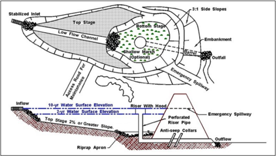

Figure 11.2. Typical wet pond schematic.

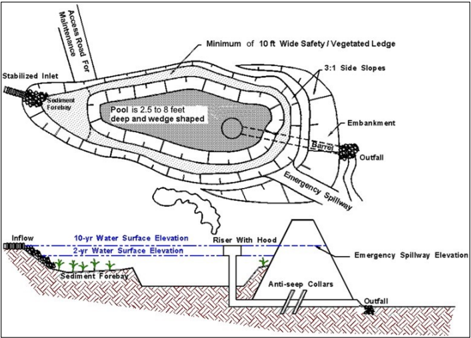

Wet ponds represent an effective water quality BMP. If properly sized and maintained, wet ponds can achieve a high removal rate of sediment, biological oxygen demand, organic nutrients, and trace  metals.  Biological  processes  within  the  pond  also  remove  soluble  nutrients  (nitrate  and ortho-phosphorus)  that  contribute  to  nutrient  enrichment  (eutrophication).  Wet  ponds  are  most cost-effective  in  larger,  more  intensively  developed  sites. Positive  impacts  of  wet  ponds  can include creation of local wildlife habitat; higher property values; recreation; and landscape amenities. Negative impacts can include possible upstream and downstream habitat degradation; downstream sediment imbalance; potential safety hazards; occasional nuisance problems (e.g., odor, algae, and debris); and the eventual need for costly sediment removal.

## 11.3.2 Infiltration BMPs

Infiltration BMPs function primarily to remove pollutants by percolating stormwater runoff through soil strata. Common  applications of infiltration BMPs  include infiltration/exfiltration trenches, infiltration basins, and sand filters.

## 11.3.2.1 Infiltration/Exfiltration Trenches

Infiltration  trenches  are  shallow  excavations  which  have  been  backfilled  with  a  coarse  stone media. The trench forms an underground reservoir which collects runoff and either exfiltrates it to the  subsoil  or  diverts  it  to  an  outflow  facility.  The  trenches  primarily  serve  as  a  BMP  providing moderate to high removal of fine particulates and soluble pollutants, but they also serve to reduce peak flows. Infiltration trenches only work with permeable soils and where the groundwater table is below the bottom of the trench.  Figure 11.3 shows an example of surface trench design (Schueler 1987). Engineers frequently use infiltration trenches for highway median strips and parking lot 'islands' (depressions between two lots or adjacent sides of one lot). The components  of  an  infiltration  trench  can  include  backfill  material,  observation  wells,  per meable filter, overflow pipes, emergency overflow berms, and a vegetated buffer strip.

seasonal

Figure 11.3. Median strip trench design.

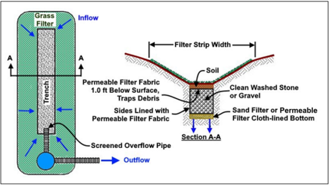

Advantages  of  infiltration  trenches  include  preservation  of  the  natural  groundwater  recharge capabilities of a site and the relative ease of fitting them into the margins, perimeters, and other unused areas of a development site. Few other BMPs offer pollutant removal on small sites or infill developments.

water,

The  disadvantages  associated  with  infiltration  trenches  include  practical  difficulties  in  keeping sediment  out of the structure during site construction (particularly if development  occurs  in phases), the need for careful construction of the trench and regular maintenance thereafter, and a  possible  risk  of  groundwater  contamination.  Frequent  clogging  involves  routine  maintenance, which has a cost impact. Designers may wish to examine the limitations, risks, and benefits of infiltration BMPs  in the context of the built and natural environments (e.g., surface groundwater, soils, and infrastructure) (NASEM 2019).

There are three basic trench systems: complete exfiltration, partial exfiltration, and water quality exfiltration. In a complete exfiltration system , water can exit the trench only by passing through the stone reservoir and into the underlying soils (i.e., it includes no positive pipe outlet from the trench). As  a result, the stone reservoir must  be  large  enough  to  accommodate  the  entire expected design runoff volume, less any runoff volume lost via exfiltration during the storm. The complete  exfiltration  system  provides  total  peak  flow,  volume,  and  water  quality  control  for  all rainfall events less than or equal to the design storm. To handle any excess runoff from storms greater than the design storm, a rudimentary overflow channel, such as a shallow berm or dike, may be included.

A partial  exfiltration  system offers  an  alternative  where  complete  reliance  on  exfiltration  to dispose  of  runoff  may  not  be  possible  or  prudent.  For  example,  designers  may  be  concerned about the long-term permeability of the underlying soils, downstream seepage, or clogging at the interface between  the  filter fabric and  subsoil. To  address  this, a partial exfiltration  system includes a perforated pipe to collect water and direct it to an outlet.

If  the  designer  locates  the  perforated  pipe  as  an  underdrain  at  the  bottom  of  the  trench,  the underdrain will collect and convey a high percentage of the water that has not yet exfiltrated from the trench. As a result, these designs may only act as a short-term underground detention system. Together, the low exfiltration rates and short residence times can result in poor pollutant removal and hydrologic control.

Engineers can improve the performance of partial exfiltration systems during smaller storms by including a perforated pipe near the top of the trench. In this design, runoff will not exit the trench through  the  pipe  until  it  rises  to  the  level  of  the  outlet  pipe.  Storms  with  less  volume  than  the design storm may never fill the trench to this level and will be subject to complete exfiltration.

In either design, engineers can analyze the passage of the inflow hydrograph through the trench with  hydrograph  routing  procedures  to  determine  the  appropriate  sizing  of  the  trench.  Due  to storage and timing effects, partial exfiltration trenches will be s maller in size than full exfiltration trenches serving the same site.

For a Water Quality Exfiltration System , engineers design the storage volume of a water quality trench to receive only the first flush of runoff volume during a storm. As discussed in Section 11.1, engineers quantify first  flush  volume  variously  according  to  local  practice.  The  trench  does  not treat the remaining runoff volume, and instead conveys it to a conventional detention or retention facility downstream. Engineers estimate the water quality volume using:

V V WQ QA (R P)A = =

(11.2)

where:

WQv =

Water quality volume

Q =

Depth of runoff, inch (mm)

RV =

Volumetric runoff coefficient

P =

Rainfall depth, inch (mm)

A =

Drainage area, ac (ha)

While water quality exfiltration systems do not typically satisfy stormwater storage goals, they may result  in  smaller,  less  costly  facilities  downstream.  The  smaller  size  and  area  requirements  of water quality exfiltration systems allows considerable flexibility in their placement within development site, an important factor for 'tight' sites. Additionally, if for some reason the water quality  trench  fails,  a  downstream  stormwater  management  facility  may  still  adequately  control stormwater.

## 11.3.2.2 Infiltration Basins

An infiltration basin impounds stormwater flow and gradually exfiltrates it through the floor of an excavated  area.  Infiltration  basins  have  a  similar  appearance  and  construction  to  conventional dry  ponds.  However,  the  detained  runoff  exfiltrates  though  permeable  soils  beneath  the  basin, removing both fine and soluble pollutants. Engineers may design infiltration basins as combined exfiltration/detention  facilities  or  as  simple  infiltration  basins.  They  can  be  adapted  to  provide stormwater management functions by attenuating peak flows from large design storms and can serve drainage areas up to 50 ac.  Figure 11.4 shows a plan and profile schematic of an infiltration basin and its components.

Figure 11.4. Infiltration basin schematic.

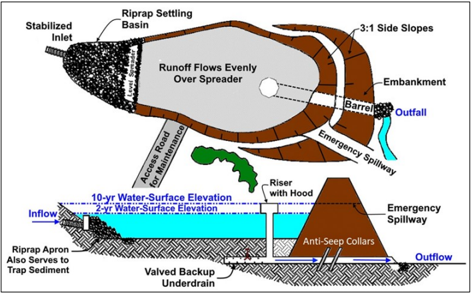

a

Infiltration basins present a feasible option where soils are permeable, and where the water table and bedrock are situated well below the soil surface. They have similar construction costs and maintenance requirements to those for conventional dry ponds. Experience to date indicates that infiltration basins have one of the highest  failure rates of any BMP  from plugging of the permeable soils, emphasizing the importance of regular inspection for standing water.

Advantages of infiltration basins include:

- Preserving the natural water balance of the site.
- Serving larger developments.
- Usefulness as sediment basins during the construction phase.
- Reasonable cost-effectiveness in comparison with other BMPs.

Disadvantages of infiltration basins include:

- High rate of failure due to unsuitable soils.
- Need for frequent maintenance.
- Frequent nuisance problems (e.g., odors, mosquitoes, soggy ground).

## 11.3.2.3 Sand Filters

Sand filters provide stormwater treatment for first flush runoff. Runoff filters through a sand bed before returning to a stream or channel. Engineers generally use sand filters in urban areas and for groundwater protection where infiltration into soils is not feasible. Alternative designs of sand filters  use  a  top  layer  of  peat  or  some  form  of  grass  cover  through  which  runoff  passes  before being  strained  through  the  sand  layer.  This  combination  of  layers  increases  pollutant  removal. Effective  BMPs  such  as  bioretention  and  rain  gardens include sand  filters  as  a component (USEPA 2021).

Engineers use a variety of sand filter designs.  Figure 11.5 and Figure 11.6 present examples of the two general types of filter systems.  Figure 11.5 shows a cross-section schematic of a sand filter compartment (City of Alexandria 1992), and Figure 11.6 shows a cross-section schematic of a peat-sand filter (Galli 1990).

Sand filters have the advantage of  being adaptable. They can be used on areas with thin soils, high  evaporation  rates,  low  soil  infiltration  rates,  and  limited  space.  Sand  filters  also  have  high removal  rates  for  sediment  and  trace  metals  and  have  a  very  low  failure  rate.  Disadvantages associated with sand filters include frequent maintenance to ensure proper operation, unattractive surfaces, and odor problems.

Figure 11.5. Cross-section schematic of sand filter compartment.

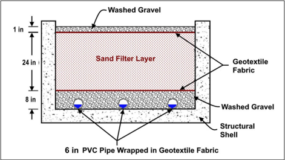

Figure 11.6. Cross-section schematic of peat-sand filter.

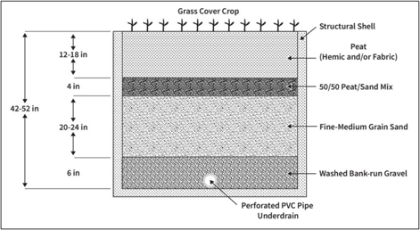

## 11.4  Green Infrastructure

Green infrastructure involves stormwater management  designed to capture rainwater near where it falls, largely by slowing runoff and promoting infiltration in ways that  mimic natural runoff and infiltration. Examples of infrastructure include green roofs, rain gardens, grass paver parking lots, infiltration trenches, permeable pavements, bioswales, planter boxes and rainwater harvesting.

## Gray Infrastructure

green wet In contrast to green infrastructure, gray infrastructure includes approaches for stormwater collection, storage, and conveyance designed to move rainwater away from impervious surfaces, such as roadways, parking lots and rooftops, as quickly as possible. It may include curbs, gutters, drains, piping, and collection systems.

Green infrastructure represents a resilient nature-based solution that manages weather impacts and provide ecological, economic,  and  social  benefits to the affected community. The International Union for Conservation  of Nature  (IUCN  2020) describes

'nature-based solutions' (NBS) as 'actions to protect, sustainably manage, and restore natural or modified ecosystems that address societal challenges effectively and adaptively, simultaneously providing for human well-being and biodiversity benefits.'

Green  infrastructure  may  also  be  called  natural  infrastructure.  Section  11103  of  BIL  added  a definition of natural infrastructure under Section 101 of Title 23 of U.S. Code as follows:

The term 'natural  infrastructure'  means infrastructure that uses, restores, emulates natural ecological processes and - or

(A)  is  created  through  the  action  of  natural  physical,  geological,  biological,  and chemical processes over time;

(B) is created by human design, engineering, and construction to emulate or act in concert with natural processes; or

(C) involves the use of plants, soils, and other natural features, including through the creation, restoration, or preservation of vegetated areas using materials appropriate to the region to manage stormwater and runoff, to attenuate flooding and storm surges, and for other related purposes.

Executive Order 13690 'Establishing a Federal Flood Risk Management Standard and  a Process for Further  Soliciting  and  Considering  Stakeholder  Input' also  promotes  such  NBS  and  natural infrastructure  by requiring agencies, where possible,  to  use natural systems, ecosystem processes, and  nature-based  approaches  when  developing  alternatives  for  consideration.'' (80 FR 13690 (Jan. 30, 2015), revoked by EO 13807 (Aug. 15, 2017), but reinstated by EO 14030 (May 20, 2021)). Green infrastructure (NBS and natural infrastructure) is important to consider as FHWA and  others  seek  to  ensure  the  transportation  network  is  resilient  in  the  face  of  the  risk associated with climate change.

## 11.4.1 Low Impact Development

Low  impact  development  (LID)  is  a  decentralized  source  and  treatment  control  strategy  for stormwater management (NASEM 2006). LID establishes a stormwater management system to prevent  pollution  resulting  from  development  and  urbanization. It  mimics  natural  processes  to maintain the hydrological processes of infiltration, interception, and evapotranspiration that existed before development. LID strategies come in many forms including:

- Bioretention area (rain garden): Retains, infiltrates, and filters runoff and pollutants using a shallow surface depression usually planted with native vegetation. See Figure 11.7.
- Bioretention swales: Also referred to as bioswales or vegetated swales, consist of typically parabolic  or  trapezoidal  depressions  that  use  bioretention  soil  media  and  vegetation  to promote infiltration, water retention, and sedimentation and pollutant removal. See Figure 11.8.
- Stormwater curb extensions: Also called stormwater bump outs, extend the curb into the roadway to reduce traffic speed and capture stormwater runoff from roadways sidewalks.
- Stormwater planters : C onsist of narrow, flat-bottomed landscape areas, typically rectangular shape with vertical walls.
- Stormwater tree systems (i.e., pits and trenches): Intercept and capture stormwater using a tree or shrub, bioretention soil media, and a gravel reservoir.
- Infiltration trenches: Excavated linear areas filled with layers of stone and sand wrapped in geotextile fabric. See Figure 11.9.
- Subsurface infiltration and detention practices: Underground storage that holds runoff and allows infiltration.
- Permeable pavements: Includes porous asphalt (pavement) and pavers that allow runoff to infiltrate through void space instead of becoming surface runoff. See Figure 11.10.

Figure 11.7. Green infrastructure practice: bioretention (rain garden). Source: Roger Kilgore.

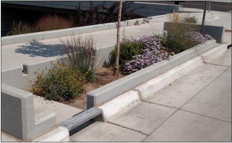

and of

Figure 11.8. Green infrastructure practice: bioswale (USEPA 2021).

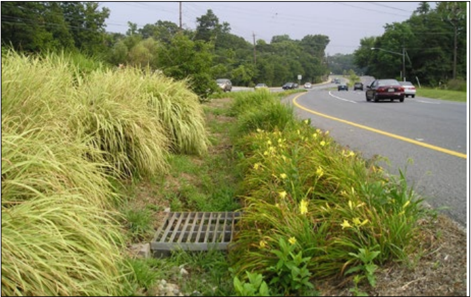

Figure 11.9. Green infrastructure practice: infiltration trench (USEPA 2021).

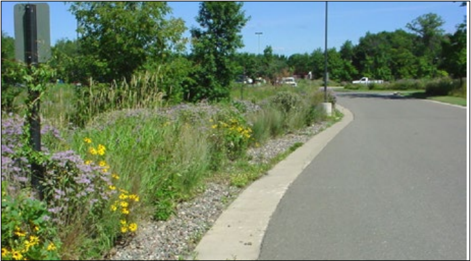

Figure 11.10. Green infrastructure practice: permeable pavers (USEPA 2021).

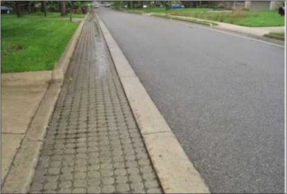

Table 11.1 summarizes  the  relative  effectiveness  (based  on pollutant  removal  efficiencies)  of properly  maintained  green  infrastructure  practices  for  various  water  quality constituents  that roadway runoff typically produces in high concentrations.

Table 11.1. Pollutant removal efficiencies of green infrastructure practices (USEPA 2021).

|                                       | Pollutant Removal Efficiency *   | Pollutant Removal Efficiency *   | Pollutant Removal Efficiency *   | Pollutant Removal Efficiency *   | Pollutant Removal Efficiency *   | Pollutant Removal Efficiency *   | Pollutant Removal Efficiency *   |
|---------------------------------------|----------------------------------|----------------------------------|----------------------------------|----------------------------------|----------------------------------|----------------------------------|----------------------------------|
| Green Infrastructure Practice         | Total Su- spended Solids         | Total Nitrogen                   | Total Phos- phorus               | Fecal Coli- form                 | Total Zinc                       | Total Copper                     | Total Lead                       |
| Bioretention (Rain Garden)            |                                 |                                 |                                 | -                                |                                 | -                                |                                 |
| Bioswale                              |                                 |                                 |                                 |                                 | -                                | -                                | -                                |
| Stormwater Curb Extension             |                                 |                                 |                                 | -                                |                                 | -                                |                                 |
| Stormwater Planter                    |                                 |                                 |                                 | -                                |                                 | -                                |                                 |
| Street Trees                          |                                 |                                 |                                 |                                 |                                 |                                 |                                 |
| Infiltration Trench                   |                                 |                                 |                                 |                                 |                                 | -                                | -                                |
| Subsurface Infiltration and Detention |                                 |                                 |                                 |                                 |                                 |                                 |                                 |
| Permeable Pavement                    |                                 | -                                |                                 | -                                |                                 |                                 |                                 |
| Permeable Friction Course             |                                 | -                                | -                                | -                                |                                 |                                 |                                 |

*  = 0 - 30%;  = 31 - 65%;  = &gt;65%; - = no data.

## 11.4.2 Grassed Swales

Engineers typically use grassed swales in developments and highway medians as an alternative to curb and gutter drainage systems. Swales have a limited capacity to accept runoff from large design  storms,  and  often  lead  into  storm  drain  inlets  to  prevent  large,  concentrated  flows  from gullying/eroding the swale. HEC-15 (FHWA 2005)   provides information for the design of grassed swales.

Grassed swales sometimes incorporate check dams and level spreaders. Level spreaders consist of  excavated  depressions  running  perpendicular  across  the  swale.  Engineers  incorporate  level spreaders and check dams into a swale design to reduce overland runoff  velocities. Figure 11.11 shows a schematic of a grassed swale level spreader and check dam. Swales with check dams placed across the flow path can provide some stormwater management for small design storms by infiltration and flow attenuation. In most cases, however, engineers combine swales with other BMPs downstream to meet stormwater management requirements.

swales

Swales can filter out particulate pollutants under certain site conditions. However, generally  cannot  remove  soluble  pollutants,  such  as  nutrients.  In  some  cases,  trace  metals leached  from  culverts  and  nutrients  leached  from  lawn  fertilization  may  increase  the  export  of soluble pollutants. Grassed swales usually cost less than the curb and gutter.

In addition to being conveyors of stormwater, grassed swales can also function as biofilters in the management  of the quality of stormwater runoff from roads. Swales designed to increase hydraulic residence to promote biofiltration are known as biofiltration swales as discussed in the previous  section. Biofiltration swales  take  advantage  of  filtration, infiltration,  adsorption,  and

biological  uptakes  as  runoff  flows  over  and  through  vegetation.  Removal  of  pollutants  by  a biofiltration swale depends on the time that water remains in the swale, or the hydraulic residence time,  and  the  extent  of  its  contact  with  vegetation  and  soil  surfaces.  The  Washington  State Department of Transportation Highway Runoff Manual contains information on biofiltration swales (WSDOT 2019).

Figure 11.11. Schematic of grassed swale level spreader and check dam.

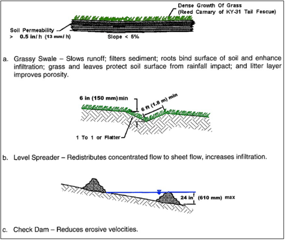

## 11.4.3 Filter Strips

Filter  strips  have  many  similarities  to  grassed  swales,  but  only  accept  overland  sheet  flow.  To function,  runoff  from  an  adjacent  impervious  area  must  be  evenly  distributed  across  the  filter strips. Runoff  has  a  strong  tendency  to  concentrate  and  form  a  channel,  effectively circuiting' the filter strip so that it does not perform as designed.

'short-

A properly functioning filter strip has: 1) some sort of level spreading device; 2) dense vegetation with a mix of erosion resistant plant species that effectively bind the soil; 3) grading to a uniform, even, and relatively low slope; and 4) length at least equal to the contributing runoff area. HEC -15 has information on permissible shear stresses (erosion resistance) of various types vegetation  ( FHWA  2005).  Filter  strips  built  using  HEC -15  can  remove  a  high  percentage  of particulate  pollutants.  Little  research  exists  on  the  capability  of  filter  strips  in  removing  soluble pollutants. Filter strips cost relatively little to establish and almost nothing if preserved before site of

development.  A  creatively  landscaped  filter  strip  can  become  a  valuable  community  amenity, providing wildlife habitat, screening, and stream protection. Engineers also commonly use grass filter strips to protect surface infiltration trenches from clogging by sediment.

Filter strips do not provide storage or infiltration to effectively reduce  peak flows. Typically, filter strips make up one part of an integrated stormwater management system. Thus, the strips can lower  runoff  velocity  (and,  consequently,  the  watershed  time  of  concentration),  slightly  reduce both runoff volume and watershed imperviousness, and contribute to groundwater recharge. Filter strips also provide important benefits of preserving the riparian zone and stabilizing streambanks.

## 11.4.4 Constructed Wetlands

Wetlands can efficiently remove pollutants from highway and urban runoff. Engineers often use wetlands  or  shallow  marshes  in  conjunction  with  other  BMPs  to  achieve  maximum  pollutant removal. Studies on wetlands concluded that detention basins and wetlands appear to function comparably well in removing monitored pollutants (Str ecker et al. 1992), but for some indicators wetlands  perform  better  ( NASEM 2017).  An  effective  design  of  a  wetland  as  a  water  quality measure would include the creation of a detention basin upstream of the wetland. The detention basin provides an area where heavy particulate matter can settle, thus minimizing disturbance of the wetland soils and vegetation.

Frequently,  engineers  design  wetlands  for  BMP  purposes  in  conjunction  with  wet  pond  sites, provided that the runoff passing through the vegetation does not dislodge the aquatic vegetation (AASHTO 2007). Vegetation systems may not be effective where the water 's edge is extremely unstable or heavily used. Additionally, in flood-prone areas, the alteration of the hydraulic characteristics of the watercourse may cause some types of marsh vegetation to be ineffective as a BMP.

## 11.5  Ultra-Urban BMPs

Densely developed areas with very limited right-of-way, termed 'ultra-urban' environments, present a unique challenge for the use of traditional  treatment BMPs given the lack of available surface area. The  term  'ultra-urban  BMPs'  generally  describes  the  use  of  treatment  BMPs installed  underground and resulting in small footprints (NASEM 2012).  These methods capture runoff  contaminants  before  they  reach  surface  water and  groundwater.  They  apply  particularly well to retrofitting urban areas, as well as to new urban development.

These engineered devices are typically structural and are made on a production line in a factory. Engineers  may  design  them  to  handle  a  range  of  pollutant  and  water  quantity  conditions  and, because they have small footprints they may be dropped into the urban infrastructure or integrated into the streetscape of both private and public sector property. Others may be installed beneath parking lots and garages or on rooftops. Engineers design still others to remove pollutants before they are flushed into urban runoff collection systems.

Pre-cast storm drain inlets, or 'water quality inlets,' remove sediment, oil and grease, and large particulates from runoff originating from paved surfaces before it reaches storm drainage systems or infiltration BMPs. Water quality inlets typically serve highway storm drainage facilities adjacent to  commercial  sites  generating  large  amounts  of  vehicle  wastes,  such  as  gas  stations,  vehicle repair facilities, and loading areas. They may pretreat runoff before it enters an underground filter system.

These inlets can include a three-chamber underground retention system designed to settle out grit and absorbed hydrocarbons as shown in  Figure 11.12: a sediment trapping chamber, an oil separation chamber, and the final chamber attached to the outlet. The sediment trapping chamber settles out grit and sediment and traps floating debris in a permanent pool. An orifice protected

by a trash rack connects this chamber to the oil separation chamber. The oil separation chamber also maintains a permanent pool of water. An inverted elbow connects the separation chamber to the third chamber.

Advantages  of  water  quality  inlets  include  compatibility  with  the  storm  drain  network,  easy  to access, able to pretreat runoff before it enters infiltration BMPs, and unobtrusive. Disadvantages include their limited stormwater  and  pollutant removal  capabilities, frequent cleaning (which cannot always be assured), the possible difficulties in disposing of accumulated sediments, and cost.

Other  water  quality  ultra-urban  applications,  include  filter  inserts,  hydrodynamic  devices,  and simple  sumps.  Bag  or  basket  type  filter  inserts  have  small  openings  to  allow  low  flows  to  seep through and larger flows to overflow without causing backwater to the inlet.  Hydrodynamic devices typically  include  baffles,  vortex  mechanisms,  or  other  settling  components,  or  a  combination  of these elements. These devices separate sediment and pollutants from stormwater and commonly are inserted between inlets and storm drain pipes. Sumps placed at the bottom of access holes and below the storm drain pipe flow lines  allow  sediment  and  debris  to  deposit  while  releasing stormwater through weep holes.

Figure 11.12. Cross-section detail of a typical oil/grit separator.

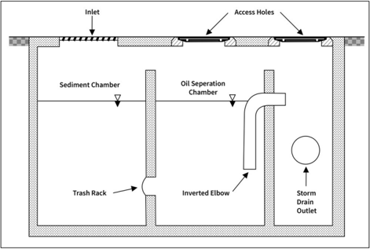

## 11.6  Non-Structural BMPs

Drainage engineers   and planners   commonly use non-structural BMPs in conjunction with structural BMPs, particularly as a means of pre-treating runoff before retention, detention, storage, or  discharge. Non-structural  BMPs do  not  involve  grading  or  construction,  and  therefore  cost significantly  less  than  structural  controls.  In  contrast  to  structural  BMPs,  which  treat  or  remove pollutants,  non-structural  BMPs  focus  primarily  on  the  avoidance  of  pollution.  Governmental

agencies and other organizations typically implement non-structural BMPs by establishing ordinances  and  administrative  policies,  and  through  watershed  planning.  Some  of  the  most common non-structural BMPs are (NASEM 2014):

notably

- Storm drain cleaning : Removal of sediment and debris from storm drain pipes and inlets. Has a minor effect on water quality improvement because most pollutants, nutrients,  tend  to  pass  through  the  drainage  inlets  and  catch  basins.  This  BMP  most efficiently removes suspended solids.
- Street sweeping : Removal of sediment from paved surfaces. Has modest water quality benefits, in particular in the removal of sediment, debris, and trash/litter.
- Efficient  landscaping  practices :  Minimizing or eliminating the use of pollutants landscaping (e.g., fertilizers) and avoiding excessive irrigation.

in

- Trash  management  practices : Minimizing public littering  and  minimizing  windblown trash from vehicles and landfills.
- Elimination of groundwater inflow to storm drains :  Use  of  watertight  joints  and  the elevation of pipes above the groundwater table. Storm drains that are below groundwater table can perennially convey low flows with concentrations of pollutants.
- Slope and channel stabilization :  Vegetating,  lining,  or  reconfiguring  embankment  slopes and channels to reduce erosion.
- Winter maintenance: Proper use of deicing chemicals and abrasives to alleviate winter conditions and post-winter cleanup.
- Irrigation runoff reduction practices : Maintain landscaped areas and reduce overwatering of landscapes to mitigate excess runoff and associated high concentrations of pollutants, typically during the dry weather season.

the
