# Chapter 12 - Pump Stations

- Source: hif24006.pdf
- Generated: 2025-12-28T23:40:53+00:00
- Chunk: 13/13
- Estimated tokens: ~17,780
- Total pages: 313
- Type: chapter

## Chapter 12 - Pump Stations

Stormwater pump stations move stormwater from highway sections where elevation topography prohibit gravity flow. Compared with gravity drainage, pump stations involve high lifecycle  costs  and  present  several potential  design  and  operational  challenges  discussed  in  this chapter. Therefore, designers only consider stormwater pump stations where gravity flow systems are  not  feasible.  Gravity  alternatives  to  pump  stations  include  deep  conduit  trenches,  tunnels, siphons,  and  groundwater  recharge  basins,  although  recharge  basins  are  often  aesthetically unpleasing and can create maintenance problems. This chapter provides on overview stormwater pump stations for highway applications. The FHWA publication Highway Stormwater Pump Station Design (HEC-24) provides more in-depth information (FHWA 2001). The Hydraulic Institute also prepared several publications which provide information for the successful design of pump stations (Hydraulic Institute n.d., AASHTO 2014).

ap-

Design of stormwater pump stations can differ from design of pump stations for other applications. For example, stormwater management requirements from an plicable  jurisdiction  may  limit  the  maximum discharge  from  stormwater  pump  stations. Designers often meet such requirements by providing additional storage as discussed in Section 12.4.

Designers make many stormwater pump station design decisions based engineering  judgment  and  experience.  To enhance cost effectiveness, the designer may  compare  annual  or  life-cycle  costs  of alternatives. The  decision  to  install  a  pump station  involves  long-term commitment of funds and personnel. This chapter provides

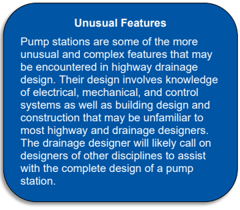

information to  minimize construction,  operation,  and  maintenance  costs  of  highway  stormwater pump stations, while remaining consistent with the functional goals for the pump stations.

## 12.1  Pump Station Types and Pumps

Designers  choose  from  several  stormwater  pump  station  types  and  numerous  pump  types. Selection of both depends on the operational requirements of the pump station, the number and size of pumps, hydraulic conditions, and frequency of operation.

## 12.1.1 Station Types

Designers can categorize pump stations as wet-pit or dry-pit. In wet-pit stations , the pumps are submerged in a wet well or sump, with the motors and the controls located overhead. With this design,  stormwater  arriving  in  the  wet  well  is  pumped  vertically  from  the  well  through  a  'riser' pipe. Commonly, the motor connects to the pump by a drive shaft located in the center of the riser pipe.

Another type of wet-pit design involves  using submersible pumps. A submersible pump commonly involves less maintenance because it does not use a long drive shaft. Submersible pumps also allow for convenient maintenance  in wet-pit stations  because  the  pumps  may  be  removed and

of

relatively  easily.  Submersible  pumps  come  in  many  sizes  and  have  many  applications. Rail systems are available which allow removal of pumps without entering the wet well.

Dry-pit stations consist  of  two  separate  elements:  a  storage  box  or  wet  well  and  a  dry  well. Stormwater arrives in the wet well, which is connected to the dry well by a horizontal suction pipe. The  dry  well  contains  the  stormwater  pumps.  Designers  often  use  radial  flow  pumps  in  this configuration.  Either  motors  mounted  in  the  dry  well  or  drive  shafts  with  overhead  motors  may provide power.

and

Since dry-pit stations cost more than wet-pit stations, designers most often use wet- pit stations. The hazards associated with pumping stormwater usually do not warrant the added expense of dry-pit  stations,  and  available  space  within  the  highway  right-of-way  may  be  a  limiting  factor. However, dry -pit stations offer some advantages, including ease of access for repair maintenance,  the  protection  of  equipment  from  fire  and  explosion,  and  adaptability  for  storage volume.

For both wet-pit and dry-pit stations, the station depth influences the cost and functionality of the pump station. Engineers minimize station depth with designs that use only the depth that will allow pump submergence and hydraulically necessary clearance  below the inlet invert. HEC -24 (FHWA 2001) provides additional information on station types.

## 12.1.2 Pump Types

One or more pumps provide the capacity to move water from a lower to higher elevation for discharge. The most stormwater pump types are rotary pumps of the axial flow , radial flow, or mixed flow types.

Axial  flow  pumps move water in the direction  along  the  axis  of  rotation  of  the pump.  The  impeller  of  an  axial  flow  pump usually looks like the propeller on a boat or a ship. These pumps operate in open water rather  than  within  a  confined  space.  Axial flow  pumps  perform  best  where  they  can move large volumes of fluid relatively low head.

Axial flow pumps lift the water up a vertical riser pipe; water flows parallel to the pump axis  and  drive  shaft.  Designers  commonly

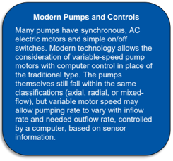

use axial flow pumps for low head, high discharge applications. Axial flow pumps do not handle debris particularly well because the propellers may be damaged if they strike a relatively large, hard object. Also, fibrous material will wrap itself around the propellers.

Radial flow pumps take water into the pump casing in the direction of the pump's axis of rotation. The impeller then changes the direction of the water's movement by 'flinging' the water outward from  the  inlet  direction,  perpendicular  to  the  impeller's  axis  of  rotation,  and  imparting  rotational motion in the direction of the impeller's rotation. The pump case is scroll -shaped, and water leaves the pump perpendicular to, and offset from, the impeller's axis of rotation, with greatly increased energy head.

Radial flow pumps use centrifugal force to increase head and move water up the riser pipe. They will  perform in any range of head and discharge but perform best for high head applications. Some

forms  of  radial  flow  pumps  handle  debris  quite  well.  A  single  vane,  open  configured  impeller handles debris best because it provides the least interference with the passage of debris through the pump. The debris handling capability decreases the number of vanes, since the size of the openings decreases.

Mixed  flow  pumps represent a physical transition  from  axial  flow  to  radial  flow  and have some attributes of each. Unlike with an axial flow pump, inside a mixed flow pump, the water flow direction changes from along the impeller's axis of rotation to some angle away  from  that  axis.  But,  unlike  in  a  radial flow pump,  the  change  in  direction  is not perpendicular to the axis of rotation. As in a radial flow pump,  the  impeller 'flings' the water outward and adds energy, but the pump  case  then  redirects  the  water  back along the axis of rotation.

Very often, mixed flow pumps are multi -stage.  This  design  stacks  together  several impellers inside of several cases and drives them by a common  shaft. Water passes through the impellers progressively, with each  stage imparting more  energy  to the water.  The impellers  of  a  mixed  flow  pump can  be  designed  to  shed  and  pass  debris better  than  an  axial  flow  pump.  Mixed  flow

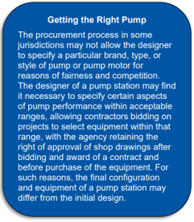

pumps  work  best  for  intermediate  head  and  discharge  applications.  Because  they  are  easily configurable for multiple stages, and because of the physical configuration of mixed flow pumps, most submersible pumps are of this type.

All pumps can use motors or engines housed overhead or in a dry well, or submersible motors located in a wet well. Submersible pumps frequently provide the advantages of simplified design, construction, and maintenance and, therefore, lower associated cost. Designers rarely anything other than a constant speed, single suction pump.

## 12.1.3 Pump Selection and Sizing

Designers select pumps by establishing criteria, characterizing operating requirements, and then selecting  a combination that  meets  the design criteria. They consider cost, reliability, and operating  and  maintenance  requirements.  Because  stormwater  pump  stations  have  relatively short annual operating periods, initial cost usually influences selection more than operating costs. Designers typically minimize initial pump costs by providing as much storage as possible.

The  designer  can  obtain  an  approximate  range  of  pump  and  motor  sizes  for  consideration by reviewing  the  design  of  existing  pump  stations ,  pumps,  and  their  performance  curves.  Pump manufacturer information provides  further information on the performance characteristics available  pumps .  The  designer  can  narrow  down  pump  type  and  size by  considering  pump specific speed because each pump type performs best in certain ranges of specific speed.

## 12.1.3.1 System Curve

Designers select and size pumps by referring to the system requirements expressed in the form of a system curve. The system curve relates the head required of the pump station as a function of

use

of  discharge  as  shown  in Figure  12.1.  Since  changes  in  head  influence  pump  performance, designers  calculate  the  head  required  as  accurately  as  possible  including  all  'minor  losses' attributed to valves and bends. Designers can minimize these various head losses by carefully selecting discharge line size and other components such as check valves and gate valves.

Designers select the discharge pipe size  by considering the manufactured pump outlet size, either matching the outlet size or, to reduce the loss in the line, by using a pipe larger than the outlet. Generally,  this  approach  allow s the  designer  to  identify  a  reasonable  compromise  in  balancing cost but would involve inclusion of an expansion loss in the calculations.

The  static  head  represents  the  vertical  lift  required  of  the  pump  station,  that  is,  the  difference between the head at the pump station outlet and inlet. It varies depending on the water levels in the storage at the inlet and may also vary if the outlet water surface elevations fluctuate.

The total  head  required  of  the  pump  station  combines  static  head,  friction  head,  velocity  head, and minor losses (through fittings, values, pipe expansions, pipe contractions, etc.). This quantity is called total dynamic head (TDH). It is dynamic because, except for static head, TDH increases with flow. Designers compute TDH as:

<!-- formula-not-decoded -->

| where: TDH   | =   | Total dynamic head, ft (m)                    |
|--------------|-----|-----------------------------------------------|
| H s          | =   | Static head, ft (m)                           |
| H f          | =   | Friction head (loss), ft (m)                  |
| H v          | =   | Velocity head, ft (m)                         |
| H l          | =   | Losses through fittings, valves, etc., ft (m) |

Figure 12.1 displays  a  system  curve  which  determines the  energy  required  to  pump  any  flow through the discharge system. It is especially critical for the analysis of a discharge system with a force main. When overlaid with pump performance curves (provided by the manufacturer), it will yield the pump operating range.

## 12.1.3.2 Pump Performance Curve

A pump performance curve expresses the capabilities of the pump in terms of both discharge and TDH, as Figure 12.1 shows. The designer selects multiple pumps for a given station to operate together to deliver the design flow (Q) at a TDH computed to correspond with the design water level. Because pumps must operate over a range of water levels, the quantity delivered will var y between the lowest level and the highest level of the range.

Typically, the designer specifies the conditions for the TDH expected over the full operating range of  the  pump  with  emphasis  on  at  least  three  points  on  the  pump  performance  curve:  near  the highest head, at the design head, and at the lowest head. Manufacturers always provide a curve of TDH versus pump capacity for every pump. When running, the pump will pump the discharge associated with the actual TDH on the curve. The designer can develop an understanding of the pumping  conditions  (head,  discharge,  efficiency,  horsepower,  etc.)  throughout  the  full  range  of head under which the pump will operate by studying the performance curves for various pumps.

Pump efficiency, also provided by the manufacturer, influences pump selection. Designers select a  pump to operate with the best efficiency at its design point, which corresponds to the design water  level  of  the  station.  The  efficiency  of  a  stormwater  pump  at  its  design  point  will  vary, depending  on  the  pump  type.  HEC -24  (FHWA  2001)  provides  additional  information  on  pump performance curves.

Figure 12.1. System and pump curves.

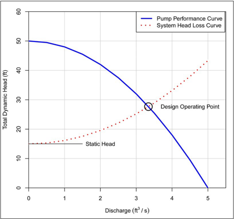

## 12.1.4 Number of Pumps

System  requirements  determine  the  number  of  pumps  needed.  However,  two  to  three  pumps generally  represent  the  recommended  minimum.  When  pumping  a  small  total  discharge  and where  the  area  draining  to  the  station  has  little  chance  of  increasing  substantially,  designers typically  prefer  to  use  a  two-pump  station.  Designers  may  consider  oversizing  the  pumps  to compensate,  in  part,  for  a  pump  failure.  The  two-pump  system  could  have  pumps  designed  to pump  from  66  to  100  percent  of  the  required  discharge,  and  the three-pump  system  could  be designed so that each pump would pump 50 percent of the design flow. Designers c an use the damage resulting from the loss of one pump as a basis for deciding the size and numbers of the pumps.

Limitations on power unit size as well as practical limitations governing operation maintenance determine the upper limit of pump size. The minimum number of pumps used may increase due to these limitations.

and

Using pumps of equal size and type has the benefit of enabling all pumps to be freely alternated into  service thereby  distributing  the  load  between  pumps  more  evenly.  Providing  an  automatic

## Equipment Certification and Testing

Testing, certification, and acceptance of equipment is an important element of pump station development. Witnessing equipment testing at the manufacturer's lab or at a suitable facility is ideal, but not always practical. As an alternative, the manufacturer can provide certified test results to the owner. It is good practice to include in the contract specifications the requirement for acceptance testing by the owner, when possible, to ensure proper operation of the completed pump station. Generally, the testing happens in the presence of the owner's representative. If the representative waives the right to observe the test, the manufacture can provide the owner a written report, signed and sealed by a licensed Professional Engineer or person with other credentials deemed appropriate by the owner, to give assurance that the pump equipment meets all performance and reliability requirements. Any component which fails should be repaired and retested.

alternation system for each pump station allows this approach. This system would automatically rotate the lead and lag pump after each pump cycle so that each pump in turn would become the lead pump. This equalizes wear and reduces needed cycling storage. It also simplifies scheduling maintenance and allows pump parts to be interchangeable. Providing hour and start meters aids in scheduling needed maintenance.

## 12.1.5 Inlet Water Depth and Net Positive Suction Head

Net positive suction head required is the head above vapor pressure head required to ensure that cavitation does not occur at the impeller. The hydrodynamic phenomenon of cavitation can cause substantial damage to pumps. Cavitation results when the depth of water above the pump inlet (submergence)  is  too  low.  Insufficient  water  depth  can  also  allow  vortex  formation  at  the  inlet, which reduces pump efficiency.

More  precisely,  cavitation  may  occur  when the  net  positive  suction  head  (NPSH),  which  is  a function  of  water  depth,  is  lower  than  the  required  NPSH for  the  pump. NPSH is  the  minimum pressure under which fluid will enter the eye of the impeller. It varies significantly with pump type and  speed  and  with  ambient  atmospheric  pressure  (a  function  of  altitude).  This  dimension  is provided by the pump manufacturer and is determined by laboratory testing. The available NPSH should be calculated and compared to the manufacturer's requirement.

## 12.2  Pump Station Components

In  addition  to  the  pumps  and  pits,  stormwater  pump  stations  include  many  other  components described briefly in this section. HEC-24 provides additional information on these and other pump station components (FHWA 2001).

## 12.2.1 Water-Level Sensors

Engineers design stormwater pump stations to operate automatically, without human intervention. They rely on water-level sensors to activate the pumps, making those sensors a vital component of the control system. Available sensor types include float switches, electronic probes, ultrasonic devices, mercury switches, and air pressure switches.

The location or setting of sensors inside of the wet well or storage box controls the starting and stopping of pump motors. Their function is critical because pump motors or engines must not start more  frequently  than  an  allowable  number  of  times  per  hour  (i.e.,  the  minimum  cycle  time)  to avoid damage. Designers can prolong motor life by providing sufficient storage volume between the pump start and stop elevations to achieve the minimum cycle time requirement.

## 12.2.2 Power

Designers choose from several types of power for a pump station. Most commonly, they choose electric  motors,  which  involve  the  least  maintenance  and  oversight.  In  some  cases,  designers choose fuel-driven (gasoline, diesel, or natural gas) engines. When selecting fuel -driven engines, considerations  include  reliable  storage  with  minimal  chance  of  leakage  of  liquid  fuels  and  fuel perishability.  Fuel-driven  engines  involve  periodic  maintenance  but  must  start  and  run  reliably without  human  oversight.  Designers  select  the  type  of  power  that  best  meets  the  needs  of  the project based  on  an  estimate of future energy considerations and  overall station reliability. Developing a comparative cost analysis of alternatives helps make this decision. However, when readily  available,  electric  power  usually  costs  the  least  while  being  the  most  reliable  choice. Getting input from the maintenance engineer  will aid the designer in the selection process. The designer  will  also  benefit  from  remembering  that  the  same  conditions necessitating the  pump station-rainstorms-are also the conditions under which electric systems may experience service outages.

Because  of  the tendency  for outages  to occur during storms, designers generally consider provisions for backup power. However, if they deem the consequences of failure acceptable, they may  choose  not  to  provide  backup  power.  Generally,  designers  make  the  decision  to  provide backup  power  on  economics,  serviceability,  and  safety.  For  electric  motors,  two  independent electrical  feeds  from  the  electric  utility  with  an  automatic  transfer  switch  may  provide  sufficient reliability and affordability when backup power is required.

For extensive depressed freeway systems involving  several electric motor-driven stations, mobile generators  represent  another  potential  source  of  backup  power.  Maintenance  staff  can  store  a trailer mounted generator at any one of the pump stations, moving the generator to the affected station in case of power outage.

## 12.2.3 Discharge System

Designers will want to keep discharge piping as simple as possible. Pump systems that lift the stormwater vertically and discharge it through individual lines to a gravity storm drain as quickly as possible represent a preferred design. Because frozen discharge pipes could damage pumps, designers also consider frost depth when deciding the depth of discharge piping.

Depending on topography, designs may use long discharge lines to pump stormwater to a higher elevation. For efficiency, such a design may combine the lines from individual pump stations into a force main or mains. For such cases, designers provide check valves on the individual lines to prevent  stormwater  from  flowing  back  into  the  wet  well  and  restarting  the  pumps  or  prolonging their operation  time.  Check  valves are  preferably located  in horizontal lines. To  provide  for continued  operation  during  periods  of  repair,  etc.,  designers  include  gate  valves  in  each  pump discharge  line.  To  determine  the  most  efficient  length  and  type  of  discharge  piping  and  fittings such as manifolds designers perform a cost analysis. Designers keep the number of val ves to a minimum  to  reduce cost, maintenance, and head  loss through the system. Because  water remaining in the pipe can develop corrosive and hazardous anaerobic conditions and become a nuisance, designers include some provision for draining or other removal of water stored in the force main (that will not drain by gravity) after a pumping event.

## 12.2.4 Flap Gates and Valving

Designs use flap gates and  various valve types to provide controls and connections stormwater pump station. Flap gates restrict water from flowing back into the discharge pipe and discourage entry into the outfall line. Because flap gates are usually not watertight, designers set the elevation of the discharge pipe above the normal water levels in the receiving channel. If the design uses flap gates, check valves may not be necessary.

for

Check valves are watertight; designers use them to prevent backflow on force mains which could store enough water to restart the pumps if backflow were to flow into the wet well or storage box. By preventing backflow, they prevent pump direction reversal and resulting motor rotation, which can  cause  electrical  overloads  and  tripped  circuit  breakers.  Designers  use  check  valves  on manifolds to prevent return flow from perpetuating pump operation. To prevent water hammer in the pipes, designers use spring-assi sted silent or 'nonslam' configuration check valves or otherwise pay careful attention to design and installation. These include swing, ball, dashpot, and electric.

Gate valves are  a  shut-off  device  used  on  force  mains  to  allow  for  pump  or  valve  removal. Designers should not use valves in pump stations to throttle flow. Instead, they should be either entirely open or entirely closed.

Air/Vacuum valves allow trapped air to escape the discharge piping when pumping begins and prevent  vacuum  damage  to  the  discharge  piping  when  pumping  stops.  They  are  especially important  with  large  diameter  pipe.  If  the  pump  discharge  is  open  to  the  atmosphere,  an  air -vacuum  release  valve  is  not  necessary.  Designers  use  combination  air  release  valves  at  high points in force mains to evacuate trapped air and to allow entry of air during system drainage.

## 12.2.5 Trash Racks and Grit Chambers

Designers can provide trash racks at the entrance to the wet well if they anticipate large debris. For stormwater pumping stations, simple inclined steel bar screens are adequate. Constructing the  screens  in  standardized  modules  facilitates  removal  for  maintenance  and  replacement  if damaged. If the screen is relatively small, designers  typically provide an emergency overflow to protect  against  clogging  and  subsequent  surcharging  of  the  collection  system.  Screening  large debris at surface inlets may effectively minimize the need for trash racks. Excluding debris at the surface,  and  thereby  preventing  entry  into  the  system,  facilitates  maintenance  and  improves hygiene.

If  designers  anticipate  substantial  amounts  of  sediment,  they  may  provide  an  easily  accessible grit chamber to capture settleable solids. This will reduce wear on the pump impellers and cases and  reduce  the  need  for  regular  removal  of  sediment  from  the  wet well.  The  optimal  design provides convenient access to the grit chamber and removal of sediment by mechanical means (e.g., backhoe tractor or vacuum truck), rather than manual removal.

## 12.2.6 Monitoring Systems and Maintenance

Pump stations  are  vulnerable  to  a  wide  range  of  operational  problems  from  malfunction  of  the equipment  to  loss  of  electrical  power.  Designers  traditionally  use  monitoring  systems  such  as onsite warning lights and remote alarms for pump stations to help minimize such failures and their consequences. The expanding use of Intelligent Transportation System (ITS) elements such as video roadway surveillance, electronic changeable message signs, and active monitoring of urban roadways enhances the possibilities for pump station oversight and monitoring. Cellular and other wireless  communications  allow  regular  exchange  of  information  with  highway  features  such  as traffic  signals;  monitoring  the  status,  performance,  and  maintenance  of  pump  stations  is  no different. The pump station can transmit operating functions to a central control unit,

a

ITS

monitoring  office,  or  maintenance  office,  allowing  the  central  control  unit  to  initiate  corrective actions  immediately  in  case  of  malfunction.  This  approach  allows  effective  monitoring  of  such functions as power, pump operations, unauthorized entry, explosive fumes, and high water levels. A regular schedule of maintenance conducted by trained, experienced personnel help assure the proper pump station functioning.

rainfal

The ease of acquisition of information from remote locations allowed by ITS and modern communications presents opportunities not available in the past. Designers may consider including electronic weather monitoring equipment such as temperature and l measurements  at  pump  stations,  along  with  electronic  records  of  operation  (start/stop  times, water  level  in  wet  wells,  inflow, and  outflow  data)  over  several  years  or  the  lifespan  of  a  pump station. Such data can prove invaluable in improving future design, maintenance, and operation of  pump  stations,  as  well  as  in  providing  real -time  data  for  active  traffic  management  via  ITS, active maintenance management, and emergency incident management. Pump stations provide a logical setting for such data collection and transmission equipment.

Since major storm events occur infrequently, the DOT can develop a comprehensive, preventive maintenance, inspection, and recertification program for maintaining and testing the equipment so that it will function properly when needed. Inclusion of instruments such as hour meters and number-of-starts  meters  on  each  pump  will  help  schedule  maintenance.  Soliciting  input  from maintenance forces will allow designers to improve each new generation of stations.

Periodically testing equipment, instrumentation, and auxiliary features (hatches, doors, etc.) will help ensure proper operation and condition. DOTs will also wish to schedule relatively frequent inspection  of  the  facility  for  vandalism,  deterioration,  weather  damage,  vehicular  damage,  and unauthorized  entry  or  occupation.  In  some  areas,  vegetation,  roots,  insects,  or  other  creatures can create entry or maintenance problems. Fire ants, in particular, can damage  electronic components.  Bats,  raccoons,  skunks,  snakes,  and  other  animals  can  create  disease  or  safety hazards and damage components.

## Safety First

For the safety of operation and maintenance, designers review all elements of the pump station. Ladders, stairwells, and other access points facilitate use by maintenance personnel. Designers also ensure adequate space for the operation and maintenance of all equipment, paying particular attention to guarding moving components such as drive shafts and providing proper and reliable lighting. In some cases, air testing equipment can be available so maintenance personnel can check for clean air before entering. Proper ventilation is essential.

Pump stations will likely be classified as a confined space resulting in appropriate access requirements and safety equipment. Designers ensure pump stations are secure from entry by unauthorized persons, providing as few windows as possible.

## 12.3  Site Planning and Hydrology

Effective stormwater pump station design starts with evaluation of the site and the site hydrology. This  section  describes  stormwater  pump  station  location,  site  hydrology,  and  the  stormwater collection system that drains to the site.

## 12.3.1 Location

Practical considerations usually designers  to  locate  pump  stations  near  the low  point  in  the  highway  drainage  system they serve. An adjacent frontage road overpass can often provide easy access to the  station.  If  possible,  locating  the  station and access  road  on  high  ground  will  allow access if the highway becomes flooded. Soil borings made during the selection of the site will reveal the allowable bearing capacity of the soil and identify any potential problems.

allow or

in

Considering architectural and landscaping issues  in  the  location  phase  of  the  design process  will  allow  aboveground  stations  to blend  into  the  surrounding  community  or  fit with  the  theme  of  past  and  future  projects. Foregrounding aesthetic, decorative, and community-relevant aspects of highway projects has become commonplace recent  decades,  and  pump  stations  can  fit into  such  schemes.  Relevant  pump  station location and design considerations include:

a

- Providing architecturally pleasing modern pump stations with minimal cost increase.
- Using screening walls to exterior equipment and break up the lines of the building.

## Consider Construction Experience

Construction methods impact the cost of the pump station. The more a pump station operates, the smaller the fraction the construction cost is of life-cycle cost. With a stormwater pump station, which operates only when needed (during wet weather) operating costs may be insignificant compared to construction costs. One construction option includes caisson construction, in which the station is usually circular, and construction is open-pit construction. Soil conditions are important in selecting the most cost-effective alternative.

Feedback from construction personnel on any problems encountered can improve future designs. 'As-built' drawings document any changes. Personnel knowledgeable and experienced with such equipment conduct construction inspections of pump stations.

hide

- Adding landscaping and plantings to improve the overall appearance of the site.
- Determining if it is necessary or desirable to place the station entirely underground.
- Accommodating  maintenance  requirements  by  providing  unobtrusive  parking  and  work areas adjacent to the station without encouraging their use by the public.

## Hazardous Materials Spills in the Highway Corridor

Pump stations and pumping equipment may be vulnerable to hazard materials spills (of gasoline, other fuels, oils, corrosive chemicals, pesticides, and other hazardous cargo) and associated fire hazards. Commonly, designers have provided a closed conduit system leading directly from the highway to the pump station without any open forebay to intercept hazardous fluids or vent off volatile gases. A closed system depends on a gastight seal between the pump pit and the motor room in the pump station. A safer design isolates the pump station from the main collection system and the effect of hazardous spills by placing the storage facility upstream of the station. This may be an open forebay or a closed box (with sufficient grating at each end for ventilation) below or adjacent to the highway pavement.

## 12.3.2 Hydrology

For  traffic  safety  and  to  avoid  flood  hazards,  engineers  usually  design  pump  stations  serving major  controlled-access  thoroughfares  and  arterial  streets  to  accommodate  a  0.02  AEP  event (AASHTO  2014).  To  determine  the  extent  of  flooding  and  the  associated  risk,  designers  also validate  the  drainage  system  performance  for  the  0.01  AEP  event.  Keeping  the  drainage  area contributing to the station small reduces the size of the pumping station and minimizes negative impacts if the  pumping station malfunctions . For the  same reasons, designers anticipate future development that could contribute to increases in flow to the pumping station.

Consider the feasibility of providing storage, in addition to that which exists in the wet well, at all pump  station  sites.  For  most  highway  pump  stations,  the  high  discharges  associated  with  the inflow hydrograph occur over a relatively short time window.  Additional storage, above or below ground, may greatly reduce the peak pumping rate. Designers can use an economic analysis to estimate the optimum combination of storage and pumping capacity. However, once constructed, adding pumping capacity typically involves many additional costs compared to relatively low-cost storage volume. Chapter 10 describes procedures for storage routing.

## 12.3.3 Collection Systems

Local topography and efforts to minimize depth and associated construction costs often restrict storm drains leading to pumping stations to mild grades. A grade resulting in velocities of around 3  ft/s  in  the  pipe  while  flowing  full  typically  avoids  siltation  problems  in  the  collection  system. Minimum pipe cover, construction clearance, or local head requirements will usually govern the depth of the uppermost inlets. Designers often use baffles to ensure that inflow to the pump well distributes  inflow  equally  to  all  pumps.  The  Hydraulic  Institute  provides  information  for  pump station layout (Hydraulic Institute n.d.).

Collector lines preferably terminate at a forebay or storage box structure, or they may discharge directly  into  the  station.  Under  the  latter  condition,  designers  calculate  and  carefully  check  the capacity of the collectors and the storage volume inside of them to provide adequate cycling time for the pumps. A minimum grade of 2 percent may prevent or control siltation problems in storage units.

Storm drainage systems tributary to pump stations can be quite extensive and costly. For some pump stations, the storage volume within the collection piping itself may be significant. Designers may consider storage volume within the system, especially near the  pump station,  when designing the collection system.

To prevent large objects from entering the system and possibly damaging the pumps, designers typically use debris screens. Screening at the surface facilitates screen maintenance and debris removal, however debris screening may occur either at the surface or inside the wet well/storage system. Design considers the level, accessibility, and convenience of maintenance and inspec tion when selecting debris trapping devices.

## 12.4  Storage and Mass Curve Routing

Stormwater  pump  stations  route  stormwater  inflows  at  a  low  point  to  a  higher  discharge  point, using  storage  to  provide  for  effective  pump  station  operation.  When  determining  the  volume  of storage for a pump station, designers strive to achieve a balance between pump rates and storage volume; as available storage increases, required pump size decreases. Designers use an iterative procedure in conjunction with economic estimation to balance storage volumes and pump sizes. Because  of  the  cost  associated  with  pump  station  construction  and  ongoing  maintenance  and operations,  designers  consider several  viable  alternatives  as  they  strive to  optimize  life-cycle

cost/benefit.  This  allows  comparisons  of  life-cycle  costs  and  sensitivity  to  uncertainties  of  both physical and financial constraints.

During  a  stormwater  event,  pump  station  operations  generally  include  the  following  series  of events:

1. As stormwater flows to the pump station, the wet well or storage box  stores the water, and the water level rises to an elevation which activates the first pump.
2. If the inflow rate exceeds the pump rate, the water level will continue to rise until it causes the second pump to start. If not, the water level will diminish until the pump stops.
3. This process continues sequentially for each pump until either the inflow rate subsides, or enough pumps operate to equal or exceed the inflow.
4. After  the  pumping  rate  exceeds  the  inflow  rate,  the  stage  in  the  station  recedes until reaching the pump stop elevations (sequentially), eventually stopping all pumps.
5. If inflow continues at a rate lower than the output of one pump, the water level will again rise in the wet well until a pump starts.
6. The static condition after the end of an event  has a water level somewhere between the lowest elevation for NPSH and the first pump start elevation.

involves

Evaluation of the relationship between pump station storage and pumping rate developing  an  inflow  mass  curve  and  routing  the  mass  curve  through  the  pump  station.  The following sections outline these elements of the design.

## 12.4.1 Storage

Storage attenuates the incoming flow and reduces the demands on pump station operation. Using the inflow hydrograph and pump-system curves, designers can try various levels of pump capacity to determine the corresponding required total storage. Designers estimate the required storage volume by comparing the inflow hydrograph to the controlling pump discharge rate. S tormwater management limitations, the capacity of the receiving system, desirable pump size, or available storage may set this controlling pump discharge rate.

Figure 12.2 depicts an inflow hydrograph and an assumed peak pumping rate. Since the inflow hydrograph peak is greater than the pumping rate, the needed storage volume is the shaded area above the last pump turn-on point. Allowing more of the design storm to collect in a storage facility enables use of a smaller pump station, with anticipated cost benefits.

The  location  of  most  highway  related  pump  stations  near  either  short  underpasses  or  long depressed  sections,  often  makes  aboveground  storage  impracticable.  Designers  ensure  that water  originating  outside  of  the  depressed  areas  does  not  enter  the  depressed  areas  to  avoid pumping additional water. Enlarging the collection system or constructing underground storage represent  the  simplest  forms  of  storage  for  such  depressed  situations.  State  DOTs  typically construct these under the roadway area or in the median, so they rarely involve additional rightof-way.

Figure 12.2. Estimated required storage from inflow hydrograph.

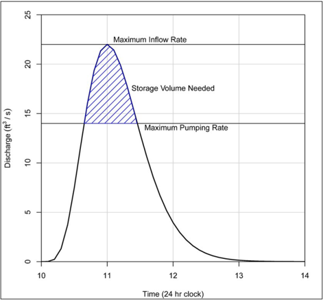

## 12.4.2 Inflow Mass Curve

Designers  develop  the  inflow  mass  curve  by  dividing  the  inflow  hydrograph  into  uniform  time increments, computing the inflow volume over each time step, and summing the inflow volumes to obtain a cumulative inflow volume. They then plot this cumulative inflow volume against time to produce the inflow mass curve as shown in Figure 12.3.

## 12.4.3 Mass Curve Routing

Designers evaluate the relationship between pump station storage and pumping rates using the mass  inflow  curve  in  a  tabular,  computerized  form  (spreadsheet)  or  a  graphical  mass  curve routing procedure. Designers can find spreadsheet applications for this procedure alternatively, individual designers or agencies can develop them relatively easily. Designers will want  to  pay  close  attention  to  the  time  steps  on  the  mass  inflow  curve;  sometimes,  achieving sufficiently short time steps will depend on curve fitting or polynomial interpolation.

online;

Figure 12.3. Mass inflow curve.

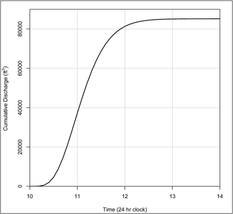

Downstream capacity considerations, limits imposed by local jurisdictions, or other determine  an  initial  maximum  pump  discharge.  With  the  inflow  mass  curve  and  an  assigned pumping  rate, the designer can determine required storage by various trials of the routing procedure.

Designers use three pieces of information for mass curve routing:

- An inflow hydrograph (Figure 12.2) (from hydrologic evaluation).
- A stage-storage curve (Figure 12.4) (from physical geometry of the storage features).
- A stage-discharge curve (Figure 12.5) (from the pump curve and start/stop elevations).

criteria

Figure 12.4. Stage-storage curve.

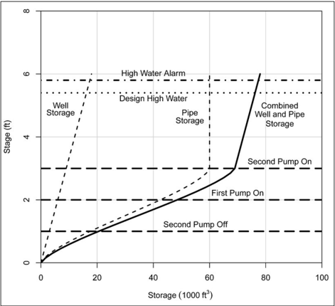

Using this information, designers develop a mass curve routing diagram as shown in  Figure 12.6. The letters in the figure note the following sequence of events:

1. The first pump starts at point A and pump at a rate represented by the slope of the line between A and B.
2. At point B, the storage empties and the pump turns off.
3. At point C the start volume has accumulated again, and the lead pump turns on.
4. At Point D the storage has filled to the elevation where the second pump turns on. Since this depicts a two-pump system, both pumps will operate along the pump curve from D to E.
5. Point E represents the elevation where the second pump turns off. At point F, the storage has been emptied and the lead pump turns off.

The  vertical  lines  on  Figure 12.6 represent  the  total  volume  stored  at  any  given  time,  such  as when a pump starts or stops. The maximum vertical distance between the inflow mass curve and

the  pump  discharge  curve  represents  the  amount  of  storage  needed  for  that  set  of  conditions. The pump start elevations tie directly to the storage volume at that elevation. The designer tries different  start  elevations  iteratively  to  find  a  set  of  start  elevations  that  minimizes  the  storage needed.

Figure 12.5. Stage-discharge curve.

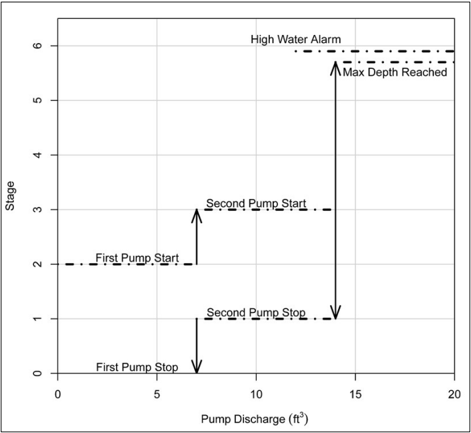

Designers can use a spreadsheet to perform the calculations. With reasonably short time steps, they  can  try  many  different  combinations  of  start/stop  elevations.  They  can  try  different  pump performance  curves  the  same  way.  HEC-24  provides  a  detailed  example  of  stormwater  pump station design and describes additional design, operations, and maintenance aspects.

Figure 12.6. Mass curve routing diagram.

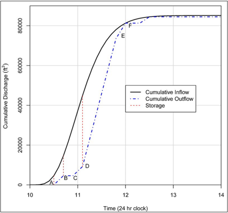

## Page Intentionally Left Blank

## Literature Cited

- AASHTO 2000. Model  Drainage  Manual , American Association of State Highway Transportation Officials, Washington, DC.
- AASHTO 2007. Highway Drainage Guidelines , 4 th  Edition, Washington, DC.
- AASHTO 2011. Roadside Design Guide , 4th Edition, Washington DC.
- AASHTO  2014. Drainage  Manual , 1st Edition, American  Association  of  State  Highway  and Transportation Officials, Washington, DC.
- AASHTO 2018. A Policy on Geometric Design of Highways and Streets, 7 th  Edition , Washington, DC.
- ACPA 1978. Concrete Pipe Design Manual ,  American Concrete Pipe Association, Washington, DC.
- AISI 1983. Handbook of Steel Drainage and Highway Construction Products , American Iron and Steel Institute, Washington, DC.
- Anderson, A.G., S.P. Amreek, and J.T. Davenport 1970. 'Tentative Design Procedure for Riprap Lined Channels.' NCHRP Report No. 108, Highway Research Board, National Academy of Sciences, Washington, DC.
- Anderson,  D.A.,  J.R. Reed,  R.S. Huebner,  J.J. Henry,  W.P. Kilareski,  and  J.C. Warner  1995. Improved Surface Drainage of Pavements , NCHRP Project I-29, Pennsylvania Transportation  Institute,  Pennsylvania  State  University,  Federal  Highway  Administration, Washington, DC.
- APWA 1981. Urban Stormwater Management ,  Special  Report  No.  49,  American  Public  Works Association Research Foundation and the Institute for Water Resources, Washington, DC.
- ASCE 1960. Design Manual for Storm Drainage , American Society of Civil Engineers, New York, NY.
- ASCE  1992. Design  and  Construction  of  Urban  Stormwater  Management  Systems ,  ASCE Manuals  and  Reports  of  Engineering  Practice  No.  77,  WEF  Manual  of  Practice  FD -20, American Society of Civil Engineers, New York, NY.
- Bauer, W.J. and D.C. Woo 1964. Hydraulic Design of Depressed Curb-Opening Inlets , Highway Research Record No. 58, Highway Research Board, Washington, DC.
- Boyd,  M.J.  1981. Preliminary  Design  Procedures  for  Detention  Basins , Proceedings ,  Second International Conference on Urban Storm Drainage, Urbana, IL.
- Brater, E.F. and H.W. King 1976. Handbook of Hydraulics , 6th ed., McGraw Hill Book Company, New York, NY.
- Burgi, P.H. 1978a. Bicycle-Safe Grate Inlets Study, Volume 2 - Hydraulic Characteristics of Three Selected Grate Inlets on Continuous Grades , FHWA -RD-78-4, Federal Highway Administration (May).
- Burgi, P.H. 1978b. Bicycle-Safe Grate Inlets Study, Volume 3 - Hydraulic Characteristics of Three Selected Grate Inlets in a Sump  Condition , FHWA -RD-78-70, Federal Highway Administration (September).

and

- Burgi,  P.H.  and  D.E.  Gober  1977. Bicycle-Safe Grate Inlets Study, Volume 1 - Hydraulic and Safety Characteristics of Selected Grate Inlets on Continuous Grades ,  FHWA-RD-77-24, Federal Highway Administration (June).
- Chang, F.M. and R.T. Kilgore 1989. Calculation of Head Loss Coefficients for Junction Manholes , unpublished research report prepared for the Federal Highway Administration.
- Chang,  F.M.,  R.T. Kilgore,  D.C. Woo,  M.P. Mistichelli  1994. Energy Losses through Junction Manholes ,  'Volume  I:  Research  Report  and  Design  Guide,'  FHWA -RD-94-080,  Federal Highway Administration, McLean, VA.

Chow, V.T. 1959. Open-Channel Hydraulics , McGraw Hill, New York, 1959.

- City  of  Alexandria, VA 1992. Alexandria Supplement to the Northern Virginia BMP Handbook , Department of Transportation and Environmental Protection, Alexandria, VA.
- Driscoll, E.D. 1990. Pollutants Loadings and Impacts from Highway Stormwater Runoff; Volume II , FHWA-RD-88-007, Federal Highway Administration, Washington, DC. (April).
- England, J.F., Jr., T.A. Cohn, B.A. Faber, J.R. Stedinger, W.O. Thomas, Jr., A.G. Veilleux, J.E. Kiang,  and  R.R.  Mason,  Jr.  2019 . Guidelines  for  Determining  Flood  Flow  FrequencyBulletin 17C (ver. 1.1): U.S. Geological Survey Techniques and Methods, book 4, chap. B5, 148 p.
- FHWA 1977 (reprint). Design Charts for Open-Channel Flow ,  Hydraulic Design Series 3 (HDS3), U.S. Department of Transportation, Washington, DC.
- FHWA 1979. Underground Disposal of Stormwater Runoff ,  Design Guidelines Manual FHWA -TS80-218, Federal Highway Administration, Washington, DC.
- FHWA 1984. Drainage of Highway Pavements , Hydraulic Engineering Circular No. 12 (HEC-12), FHWA-TS-84-202.
- FHWA 1986. Culvert  Inspection  Manual, Final Report FHWA -IP-86-2, Federal Highway Administration, Washington, DC.
- FHWA 1993. Design of Bridge Deck Drainage , Hydraulic Engineering Circular No. 21 (HEC-21), FHWA-SA-92-010.
- FHWA 2000. 'Stormwater Best Management Practices in an Ultra-Urban Setting: Selection and Monitoring' Federal Highway Administration, Washington, DC.
- FHWA 2001. Highway Stormwater Pump Station Design , Hydraulic Engineering Circular No. 24 (HEC-24), FHWA-NHI-10-007.
- FHWA  2002. Highway  Hydrology, Second  Edition,  Hydraulic  Design  Series  No.  2  (HDS -2), FHWA-NHI-02-001.
- FHWA 2005. Design of Roadside Channels with Flexible Linings , Hydraulic Engineering Circular No. 15 (HEC -15), Third Edition,  FHWA -NHI-05-114, Federal Highway Administration, Washington, DC.
- FHWA  2006a. Hydraulic  Design  of  Energy  Dissipators  for  Culverts  and  Channels ,  Hydraulic Engineering Circular No. 14, FHWA -NHI-06-086, Federal Highway Administration, Washington, DC.
- FHWA 2006b. Geotechnical  Aspects  of  Pavements , U.S. Department of Transportation Publication No. FHWA NHI-05-037, May.
- FHWA 2008. Introduction to Highway Hydraulics , Hydraulic Design Series No. 4 (HDS-4), Fourth Edition, FHWA-NHI-08-090, Federal Highway Administration, Washington, DC.

and

- FHWA 2009. Highway -Runoff Database (HRDB Version 1.0) --A Data Warehouse Preprocessor for the Stochastic Empirical Loading and Dilution Model, U.S. Department of Transportation, Federal Highway Administration, FHWA-HEP-09-004, 57 p.
- FHWA 2012a. Hydraulic Design of Highway Culverts , Third Edition, Hydraulic Design Series No. 5 (HDS-5), FHWA-HIF-12-026.
- FHWA 2012b. Hydraulic Design of Safe Bridges ,  Third  Edition,  Hydraulic  Design  Series  No.  7 (HDS-7), FHWA-HIF-12-018.
- FHWA  2014a . Determining  the  State  of  the  Practice  in  Data  Collection  and  Performance Measurement of Stormwater Best Management Practices , FHWA-HEP-16-021.
- FHWA  2014b .  'FHWA  Order  5520:  Transportation  System  Preparedness  and  Resilience  to Climate Change and Extreme Weather Events,' Federal Highway Administration, Washington, DC.
- FHWA 2015. FHWA Environmental Justice Reference Guide , Federal  Highway  Administration, Washington, DC, available online: http://www.ncfrpc.org/mtpo/FullPackets/MTPO/2021/ej\_guide\_fhwahep15035.pdf.
- FHWA  2016. Highways in  the  River  Environment  -  Floodplains,  Extreme  Events,  Risk,  and Resilience ,  Hydraulic  Engineering  Circular  No.  17  (HEC -17),  2nd  Edition,  FHWA -HIF-16018, National Highway Institute, Federal Highway Administration, Arlington, VA.
- FHWA  2022a. Technical  Note:  Curb-Opening  Inlet  Interception  on  Grade,  Federal  Highway Administration , FHWA-HRT-22-061.
- FHWA 2022b. Highway Hydrology: Evolving Methods, Tools, and Data ,  Hydraulic  Engineering Circular No. 19 (HEC -19), FHWA -HIF-22-XXX, National Highway Institute, Federal Highway Administration, Arlington, VA.
- FHWA 2022c. 'Sustainable Highways Initiative, Overview' (website), Federal Administration, Washington, DC, https://www.sustainablehighways.dot.gov/overview.aspx#quest1, last accessed June 2022.

Highway available

1,

- FHWA 2022d, 'FHWA State Asset Management Plan Under BIL,' May 5, 2022, Federal Highway Administration, Washington, DC.
- Gallaway, B.M., D.L. Ivey, G. Hayes, W.B. Ledbetter, R.M. Olson, D.L. Woods, and R.F. Schiller, Jr.  1979. Pavement and Geometric Design Criteria  for  Minimizing  Hydroplaning ,  Texas Transportation  Institute,  Texas  A&amp;M  University,  Federal  Highway  Administration,  Report No. FHWA-RD-79-30, A Technical Summary.
- Galli,  F.J.  1990. The Peat Sand Filter: An Innovative BMP for Controlling Urban Stormwater , Anacostia Restoration Team, Washington, DC.
- Granato, G.E. 2013. 'Stochastic Empirical Loading and Dilution Model (SELDM) Version 1.0.0,' U.S. Geological Survey Techniques and Methods, book 4, chap. C3.
- Granato, G.E. 2014. Statistics  for  Stochastic  Modeling  of  Volume  Reduction,  Hydrograph Extension, and Water-quality Treatment by Structural Stormwater Runoff Best Management Practices (BMPs) , U.S. Geological Survey Scientific Investigations Report 2014-5037.
- Granato, G.E. and S.C. Jones 2019. 'Simulating Runoff Quality with the Highway -Runoff Database and the Stochastic Empirical Loading and Dilution Model,' Transportation Research Record , Journal of the Transportation Research Board, 2673(1), 136-142.

- Harvey, J. and D.R. Smith 2018. Final Report: Permeable Pavement Road Map Workshop and Proposed Road Map for Permeable Pavement, Research  Report:  UCPRC- RR-2018-01, University of California Pavement Research Center, Davis and Berkeley, CA.
- Hydraulic Institute n.d. 'Hydraulic Institute Standards for Vertical Turbine Pumps,' Cleveland, OH.
- IUCN  2020. Global  Standard  for  Nature-based  Solutions . A  User-Friendly  Framework  for  the Verification,  Design  and  Scaling  Up  of  NbS , First edition, International Union Conservation of Nature, Gland, Switzerland.
- Izzard,  C.F.  1946. 'Hydraulics  of  Runoff  from  Developed  Surfaces ,'  Proc. Highway Research Board , 26, 29-150, Highway Research Board, Washington, DC.
- Kerenyi,  K.,  J.S.  Jones,  and  S.  Stein  2006. Junction  Loss  Experiments:  Laboratory  Report , FHWA-HRT-07-036, July.
- Kilgore,  R.T.  2005.  'A  Proposed  Storm  Drain  Energy  Loss  Methodology  for  Access  Holes,' presented  at  the  Transportation  Research  Board  84 th   Annual  Meeting,  Washington,  DC, January 9-13.
- Kilgore, R.T. 2006. A  Proposed  Storm  Drain  Energy  Loss  methodology  for  Access  Holes , unpublished report to FHWA, January.
- Kranc, S.C., C.J. Cromwell, C,J. Rabens, N. Collier, and B. Fast 2005. Experimental Investigation and  Analysis  of  Flow  Under  Barrier  Walls , prepared for the Florida Department Transportation, FL/DOT/RMC/BC-353-27.
- Lane, E. 1955. 'Design of Stable Channels,' Transactions ASCE, 120.
- Lottes, S.A. and C. Bojanowski 2015. Hydraulic Capacity of an ADA Compliant Street Drain Grate , Transportation Research and Analysis Computing Center, Energy Systems Division, Argonne National Laboratory, ANL/ESD-15/25.
- Malhotra,  V.P.  and  J.M.  Normann  1994. Best  Management Practices Computer  Model ,  SDN Water Resources.
- Muhammad,  M.A.  2018. Interception  Capacity  of  Curb  Opening  Inlets , dissertation  in partial fulfillment of the requirements for a Doctor of Philosophy, University of Texas at Austin.

Press,

- NASEM 2006. Evaluation of Best Management Practices for Highway Runoff Control, National Academies of Sciences, Engineering, and Medicine, The National Academies Washington, DC.
- NASEM 2007. Roundabouts in the United States, NCHRP  Report  572,  National  Academies  of Sciences, Engineering, and Medicine, The National Academies Press, Washington, DC.
- NASEM  2010. Roundabouts:  An  Informational  Guide,  Second  Edition, NCHRP  Report  672, National  Academies  of  Sciences,  Engineering,  and  Medicine,  The  National  Academies Press, Washington, DC.
- NASEM  2012. Guidelines  for  Evaluating  and  Selecting  Modifications  to  Existing  Roadway Drainage Infrastructure to Improve Water Quality in Ultra-Urban Areas, National Academies of Sciences, Engineering, and Medicine, The National Academies Press, Washington, DC.
- NASEM 2014. Long-Term Performance and Life-Cycle Costs of Stormwater Best Management Practices, National Academies  of Sciences, Engineering, and Medicine, The National Academies Press, Washington, DC.
- NASEM 2017. A Watershed Approach to Mitigating Stormwater Impacts, National Academies of Sciences, Engineering, and Medicine, The National Academies Press, Washington, DC.

of for

Press,

- NASEM 2019. Stormwater Infiltration in the Highway Environment: Guidance Manual, National Academies of Sciences, Engineering, and Medicine, The National Academies Washington, DC.

Press,

- NASEM 2021. Guidance to Predict and Mitigate Dynamic Hydroplaning on Roadways, National Academies of Sciences, Engineering, and Medicine, The National Academies Washington DC.
- NRCS  2010.  'Time  of  Concentration,' National  Engineering  Handbook ,  Part  630  Hydrology, Chapter 15.
- PennDOT  1994. Standards  for  Roadway  Construction , Publication No. 72, Pennsylvania Department of Transportation, Harrisburg, PA (March).
- Pugh, C.A. 1980. Bicycle-Safe Grate Inlets Study, Volume 4 - Hydraulic Characteristics of Slotted Drain Inlets , FHWA-RD-79-106, Federal Highway Administration (February).
- Ragan,  R.M.  1971. A Nomograph Based on Kinematic Wave Theory for Determining Time of Concentration  for  Overland  Flow , Report Number 44, Civil En gineering Department, University of Maryland at College Park.
- Reis, K.G., 2007. The  National  Streamflow  Statistics  Program:  A  Computer  Program  for Estimating Streamflow Statistics for Ungaged Sites , Chapter 6, Book 4, Hydrologic Analysis and Interpretation, Section A, Statistical Analysis, U.S. Geological Survey.
- Sandvik, A. 1985. 'Proportional Weirs for Stormwater Pond Outlets,' Civil Engineering , American Society of Civil Engineers, New York, NY.
- Sauer,  V.B.,  W.O. Thomas,  Jr.,  V.A. Stricker,  and  K.V. Wilson  1983. Flood Characteristics of Urban Watersheds in the United States ,  prepared in cooperation with U.S. Department of Transportation,  Federal  Highway  Administration,  U.S.  Geological  Survey  Water -Supply Paper 2207.
- Schalla, F.E. 2016. 'Effects of Flush Slab Supports on the Hydraulic Performance of Curb Inlets and an Analysis of Design Equations,' thesis in partial fulfillment of the requirements for a Master of Science in Engineering, University of Texas at Austin.
- Schueler,  T.R.  1987. Controlling Urban Runoff: A Practical Manual for Planning and Designing Urban BMPs , Metropolitan Council of Governments, Washington, DC.
- SCS 1986. Urban Hydrology for Small Watersheds , Technical Release No. 55, Soil Conservation Service, U.S. Department of Agriculture.
- Strecker,  E.W.,  J.M.  Kersnar,  E.D.  Driscoll,  and  R.R.  Horner 1992. The Use of Wetlands for Controlling Stormwater Pollution ,  Woodward-Clyde  Consultants  for  the  Terrene  Institute, Washington, DC (April).
- TxDOT 2019. Hydraulic Design Manual , Texas Department of Transportation.
- UDFCD  2001. Urban Storm Drainage Criteria Manual ,  Volume  1,  Urban  Drainage  and  Flood Control District, Denver, CO.
- USACE  1977. STORM Storage Treatment Overflow Runoff Model ,  User's  CPD-7,  U.S.  Army Corps of Engineers, Hydrologic Engineering Center (HEC), Davis, CA.
- USDA-NRCS  2021. Title  210,  National  Engineering  Handbook,  Part  650  Engineering  Field Handbook, Chapter 11, Ponds and Reservoirs ,  U.S.  Department  of  Agriculture,  Natural Resources Conservation Service, Washington, DC.
- USDOT  2021.  'Climate  Action  Plan:  Revitalizing  Efforts  to  Bolster  Adaptation  and  Increase Resilience, U.S. Department of Transportation, Washington, DC.

USDOT 2022. Equity Action Plan , U.S. Department of Transportation, Washington, DC, available online: https://www.transportation.gov/sites/dot.gov/files/2022-04/Equity\_Action\_Plan.pdf. USEPA 2002. User's Manual for Hydrological Simulation Program - Fortran (HSPF) , EPA/600/980/015. U.S. Environmental Protection Agency, Washington, DC. USEPA 2018 . Spreadsheet Tool for the Estimation of Pollutant Load (STEPL), Version 4.4. U.S. Environmental Protection Agency, Washington, DC. USEPA 2020 . Storm Water Management Model (SWMM) ,  U.S.  Environmental  Protection  Agency, Washington, DC. USEPA  2021. Green  Streets  Handbook ,  EPA  841-B-18-001,  U.S.  Environmental  Protection Agency, Washington, DC. USGS 2020. SELDM: Stochastic Empirical Loading and Dilution Model -  Project page: https://www.usgs.gov/SELDM/. Woodward, D.E. 1983. 'Hydraulic Design of a Two-Stage Risers by a Shortcut Method,' Engineering Technical Note No. 28, Soil Conservation Service, Bromall, PA. Transportation,

WSDOT 2019. Highway  Runoff  Manual . Washington State Department of Olympia, WA.

Young, G.K., D.R. Pearson, S.M. Stein, J.S. Krolak, and A.T. Atayee  1996. HYDRAIN - Integrated Drainage Design Computer System: Version 6.0 - Volume VI: HYCHL , FHWA-SA-96-064, June.

## Appendix A - Units

## Page Intentionally Left Blank

## Appendix B - Spread-Discharge for Parabolic Sections

A parabolic cross-section can be described by the equation:

<!-- formula-not-decoded -->

where:

a =

2H/B

b =

H/B2

H =

Crown height, ft (m)

B =

Half width, ft (m)

Figure B.1 shows the relationships between a, b, crown height, H, and half width, B.

Figure B.1. Properties of a parabolic curve.

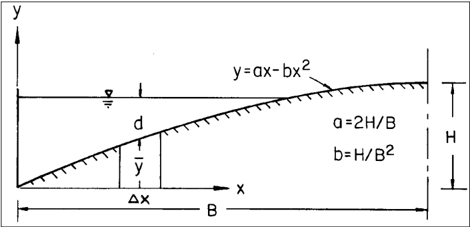

To determine total gutter flow, divide the cross -section into segments of equal width and compute the discharge for each segment by Manning's equation. The parabola can be approximated with 2 ft chords. The total discharge is the sum of the discharges in all segments.

The crown height, H, and half width, B, vary from one design to another. Since discharge is directly related to the configuration of the cross -section, discharge-depth (or spread) relationships developed for one configuration do not apply for roadways of other configurations, therefore, the designer develops relationships for each roadway configuration.

The  following procedure  illustrates the development  of  a conveyance  curve  for  a parabolic pavement section with a half width, B = 23.9 ft and a crown height, H = 0.48 ft.  The Manning's n = 0.016. Table B.1 summarizes the results of the procedure for spreads of 2, 4, and 6 ft.

## Step 1.   Choose the width of segment, ∆ x.

Choose the segment width for which the vertical rise will be computed. In this case, select 2 ft and record this in column 1 of Table B.1.

## Step 2.   Compute the vertical rise.

For H = 0.48 ft and B = 24 ft, equation B.1 becomes:

<!-- formula-not-decoded -->

Compute the vertical rise for each segment width and enter it into column 2.

## Step 3.   Compute the mean rise, ya, of each segment.

Compute the mean rise of each segment and record in column 3.

## Step 4.   Compute the conveyance from the first segment width.

Depth of flow at the curb, d, for a given spread, T, is equal to the vertical rise, y, shown in column 2. The average flow depth for any segment is equal to depth at the curb for the spread minus the mean rise in that segment. For example, depth at curb for a 2 ft spread is equal to 0.0767 ft. The mean rise in the segment is equal to 0.0384 ft. Therefore, average flow depth in the segment, d = 0.0767 - 0.0384 = 0.0383 ft. Record in column 4.

Compute depth to the five-thirds power and record in column 5.

The sum of d to the five-thirds is 0.0043 as shown in the table.

<!-- formula-not-decoded -->

Where K is conveyance and depth, d, is used as an approximation for hydraulic radius, R. K u is 1.49 for English units.

For this segment:

K = [1.49 ( ∆ x) d 5/3 ] / n = (1.49 (2) (0.0043))/0.016 = 0.8 ft 3 /s.

## Step 5.   Compute the conveyance from the first and second segment widths.

Compute average depth of flow in the next 2-foot  segment and enter it into column 6. Average flow depth in the first 2-foot segment nearest the curb is equal to the depth at the curb minus the average rise in the segment.

<!-- formula-not-decoded -->

Similarly, the average flow depth in the second 2-foot segment away from the curb is:

<!-- formula-not-decoded -->

The sum of d to the five-thirds is 0.0281 as shown in the table.

For the first two segments:

K = [1.49 ( ∆ x) d 5/3 ] / n = (1.49 (2) (0.0281))/0.016 = 5.23 ft 3 /s.

## Step 6.   Repeat for all additional segment widths.

Columns 8 and 9 are computed in the same manner. For T = 6 ft, K = 14.27 ft 3 /s.

Repeat the same analysis for spreads up to the half-section width. The computation is limited for to depths less than or equal to the curb height.

Table B.1. Conveyance computations, parabolic street section.

| Dis-            | Vertical   |               | T = 2 ft            | T = 2 ft   | T = 4 ft            | T = 4 ft   | T = 6 ft            | T = 6 ft   |
|-----------------|------------|---------------|---------------------|------------|---------------------|------------|---------------------|------------|
| tance From Curb | Rise y     | Ave. Rise Y a | Ave. Flow Depth (d) | d 5/3      | Ave. Flow Depth (d) | d 5/3      | Ave. Flow Depth (d) | d 5/3      |
| (1)             | (2)        | (3)           | (4)                 | (5)        | (6)                 | (7)        | (8)                 | (9)        |
| 0               | 0          | 0.0384        | 0.0383              | 0.0043     | 0.1083              | 0.0244     | 0.1716              | 0.0527     |
| 2               | 0.0767     | 0.1117        | -                   | -          | 0.0350              | 0.0037     | 0.0983              | 0.0208     |
| 4               | 0.1467     | 0.1784        | -                   | -          | -                   | -          | 0.0316              | 0.0031     |
| 6               | 0.2100     | 0.2384        | -                   | -          | -                   | -          | -                   | -          |
| 8               | 0.2667     | 0.2917        | -                   | -          | -                   | -          | -                   | -          |
| 10              | 0.3167     | 0.3384        | -                   | -          | -                   | -          | -                   | -          |
| 12              | 0.3600     | 0.3784        | -                   | -          | -                   | -          | -                   | -          |
| 14              | 0.3967     | 0.4118        | -                   | -          | -                   | -          | -                   | -          |
| 16              | 0.4268     | 0.4385        | -                   | -          | -                   | -          | -                   | -          |
| 18              | 0.4501     | 0.4585        | -                   | -          | -                   | -          | -                   | -          |
| 20              | 0.4668     | 0.4718        | -                   | -          | -                   | -          | -                   | -          |
| 22              | 0.4768     | 0.4784        | -                   | -          | -                   | -          | -                   | -          |
| 24              | 0.4800     | -             | -                   | -          | -                   | -          | -                   | -          |
| Sum             | -          | -             | -                   | 0.0043     | -                   | 0.0281     | -                   | 0.0766     |

Table B.2 summarizes the results of the analyses for spreads of 8 to 24 ft, which are also plotted in Figure B.2. For a given spread or flow depth at the curb, the conveyance can be read from the figure and the discharge computed from Q = KS 0.5 . For a given discharge and longitudinal slope, the flow depth or spread can be read directly from the figure by first computing the conveyance, K = Q/S 0.5 , and using this value to enter the figure.

As shown in the figure, for a conveyance of 30 ft 3 /s (based on Q = 3 ft 3 /s and S = 0.01 ft/ft) the water depth at the curve equals 0.275 ft. Using the spread curve at that depth yields a spread of 8.4 ft for the given parabolic curve parameters (H = 0.48 ft and B = 24 ft)

Table B.2. Conveyance and spread for a parabolic street section.

|             |   T (ft) |   T (ft) |   T (ft) |   T (ft) |   T (ft) |   T (ft) |   T (ft) |   T (ft) |   T (ft) |
|-------------|----------|----------|----------|----------|----------|----------|----------|----------|----------|
| Quantity    |    8     |   10     |    12    |   14     |   16     |    18    |   20     |   22     |    24    |
| d (ft)      |    0.267 |    0.317 |     0.36 |    0.397 |    0.427 |     0.45 |    0.467 |    0.477 |     0.48 |
| K (ft 3 /s) |   27.53  |   44.71  |    64.45 |   85.26  |  105.54  |   123.63 |  137.98  |  147.26  |   150.5  |

Figure B.2. Conveyance curve for a parabolic cross-section with example application.

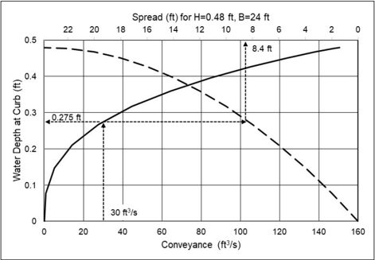

## Appendix C - Mean Velocity in a Triangular Channel

Flow  time  in  curbed  gutters  is  one  component  of  the  time  of  concentration  for  the  contributing drainage area to the inlet. Velocity in a triangular gutter varies with the flow rate, and the flow rate varies with distance along the gutter, i.e., both the velocity and flow rate in the gutter are spatially varied. Figure C.1 illustrates the concept used to develop average velocity in a reach of channel.

Figure C.1. Conceptual sketch of spatially varied gutter flow.

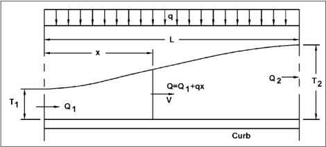

Time  of  flow  can  be  estimated  by  use  of  an  average  velocity  obtained  by  integration  of  the Manning's equation for a triangular channel with respect to time. The assumption of this solution is that the flow rate in the gutter varies uniformly from Q 1 at the beginning of the section to Q2 at the inlet. Using the gutter equation (equation 5.2), Q is:

<!-- formula-not-decoded -->

<!-- formula-not-decoded -->

where:

Q =

Gutter flow, ft 3 /s (m 3 /s)

n =

Manning's roughness coefficient

SL =

Gutter longitudinal slope, ft/ft (m/m)

Sx =

Gutter transverse scope, ft/ft (m/m)

T =

Spread, ft (m)

Ku =

Unit conversion constant, 0.56 in CU (0.376 in SI)

Dividing the gutter flow by the gutter cross-section area, V becomes:

<!-- formula-not-decoded -->

<!-- formula-not-decoded -->

where:

V =

Gutter velocity, ft/s (m/s)

n =

Manning's roughness coefficient

SL =

Gutter longitudinal slope, ft/ft (m/m)

Sx =

Gutter transverse scope, ft/ft (m/m)

T =

Spread, ft (m)

Ku =

Unit conversion constant, 0.56 in CU (0.376 SI)

From equation C.1:

<!-- formula-not-decoded -->

Substituting equation C.3 into equation C.2 with V = dx/dt results in:

<!-- formula-not-decoded -->

where:

dx =

Change in longitudinal distance, ft (m)

dt =

Change in time, s

Here, Q = Q1 + qx and therefore dQ = qdx.  Combining these with equation C.4 and performing the integration results in:

<!-- formula-not-decoded -->

The average velocity, Va is:

<!-- formula-not-decoded -->

Substituting L = (Q2 - Q1)/q and Q = K1T 2.67 , Va becomes:

<!-- formula-not-decoded -->

Defining a gutter geometry parameter as:

<!-- formula-not-decoded -->

Then substituting results in:

<!-- formula-not-decoded -->

where:

Va =

Average velocity in the gutter section between T1 and T2 locations, ft/s (m/s)

T1 =

Upstream spread, ft (m)

T2 =

Downstream spread, ft (m)

KG =

Gutter geometry parameter

Ku =

Unit conversion constant, 0.840 in CU (0.564 in SI)
